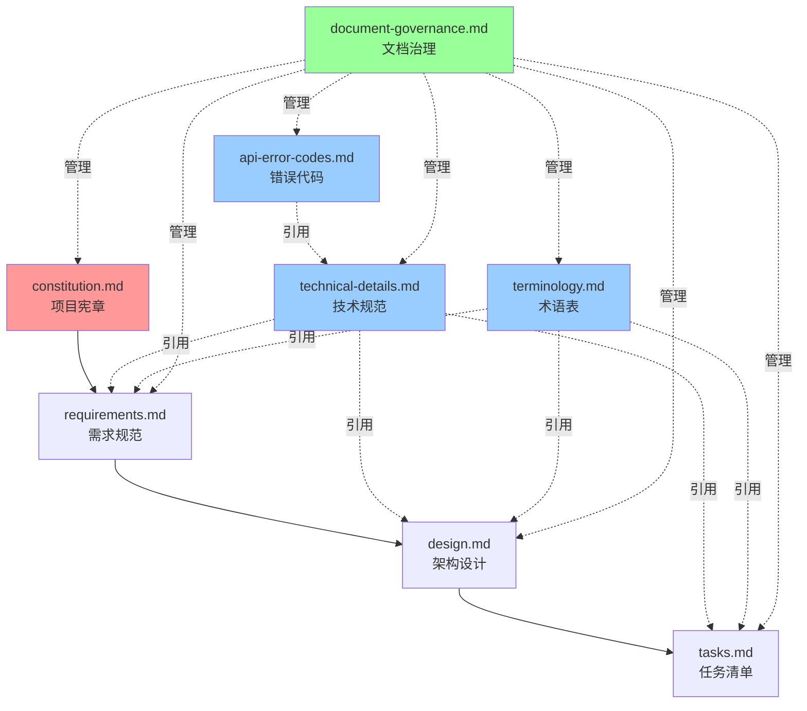

# LLMChat 规范文档索引

**版本**: 1.0.0  
**更新日期**: 2025-01-16

---

## 文档导航

### 核心规范文档（按阅读顺序）

1. **[项目宪章](../../.specify/memory/constitution.md)** 
   - **作用**: 项目核心原则和治理规则
   - **适用**: 所有开发者必读
   - **更新频率**: 低（需团队投票）

2. **[项目需求](requirements.md)** 
   - **作用**: 功能需求、非功能需求、用户故事
   - **适用**: 产品经理、架构师、开发者
   - **更新频率**: 中（需求变更时）

3. **[架构设计](design.md)** 
   - **作用**: 系统架构、模块设计、技术选型
   - **适用**: 架构师、开发Lead
   - **更新频率**: 中（架构调整时）

4. **[任务清单](tasks.md)** 
   - **作用**: 任务分解、依赖关系、执行计划
   - **适用**: 所有开发者
   - **更新频率**: 高（日常开发）

### 技术规范文档（单一真实来源）

5. **[技术规范详细说明](technical-details.md)** 
   - **作用**: JWT、密码、性能、测试等技术细节
   - **适用**: 所有开发者
   - **权威性**:  技术实现的唯一权威来源

6. **[术语表](terminology.md)** 
   - **作用**: 统一术语定义、命名规范
   - **适用**: 所有开发者、文档编写者
   - **权威性**:  术语使用的唯一权威来源

7. **[API错误代码](api-error-codes.md)** 
   - **作用**: 错误代码定义、错误处理规范
   - **适用**: 后端开发者、前端开发者
   - **权威性**:  错误处理的唯一权威来源

### 治理文档

8. **[文档治理规范](document-governance.md)** 
   - **作用**: 文档管理规则、审查流程
   - **适用**: 文档维护者、审查者
   - **更新频率**: 低

---

## 文档使用指南

### 新成员入职

**阅读顺序**:
1. constitution.md（了解项目原则）
2. requirements.md（了解项目目标）
3. terminology.md（学习项目术语）
4. design.md（理解系统架构）
5. technical-details.md（掌握技术规范）
6. tasks.md（开始实际开发）

### 日常开发

**开发新功能前**:
1. 查看 requirements.md - 确认需求
2. 查看 design.md - 了解架构约束
3. 查看 technical-details.md - 遵循技术规范
4. 查看 tasks.md - 找到对应任务

**遇到技术问题**:
1. 查看 technical-details.md - 技术规范
2. 查看 api-error-codes.md - 错误处理
3. 查看 terminology.md - 术语确认

**提交代码前**:
1. 查看 constitution.md - 质量标准
2. 运行验证工具
3. 更新相关文档

---

## 文档依赖关系

**图例**:
-  红色：原则文档（高权威）
-  蓝色：规范文档（技术权威）
-  绿色：治理文档
- 实线箭头：层级依赖
- 虚线箭头：引用关系

---

## 文档查找快速索引

### 按主题查找

**认证与安全**:
- JWT配置  technical-details.md#1.1
- 密码安全  technical-details.md#1.2
- 角色权限  technical-details.md#1.3
- 错误代码  api-error-codes.md

**性能与监控**:
- 响应时间  technical-details.md#2.1
- 并发能力  technical-details.md#2.2
- 监控指标  technical-details.md#2.1

**数据库**:
- 连接池  technical-details.md#3.1
- 索引策略  technical-details.md#3.2
- 迁移文件  tasks.md#T006

**测试**:
- 覆盖率要求  technical-details.md#5.1
- 测试规范  technical-details.md#5.2
- 测试配置  tasks.md#T045

**提供商集成**:
- FastGPT  tasks.md#T017
- OpenAI  tasks.md#T018
- Anthropic  tasks.md#T019
- Dify  tasks.md#T019b
- 统一接口  technical-details.md#7.1
- 回退策略  technical-details.md#3

---

## 快速参考卡

### 常见问题快速查找

| 问题 | 查看文档 | 章节 |
|------|---------|------|
| JWT如何配置？ | technical-details.md | #1.1 |
| 密码如何哈希？ | technical-details.md | #1.2 |
| API响应格式？ | technical-details.md | #4.1 |
| 错误代码列表？ | api-error-codes.md | 全文 |
| 测试覆盖率要求？ | technical-details.md | #5.1 |
| Agent是什么？ | terminology.md | #核心术语 |
| 如何添加新提供商？ | technical-details.md | #7.1 |
| 性能指标？ | technical-details.md | #2.1 |
| 如何提交代码？ | constitution.md | #开发流程规范 |

---

## 文档维护日历

### 定期审查

| 频率 | 审查内容 | 负责人 |
|------|---------|--------|
| 每日 | tasks.md进度更新 | 开发Lead |
| 每周 | 文档-代码一致性检查 | 架构师 |
| 每Sprint | 完整文档审查 | 全体 |
| 每季度 | 规范优化和更新 | 架构委员会 |

---

## 版本历史

| 版本 | 日期 | 变更 |
|------|------|------|
| 1.0.0 | 2025-01-16 | 初始版本 |

---

**维护者**: LLMChat 开发团队
