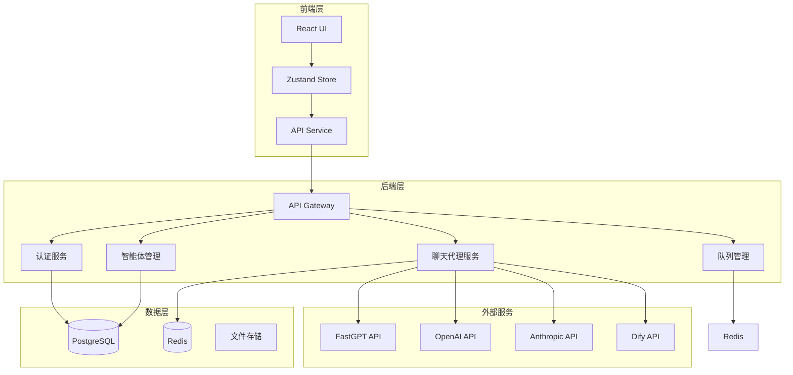

# LLMChat 架构设计文档

> **文档性质**: 本文档是架构设计说明，专注于系统架构和模块设计
> 
> **技术实现细节**: 具体的配置参数、性能指标等请参阅 [技术规范详细说明](technical-details.md)
> 
> **需求追溯**: 需求定义详见 [项目需求规范](requirements.md)

---

**版本**: 1.0.0  
**创建日期**: 2025-01-15  
**状态**: 生效

> **注意**: 本文档专注于架构设计和技术选型。技术实现细节（如JWT配置、密码参数等）请参阅 [技术规范详细说明](technical-details.md)。

---

## 系统架构概览

### 技术栈

- **前端**: React 18 + TypeScript + Vite + Tailwind CSS + Zustand
- **后端**: Node.js + Express + TypeScript + PostgreSQL + Redis
- **测试**: Jest (后端) + Vitest (前端) + Playwright (E2E)
- **部署**: Docker + Nginx + PM2
- **CI/CD**: GitHub Actions

### 系统架构图



---

## 核心模块设计

### 1. 认证服务（AuthServiceV2）

**职责**:
- 用户注册、登录、登出
- JWT Token生成和验证
- Token刷新机制
- 密码哈希和验证

**接口**:
```typescript
class AuthServiceV2 {
  async register(email: string, password: string): Promise<User>
  async login(email: string, password: string): Promise<LoginResponse>
  async refreshToken(refreshToken: string): Promise<TokenPair>
  async logout(userId: string): Promise<void>
  async verifyToken(token: string): Promise<JWTPayload>
}
```

**依赖**:
- PostgreSQL（用户数据存储）
- Redis（Token黑名单）
- bcrypt（密码哈希）
- jsonwebtoken（JWT生成）

---

### 2. 智能体管理（AgentConfigService）

**职责**:
- 智能体配置加载
- 智能体状态检查
- 配置热重载
- 多提供商适配

**接口**:
```typescript
class AgentConfigService {
  async getAgents(): Promise<AgentConfig[]>
  async getAgentById(id: string): Promise<AgentConfig | null>
  async checkAgentStatus(id: string): Promise<AgentStatus>
  async reloadConfig(): Promise<void>
}
```

**配置来源**: `config/agents.json`

---

### 3. 聊天代理服务（ChatProxyService）

**职责**:
- 统一不同AI提供商接口
- 流式/非流式响应处理
- 错误处理和重试
- 消息格式转换

**支持的提供商**:
- FastGPT
- OpenAI
- Anthropic
- Dify

**接口**:
```typescript
class ChatProxyService {
  async sendMessage(options: ChatOptions): Promise<ChatResponse>
  async sendStreamMessage(
    options: ChatOptions, 
    onChunk: (text: string) => void
  ): Promise<void>
}
```

---

### 4. 队列管理（QueueManager）

**职责**:
- 请求队列管理
- 并发控制
- 优先级调度
- 超时处理

**实现**:
- 基于Redis的优先级队列
- 支持并发控制（最大100并发）
- 超时自动重试（最多3次）

---

### 5. 监控服务（MonitoringService）

**职责**:
- 系统性能监控
- 智能体可用性监控
- 错误日志收集
- Prometheus指标导出

**监控指标**:
- API响应时间（P50, P95, P99）
- 并发连接数
- 错误率
- 智能体调用统计

---

## 数据模型设计

### 用户表（users）

```sql
CREATE TABLE users (
  id UUID PRIMARY KEY DEFAULT gen_random_uuid(),
  email VARCHAR(255) UNIQUE NOT NULL,
  password_hash VARCHAR(255) NOT NULL,
  role VARCHAR(20) DEFAULT 'user',
  created_at TIMESTAMP DEFAULT CURRENT_TIMESTAMP,
  updated_at TIMESTAMP DEFAULT CURRENT_TIMESTAMP
);
```

### 会话表（conversations）

```sql
CREATE TABLE conversations (
  id UUID PRIMARY KEY DEFAULT gen_random_uuid(),
  user_id UUID REFERENCES users(id),
  agent_id VARCHAR(50) NOT NULL,
  title VARCHAR(255),
  created_at TIMESTAMP DEFAULT CURRENT_TIMESTAMP,
  updated_at TIMESTAMP DEFAULT CURRENT_TIMESTAMP
);
```

### 消息表（messages）

```sql
CREATE TABLE messages (
  id UUID PRIMARY KEY DEFAULT gen_random_uuid(),
  conversation_id UUID REFERENCES conversations(id),
  role VARCHAR(20) NOT NULL,
  content TEXT NOT NULL,
  created_at TIMESTAMP DEFAULT CURRENT_TIMESTAMP
);
```

---

## 部署架构

### Docker容器化

**容器服务**:
- `llmchat-backend`: Node.js后端服务
- `llmchat-frontend`: Nginx静态文件服务器
- `postgres`: PostgreSQL数据库
- `redis`: Redis缓存

### Nginx反向代理

```nginx
server {
  listen 80;
  
  location /api {
    proxy_pass http://backend:3001;
    proxy_http_version 1.1;
    proxy_set_header Upgrade $http_upgrade;
    proxy_set_header Connection 'upgrade';
  }
  
  location / {
    root /usr/share/nginx/html;
    try_files $uri /index.html;
  }
}
```

---

## 技术决策

### 为什么选择Zustand而非Redux？

**原因**:
-  更轻量（~1KB vs ~10KB）
-  无需Provider包装
-  TypeScript支持更好
-  学习曲线更低

### 为什么选择Vite而非Webpack？

**原因**:
-  开发服务器启动更快（<1秒 vs >10秒）
-  HMR更快
-  构建速度更快
-  配置更简单

### 为什么选择PostgreSQL而非MongoDB？

**原因**:
-  ACID事务支持
-  关系型数据更适合用户/会话/消息模型
-  更成熟的生态系统
-  更好的数据一致性

---

## 安全架构

### 多层防护

1. **网络层**: HTTPS强制，CORS配置
2. **应用层**: JWT认证，RBAC授权，速率限制
3. **数据层**: SQL注入防护，参数化查询，密码加密

### 敏感信息管理

-  环境变量存储API密钥
-  `.env`文件不提交到Git
-  生产环境使用密钥管理服务

---

## 可扩展性设计

### 水平扩展

- **无状态服务**: 后端服务完全无状态，支持多实例部署
- **会话共享**: 通过Redis共享会话状态
- **负载均衡**: Nginx upstream配置多个后端实例

### 垂直扩展

- **数据库优化**: 索引优化，查询优化
- **缓存策略**: Redis缓存热点数据
- **异步处理**: 队列管理异步任务

---

**文档版本**: 1.0.0  
**维护者**: LLMChat 架构团队  
**最后更新**: 2025-01-15
