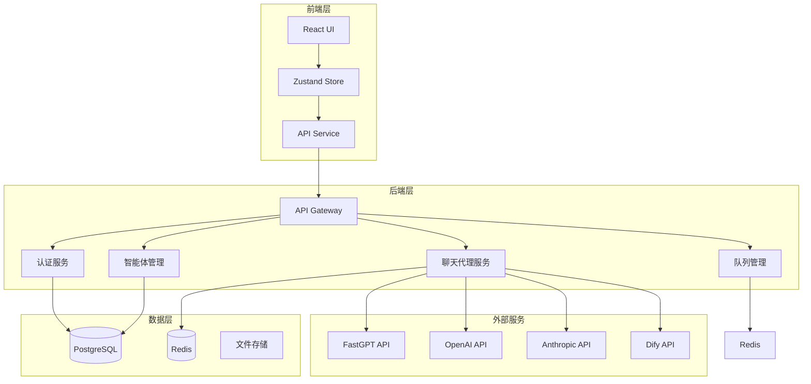
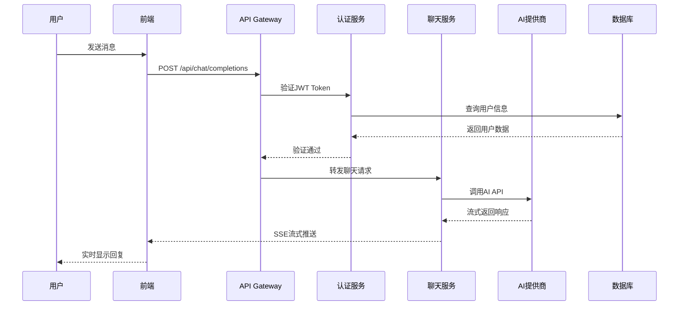

# LLMChat 项目基线规范
> 版本: 1.0.0 | 生成日期: 2025-01-15 | 基于: [项目宪章 v1.0.0](.specify/memory/constitution.md)

## 📋 项目概述

### 项目名称
**LLMChat** - 智能体切换聊天应用

### 项目使命
构建一个企业级的多 AI 智能体切换平台，支持 FastGPT、OpenAI、Anthropic、Dify 等多个 AI 提供商的无缝集成和切换。

### 核心价值主张
- ✅ **多智能体支持**: 动态切换不同 AI 提供商和智能体
- ✅ **统一接口**: 标准化的 API 接口适配不同提供商
- ✅ **企业级质量**: 零容忍 TypeScript 错误，80%+ 测试覆盖率
- ✅ **安全优先**: JWT 认证、密码加密、输入验证
- ✅ **真实环境**: 禁止模拟数据，所有功能基于真实 API

## 🎯 项目目标

### 短期目标（1-3 个月）
1. ✅ 完成核心智能体切换功能
2. ✅ 实现 FastGPT、OpenAI、Anthropic 集成
3. ✅ 建立完整的认证和授权系统
4. ✅ 达到 80% 测试覆盖率
5. 🔄 完成管理后台所有功能
6. 🔄 实现完整的队列管理系统
7. 🔄 完成 CI/CD 自动化流水线

### 中期目标（3-6 个月）
1. 📋 支持更多 AI 提供商（Dify、自定义）
2. 📋 实现高级会话管理（多轮对话、上下文保持）
3. 📋 性能优化（响应时间 <200ms）
4. 📋 完善监控和告警系统
5. 📋 多语言支持

### 长期目标（6-12 个月）
1. 📋 企业级部署方案（Docker/K8s）
2. 📋 插件系统（支持第三方扩展）
3. 📋 高级分析和报表
4. 📋 移动端应用
5. 📋 开源社区版本

## 🏗️ 技术架构

### 技术栈
- **前端**: React 18 + TypeScript + Vite + Tailwind CSS + Zustand
- **后端**: Node.js + Express + TypeScript + PostgreSQL + Redis
- **测试**: Jest (后端) + Vitest (前端) + Playwright (E2E)
- **部署**: Docker + Nginx + PM2
- **CI/CD**: GitHub Actions

### 系统架构图


### 数据流架构


## 📁 目录结构规范

### 后端结构
```
backend/
├── src/
│   ├── controllers/         # 控制器层（HTTP请求处理）
│   │   ├── AgentController.ts
│   │   ├── ChatController.ts
│   │   ├── AuthController.ts
│   │   └── AdminController.ts
│   │
│   ├── services/           # 业务逻辑层
│   │   ├── AgentConfigService.ts     # 智能体配置管理
│   │   ├── ChatProxyService.ts       # 聊天代理服务
│   │   ├── AuthServiceV2.ts          # 认证服务
│   │   ├── MonitoringService.ts      # 监控服务
│   │   └── QueueManager.ts           # 队列管理
│   │
│   ├── routes/             # 路由定义
│   │   ├── agents.ts
│   │   ├── chat.ts
│   │   ├── auth.ts
│   │   └── admin.ts
│   │
│   ├── middleware/         # 中间件
│   │   ├── jwtAuth.ts            # JWT认证
│   │   ├── protectMiddleware.ts  # 保护中间件
│   │   ├── rateLimiter.ts        # 速率限制
│   │   └── requestLogger.ts      # 请求日志
│   │
│   ├── types/              # TypeScript类型定义
│   │   ├── agent.ts
│   │   ├── chat.ts
│   │   ├── auth.ts
│   │   └── api.ts
│   │
│   ├── utils/              # 工具函数
│   │   ├── logger.ts
│   │   ├── errors.ts
│   │   ├── validators.ts
│   │   └── helpers.ts
│   │
│   ├── migrations/         # 数据库迁移
│   │   ├── 001_create_users.sql
│   │   ├── 002_create_sessions.sql
│   │   └── 003_create_messages.sql
│   │
│   └── index.ts           # 入口文件
│
├── tests/                 # 测试文件
│   ├── unit/
│   ├── integration/
│   └── __mocks__/
│
├── dist/                  # 编译输出
├── tsconfig.json
├── package.json
└── .env.example
```

### 前端结构
```
frontend/
├── src/
│   ├── components/        # React组件
│   │   ├── ui/           # 基础UI组件
│   │   │   ├── Button.tsx
│   │   │   ├── Input.tsx
│   │   │   ├── Dialog.tsx
│   │   │   └── Card.tsx
│   │   │
│   │   ├── agents/       # 智能体相关
│   │   │   ├── AgentList.tsx
│   │   │   ├── AgentCard.tsx
│   │   │   └── AgentSelector.tsx
│   │   │
│   │   ├── chat/         # 聊天相关
│   │   │   ├── ChatWindow.tsx
│   │   │   ├── MessageList.tsx
│   │   │   ├── MessageInput.tsx
│   │   │   └── StreamingMessage.tsx
│   │   │
│   │   ├── admin/        # 管理后台
│   │   │   ├── AdminDashboard.tsx
│   │   │   ├── AgentManagement.tsx
│   │   │   └── UserManagement.tsx
│   │   │
│   │   └── layouts/      # 布局组件
│   │       ├── MainLayout.tsx
│   │       └── AdminLayout.tsx
│   │
│   ├── store/            # Zustand状态管理
│   │   ├── chatStore.ts
│   │   ├── agentStore.ts
│   │   └── authStore.ts
│   │
│   ├── services/         # API服务层
│   │   ├── agentService.ts
│   │   ├── chatService.ts
│   │   └── authService.ts
│   │
│   ├── hooks/            # 自定义Hooks
│   │   ├── useChat.ts
│   │   ├── useAgents.ts
│   │   └── useAuth.ts
│   │
│   ├── types/            # TypeScript类型
│   │   ├── agent.ts
│   │   ├── chat.ts
│   │   └── common.ts
│   │
│   ├── utils/            # 工具函数
│   │   ├── api.ts
│   │   ├── storage.ts
│   │   └── helpers.ts
│   │
│   ├── App.tsx
│   └── main.tsx
│
├── public/
├── tests/
├── dist/
├── vite.config.ts
├── tsconfig.json
└── package.json
```

## 🔌 API 接口规范

### 认证相关 API

#### POST /api/auth/login
用户登录

**请求体**:
```typescript
{
  email: string;      // 邮箱地址
  password: string;   // 密码
}
```

**响应**:
```typescript
{
  token: string;      // JWT token
  user: {
    id: string;
    email: string;
    role: 'user' | 'admin';
    createdAt: Date;
  }
}
```

#### POST /api/auth/register
用户注册

**请求体**:
```typescript
{
  email: string;
  password: string;
  name?: string;
}
```

#### POST /api/auth/refresh
刷新 token

**请求头**:
```
Authorization: Bearer <token>
```

### 智能体管理 API

#### GET /api/agents
获取所有可用智能体

**响应**:
```typescript
{
  agents: Array<{
    id: string;
    name: string;
    provider: 'fastgpt' | 'openai' | 'anthropic' | 'dify';
    description: string;
    status: 'active' | 'inactive';
    features: {
      supportsStream: boolean;
      supportsFiles: boolean;
      supportsImages: boolean;
    };
  }>;
}
```

#### GET /api/agents/:id/status
检查智能体状态

#### POST /api/agents/reload
重新加载智能体配置（需要管理员权限）

### 聊天相关 API

#### POST /api/chat/completions
发送聊天请求（支持流式和非流式）

**请求体**:
```typescript
{
  agentId: string;
  messages: Array<{
    role: 'user' | 'assistant' | 'system';
    content: string;
  }>;
  stream?: boolean;        // 是否使用流式响应
  sessionId?: string;      // 会话ID
}
```

**响应（非流式）**:
```typescript
{
  message: {
    role: 'assistant';
    content: string;
  };
  sessionId: string;
}
```

**响应（流式）**: Server-Sent Events
```
event: chunk
data: {"text": "部分回复内容"}

event: end
data: {"sessionId": "xxx"}
```

## 🗄️ 数据库设计

### 核心表结构

#### users 表
```sql
CREATE TABLE users (
    id UUID PRIMARY KEY DEFAULT gen_random_uuid(),
    email VARCHAR(255) UNIQUE NOT NULL,
    password_hash VARCHAR(255) NOT NULL,
    name VARCHAR(255),
    role VARCHAR(50) DEFAULT 'user',
    created_at TIMESTAMP DEFAULT CURRENT_TIMESTAMP,
    updated_at TIMESTAMP DEFAULT CURRENT_TIMESTAMP
);
```

#### sessions 表
```sql
CREATE TABLE sessions (
    id UUID PRIMARY KEY DEFAULT gen_random_uuid(),
    user_id UUID REFERENCES users(id),
    agent_id VARCHAR(255) NOT NULL,
    title VARCHAR(500),
    created_at TIMESTAMP DEFAULT CURRENT_TIMESTAMP,
    updated_at TIMESTAMP DEFAULT CURRENT_TIMESTAMP
);
```

#### messages 表
```sql
CREATE TABLE messages (
    id UUID PRIMARY KEY DEFAULT gen_random_uuid(),
    session_id UUID REFERENCES sessions(id),
    role VARCHAR(50) NOT NULL,
    content TEXT NOT NULL,
    created_at TIMESTAMP DEFAULT CURRENT_TIMESTAMP
);
```

## 🧪 测试策略

### 测试层级

#### 1. 单元测试（80%+ 覆盖率）
**工具**: Jest (后端) / Vitest (前端)

**测试范围**:
- 所有业务逻辑函数
- 所有工具函数
- 所有类方法
- 边界条件和异常情况

**示例**:
```typescript
// backend/tests/unit/AgentConfigService.test.ts
describe('AgentConfigService', () => {
  it('should load agent configuration from file', async () => {
    const service = new AgentConfigService();
    const agents = await service.getAllAgents();
    expect(agents).toBeInstanceOf(Array);
    expect(agents.length).toBeGreaterThan(0);
  });

  it('should throw error for invalid agent ID', async () => {
    const service = new AgentConfigService();
    await expect(service.getAgentById('invalid'))
      .rejects.toThrow('Agent not found');
  });
});
```

#### 2. 集成测试（关键流程）
**工具**: Jest + Supertest

**测试范围**:
- API 端点集成
- 数据库交互
- 服务间通信
- 认证和授权流程

**示例**:
```typescript
// backend/tests/integration/auth.test.ts
describe('Authentication API', () => {
  it('should login successfully with valid credentials', async () => {
    const response = await request(app)
      .post('/api/auth/login')
      .send({
        email: 'test@example.com',
        password: 'Test123!'
      });

    expect(response.status).toBe(200);
    expect(response.body).toHaveProperty('token');
    expect(response.body.user.email).toBe('test@example.com');
  });
});
```

#### 3. E2E 测试（关键用户流程）
**工具**: Playwright

**测试场景**:
- 用户注册和登录
- 智能体切换
- 发送消息和接收回复
- 管理后台操作

**示例**:
```typescript
// tests/e2e/chat.spec.ts
test('should send message and receive response', async ({ page }) => {
  await page.goto('http://localhost:3000');
  await page.fill('[data-testid="email-input"]', 'test@example.com');
  await page.fill('[data-testid="password-input"]', 'Test123!');
  await page.click('[data-testid="login-button"]');
  
  await page.waitForSelector('[data-testid="chat-window"]');
  await page.fill('[data-testid="message-input"]', 'Hello AI');
  await page.click('[data-testid="send-button"]');
  
  await page.waitForSelector('[data-testid="assistant-message"]');
  const response = await page.textContent('[data-testid="assistant-message"]');
  expect(response).toBeTruthy();
});
```

### 测试覆盖率要求
- **整体覆盖率**: ≥80%
- **关键模块**: ≥90%
  - AuthService
  - ChatProxyService
  - AgentConfigService
- **工具函数**: ≥95%

### 测试执行
```bash
# 单元测试
pnpm run backend:test       # 后端单元测试
pnpm run frontend:test      # 前端单元测试

# 集成测试
pnpm run test:integration   # 集成测试

# E2E 测试
pnpm run test:e2e          # E2E测试
pnpm run test:e2e:ui       # E2E测试UI模式

# 全部测试
pnpm test                  # 运行所有测试
```

## 🔒 安全规范

### 认证和授权
- ✅ JWT Token 认证（HS256 算法）
- ✅ Token 过期时间：1小时
- ✅ Refresh Token 机制
- ✅ 密码哈希：bcrypt（salt rounds: 10）
- ✅ 角色基础权限控制（RBAC）

### 数据安全
- ✅ 输入验证（所有 API 端点）
- ✅ SQL 注入防护（使用参数化查询）
- ✅ XSS 防护（前端输出净化）
- ✅ CSRF 防护
- ✅ 速率限制（API调用限制）

### API 安全
- ✅ API 密钥通过环境变量管理
- ✅ 敏感数据加密存储
- ✅ HTTPS 强制使用（生产环境）
- ✅ CORS 策略配置
- ✅ 请求大小限制

### 日志和审计
- ✅ 操作日志记录
- ✅ 敏感信息脱敏
- ✅ 错误日志监控
- ✅ 安全事件告警

## 📊 性能指标

### 响应时间
- API 响应时间（P95）: <200ms
- 首屏加载时间: <3s
- 流式响应延迟: <100ms

### 资源使用
- 内存使用: <500MB（正常负载）
- CPU 使用: <50%（正常负载）
- 数据库连接池: 10-50个连接

### 并发能力
- 同时在线用户: >1000
- 每秒请求数(QPS): >100
- 消息吞吐量: >50条/秒

## 🚀 部署策略

### 开发环境
```bash
# 启动所有服务
pnpm run dev

# 前端: http://localhost:3000
# 后端: http://localhost:3001
```

### 生产环境
```bash
# 构建
pnpm run build

# 启动
pnpm start

# 使用 PM2
pm2 start ecosystem.config.js
```

### Docker 部署
```bash
# 构建镜像
docker build -t llmchat:latest .

# 运行容器
docker-compose up -d
```

### 环境变量
```bash
# 必需环境变量
DATABASE_URL=postgresql://...
JWT_SECRET=your_jwt_secret
REDIS_URL=redis://localhost:6379

# AI 提供商 API 密钥
FASTGPT_API_KEY=...
OPENAI_API_KEY=...
ANTHROPIC_API_KEY=...

# 可选配置
PORT=3001
NODE_ENV=production
LOG_LEVEL=info
```

## 📝 开发规范遵守检查清单

### 提交前检查
- [ ] TypeScript 类型检查通过 (`pnpm run type-check`)
- [ ] ESLint 检查通过 (`pnpm run lint`)
- [ ] 所有测试通过 (`pnpm test`)
- [ ] 代码格式化正确 (`pnpm run lint:fix`)
- [ ] 无安全漏洞 (`pnpm audit`)

### 代码审查检查
- [ ] 代码符合 TypeScript 严格模式
- [ ] 所有函数有类型注解
- [ ] 错误处理完善
- [ ] 测试覆盖充分
- [ ] 无硬编码敏感信息
- [ ] 注释清晰准确
- [ ] 无模拟数据/服务

### PR 合并检查
- [ ] CI/CD 流水线全部通过
- [ ] 至少 1 人代码审查批准
- [ ] 无合并冲突
- [ ] 文档已更新
- [ ] 变更日志已记录

## 📚 相关文档

- [项目宪章](.specify/memory/constitution.md) - 核心原则和治理规则
- [CLAUDE.md](CLAUDE.md) - AI 助手上下文文档
- [CODE_QUALITY_STANDARDS.md](CODE_QUALITY_STANDARDS.md) - 代码质量标准
- [DEVELOPMENT_STANDARDS.md](DEVELOPMENT_STANDARDS.md) - 开发规范和最佳实践
- [README.md](README.md) - 项目概述和快速开始
- [API 文档] - Swagger API 文档（运行时生成）

## 📞 支持和联系

- **项目仓库**: [GitHub Repository URL]
- **文档网站**: [Documentation URL]
- **问题追踪**: [Issue Tracker URL]
- **团队联系**: [Team Email]

---

**规范版本**: 1.0.0  
**最后更新**: 2025-01-15  
**维护者**: LLMChat 开发团队


---

## Clarifications

### Session 2025-01-16

**澄清目标**: 明确TypeScript错误修复的执行策略和优先级

#### 已记录的关键决策

1. **Q: 实施优先级策略？**
   - **A: 质量优先** - 先修复所有236个TypeScript错误，再开发新功能
   - **影响**: 暂缓tasks.md中的新功能任务，聚焦代码质量基线

2. **Q: 错误修复的顺序？**
   - **A: 分模块批量修复** - 监控系统  CAD  UI  Hooks  Demo禁用
   - **影响**: 按功能模块组织修复工作，提高效率

3. **Q: CAD功能的实现范围？**
   - **A: 完整CAD工作流** - 包含查看器 + 聊天集成 + 文件上传 + 管理
   - **影响**: CAD是核心功能（非Demo），必须完整实现并修复所有错误
   - **修正**: CAD优先级从P2提升至P0

4. **Q: Demo组件的处理方式？**
   - **A: 暂时禁用路由** - 性能对比Demo不需要，注释路由节省修复时间
   - **影响**: 节省~2小时，减少30个错误，代码保留便于未来启用

#### 执行计划确认

基于以上澄清，执行计划分为7个批次：
- **第1批** : 核心聊天功能 (27个) - 已完成
- **第2批**: 监控系统 (~100个) - 6-8小时
- **第3批**: CAD完整功能 (~60个) - 4-5小时
- **第4批**: UI组件 (~25个) - 2-3小时
- **第5批**: Hooks等 (~21个) - 1.5小时
- **第6批**: Demo禁用 (~300个) - 0.5小时
- **第7批**: 最终验证 - 1小时

**总预计时间**: 15-20小时（2-3个工作日）
**最终目标**: Frontend TypeScript零错误

---
