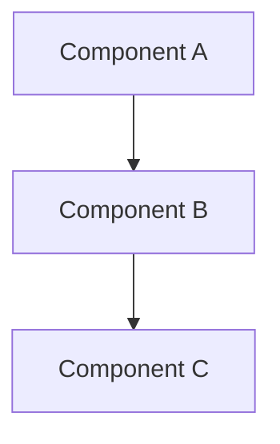
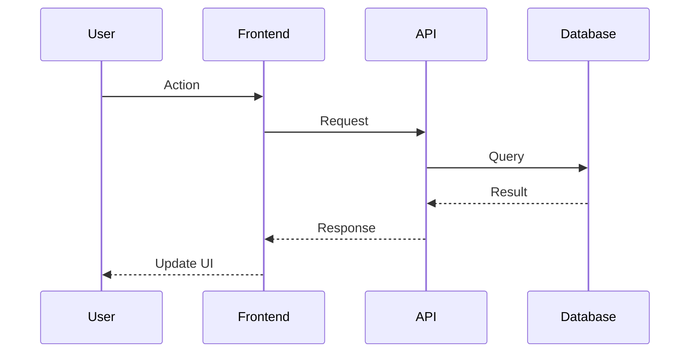

# [Feature Name] - Design & Architecture

**Version**: 1.0.0
**Created**: [Date]
**Last Updated**: [Date]
**Status**: Draft/Active/Approved

## 1. Architecture Overview

### 1.1 System Context
[Describe how this feature fits into the overall system]

### 1.2 Architecture Diagram


## 2. Component Design

### 2.1 [Component Name]

**Purpose**: [What does this component do?]

**Responsibilities**:
- [Responsibility 1]
- [Responsibility 2]

**Interfaces**:
```typescript
interface ComponentInterface {
  method1(param: Type): ReturnType;
  method2(param: Type): ReturnType;
}
```

**Dependencies**:
- [Dependency 1]
- [Dependency 2]

[Repeat for all components]

## 3. Data Model

### 3.1 Database Schema

```sql
CREATE TABLE table_name (
    id UUID PRIMARY KEY,
    field1 VARCHAR(255),
    field2 INTEGER,
    created_at TIMESTAMP
);
```

### 3.2 Type Definitions

```typescript
interface DataModel {
  id: string;
  field1: string;
  field2: number;
  createdAt: Date;
}
```

## 4. API Design

### 4.1 Endpoints

**[Method] /api/path**
- **Purpose**: [What does this endpoint do?]
- **Authentication**: Required/Optional
- **Request**:
  ```typescript
  {
    param1: string;
    param2: number;
  }
  ```
- **Response**:
  ```typescript
  {
    data: DataType;
    message: string;
  }
  ```
- **Errors**: 400, 401, 404, 500

[Repeat for all endpoints]

## 5. Data Flow

### 5.1 [Flow Name]



## 6. State Management

### 6.1 Frontend State

**Store Structure**:
```typescript
interface StoreState {
  data: DataType[];
  loading: boolean;
  error: string | null;
}
```

**Actions**:
- `fetchData()`: Load data from API
- `updateData()`: Update specific data
- `clearData()`: Reset state

## 7. Error Handling

### 7.1 Error Scenarios

| Error Type | HTTP Status | Error Code | User Message |
|-----------|-------------|------------|--------------|
| Validation Error | 400 | VAL_001 | "Invalid input" |
| Auth Error | 401 | AUTH_001 | "Unauthorized" |

## 8. Security Considerations

- [Security consideration 1]
- [Security consideration 2]

## 9. Performance Considerations

- [Performance consideration 1]
- [Performance consideration 2]

**Expected Performance**:
- Response time: < XXms
- Throughput: XXX requests/sec

## 10. Integration Points

### 10.1 External Services

- **Service Name**: [Purpose and integration details]

### 10.2 Internal Dependencies

- **Component/Service**: [How it integrates]

## 11. Migration Strategy

[If applicable, describe how to migrate from old system/approach]

## 12. Testing Strategy

### 12.1 Unit Tests
- Test [Component 1]
- Test [Component 2]

### 12.2 Integration Tests
- Test [Flow 1]
- Test [Flow 2]

### 12.3 E2E Tests
- Test [User Journey 1]
- Test [User Journey 2]

---

**Design Status**:  Approved for Implementation
**Next Phase**: Task Breakdown & Implementation
**Review Date**: [Date]
