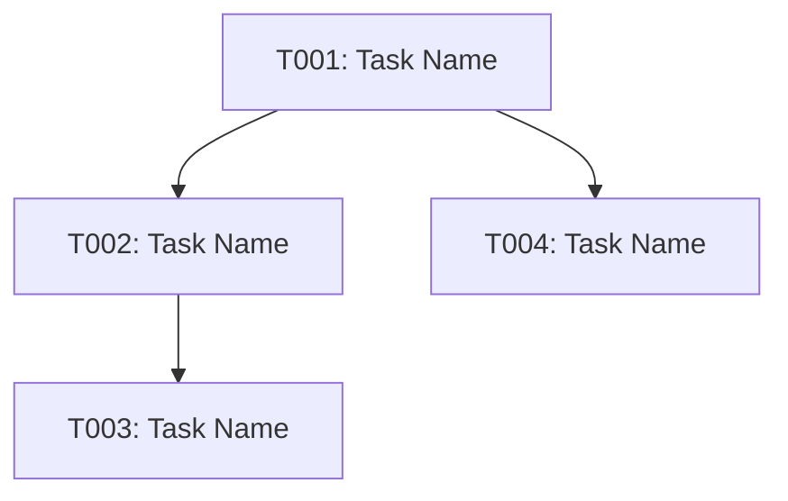

# [Feature Name] - Implementation Tasks

**Version**: 1.0.0
**Created**: [Date]
**Status**: Active
**Total Tasks**: [X]

## Task Overview

This document breaks down the [feature name] into atomic, executable tasks.
Each task is designed to be completed independently and traced back to specific requirements.

### Task Status Legend
- [ ] Pending - Not started
- [x] Completed - Finished and tested
- [~] In Progress - Currently being worked on
- [!] Blocked - Waiting on dependencies

### Priority Levels
- P0: Critical - Must have for MVP
- P1: High - Important for launch
- P2: Medium - Nice to have
- P3: Low - Future enhancement

---

## Phase 1: [Phase Name] (Priority)

### 1.1 [Subsection Name]

- [ ] **T001: [Task Title]** [Ref: US-XXX, FR-XXX]
  - **Files**: [List specific files to create/modify]
  - **Priority**: P0/P1/P2/P3
  - **Estimated Time**: XX minutes
  - **Dependencies**: [List task IDs or "None"]
  - **Acceptance**: [Specific, testable acceptance criteria]
  - **Details**: 
    - [Step 1]
    - [Step 2]
    - [Step 3]
    - Write unit tests

- [ ] **T002: [Task Title]** [Ref: US-XXX, FR-XXX]
  - **Files**: [Specific files]
  - **Priority**: P0/P1/P2/P3
  - **Estimated Time**: XX minutes
  - **Dependencies**: T001
  - **Acceptance**: [Acceptance criteria]
  - **Details**: 
    - [Implementation details]

[Repeat for all tasks in this subsection]

### 1.2 [Another Subsection]

[More tasks...]

---

## Phase 2: [Phase Name] (Priority)

[More phases and tasks...]

---

## Task Summary

### By Phase
- **Phase 1** ([Name]): X tasks (TXXX-TXXX)
- **Phase 2** ([Name]): X tasks (TXXX-TXXX)

### By Priority
- **P0** (Critical): X tasks
- **P1** (High): X tasks
- **P2** (Medium): X tasks
- **P3** (Low): X tasks

### Estimated Total Time
- **Total**: ~XX hours
- **Phase 1**: ~XX hours
- **Phase 2**: ~XX hours

---

## Dependencies Graph

---

## Progress Tracking

**Last Updated**: [Date]
**Completed**: 0 / X tasks (0%)
**In Progress**: 0 tasks
**Blocked**: 0 tasks

### Milestone Status
- [ ] Phase 1 Complete (0 / X tasks)
- [ ] Phase 2 Complete (0 / X tasks)

---

**Notes**:
- All tasks are atomic and can be completed in 15-60 minutes
- Each task specifies exact files to create/modify
- Dependencies are clearly mapped
- All tasks reference specific requirements
- Ready for agent-based implementation
