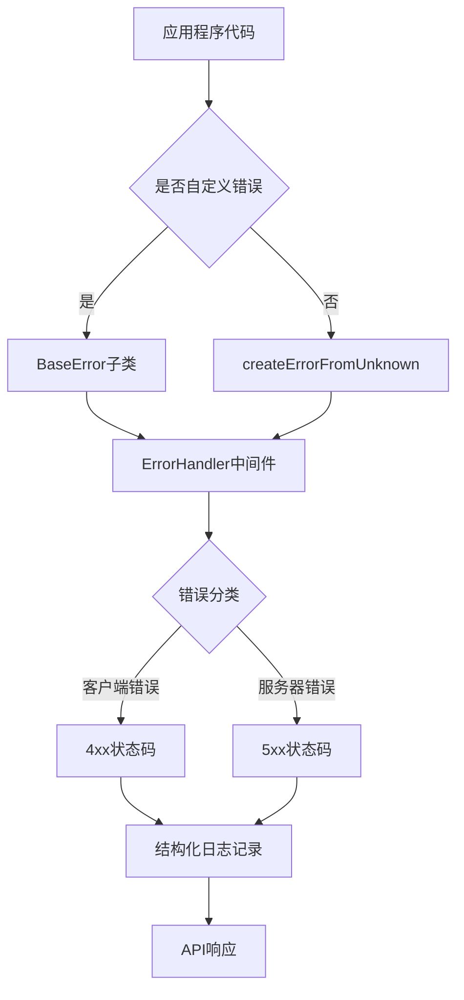
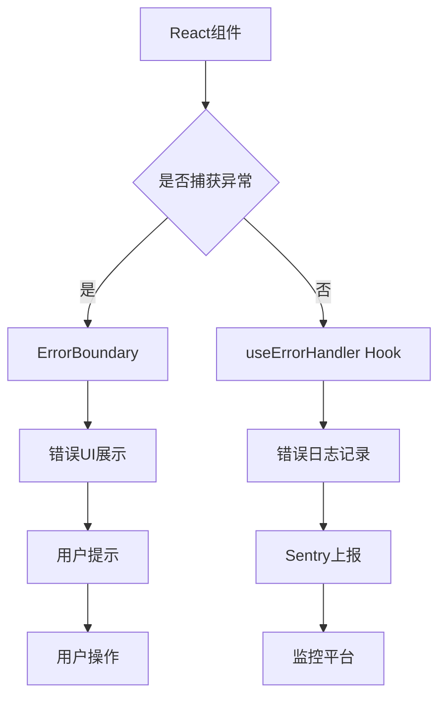

# 修复项目中所有异常的设计方案

## 1. 概述

本设计方案旨在全面修复LLMChat项目中的所有异常处理问题，包括后端和前端两个层面。项目当前已经建立了较为完善的错误处理基础设施，但仍存在一些需要改进的地方，如使用`any`类型的错误处理、直接抛出`Error`对象而非自定义错误类型等。

### 1.1 项目现状分析

通过代码分析，发现以下主要问题：

1. **后端问题**：
   - 存在多个使用`catch (error: any)`的代码段
   - 部分代码直接使用`throw new Error()`而非自定义错误类型
   - 错误处理中间件未完全统一

2. **前端问题**：
   - 存在多个错误边界组件，功能重复
   - 缺乏统一的错误处理策略
   - 部分组件中可能存在未处理的异常

### 1.2 设计目标

1. 统一前后端的异常处理机制
2. 消除使用`any`类型的错误处理代码
3. 规范化错误类型，全部使用自定义错误类
4. 提升错误信息的可读性和可追踪性
5. 完善错误日志记录和监控机制

## 2. 架构设计

### 2.1 后端异常处理架构



### 2.2 前端异常处理架构



## 3. 后端异常处理改进

### 3.1 统一错误类型系统

项目已建立完善的错误类型系统，包含以下核心组件：

1. **BaseError类**：所有自定义错误的基类
2. **具体错误类**：如ValidationError、AuthenticationError等
3. **错误处理工具**：safeExecute、safeExecuteAsync等
4. **错误转换函数**：createErrorFromUnknown

### 3.2 改进方案

#### 3.2.1 替换`catch (error: any)`为类型安全处理

将所有类似以下代码：

```typescript
catch (error: any) {
  logger.error('操作失败', { error });
}
```

替换为：

```typescript
catch (unknownError: unknown) {
  const error = createErrorFromUnknown(unknownError, {
    component: 'ComponentName',
    operation: 'operationName'
  });
  logger.error('操作失败', error.toLogObject());
}
```

#### 3.2.2 规范化throw语句

将所有直接使用`throw new Error()`的代码替换为具体的错误类型：

```typescript
// 原代码
throw new Error('Agent ID is required');

// 改进后
throw new ValidationError({
  message: 'Agent ID is required',
  field: 'agentId',
  code: 'AGENT_ID_REQUIRED',
});
```

#### 3.2.3 完善错误处理中间件

确保所有路由都使用asyncErrorHandler包装：

```typescript
import { asyncErrorHandler } from '@/middleware/errorHandler';

// 路由定义
app.post('/api/chat', asyncErrorHandler(chatController.handleChat));
```

### 3.3 错误处理流程

1. 应用程序代码抛出错误（自定义错误类型或未知错误）
2. 错误被传递到ErrorHandler中间件
3. ErrorHandler将未知错误转换为BaseError子类
4. 根据错误类型确定HTTP状态码
5. 记录结构化日志
6. 返回统一格式的API错误响应

## 4. 前端异常处理改进

### 4.1 统一错误边界组件

项目中存在多个错误边界组件，需要统一为单一实现：

1. **ErrorBoundary.tsx**：作为主要的错误边界组件
2. **useErrorHandler Hook**：用于函数组件中的错误处理

### 4.2 改进方案

#### 4.2.1 统一错误边界使用

确保所有可能出错的组件都被ErrorBoundary包装：

```tsx
<ErrorBoundary>
  <ChatApp />
</ErrorBoundary>
```

#### 4.2.2 规范化错误处理Hook

使用useErrorHandler Hook处理异步操作中的错误：

```typescript
const handleError = useErrorHandler();

const handleAsyncOperation = async () => {
  try {
    await someAsyncOperation();
  } catch (error) {
    handleError(error);
  }
};
```

#### 4.2.3 完善前端日志记录

使用统一的logger工具记录错误：

```typescript
import logger from '@/lib/logger';

try {
  // 操作代码
} catch (error) {
  logger.error(
    '操作失败',
    error instanceof Error ? error : new Error(String(error))
  );
}
```

## 5. 数据模型和API契约

### 5.1 统一错误响应格式

所有API错误响应遵循统一格式：

| 字段      | 类型   | 必填 | 描述       |
| --------- | ------ | ---- | ---------- |
| code      | string | 是   | 错误代码   |
| message   | string | 是   | 错误消息   |
| category  | string | 否   | 错误类别   |
| severity  | string | 否   | 错误严重性 |
| details   | object | 否   | 错误详情   |
| timestamp | string | 是   | 时间戳     |
| userId    | string | 否   | 用户ID     |
| requestId | string | 否   | 请求ID     |

### 5.2 错误类别定义

| 类别             | 描述         |
| ---------------- | ------------ |
| validation       | 验证错误     |
| authentication   | 身份验证错误 |
| authorization    | 权限错误     |
| network          | 网络错误     |
| external_service | 外部服务错误 |
| resource         | 资源错误     |
| business_logic   | 业务逻辑错误 |
| system           | 系统错误     |

### 5.3 错误严重性级别

| 级别     | 描述       |
| -------- | ---------- |
| low      | 低优先级   |
| medium   | 中优先级   |
| high     | 高优先级   |
| critical | 关键优先级 |

## 6. 业务逻辑层设计

### 6.1 后端业务逻辑异常处理

#### 6.1.1 服务层错误处理

所有服务方法应返回Result类型或抛出自定义错误：

```typescript
// 使用Result类型
async function getUserById(id: string): Promise<Result<User>> {
  try {
    const user = await db.getUserById(id);
    if (!user) {
      return createFailure(
        new ResourceError({
          message: 'User not found',
          resourceType: 'user',
          resourceId: id,
          code: 'USER_NOT_FOUND',
        })
      );
    }
    return createSuccess(user);
  } catch (unknownError) {
    const error = createErrorFromUnknown(unknownError, {
      component: 'UserService',
      operation: 'getUserById',
    });
    return createFailure(error);
  }
}

// 抛出自定义错误
async function updateUserProfile(
  userId: string,
  profile: Profile
): Promise<User> {
  try {
    // 验证输入
    if (!profile.email) {
      throw new ValidationError({
        message: 'Email is required',
        field: 'email',
        code: 'EMAIL_REQUIRED',
      });
    }

    // 更新用户
    const user = await db.updateUser(userId, profile);
    return user;
  } catch (unknownError) {
    if (unknownError instanceof BaseError) {
      throw unknownError;
    }

    throw createErrorFromUnknown(unknownError, {
      component: 'UserService',
      operation: 'updateUserProfile',
    });
  }
}
```

#### 6.1.2 控制器层错误处理

控制器应使用asyncErrorHandler包装，并正确处理服务层返回的Result：

```typescript
class UserController {
  async getUser(req: Request, res: Response, next: NextFunction) {
    try {
      const { id } = req.params;
      const result = await userService.getUserById(id);

      if (!result.success) {
        // 服务层已返回具体的错误，直接传递给错误处理中间件
        return next(result.error);
      }

      safeJsonResponse(res, {
        success: true,
        data: result.data,
      });
    } catch (unknownError) {
      // 意外错误，转换后传递给错误处理中间件
      const error = createErrorFromUnknown(unknownError, {
        component: 'UserController',
        operation: 'getUser',
      });
      next(error);
    }
  }
}
```

### 6.2 前端业务逻辑异常处理

#### 6.2.1 API调用错误处理

所有API调用应正确处理错误响应：

```typescript
import logger from '@/lib/logger';

async function fetchUserData(userId: string): Promise<User | null> {
  try {
    const response = await api.get<User>(`/users/${userId}`);
    return response.data;
  } catch (error) {
    // 记录错误
    logger.error(
      '获取用户数据失败',
      error instanceof Error ? error : new Error(String(error)),
      {
        component: 'UserService',
        operation: 'fetchUserData',
        userId,
      }
    );

    // 根据错误类型处理
    if (isApiError(error)) {
      switch (error.code) {
        case 'USER_NOT_FOUND':
          // 处理用户不存在的情况
          return null;
        case 'UNAUTHORIZED':
          // 处理未授权情况
          redirectToLogin();
          return null;
        default:
          // 其他错误，抛出给上层处理
          throw error;
      }
    }

    // 网络错误或其他未知错误
    throw error;
  }
}
```

#### 6.2.2 状态管理错误处理

在Zustand store中正确处理异步操作错误：

```typescript
interface ChatStoreState {
  messages: Message[];
  loading: boolean;
  error: string | null;
  fetchMessages: (sessionId: string) => Promise<void>;
}

const useChatStore = create<ChatStoreState>((set, get) => ({
  messages: [],
  loading: false,
  error: null,

  fetchMessages: async (sessionId: string) => {
    set({ loading: true, error: null });

    try {
      const messages = await chatService.getMessages(sessionId);
      set({ messages, loading: false });
    } catch (error) {
      const errorMessage = error instanceof Error ? error.message : '未知错误';
      logger.error(
        '获取消息失败',
        error instanceof Error ? error : new Error(String(error)),
        {
          component: 'ChatStore',
          operation: 'fetchMessages',
          sessionId,
        }
      );

      set({ error: errorMessage, loading: false });
    }
  },
}));
```

## 7. 中间件和拦截器

### 7.1 后端中间件

#### 7.1.1 错误处理中间件

项目已实现统一的错误处理中间件，包含以下功能：

1. 类型安全的错误转换
2. 统一的错误响应格式
3. 结构化日志记录
4. 开发环境详细信息
5. 生产环境错误追踪

#### 7.1.2 异步错误包装器

使用asyncErrorHandler包装所有异步路由处理器：

```typescript
export const asyncErrorHandler = (
  fn: (req: Request, res: Response, next: NextFunction) => Promise<void>
) => {
  return (req: Request, res: Response, next: NextFunction): void => {
    Promise.resolve(fn(req, res, next)).catch(next);
  };
};
```

#### 7.1.3 404处理中间件

统一处理未找到的路由：

```typescript
export const notFoundHandler = (
  req: Request,
  res: Response,
  next: NextFunction
): void => {
  const error = createErrorFromUnknown(
    new Error(`Route ${req.method} ${req.originalUrl} not found`),
    {
      component: 'ErrorHandler',
      operation: 'notFoundHandling',
      url: req.originalUrl,
      method: req.method,
    }
  );

  const errorResponse = error.toApiError();
  res.status(404).json(errorResponse);
};
```

### 7.2 前端拦截器

#### 7.2.1 API响应拦截器

统一处理API响应和错误：

```typescript
// api.ts
api.interceptors.response.use(
  response => response,
  error => {
    // 记录错误日志
    logger.error('API请求错误', error, {
      url: error.config?.url,
      method: error.config?.method,
      status: error.response?.status,
    });

    // 处理特定状态码
    const status = error.response?.status;
    if (status === 401) {
      // 处理未授权
      const { logout } = useAuthStore.getState();
      logout();
      toast({ type: 'warning', title: '登录状态已过期，请重新登录' });
      const target = window.location.pathname + (window.location.search || '');
      window.location.assign(`/login?redirect=${encodeURIComponent(target)}`);
      return Promise.reject(error);
    }

    // 处理网络超时
    if (error.code === 'ECONNABORTED' || error.message?.includes('timeout')) {
      error.message = '请求超时，请检查网络连接';
    } else if (error.code === 'ERR_NETWORK') {
      error.message = '网络连接失败，请检查后端服务是否启动';
    }

    return Promise.reject(error);
  }
);
```

## 8. 测试策略

### 8.1 后端测试

#### 8.1.1 错误处理单元测试

为所有错误处理逻辑编写单元测试：

```typescript
describe('ErrorHandler Middleware', () => {
  test('should handle ValidationError correctly', async () => {
    const validationError = new ValidationError({
      message: 'Invalid input',
      field: 'email',
      value: 'invalid-email',
    });

    // 模拟Express请求/响应对象
    const mockReq = {} as Request;
    const mockRes = {
      status: jest.fn().mockReturnThis(),
      json: jest.fn(),
    } as unknown as Response;
    const mockNext = jest.fn();

    // 调用错误处理中间件
    errorHandler(validationError, mockReq, mockRes, mockNext);

    // 验证响应
    expect(mockRes.status).toHaveBeenCalledWith(400);
    expect(mockRes.json).toHaveBeenCalledWith(
      expect.objectContaining({
        code: 'VALIDATION_ERROR',
        message: 'Invalid input',
      })
    );
  });

  test('should handle unknown errors', async () => {
    const unknownError = new Error('Unknown error');

    const mockReq = {} as Request;
    const mockRes = {
      status: jest.fn().mockReturnThis(),
      json: jest.fn(),
    } as unknown as Response;
    const mockNext = jest.fn();

    errorHandler(unknownError, mockReq, mockRes, mockNext);

    expect(mockRes.status).toHaveBeenCalledWith(500);
    expect(mockRes.json).toHaveBeenCalledWith(
      expect.objectContaining({
        code: 'INTERNAL_ERROR',
        message: 'Unknown error',
      })
    );
  });
});
```

#### 8.1.2 服务层错误测试

测试服务层正确处理各种错误情况：

```typescript
describe('UserService', () => {
  test('should return USER_NOT_FOUND error when user does not exist', async () => {
    // 模拟数据库返回null
    jest.spyOn(db, 'getUserById').mockResolvedValue(null);

    const result = await userService.getUserById('non-existent-id');

    expect(result.success).toBe(false);
    expect(result.error).toBeInstanceOf(ResourceError);
    expect(result.error.code).toBe('USER_NOT_FOUND');
  });

  test('should handle database errors correctly', async () => {
    // 模拟数据库错误
    jest
      .spyOn(db, 'getUserById')
      .mockRejectedValue(new Error('Database connection failed'));

    const result = await userService.getUserById('user-id');

    expect(result.success).toBe(false);
    expect(result.error).toBeInstanceOf(ExternalServiceError);
    expect(result.error.code).toBe('DATABASE_ERROR');
  });
});
```

### 8.2 前端测试

#### 8.2.1 错误边界测试

测试错误边界组件正确捕获和显示错误：

```typescript
describe('ErrorBoundary', () => {
  test('should render fallback UI when error occurs', () => {
    const ThrowError: React.FC = () => {
      throw new Error('Test error');
    };

    const { getByText } = render(
      <ErrorBoundary>
        <ThrowError />
      </ErrorBoundary>
    );

    expect(getByText('应用遇到了错误')).toBeInTheDocument();
    expect(getByText('Test error')).toBeInTheDocument();
  });

  test('should call componentDidCatch when error occurs', () => {
    const consoleErrorSpy = jest.spyOn(console, 'error').mockImplementation();

    const ThrowError: React.FC = () => {
      throw new Error('Test error');
    };

    render(
      <ErrorBoundary>
        <ThrowError />
      </ErrorBoundary>
    );

    expect(consoleErrorSpy).toHaveBeenCalledWith('Uncaught error:', expect.any(Error), expect.any(Object));

    consoleErrorSpy.mockRestore();
  });
});
```

#### 8.2.2 API错误处理测试

测试API调用正确处理各种错误情况：

```typescript
describe('API Error Handling', () => {
  test('should handle 401 Unauthorized error', async () => {
    // 模拟401响应
    mock.onGet('/api/user').reply(401, {
      code: 'UNAUTHORIZED',
      message: 'Unauthorized',
    });

    const logoutSpy = jest.spyOn(useAuthStore.getState(), 'logout');

    await expect(api.get('/api/user')).rejects.toThrow();

    // 验证是否调用了登出函数
    expect(logoutSpy).toHaveBeenCalled();
  });

  test('should handle network timeout', async () => {
    // 模拟网络超时
    mock.onGet('/api/user').timeout();

    await expect(api.get('/api/user')).rejects.toThrow(
      '请求超时，请检查网络连接'
    );
  });
});
```

## 9. 部署和监控

### 9.1 错误监控集成

#### 9.1.1 Sentry集成

项目已集成Sentry用于错误监控，需确保：

1. 正确配置Sentry DSN
2. 在生产环境启用Sentry
3. 正确设置用户上下文追踪

#### 9.1.2 结构化日志

所有错误都应记录结构化日志，便于后续分析：

```typescript
logger.error('操作失败', {
  errorId: error.id,
  code: error.code,
  message: error.message,
  component: 'ComponentName',
  operation: 'operationName',
  userId: 'user-id',
  requestId: 'request-id',
  timestamp: error.timestamp,
  stack: error.stack,
});
```

### 9.2 告警机制

#### 9.2.1 高优先级错误告警

对于以下类型的错误应立即告警：

1. Critical和High严重级别的错误
2. 5xx服务器错误
3. 特定错误码：DATABASE_ERROR、REDIS_ERROR、CIRCUIT_BREAKER_OPEN等

#### 9.2.2 告警策略

```typescript
export const shouldAlert = (error: BaseError): boolean => {
  // Critical和High严重级别需要告警
  if (error.severity === 'critical' || error.severity === 'high') {
    return true;
  }

  // 5xx服务器错误需要告警
  const statusCode = getErrorStatusCode(error);
  if (isServerError(statusCode)) {
    return true;
  }

  // 特定错误码需要告警
  const alertCodes = [
    'DATABASE_ERROR',
    'REDIS_ERROR',
    'CIRCUIT_BREAKER_OPEN',
    'SERVICE_UNAVAILABLE',
    'CRITICAL_SYSTEM_ERROR',
  ];

  return alertCodes.includes(error.code);
};
```

## 10. 实施计划

### 10.1 阶段一：后端异常处理改进（2天）

1. 替换所有`catch (error: any)`为类型安全处理（1天）
2. 规范化所有throw语句，使用自定义错误类型（0.5天）
3. 完善错误处理中间件配置（0.5天）

### 10.2 阶段二：前端异常处理改进（2天）

1. 统一错误边界组件使用（1天）
2. 规范化前端错误处理Hook使用（0.5天）
3. 完善前端日志记录（0.5天）

### 10.3 阶段三：测试和完善（2天）

1. 编写缺失的错误处理测试（1天）
2. 验证错误处理流程，修复发现的问题（1天）

### 10.4 阶段四：文档和培训（0.5天）

1. 更新相关文档
2. 团队培训和知识传递

## 11. 风险评估和缓解措施

### 11.1 主要风险

1. **兼容性风险**：修改错误处理可能影响现有功能
   - 缓解措施：充分测试，逐步部署

2. **性能风险**：增加错误处理逻辑可能影响性能
   - 缓解措施：优化错误处理代码，避免不必要的操作

3. **监控盲点**：修改后可能丢失某些错误的监控
   - 缓解措施：确保所有错误都被正确记录和上报

### 11.2 回滚计划

如果新错误处理机制导致严重问题：

1. 立即回滚到上一版本
2. 分析问题原因
3. 修复后重新部署
