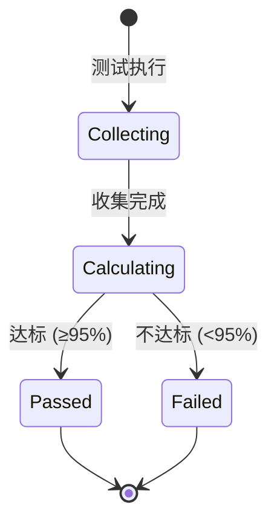
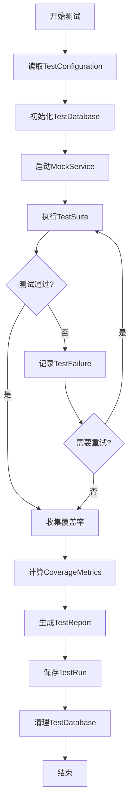
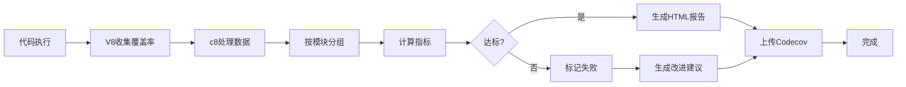

# 测试覆盖率提升 - 数据模型

**创建时间**: 2025-10-16  
**版本**: 1.0  
**状态**: 定义中

---

## 1. 测试执行实体

### 1.1 TestRun (测试运行)

**描述**: 记录每次测试执行的完整信息

**字段**:
```typescript
interface TestRun {
  id: string;                    // UUID
  runAt: Date;                   // 执行时间
  environment: TestEnvironment;  // 环境 (local, ci, staging)
  branch: string;                // Git分支
  commit: string;                // Git commit SHA
  coverage: CoverageMetrics;     // 覆盖率指标
  duration: number;              // 执行时长(ms)
  status: TestStatus;            // 状态 (passed, failed, partial)
  failedTests: TestFailure[];    // 失败的测试
  createdAt: Date;
}

type TestEnvironment = 'local' | 'ci' | 'staging' | 'production';
type TestStatus = 'passed' | 'failed' | 'partial' | 'running';
```

**关系**:
- `1:N` with TestFailure
- `1:1` with CoverageMetrics

**验证规则**:
- `id`: 必需，UUID格式
- `duration`: 必需，>0
- `coverage`: 必需，符合CoverageMetrics schema
- `branch`: 必需，非空字符串
- `commit`: 必需，40字符SHA

---

### 1.2 TestFailure (测试失败记录)

**描述**: 详细记录每个失败的测试用例

**字段**:
```typescript
interface TestFailure {
  id: string;
  testRunId: string;             // 关联TestRun
  testName: string;              // 测试名称
  testFile: string;              // 测试文件路径
  testType: TestType;            // 测试类型
  errorMessage: string;          // 错误消息
  errorStack: string;            // 错误堆栈
  expectedValue?: any;           // 期望值
  actualValue?: any;             // 实际值
  retryCount: number;            // 重试次数
  screenshot?: string;           // 截图路径 (E2E)
  duration: number;              // 执行时长
  createdAt: Date;
}

type TestType = 'unit' | 'integration' | 'e2e' | 'security' | 'performance';
```

**关系**:
- `N:1` with TestRun
- `N:1` with TestFile

**验证规则**:
- `testName`: 必需，非空
- `errorMessage`: 必需，<1000字符
- `testType`: 必需，枚举值
- `retryCount`: ≥0，≤5

---

### 1.3 CoverageMetrics (覆盖率指标)

**描述**: 记录代码覆盖率的各项指标

**字段**:
```typescript
interface CoverageMetrics {
  id: string;
  testRunId: string;
  lineCoverage: number;          // 行覆盖率 0-100
  branchCoverage: number;        // 分支覆盖率 0-100
  functionCoverage: number;      // 函数覆盖率 0-100
  statementCoverage: number;     // 语句覆盖率 0-100
  totalLines: number;            // 总行数
  coveredLines: number;          // 覆盖行数
  uncoveredFiles: string[];      // 未覆盖文件列表
  coverageByModule: ModuleCoverage[];  // 模块级覆盖率
  createdAt: Date;
}

interface ModuleCoverage {
  moduleName: string;            // 模块名称
  lineCoverage: number;
  branchCoverage: number;
  functionCoverage: number;
  passesThreshold: boolean;      // 是否达标
  threshold: number;             // 阈值要求
}
```

**验证规则**:
- 所有coverage字段: 0-100
- `coveredLines` ≤ `totalLines`
- `coverageByModule`: 至少包含 Auth, Chat, Agent

**状态转换**:


---

## 2. 测试配置实体

### 2.1 TestConfiguration (测试配置)

**描述**: 测试执行的配置参数

**字段**:
```typescript
interface TestConfiguration {
  id: string;
  name: string;                  // 配置名称
  environment: TestEnvironment;
  coverageThresholds: CoverageThresholds;
  retrySettings: RetrySettings;
  timeoutSettings: TimeoutSettings;
  mockStrategy: MockStrategy;
  parallelism: number;           // 并行度
  isActive: boolean;
  createdAt: Date;
  updatedAt: Date;
}

interface CoverageThresholds {
  global: {
    lines: number;               // 95
    branches: number;            // 90
    functions: number;           // 95
    statements: number;          // 95
  };
  perModule: {
    [moduleName: string]: {
      lines: number;             // 如 Auth: 90
      branches: number;
      functions: number;
      statements: number;
    };
  };
}

interface RetrySettings {
  maxRetries: number;            // 最大重试次数
  retryDelay: number;            // 重试延迟(ms)
  retryOn: string[];             // 重试条件
}

interface TimeoutSettings {
  unit: number;                  // 单元测试超时
  integration: number;           // 集成测试超时
  e2e: number;                   // E2E测试超时
}

type MockStrategy = 'full' | 'partial' | 'none';
```

**验证规则**:
- `parallelism`: 1-10
- `coverageThresholds.global.lines`: ≥80
- `retrySettings.maxRetries`: ≤5
- `timeoutSettings.e2e`: ≤60000 (60秒)

---

### 2.2 TestSuite (测试套件)

**描述**: 组织相关测试用例的集合

**字段**:
```typescript
interface TestSuite {
  id: string;
  name: string;                  // 套件名称
  module: string;                // 所属模块
  testType: TestType;
  testCases: TestCase[];
  tags: string[];                // 标签 (smoke, regression, critical)
  priority: Priority;            // 优先级
  estimatedDuration: number;     // 预计时长(ms)
  dependencies: string[];        // 依赖的其他套件
  createdAt: Date;
  updatedAt: Date;
}

type Priority = 'P0' | 'P1' | 'P2' | 'P3';

interface TestCase {
  id: string;
  name: string;
  description: string;
  testFile: string;
  lineNumber: number;
  expectedBehavior: string;      // 期望行为
  testData?: any;                // 测试数据
  assertions: Assertion[];
}

interface Assertion {
  type: AssertionType;
  expected: any;
  message: string;
}

type AssertionType = 
  | 'toBe' 
  | 'toEqual' 
  | 'toContain' 
  | 'toThrow' 
  | 'toBeGreaterThan'
  | 'toBeLessThan'
  | 'toMatchSnapshot';
```

**关系**:
- `1:N` with TestCase
- `N:N` with TestSuite (dependencies)

---

## 3. 测试环境实体

### 3.1 TestDatabase (测试数据库)

**描述**: 测试专用数据库配置

**字段**:
```typescript
interface TestDatabase {
  id: string;
  name: string;                  // llmchat_test
  connectionString: string;      // PostgreSQL连接串
  schema: string;                // public
  migrations: Migration[];       // 已执行迁移
  seedData: SeedData[];          // 种子数据
  snapshotId?: string;           // 快照ID (用于快速恢复)
  isClean: boolean;              // 是否已清理
  createdAt: Date;
}

interface Migration {
  version: string;               // 迁移版本号
  name: string;                  // 迁移名称
  appliedAt: Date;
  checksum: string;              // 校验和
}

interface SeedData {
  table: string;
  records: any[];
  order: number;                 // 插入顺序
}
```

**验证规则**:
- `name`: 必须包含 '_test' 后缀
- `migrations`: 版本号递增
- `seedData`: order唯一且连续

---

### 3.2 MockService (Mock服务配置)

**描述**: 外部依赖的Mock配置

**字段**:
```typescript
interface MockService {
  id: string;
  serviceName: string;           // FastGPT, Redis, FileUpload
  mockType: MockType;
  endpoints: MockEndpoint[];
  globalBehavior: MockBehavior;
  scenarios: MockScenario[];     // 预定义场景
  isActive: boolean;
  createdAt: Date;
}

type MockType = 'jest' | 'nock' | 'msw' | 'manual';

interface MockEndpoint {
  path: string;
  method: HttpMethod;
  response: MockResponse;
  delay?: number;                // 模拟延迟
  errorRate?: number;            // 错误率 0-1
}

interface MockResponse {
  status: number;
  headers?: Record<string, string>;
  body: any;
}

interface MockBehavior {
  defaultDelay: number;          // 默认延迟
  defaultErrorRate: number;      // 默认错误率
  fallbackResponse: MockResponse;
}

interface MockScenario {
  name: string;                  // success, timeout, error
  description: string;
  overrides: Partial<MockEndpoint>[];
}

type HttpMethod = 'GET' | 'POST' | 'PUT' | 'DELETE' | 'PATCH';
```

**预定义Scenarios**:
```typescript
const mockScenarios: MockScenario[] = [
  {
    name: 'success',
    description: '所有请求成功',
    overrides: []
  },
  {
    name: 'timeout',
    description: '模拟超时',
    overrides: [{ delay: 30000 }]
  },
  {
    name: 'rate-limited',
    description: '模拟限流',
    overrides: [{ 
      response: { status: 429, body: { error: 'Too Many Requests' } }
    }]
  },
  {
    name: 'server-error',
    description: '服务器错误',
    overrides: [{ 
      response: { status: 500, body: { error: 'Internal Server Error' } }
    }]
  }
];
```

---

## 4. 测试报告实体

### 4.1 TestReport (测试报告)

**描述**: 汇总测试运行结果的报告

**字段**:
```typescript
interface TestReport {
  id: string;
  testRunId: string;
  reportType: ReportType;
  generatedAt: Date;
  summary: TestSummary;
  detailedResults: TestResult[];
  coverageAnalysis: CoverageAnalysis;
  recommendations: Recommendation[];
  attachments: Attachment[];     // 截图、日志等
}

type ReportType = 'unit' | 'integration' | 'e2e' | 'full' | 'regression';

interface TestSummary {
  totalTests: number;
  passedTests: number;
  failedTests: number;
  skippedTests: number;
  passRate: number;              // 通过率
  totalDuration: number;
  flakyTests: string[];          // 不稳定的测试
}

interface TestResult {
  suiteName: string;
  testName: string;
  status: 'passed' | 'failed' | 'skipped';
  duration: number;
  error?: TestError;
}

interface TestError {
  message: string;
  stack: string;
  type: ErrorType;
}

type ErrorType = 
  | 'assertion' 
  | 'timeout' 
  | 'runtime' 
  | 'network'
  | 'database';

interface CoverageAnalysis {
  current: CoverageMetrics;
  previous?: CoverageMetrics;
  trend: Trend;                  // improving, stable, declining
  gaps: CoverageGap[];
}

type Trend = 'improving' | 'stable' | 'declining';

interface CoverageGap {
  file: string;
  uncoveredLines: number[];
  criticalityScore: number;      // 1-10
  suggestedTests: string[];
}

interface Recommendation {
  priority: Priority;
  category: RecommendationCategory;
  title: string;
  description: string;
  actionItems: string[];
  estimatedEffort: string;       // '1h', '4h', '1d'
}

type RecommendationCategory = 
  | 'coverage-improvement'
  | 'test-stability'
  | 'performance'
  | 'test-organization';

interface Attachment {
  type: AttachmentType;
  path: string;
  size: number;
  createdAt: Date;
}

type AttachmentType = 'screenshot' | 'log' | 'trace' | 'video';
```

---

## 5. 数据流图

### 5.1 测试执行流程



### 5.2 覆盖率收集流程



---

## 6. 数据库Schema

### 6.1 PostgreSQL Tables

```sql
-- 测试运行记录
CREATE TABLE test_runs (
    id UUID PRIMARY KEY DEFAULT gen_random_uuid(),
    run_at TIMESTAMP NOT NULL DEFAULT NOW(),
    environment VARCHAR(20) NOT NULL,
    branch VARCHAR(255) NOT NULL,
    commit CHAR(40) NOT NULL,
    status VARCHAR(20) NOT NULL,
    duration INTEGER NOT NULL,
    created_at TIMESTAMP DEFAULT NOW(),
    CHECK (environment IN ('local', 'ci', 'staging', 'production')),
    CHECK (status IN ('passed', 'failed', 'partial', 'running')),
    CHECK (duration > 0)
);

-- 覆盖率指标
CREATE TABLE coverage_metrics (
    id UUID PRIMARY KEY DEFAULT gen_random_uuid(),
    test_run_id UUID NOT NULL REFERENCES test_runs(id) ON DELETE CASCADE,
    line_coverage DECIMAL(5,2) NOT NULL,
    branch_coverage DECIMAL(5,2) NOT NULL,
    function_coverage DECIMAL(5,2) NOT NULL,
    statement_coverage DECIMAL(5,2) NOT NULL,
    total_lines INTEGER NOT NULL,
    covered_lines INTEGER NOT NULL,
    created_at TIMESTAMP DEFAULT NOW(),
    CHECK (line_coverage >= 0 AND line_coverage <= 100),
    CHECK (branch_coverage >= 0 AND branch_coverage <= 100),
    CHECK (function_coverage >= 0 AND function_coverage <= 100),
    CHECK (statement_coverage >= 0 AND statement_coverage <= 100),
    CHECK (covered_lines <= total_lines)
);

-- 模块覆盖率
CREATE TABLE module_coverage (
    id UUID PRIMARY KEY DEFAULT gen_random_uuid(),
    coverage_metrics_id UUID NOT NULL REFERENCES coverage_metrics(id) ON DELETE CASCADE,
    module_name VARCHAR(100) NOT NULL,
    line_coverage DECIMAL(5,2) NOT NULL,
    branch_coverage DECIMAL(5,2) NOT NULL,
    function_coverage DECIMAL(5,2) NOT NULL,
    passes_threshold BOOLEAN NOT NULL DEFAULT false,
    threshold DECIMAL(5,2) NOT NULL,
    created_at TIMESTAMP DEFAULT NOW()
);

-- 测试失败记录
CREATE TABLE test_failures (
    id UUID PRIMARY KEY DEFAULT gen_random_uuid(),
    test_run_id UUID NOT NULL REFERENCES test_runs(id) ON DELETE CASCADE,
    test_name VARCHAR(500) NOT NULL,
    test_file VARCHAR(500) NOT NULL,
    test_type VARCHAR(20) NOT NULL,
    error_message TEXT NOT NULL,
    error_stack TEXT,
    retry_count INTEGER DEFAULT 0,
    screenshot_path VARCHAR(500),
    duration INTEGER NOT NULL,
    created_at TIMESTAMP DEFAULT NOW(),
    CHECK (test_type IN ('unit', 'integration', 'e2e', 'security', 'performance')),
    CHECK (retry_count >= 0 AND retry_count <= 5)
);

-- 测试配置
CREATE TABLE test_configurations (
    id UUID PRIMARY KEY DEFAULT gen_random_uuid(),
    name VARCHAR(100) NOT NULL UNIQUE,
    environment VARCHAR(20) NOT NULL,
    coverage_thresholds JSONB NOT NULL,
    retry_settings JSONB NOT NULL,
    timeout_settings JSONB NOT NULL,
    mock_strategy VARCHAR(20) NOT NULL,
    parallelism INTEGER DEFAULT 1,
    is_active BOOLEAN DEFAULT true,
    created_at TIMESTAMP DEFAULT NOW(),
    updated_at TIMESTAMP DEFAULT NOW(),
    CHECK (parallelism >= 1 AND parallelism <= 10),
    CHECK (mock_strategy IN ('full', 'partial', 'none'))
);

-- 测试套件
CREATE TABLE test_suites (
    id UUID PRIMARY KEY DEFAULT gen_random_uuid(),
    name VARCHAR(200) NOT NULL,
    module VARCHAR(100) NOT NULL,
    test_type VARCHAR(20) NOT NULL,
    priority VARCHAR(10) NOT NULL,
    tags TEXT[],
    estimated_duration INTEGER,
    dependencies TEXT[],
    created_at TIMESTAMP DEFAULT NOW(),
    updated_at TIMESTAMP DEFAULT NOW(),
    CHECK (test_type IN ('unit', 'integration', 'e2e', 'security', 'performance')),
    CHECK (priority IN ('P0', 'P1', 'P2', 'P3'))
);

-- 索引
CREATE INDEX idx_test_runs_status ON test_runs(status);
CREATE INDEX idx_test_runs_run_at ON test_runs(run_at DESC);
CREATE INDEX idx_test_failures_test_run ON test_failures(test_run_id);
CREATE INDEX idx_coverage_metrics_test_run ON coverage_metrics(test_run_id);
CREATE INDEX idx_module_coverage_module_name ON module_coverage(module_name);
CREATE INDEX idx_test_suites_module ON test_suites(module);
CREATE INDEX idx_test_suites_priority ON test_suites(priority);
```

---

## 7. API接口定义

### 7.1 查询接口

```typescript
// GET /api/test-runs?environment=ci&limit=10
interface GetTestRunsRequest {
  environment?: TestEnvironment;
  branch?: string;
  startDate?: string;
  endDate?: string;
  status?: TestStatus;
  limit?: number;
  offset?: number;
}

interface GetTestRunsResponse {
  runs: TestRun[];
  total: number;
  pagination: {
    limit: number;
    offset: number;
    hasMore: boolean;
  };
}

// GET /api/test-runs/:id
interface GetTestRunResponse {
  run: TestRun;
  coverage: CoverageMetrics;
  failures: TestFailure[];
}

// GET /api/coverage/summary
interface CoverageSummaryResponse {
  current: CoverageMetrics;
  trend: {
    last7Days: CoverageMetrics[];
    last30Days: CoverageMetrics[];
  };
  byModule: ModuleCoverage[];
}

// GET /api/test-failures?groupBy=testFile
interface GetTestFailuresRequest {
  testRunId?: string;
  testType?: TestType;
  groupBy?: 'testFile' | 'testType' | 'errorType';
  limit?: number;
}

interface GetTestFailuresResponse {
  failures: TestFailure[];
  grouped?: Record<string, TestFailure[]>;
  total: number;
}
```

### 7.2 执行接口

```typescript
// POST /api/test-runs
interface CreateTestRunRequest {
  configurationId: string;
  environment: TestEnvironment;
  branch: string;
  commit: string;
  suiteIds?: string[];           // 可选，指定测试套件
}

interface CreateTestRunResponse {
  runId: string;
  status: TestStatus;
  estimatedDuration: number;
}

// POST /api/test-runs/:id/retry
interface RetryTestRunRequest {
  failedOnly: boolean;           // 仅重试失败的测试
  suiteIds?: string[];
}

// POST /api/coverage/analyze
interface AnalyzeCoverageRequest {
  testRunId: string;
  generateReport: boolean;
}

interface AnalyzeCoverageResponse {
  coverage: CoverageMetrics;
  gaps: CoverageGap[];
  recommendations: Recommendation[];
  reportUrl?: string;
}
```

---

## 8. 数据迁移策略

### 8.1 初始化Schema

```bash
# 1. 创建测试数据库
createdb llmchat_test

# 2. 运行Schema迁移
psql llmchat_test < .specify/migrations/001_test_schema.sql

# 3. 插入默认配置
psql llmchat_test < .specify/migrations/002_default_config.sql
```

### 8.2 数据备份

```sql
-- 备份测试历史数据（保留90天）
CREATE TABLE test_runs_archive AS
SELECT * FROM test_runs
WHERE run_at < NOW() - INTERVAL '90 days';

-- 清理旧数据
DELETE FROM test_runs
WHERE run_at < NOW() - INTERVAL '90 days';
```

---

**文档版本**: 1.0  
**最后更新**: 2025-10-16  
**维护者**: 开发团队


