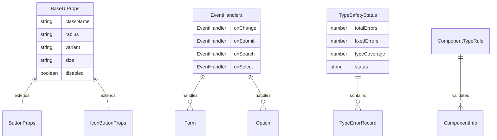
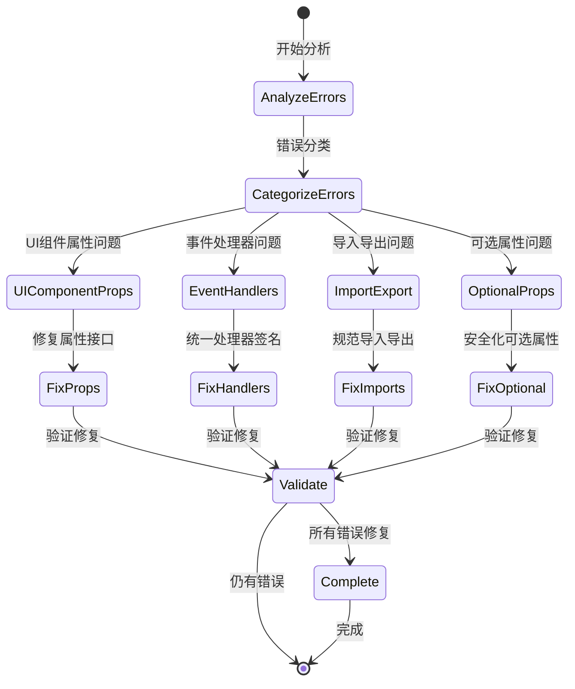

# 前端类型安全改进 - 数据模型

**版本**: 1.0
**创建日期**: 2025-10-18
**状态**: 草稿

---

## 📋 数据模型概览

基于研究分析和现有shared-types包，定义前端类型安全改进的核心数据模型。

## 🏗️ 核心实体定义

### 1. UI组件属性模型

```typescript
// 基础UI组件属性接口
interface BaseUIProps {
  /** CSS类名 */
  className?: string;
  /** 圆角大小 */
  radius?: string;
  /** 组件变体 */
  variant?: 'primary' | 'secondary' | 'ghost' | 'glass' | 'destructive';
  /** 组件尺寸 */
  size?: 'sm' | 'md' | 'lg' | 'icon';
  /** 是否禁用 */
  disabled?: boolean;
  /** 测试ID */
  'data-testid'?: string;
}

// 按钮专用属性
interface ButtonProps extends BaseUIProps {
  /** 按钮类型 */
  type?: 'button' | 'submit' | 'reset';
  /** 点击处理函数 */
  onClick?: (event: React.MouseEvent<HTMLButtonElement>) => void;
  /** 加载状态 */
  loading?: boolean;
  /** 子元素 */
  children: React.ReactNode;
}

// 图标按钮专用属性
interface IconButtonProps extends BaseUIProps {
  /** 点击处理函数 */
  onClick?: (event: React.MouseEvent<HTMLButtonElement>) => void;
  /** ARIA标签 */
  'aria-label': string;
  /** ARIA属性 */
  'aria-expanded'?: boolean;
  'aria-controls'?: string;
  /** 子元素（图标） */
  children: React.ReactNode;
}
```

### 2. 事件处理器模型

```typescript
// 统一的事件处理器类型
type EventHandler<T = any, E = React.ChangeEvent<HTMLInputElement>> = (
  value: T,
  event: E
) => void;

// 通用事件处理器映射
interface EventHandlers {
  onChange?: EventHandler<string>;
  onSubmit?: EventHandler<Form>;
  onSearch?: EventHandler<string>;
  onSelect?: EventHandler<Option>;
}

// 表单数据接口
interface Form {
  [key: string]: unknown;
}

// 选项接口
interface Option {
  value: string;
  label: string;
  disabled?: boolean;
}
```

### 3. 类型安全状态模型

```typescript
// 类型安全检查状态
interface TypeSafetyStatus {
  /** 总错误数 */
  totalErrors: number;
  /** 已修复错误数 */
  fixedErrors: number;
  /** 待修复错误数 */
  pendingErrors: number;
  /** 类型覆盖率 */
  typeCoverage: number;
  /** 最后检查时间 */
  lastChecked: string;
  /** 检查状态 */
  status: 'passing' | 'failing' | 'warning';
}

// 类型错误记录
interface TypeErrorRecord {
  /** 错误ID */
  id: string;
  /** 文件路径 */
  filePath: string;
  /** 错误行号 */
  line: number;
  /** 错误列号 */
  column: number;
  /** 错误代码 */
  code: string;
  /** 错误消息 */
  message: string;
  /** 错误严重程度 */
  severity: 'error' | 'warning' | 'info';
  /** 修复状态 */
  status: 'pending' | 'fixed' | 'skipped';
  /** 修复建议 */
  suggestion?: string;
}
```

### 4. 组件类型验证模型

```typescript
// 组件类型验证规则
interface ComponentTypeRule {
  /** 规则ID */
  id: string;
  /** 规则名称 */
  name: string;
  /** 规则描述 */
  description: string;
  /** 规则模式 */
  pattern: RegExp;
  /** 验证函数 */
  validator: (component: ComponentInfo) => boolean;
  /** 错误消息模板 */
  messageTemplate: string;
}

// 组件信息
interface ComponentInfo {
  /** 组件名称 */
  name: string;
  /** 组件类型 */
  type: 'function' | 'class' | 'forwardRef';
  /** 属性接口 */
  props: Record<string, any>;
  /** 文件路径 */
  filePath: string;
  /** 导出方式 */
  exportType: 'default' | 'named';
}
```

## 📊 实体关系图



## 🔄 状态转换流程

### 类型安全改进流程



## 📋 数据验证规则

### 1. UI组件属性验证

```typescript
// 验证UI组件属性一致性
const validateUIComponentProps = (component: ComponentInfo): boolean => {
  const requiredProps = ['className', 'radius', 'variant', 'size'];
  return requiredProps.every(prop => prop in component.props);
};

// 验证事件处理器签名
const validateEventHandlerSignature = (handler: Function): boolean => {
  const signature = handler.toString();
  const unifiedPattern = /\(value:.*?, event:.*?\) =>/;
  return unifiedPattern.test(signature);
};
```

### 2. 类型安全指标计算

```typescript
// 计算类型覆盖率
const calculateTypeCoverage = (totalComponents: number, typedComponents: number): number => {
  return Math.round((typedComponents / totalComponents) * 100);
};

// 计算修复进度
const calculateFixProgress = (totalErrors: number, fixedErrors: number): number => {
  return Math.round((fixedErrors / totalErrors) * 100);
};
```

## 🎯 质量指标

### 验收标准

1. **类型安全指标**：
   - TypeScript编译错误：0个
   - 类型覆盖率：≥95%
   - ESLint类型警告：≤10个

2. **组件一致性指标**：
   - UI组件属性定义一致性：100%
   - 事件处理器签名一致性：100%
   - 导入导出规范性：100%

3. **开发体验指标**：
   - IDE智能提示准确率：≥95%
   - 类型错误编译时捕获率：100%

### 监控指标

1. **实时监控**：
   - 当前错误数量
   - 修复进度百分比
   - 类型覆盖率变化

2. **趋势分析**：
   - 错误数量变化趋势
   - 新增错误类型分布
   - 修复效率指标

---

**更新历史**：
- v1.0 (2025-10-18): 初始版本，基于研究分析创建数据模型