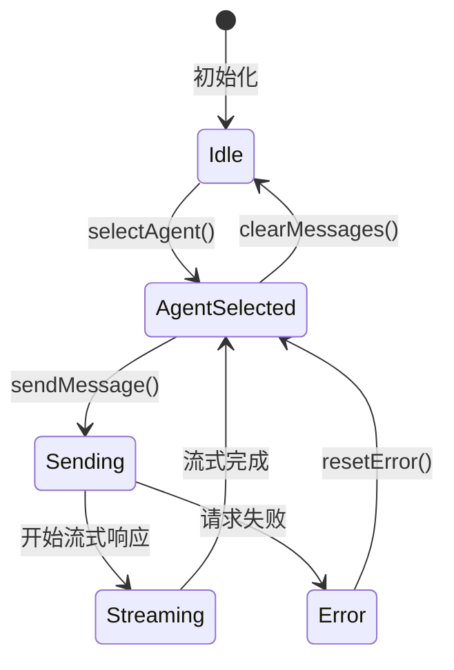
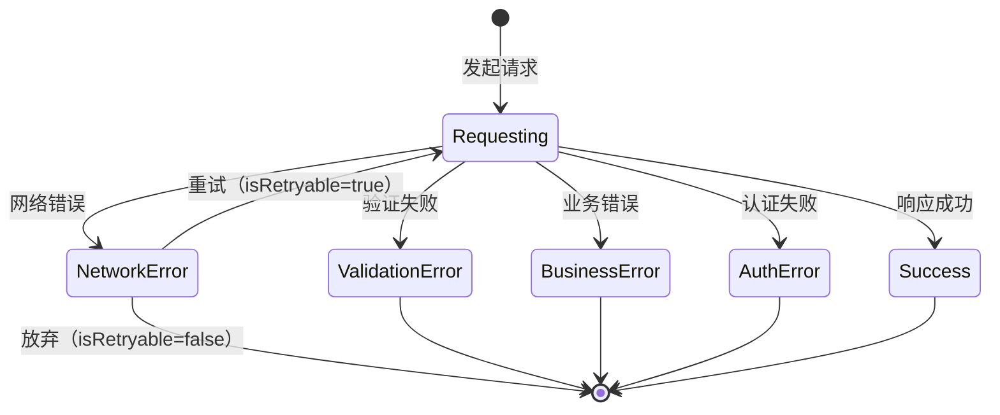

# 数据模型定义 - Phase 4类型安全改进

**功能**: 前端类型安全改进 - Phase 4剩余错误修复  
**版本**: 1.0.0  
**日期**: 2025-10-20

---

## 📊 数据模型概览

本文档定义了Phase 4类型安全改进涉及的核心数据模型，包括Store状态结构、API错误类型层次、UI组件Props类型等。

---

## 🗄️ Store状态管理模型

### ChatStore（聊天Store）

**用途**: 管理聊天会话状态、消息历史、当前智能体选择

**状态结构**:
```typescript
interface ChatState {
  // 当前选中的智能体
  currentAgent: Agent | null;
  
  // 所有会话（按智能体ID分组）
  conversations: Record<string, Conversation[]>;
  
  // 当前活动会话
  activeConversationId: string | null;
  
  // 消息列表
  messages: ChatMessage[];
  
  // 加载状态
  isLoading: boolean;
  
  // 错误状态
  error: ApiError | null;
  
  // 流式响应状态
  streamingState: {
    isStreaming: boolean;
    partialMessage: string;
  } | null;
}

interface ChatActions {
  // 选择智能体
  selectAgent: (agent: Agent) => void;
  
  // 发送消息
  sendMessage: (content: string) => Promise<Result<void, ApiError>>;
  
  // 创建新会话
  createConversation: (agentId: string) => Conversation;
  
  // 切换会话
  switchConversation: (conversationId: string) => void;
  
  // 清空消息
  clearMessages: () => void;
  
  // 重置错误
  resetError: () => void;
}

type ChatStore = ChatState & ChatActions;
```

**类型守卫**:
```typescript
// 验证Agent对象
function isValidAgent(value: unknown): value is Agent {
  return (
    typeof value === 'object' &&
    value !== null &&
    'id' in value &&
    'name' in value &&
    'type' in value &&
    typeof (value as any).id === 'string' &&
    typeof (value as any).name === 'string'
  );
}

// 验证ChatMessage对象
function isValidChatMessage(value: unknown): value is ChatMessage {
  return (
    typeof value === 'object' &&
    value !== null &&
    'role' in value &&
    'content' in value &&
    ['user', 'assistant', 'system'].includes((value as any).role)
  );
}
```

**状态转换规则**:
1. `selectAgent`: currentAgent为null → 设置为选中的Agent
2. `sendMessage`: isLoading=false → isLoading=true → 发送请求 → isLoading=false
3. `createConversation`: 创建新Conversation对象并添加到conversations
4. `clearMessages`: 清空messages数组，保持currentAgent不变

---

### AdminStore（管理后台Store）

**用途**: 管理智能体列表、配置、监控数据

**状态结构**:
```typescript
interface AdminState {
  // 智能体列表
  agents: Agent[];
  
  // 加载状态
  isLoading: boolean;
  
  // 错误状态
  error: ApiError | null;
  
  // 监控数据
  metrics: {
    agentMetrics: Record<string, AgentMetrics>;
    systemHealth: SystemHealth;
  } | null;
  
  // 过滤和排序
  filters: {
    searchTerm: string;
    statusFilter: 'all' | 'active' | 'inactive';
    sortBy: 'name' | 'createdAt' | 'lastUsed';
  };
}

interface AdminActions {
  // 加载智能体列表
  loadAgents: () => Promise<Result<void, ApiError>>;
  
  // 更新智能体配置
  updateAgent: (agentId: string, config: Partial<AgentConfig>) => Promise<Result<void, ApiError>>;
  
  // 删除智能体
  deleteAgent: (agentId: string) => Promise<Result<void, ApiError>>;
  
  // 加载监控数据
  loadMetrics: () => Promise<Result<void, ApiError>>;
  
  // 更新过滤器
  updateFilters: (filters: Partial<AdminState['filters']>) => void;
}

type AdminStore = AdminState & AdminActions;
```

---

### ThemeStore（主题Store）

**用途**: 管理主题模式和自动切换配置

**状态结构**:
```typescript
interface ThemeState {
  // 当前主题模式
  mode: 'light' | 'dark' | 'auto';
  
  // 实际应用的主题（auto模式下根据时间计算）
  effectiveTheme: 'light' | 'dark';
  
  // 自动切换配置
  schedule: {
    lightStart: number;  // 小时（0-23）
    lightEnd: number;    // 小时（0-23）
  };
}

interface ThemeActions {
  // 设置主题模式
  setMode: (mode: ThemeState['mode']) => void;
  
  // 更新自动切换配置
  updateSchedule: (schedule: Partial<ThemeState['schedule']>) => void;
  
  // 计算实际主题（auto模式使用）
  calculateEffectiveTheme: () => 'light' | 'dark';
}

type ThemeStore = ThemeState & ThemeActions;
```

---

## 🔴 API错误类型模型

### 错误类型层次结构

**基础错误接口**:
```typescript
interface BaseApiError {
  type: 'network' | 'validation' | 'business' | 'auth';
  message: string;
  timestamp: Date;
  requestId?: string;
  cause?: Error;  // 原始错误
}
```

### NetworkError（网络层错误）

**用途**: 表示HTTP请求失败、超时、连接中断等网络层问题

**字段定义**:
```typescript
interface NetworkError extends BaseApiError {
  type: 'network';
  
  // HTTP状态码（如果有响应）
  statusCode?: number;
  
  // 是否超时
  timeout?: boolean;
  
  // 是否可重试
  isRetryable: boolean;
  
  // 重试次数（如果已重试）
  retryCount?: number;
}
```

**验证规则**:
- `statusCode`: 100-599范围内的有效HTTP状态码
- `isRetryable`: 5xx错误和超时为true，4xx错误为false
- `timeout`: 仅在请求超时时为true

**使用场景**:
- HTTP 5xx服务器错误 → `isRetryable: true`
- 网络连接失败 → `isRetryable: true`
- 请求超时 → `timeout: true, isRetryable: true`
- HTTP 404 Not Found → `isRetryable: false`

---

### ValidationError（数据验证错误）

**用途**: 表示请求数据或响应数据不符合预期格式

**字段定义**:
```typescript
interface ValidationError extends BaseApiError {
  type: 'validation';
  
  // 字段级错误列表
  fieldErrors: Array<{
    field: string;
    message: string;
    value?: unknown;
  }>;
  
  // 验证规则（可选）
  validationRules?: Record<string, unknown>;
}
```

**验证规则**:
- `fieldErrors`: 至少包含一个字段错误
- `field`: 使用点号分隔的路径表示嵌套字段（如`user.email`）

**使用场景**:
- 表单数据验证失败
- API响应格式不符合预期
- 必需字段缺失
- 字段类型不匹配

---

### BusinessError（业务逻辑错误）

**用途**: 表示业务规则违反、权限不足等业务层问题

**字段定义**:
```typescript
interface BusinessError extends BaseApiError {
  type: 'business';
  
  // 业务错误代码（用于国际化和错误分类）
  errorCode: string;
  
  // 用户友好的错误消息
  userMessage: string;
  
  // 开发者详细错误消息
  developerMessage: string;
  
  // 错误上下文（可选）
  context?: Record<string, unknown>;
}
```

**验证规则**:
- `errorCode`: 格式为`DOMAIN_ERROR_NAME`（如`AGENT_NOT_FOUND`）
- `userMessage`: 简洁的用户可见消息
- `developerMessage`: 详细的技术描述

**使用场景**:
- 资源不存在（RESOURCE_NOT_FOUND）
- 业务规则违反（INVALID_OPERATION）
- 配额超限（QUOTA_EXCEEDED）
- 操作冲突（CONFLICT）

---

### AuthError（认证授权错误）

**用途**: 表示身份认证失败或权限不足

**字段定义**:
```typescript
interface AuthError extends BaseApiError {
  type: 'auth';
  
  // 认证类型
  authType: 'unauthenticated' | 'unauthorized';
  
  // 所需权限列表（unauthorized时）
  requiredPermissions?: string[];
  
  // 当前用户权限（调试用，生产环境移除）
  currentPermissions?: string[];
}
```

**验证规则**:
- `unauthenticated`: 用户未登录或token过期
- `unauthorized`: 用户已登录但权限不足

**使用场景**:
- Token过期或无效 → `authType: 'unauthenticated'`
- 访问管理员功能但非管理员 → `authType: 'unauthorized'`

---

### Result类型

**用途**: 统一的API调用返回类型

**定义**:
```typescript
type Result<T, E = ApiError> = 
  | { success: true; data: T }
  | { success: false; error: E };
```

**使用示例**:
```typescript
// API函数签名
async function getAgentList(): Promise<Result<Agent[], ApiError>>;

// 调用处理
const result = await getAgentList();
if (result.success) {
  console.log(result.data);  // Agent[]类型
} else {
  handleError(result.error);  // ApiError类型
}
```

---

## 🧩 UI组件Props模型

### Button组件条件Props

**用途**: 根据variant提供不同的必需Props

**类型定义**:
```typescript
type ButtonProps = 
  | {
      variant: 'default';
      size?: 'sm' | 'md' | 'lg';
      disabled?: boolean;
      onClick?: () => void;
      children: ReactNode;
    }
  | {
      variant: 'icon';
      icon: ReactNode;
      'aria-label': string;
      size?: 'sm' | 'md' | 'lg';
      disabled?: boolean;
      onClick?: () => void;
    }
  | {
      variant: 'custom';
      customConfig: {
        render: () => ReactNode;
        className?: string;
      };
      onClick?: () => void;
    }
  | {
      variant: 'link';
      href: string;
      external?: boolean;
      children: ReactNode;
    };
```

**类型关系**:
- `variant='default'`: 必需children
- `variant='icon'`: 必需icon和aria-label
- `variant='custom'`: 必需customConfig
- `variant='link'`: 必需href和children

---

### Card组件复合类型

**用途**: 复合组件的类型定义

**类型定义**:
```typescript
interface CardProps extends BaseComponentProps {
  variant?: 'default' | 'elevated' | 'outlined';
  children: ReactNode;
}

interface CardHeaderProps extends BaseComponentProps {
  children: ReactNode;
}

interface CardTitleProps extends BaseComponentProps {
  children: ReactNode;
  as?: 'h1' | 'h2' | 'h3' | 'h4' | 'h5' | 'h6';
}

interface CardContentProps extends BaseComponentProps {
  children: ReactNode;
}

interface CardFooterProps extends BaseComponentProps {
  children: ReactNode;
}

// 复合组件类型
type CardComponent = React.FC<CardProps> & {
  Header: React.FC<CardHeaderProps>;
  Title: React.FC<CardTitleProps>;
  Content: React.FC<CardContentProps>;
  Footer: React.FC<CardFooterProps>;
};
```

---

### Select组件条件Props

**用途**: 单选和多选模式的条件Props

**类型定义**:
```typescript
type SelectProps<T> = 
  | {
      mode: 'single';
      value: T | null;
      onChange: (value: T | null) => void;
      options: Array<{ value: T; label: string }>;
      placeholder?: string;
    }
  | {
      mode: 'multiple';
      value: T[];
      onChange: (value: T[]) => void;
      options: Array<{ value: T; label: string }>;
      placeholder?: string;
      maxSelections?: number;
    };
```

---

## 🎨 基础类型定义

### BaseComponentProps

**用途**: 所有UI组件共享的基础Props

**定义**:
```typescript
interface BaseComponentProps {
  className?: string;
  id?: string;
  'data-testid'?: string;
  style?: React.CSSProperties;
}
```

---

### AccessibilityProps

**用途**: 无障碍访问相关Props

**定义**:
```typescript
interface AccessibilityProps {
  'aria-label'?: string;
  'aria-describedby'?: string;
  'aria-labelledby'?: string;
  'aria-hidden'?: boolean;
  role?: string;
  tabIndex?: number;
}
```

---

### EventHandlersProps

**用途**: 通用事件处理器Props

**定义**:
```typescript
interface EventHandlersProps<T = HTMLElement> {
  onClick?: (event: React.MouseEvent<T>) => void;
  onFocus?: (event: React.FocusEvent<T>) => void;
  onBlur?: (event: React.FocusEvent<T>) => void;
  onKeyDown?: (event: React.KeyboardEvent<T>) => void;
  onKeyUp?: (event: React.KeyboardEvent<T>) => void;
}
```

---

## 📋 实体定义

### Agent（智能体）

**字段**:
```typescript
interface Agent {
  id: string;
  name: string;
  type: 'fastgpt' | 'openai' | 'anthropic' | 'dify';
  status: 'active' | 'inactive';
  configuration?: AgentConfig;
  createdAt: Date;
  updatedAt: Date;
}

interface AgentConfig {
  endpoint: string;
  apiKey?: string;
  model?: string;
  temperature?: number;
  maxTokens?: number;
  systemPrompt?: string;
}
```

**关系**:
- Agent → Conversation (一对多)
- Agent → AgentMetrics (一对一)

---

### Conversation（会话）

**字段**:
```typescript
interface Conversation {
  id: string;
  title: string;
  agentId: string;
  messages: ChatMessage[];
  createdAt: Date;
  updatedAt: Date;
}
```

**关系**:
- Conversation → Agent (多对一)
- Conversation → ChatMessage (一对多)

---

### ChatMessage（聊天消息）

**字段**:
```typescript
interface ChatMessage {
  id: string;
  role: 'user' | 'assistant' | 'system';
  content: string;
  timestamp: Date;
  metadata?: {
    model?: string;
    tokens?: number;
    latency?: number;
  };
}
```

---

## 🔄 状态转换图

### ChatStore状态机



### API调用状态机



---

## ✅ 数据模型验证规则

### Store状态验证
- 所有状态字段必须有明确的初始值
- 可选字段必须显式标记为`| null`或`| undefined`
- 异步操作必须包含loading和error状态

### API错误验证
- 所有错误必须继承自BaseApiError
- type字段必须是4种类型之一
- timestamp必须是有效的Date对象

### UI组件Props验证
- 条件Props必须使用discriminated unions
- 判别式字段（如variant）必须是字面量类型
- 所有variant分支必须完整定义

---

**维护者**: LLMChat前端团队  
**最后更新**: 2025-10-20
