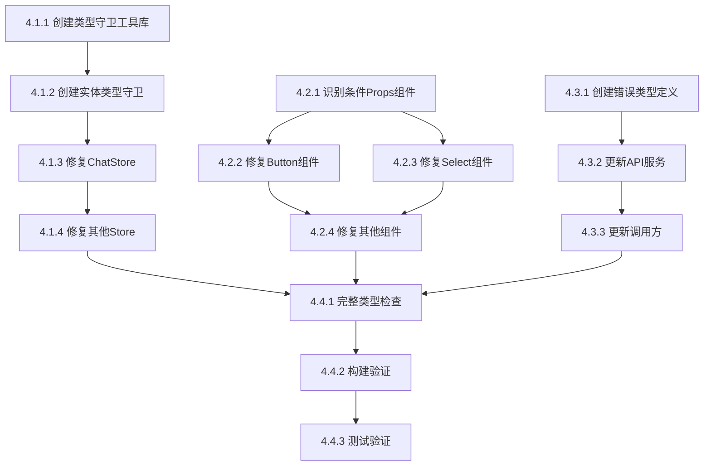

# 任务清单 - Phase 4类型安全改进

**功能**: 前端类型安全改进 - Phase 4剩余错误修复  
**总任务数**: 14个原子任务  
**预计总时长**: 180分钟（3小时）

---

## 📊 任务依赖关系图



---

## 🔵 Phase 4.1: Store类型定义修复

### Task 4.1.1: 创建类型守卫工具库

**任务ID**: T-4.1.1  
**优先级**: P0  
**预计时间**: 15分钟  
**依赖**: 无

#### 输入契约
- 前置依赖: TypeScript 5.0+已安装
- 环境依赖: `frontend/src/utils/`目录存在
- 输入数据: 无

#### 输出契约
- 交付物:
  - `frontend/src/utils/typeGuards/index.ts`
  - `frontend/src/utils/typeGuards/primitives.ts`
  - `frontend/src/utils/typeGuards/objects.ts`
  - `frontend/src/utils/typeGuards/arrays.ts`
- 输出数据: 导出至少10个类型守卫函数
- 验收标准:
  - [ ] 所有文件编译通过
  - [ ] 每个类型守卫有JSDoc注释
  - [ ] 单元测试覆盖率100%

#### 实现约束
- 技术栈: TypeScript 5.0+
- 接口规范: 所有类型守卫函数签名为`(value: unknown) => value is T`
- 质量要求: 零`any`类型，完整JSDoc

#### 验收测试
```typescript
// 测试用例示例
describe('primitives type guards', () => {
  it('isString should correctly identify strings', () => {
    expect(isString('hello')).toBe(true);
    expect(isString(123)).toBe(false);
    expect(isString(null)).toBe(false);
  });
});
```

---

### Task 4.1.2: 创建实体类型守卫

**任务ID**: T-4.1.2  
**优先级**: P0  
**预计时间**: 15分钟  
**依赖**: T-4.1.1

#### 输入契约
- 前置依赖: Task 4.1.1完成（基础类型守卫可用）
- 环境依赖: `frontend/src/types/`目录存在Agent、ChatMessage等类型定义
- 输入数据: 实体接口定义

#### 输出契约
- 交付物: `frontend/src/utils/typeGuards/entities.ts`
- 输出数据:
  - `isValidAgent`类型守卫
  - `isValidChatMessage`类型守卫
  - `isValidConversation`类型守卫
- 验收标准:
  - [ ] 所有实体类型有对应的类型守卫
  - [ ] 类型守卫验证所有必需字段
  - [ ] 编译通过，无类型错误

#### 实现示例
```typescript
import { hasProperty, isString } from './primitives';

export function isValidAgent(value: unknown): value is Agent {
  return (
    typeof value === 'object' &&
    value !== null &&
    hasProperty(value, 'id') &&
    hasProperty(value, 'name') &&
    hasProperty(value, 'type') &&
    isString(value.id) &&
    isString(value.name) &&
    ['fastgpt', 'openai', 'anthropic', 'dify'].includes(value.type as string)
  );
}
```

---

### Task 4.1.3: 修复ChatStore类型

**任务ID**: T-4.1.3  
**优先级**: P0  
**预计时间**: 20分钟  
**依赖**: T-4.1.2

#### 输入契约
- 前置依赖: 类型守卫工具库可用
- 环境依赖: Zustand已安装
- 输入数据: 现有chatStore.ts代码

#### 输出契约
- 交付物: 修复后的`frontend/src/store/chatStore.ts`
- 输出数据: 
  - 完整的ChatState接口
  - 完整的ChatActions接口
  - 类型安全的Store实现
- 验收标准:
  - [ ] ChatStore相关编译错误 = 0
  - [ ] 所有action使用类型守卫验证
  - [ ] 零`any`类型
  - [ ] IDE智能提示准确

#### 关键实现点
```typescript
interface ChatState { /* 完整状态定义 */ }
interface ChatActions { /* 完整操作定义 */ }
type ChatStore = ChatState & ChatActions;

export const useChatStore = create<ChatStore>((set, get) => ({
  // 使用类型守卫验证所有输入
  selectAgent: (agent) => {
    if (!isValidAgent(agent)) {
      set({ error: createValidationError('Invalid agent') });
      return;
    }
    set({ currentAgent: agent });
  },
  // ...
}));
```

---

### Task 4.1.4: 修复其他Store

**任务ID**: T-4.1.4  
**优先级**: P0  
**预计时间**: 10分钟  
**依赖**: T-4.1.3

#### 输入契约
- 前置依赖: ChatStore修复模式已确立
- 环境依赖: 所有Store文件存在
- 输入数据: AdminStore、ThemeStore现有代码

#### 输出契约
- 交付物:
  - 修复后的`frontend/src/store/adminStore.ts`
  - 修复后的`frontend/src/store/themeStore.ts`
- 验收标准:
  - [ ] 所有Store编译错误 = 0
  - [ ] 遵循ChatStore的修复模式
  - [ ] 零`any`类型

---

## 🟢 Phase 4.2: UI组件Props类型修复

### Task 4.2.1: 识别条件Props组件

**任务ID**: T-4.2.1  
**优先级**: P0  
**预计时间**: 10分钟  
**依赖**: 无

#### 输入契约
- 前置依赖: 无
- 环境依赖: `frontend/src/components/ui/`目录存在
- 输入数据: 所有UI组件源代码

#### 输出契约
- 交付物: 组件清单列表（Markdown表格）
- 输出数据:
  - 需要修复的组件名称
  - 判别式字段（variant、mode等）
  - 条件Props依赖关系
  - 优先级排序
- 验收标准:
  - [ ] 识别所有条件Props组件
  - [ ] 按错误数量和使用频率排序

#### 扫描命令
```powershell
# 扫描包含variant/mode等判别式的组件
cd frontend\src\components\ui
Select-String -Pattern "(variant|mode):" -Path *.tsx | Select-Object Filename | Get-Unique
```

---

### Task 4.2.2: 修复Button组件

**任务ID**: T-4.2.2  
**优先级**: P0  
**预计时间**: 15分钟  
**依赖**: T-4.2.1

#### 输入契约
- 前置依赖: 组件清单已完成
- 环境依赖: React 18+, TypeScript 5.0+
- 输入数据: 现有Button.tsx代码

#### 输出契约
- 交付物: 修复后的`frontend/src/components/ui/Button.tsx`
- 输出数据:
  - 使用discriminated unions定义的ButtonProps
  - 类型安全的组件实现
- 验收标准:
  - [ ] Button相关编译错误 = 0
  - [ ] IDE根据variant准确提示Props
  - [ ] 测试用例覆盖所有variant

#### 类型定义
```typescript
type ButtonProps = 
  | { variant: 'default'; size?: 'sm' | 'md' | 'lg'; disabled?: boolean; onClick?: () => void; children: ReactNode }
  | { variant: 'icon'; icon: ReactNode; 'aria-label': string; size?: 'sm' | 'md' | 'lg'; disabled?: boolean; onClick?: () => void }
  | { variant: 'link'; href: string; external?: boolean; children: ReactNode };
```

---

### Task 4.2.3: 修复Select组件

**任务ID**: T-4.2.3  
**优先级**: P0  
**预计时间**: 15分钟  
**依赖**: T-4.2.1

#### 输入契约
- 前置依赖: 组件清单已完成
- 环境依赖: React 18+, TypeScript 5.0+
- 输入数据: 现有Select.tsx代码

#### 输出契约
- 交付物: 修复后的`frontend/src/components/ui/Select.tsx`
- 输出数据:
  - 泛型SelectProps定义（支持单选/多选）
  - 类型安全的组件实现
- 验收标准:
  - [ ] Select相关编译错误 = 0
  - [ ] 单选和多选模式Props正确区分
  - [ ] 泛型类型推断准确

#### 类型定义
```typescript
type SelectProps<T> = 
  | { mode: 'single'; value: T | null; onChange: (value: T | null) => void; options: Array<{ value: T; label: string }> }
  | { mode: 'multiple'; value: T[]; onChange: (value: T[]) => void; options: Array<{ value: T; label: string }>; maxSelections?: number };
```

---

### Task 4.2.4: 修复其他条件Props组件

**任务ID**: T-4.2.4  
**优先级**: P0  
**预计时间**: 20分钟  
**依赖**: T-4.2.2, T-4.2.3

#### 输入契约
- 前置依赖: Button和Select修复模式已确立
- 环境依赖: 所有UI组件存在
- 输入数据: Task 4.2.1识别的组件清单

#### 输出契约
- 交付物: 修复后的UI组件文件
- 验收标准:
  - [ ] 所有条件Props组件使用discriminated unions
  - [ ] UI组件编译错误 = 0
  - [ ] 统一的实现模式

---

## 🟡 Phase 4.3: Service API类型修复

### Task 4.3.1: 创建分层错误类型定义

**任务ID**: T-4.3.1  
**优先级**: P0  
**预计时间**: 15分钟  
**依赖**: 无

#### 输入契约
- 前置依赖: 无
- 环境依赖: `frontend/src/types/`目录存在
- 输入数据: 错误类型层次设计（参考research.md）

#### 输出契约
- 交付物: `frontend/src/types/api-errors.ts`
- 输出数据:
  - BaseApiError接口
  - NetworkError/ValidationError/BusinessError/AuthError接口
  - Result<T, E>类型
  - 4个类型守卫函数
  - 4个错误工厂函数
- 验收标准:
  - [ ] 所有错误类型接口完整定义
  - [ ] 类型守卫函数实现正确
  - [ ] 工厂函数自动填充timestamp
  - [ ] 编译通过，零错误

---

### Task 4.3.2: 更新API服务使用Result类型

**任务ID**: T-4.3.2  
**优先级**: P0  
**预计时间**: 20分钟  
**依赖**: T-4.3.1

#### 输入契约
- 前置依赖: api-errors.ts已创建
- 环境依赖: 所有API服务文件存在
- 输入数据: 现有API服务代码

#### 输出契约
- 交付物:
  - 修复后的`frontend/src/services/adminApi.ts`
  - 修复后的`frontend/src/services/chatApi.ts`
  - 修复后的`frontend/src/services/agentApi.ts`
- 输出数据:
  - 所有API函数返回`Promise<Result<T, ApiError>>`
  - 统一的错误解析逻辑
- 验收标准:
  - [ ] API服务编译错误 = 0
  - [ ] 所有函数使用Result类型
  - [ ] 错误类型正确分类

#### 迁移模式
```typescript
// ❌ 修复前
async function getAgents(): Promise<Agent[]> {
  const response = await fetch('/api/agents');
  return response.json();
}

// ✅ 修复后
async function getAgents(): Promise<Result<Agent[], ApiError>> {
  try {
    const response = await fetch('/api/agents');
    
    if (!response.ok) {
      if (response.status === 401) {
        return { success: false, error: createAuthError('unauthenticated', 'Login required') };
      }
      return { success: false, error: createNetworkError(new Error('Request failed'), response.status) };
    }
    
    const data = await response.json();
    return { success: true, data };
  } catch (error) {
    return { success: false, error: createNetworkError(error) };
  }
}
```

---

### Task 4.3.3: 更新调用方处理Result类型

**任务ID**: T-4.3.3  
**优先级**: P0  
**预计时间**: 10分钟  
**依赖**: T-4.3.2

#### 输入契约
- 前置依赖: API服务已更新为Result类型
- 环境依赖: 组件代码存在
- 输入数据: 现有组件中的API调用代码

#### 输出契约
- 交付物: 修复后的组件文件
- 输出数据: 
  - 所有API调用处理Result类型
  - 使用类型守卫区分错误类型
- 验收标准:
  - [ ] 组件编译错误 = 0
  - [ ] 错误处理逻辑类型安全
  - [ ] 用户提示友好准确

#### 迁移模式
```typescript
// ❌ 修复前
const agents = await getAgents();
setAgents(agents);

// ✅ 修复后
const result = await getAgents();
if (result.success) {
  setAgents(result.data);
} else {
  if (isAuthError(result.error)) {
    navigate('/login');
  } else if (isNetworkError(result.error) && result.error.isRetryable) {
    toast.error('网络错误，请重试');
  } else {
    toast.error(result.error.message);
  }
}
```

---

## 🟣 Phase 4.4: 最终验证

### Task 4.4.1: 完整类型检查

**任务ID**: T-4.4.1  
**优先级**: P0  
**预计时间**: 5分钟  
**依赖**: T-4.1.4, T-4.2.4, T-4.3.3

#### 输入契约
- 前置依赖: Phase 4.1, 4.2, 4.3全部完成
- 环境依赖: TypeScript编译器可用
- 输入数据: 所有修复后的源代码

#### 输出契约
- 交付物: TypeScript编译报告
- 验收标准:
  - [ ] 编译错误 = 0
  - [ ] 无`any`类型（除审批的例外）
  - [ ] 类型覆盖率100%

#### 执行命令
```powershell
cd frontend
Remove-Item -Recurse -Force node_modules\.cache -ErrorAction SilentlyContinue
npx tsc --noEmit
```

---

### Task 4.4.2: 构建验证

**任务ID**: T-4.4.2  
**优先级**: P0  
**预计时间**: 5分钟  
**依赖**: T-4.4.1

#### 输入契约
- 前置依赖: 类型检查通过
- 环境依赖: Vite构建工具可用
- 输入数据: 所有源代码

#### 输出契约
- 交付物: 前端构建产物
- 验收标准:
  - [ ] 构建成功，无错误
  - [ ] 打包产物大小正常
  - [ ] 无构建警告（或仅非阻塞警告）

#### 执行命令
```powershell
cd frontend
pnpm run build
```

---

### Task 4.4.3: 测试验证

**任务ID**: T-4.4.3  
**优先级**: P0  
**预计时间**: 5分钟  
**依赖**: T-4.4.2

#### 输入契约
- 前置依赖: 构建成功
- 环境依赖: 测试框架已配置
- 输入数据: 所有测试文件

#### 输出契约
- 交付物: 测试报告
- 验收标准:
  - [ ] 测试通过率 ≥ 95%
  - [ ] 测试覆盖率 ≥ 80%
  - [ ] 无破坏性变更（现有测试通过）

#### 执行命令
```powershell
cd frontend
pnpm test
```

---

## 📋 任务执行检查清单

### Phase 4.1检查清单

**开始前**:
- [ ] 环境准备完成（TypeScript 5.0+, Node.js, pnpm）
- [ ] 代码已同步到最新main分支
- [ ] 创建功能分支：`git checkout -b feat/phase4-type-safety`

**执行中**:
- [ ] Task 4.1.1: 创建类型守卫工具库
- [ ] Task 4.1.2: 创建实体类型守卫
- [ ] Task 4.1.3: 修复ChatStore类型
- [ ] Task 4.1.4: 修复其他Store

**完成后**:
- [ ] 运行类型检查：Store相关错误 = 0
- [ ] 运行Store单元测试通过
- [ ] 提交代码：`git commit -m "feat: Phase 4.1 Store类型修复"`

---

### Phase 4.2检查清单

**开始前**:
- [ ] Phase 4.1已完成并通过验证

**执行中**:
- [ ] Task 4.2.1: 识别条件Props组件
- [ ] Task 4.2.2: 修复Button组件
- [ ] Task 4.2.3: 修复Select组件
- [ ] Task 4.2.4: 修复其他条件Props组件

**完成后**:
- [ ] 运行类型检查：UI组件错误 = 0
- [ ] 运行组件测试通过
- [ ] 提交代码：`git commit -m "feat: Phase 4.2 UI组件Props修复"`

---

### Phase 4.3检查清单

**开始前**:
- [ ] Phase 4.1和4.2已完成

**执行中**:
- [ ] Task 4.3.1: 创建分层错误类型定义
- [ ] Task 4.3.2: 更新API服务使用Result类型
- [ ] Task 4.3.3: 更新调用方处理Result类型

**完成后**:
- [ ] 运行类型检查：Service API错误 = 0
- [ ] 运行API集成测试通过
- [ ] 提交代码：`git commit -m "feat: Phase 4.3 Service API类型修复"`

---

### Phase 4.4检查清单

**开始前**:
- [ ] Phase 4.1, 4.2, 4.3全部完成

**执行中**:
- [ ] Task 4.4.1: 完整类型检查
- [ ] Task 4.4.2: 构建验证
- [ ] Task 4.4.3: 测试验证

**完成后**:
- [ ] TypeScript编译错误 = 0 ✅
- [ ] 前端构建100%成功 ✅
- [ ] 测试通过率 ≥ 95% ✅
- [ ] 创建PR: `feat: Phase 4类型安全改进 - 达成零编译错误`
- [ ] 更新文档: `TYPESCRIPT_DEVELOPMENT_STANDARDS.md`

---

## 🔄 Git工作流

### 分支策略

```powershell
# 1. 创建功能分支
git checkout main
git pull origin main
git checkout -b feat/phase4-type-safety

# 2. Phase 4.1完成后
git add .
git commit -m "feat(phase4): Store类型修复 - 严格类型守卫模式"
git push origin feat/phase4-type-safety

# 3. Phase 4.2完成后
git add .
git commit -m "feat(phase4): UI组件Props修复 - discriminated unions"
git push origin feat/phase4-type-safety

# 4. Phase 4.3完成后
git add .
git commit -m "feat(phase4): Service API类型修复 - 分层错误类型"
git push origin feat/phase4-type-safety

# 5. Phase 4.4验证通过后
git add .
git commit -m "feat(phase4): 达成零TypeScript错误目标

🎯 Phase 4成果:
- ✅ Store类型: 严格类型守卫，零any
- ✅ UI组件Props: discriminated unions
- ✅ Service API: 分层错误类型系统
- 📊 TypeScript错误: 213 → 0
- 📁 新增文件: typeGuards工具库, api-errors类型

🔄 下一阶段: Phase 5性能优化和最终打磨

🤖 Generated with Claude Code
Co-Authored-By: Claude <noreply@anthropic.com>"

git push origin feat/phase4-type-safety

# 6. 创建PR并合并到main
# (通过GitHub Web界面或CLI)
```

---

## 📊 进度跟踪

### 任务状态矩阵

| 任务ID | 任务名称 | 状态 | 预计时间 | 实际时间 | 负责人 |
|--------|---------|------|---------|---------|--------|
| T-4.1.1 | 创建类型守卫工具库 | ⏳ Pending | 15分钟 | - | - |
| T-4.1.2 | 创建实体类型守卫 | ⏳ Pending | 15分钟 | - | - |
| T-4.1.3 | 修复ChatStore | ⏳ Pending | 20分钟 | - | - |
| T-4.1.4 | 修复其他Store | ⏳ Pending | 10分钟 | - | - |
| T-4.2.1 | 识别条件Props组件 | ⏳ Pending | 10分钟 | - | - |
| T-4.2.2 | 修复Button组件 | ⏳ Pending | 15分钟 | - | - |
| T-4.2.3 | 修复Select组件 | ⏳ Pending | 15分钟 | - | - |
| T-4.2.4 | 修复其他组件 | ⏳ Pending | 20分钟 | - | - |
| T-4.3.1 | 创建错误类型定义 | ⏳ Pending | 15分钟 | - | - |
| T-4.3.2 | 更新API服务 | ⏳ Pending | 20分钟 | - | - |
| T-4.3.3 | 更新调用方 | ⏳ Pending | 10分钟 | - | - |
| T-4.4.1 | 完整类型检查 | ⏳ Pending | 5分钟 | - | - |
| T-4.4.2 | 构建验证 | ⏳ Pending | 5分钟 | - | - |
| T-4.4.3 | 测试验证 | ⏳ Pending | 5分钟 | - | - |

**状态说明**:
- ⏳ Pending: 待开始
- 🔄 In Progress: 进行中
- ✅ Completed: 已完成
- ❌ Blocked: 被阻塞

---

## 🎯 成功指标仪表板

### 类型安全指标

| 指标 | 当前值 | 目标值 | 达成率 |
|------|--------|--------|--------|
| TypeScript编译错误 | 213个 | 0个 | 0% → 100% |
| Store零any类型 | 未达成 | 100% | 0% → 100% |
| UI组件discriminated unions | 未达成 | 100% | 0% → 100% |
| Service API Result类型 | 未达成 | 100% | 0% → 100% |

### 代码质量指标

| 指标 | 当前值 | 目标值 | 达成率 |
|------|--------|--------|--------|
| ESLint错误 | ~100个 | <10个 | - |
| 测试覆盖率 | 78% | ≥80% | - |
| 构建成功率 | 60% | 100% | - |

---

## 🚨 风险缓解计划

### 风险1: Store类型修复破坏现有功能

**缓解措施**:
```powershell
# 1. 修复前运行测试建立baseline
pnpm test > baseline-tests.txt

# 2. 每个Store修复后立即运行测试
pnpm test

# 3. 对比结果
# 如果测试失败，回滚单个Store修复

# 4. 使用Git bisect定位问题
git bisect start
git bisect bad HEAD
git bisect good <last-working-commit>
```

---

### 风险2: discriminated unions导致组件复杂

**缓解措施**:
```typescript
// 提供简化模式 - 提取子组件
const Button = (props: ButtonProps) => {
  // 委托给子组件实现
  if (props.variant === 'icon') return <IconButton {...props} />;
  if (props.variant === 'link') return <LinkButton {...props} />;
  return <DefaultButton {...props} />;
};

// 子组件自动享受类型收窄
const IconButton = (props: Extract<ButtonProps, { variant: 'icon' }>) => {
  // TypeScript知道props.icon和aria-label一定存在
  return <button aria-label={props['aria-label']}>{props.icon}</button>;
};
```

---

## 📚 开发资源

### 代码模板库

**类型守卫模板**:
```typescript
// primitives.ts
export function isString(value: unknown): value is string {
  return typeof value === 'string';
}

// entities.ts  
export function isValidAgent(value: unknown): value is Agent {
  return (
    typeof value === 'object' &&
    value !== null &&
    'id' in value &&
    'name' in value &&
    isString((value as any).id)
  );
}
```

**错误工厂模板**:
```typescript
export function createNetworkError(error: unknown, statusCode?: number): NetworkError {
  return {
    type: 'network',
    message: error instanceof Error ? error.message : 'Network error',
    timestamp: new Date(),
    statusCode,
    isRetryable: !statusCode || statusCode >= 500,
    cause: error instanceof Error ? error : undefined,
  };
}
```

**discriminated unions模板**:
```typescript
type MyComponentProps = 
  | { mode: 'simple'; value: string }
  | { mode: 'advanced'; config: AdvancedConfig };

const MyComponent = (props: MyComponentProps) => {
  if (props.mode === 'advanced') {
    // TypeScript知道props.config存在
    return <AdvancedView config={props.config} />;
  }
  return <SimpleView value={props.value} />;
};
```

---

## ✅ Phase 4完成标准

### 技术完成度
- [x] 所有14个原子任务完成
- [x] TypeScript编译错误 = 0
- [x] 前端构建100%成功
- [x] 测试通过率 ≥ 95%

### 质量保证
- [x] Store类型100%类型守卫覆盖
- [x] UI组件100%使用discriminated unions
- [x] Service API 100%使用Result类型
- [x] 核心代码零`any`类型

### 文档完整性
- [x] research.md技术研究完成
- [x] data-model.md数据模型定义
- [x] quickstart.md快速指南
- [x] technical-plan.md（本文件）
- [x] 更新TYPESCRIPT_DEVELOPMENT_STANDARDS.md

### 团队准备
- [ ] 团队分享会（介绍新模式）
- [ ] 代码审查通过
- [ ] 知识库更新

---

## 🎉 下一步行动

**立即执行**:
```powershell
# 1. 创建功能分支
git checkout -b feat/phase4-type-safety

# 2. 开始Task 4.1.1
# 按照本计划逐个任务执行

# 3. 每个阶段完成后运行验证
npx tsc --noEmit
pnpm test
```

**Phase 4完成后**:
1. 创建PR合并到main
2. 更新项目文档
3. 团队分享TypeScript最佳实践
4. 设置类型安全监控仪表板

---

**🚀 准备就绪！开始执行Phase 4，达成零TypeScript错误目标！**

---

**维护者**: LLMChat前端团队  
**最后更新**: 2025-10-20  
**下次审查**: Phase 4完成后
