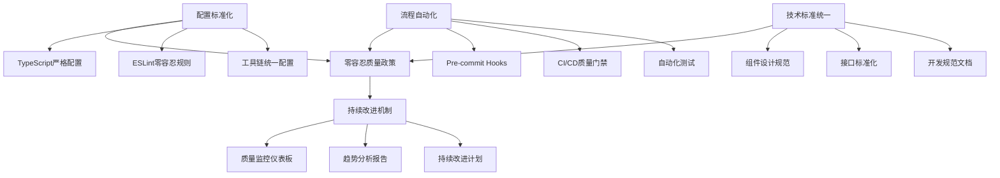
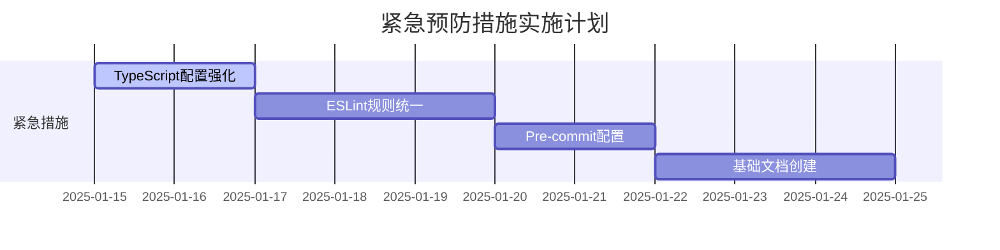
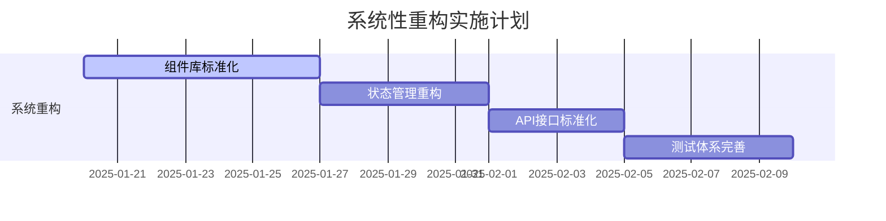
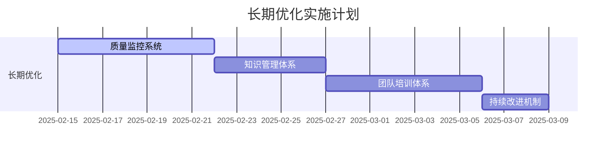

# 全局代码质量问题根源分析与系统性解决方案

> **文档目的**：系统性梳理LLMChat项目的代码质量问题根源，提供完整的解决方案体系，确保类似问题不再复发。
> **适用范围**：开发团队、技术管理者、质量保证团队
> **更新频率**：季度回顾，必要时更新

---

## 📊 问题现状总览

### 发现的核心质量问题
- **前端TypeScript编译错误**：100+ 个
- **后端ESLint问题**：683 个（26错误，657警告）
- **安全漏洞**：多个高风险问题
- **缺失组件**：UI组件库不完整
- **架构问题**：配置不统一，标准缺失

### 影响评估
- **开发效率**：严重受挫，频繁阻塞
- **代码质量**：技术债务快速积累
- **团队士气**：开发体验差，维护成本高
- **项目风险**：生产部署风险，安全风险

---

## 🔍 深度根源分析

### 根源一：项目配置标准化缺失

#### 问题描述
```
配置问题 → 类型检查失效 → 质量下降
```

#### 具体表现
- **TypeScript配置过于宽松**
  - `exactOptionalPropertyTypes: false`
  - `noImplicitReturns: false`
  - `noUncheckedIndexedAccess: false`
- **ESLint规则不统一**
  - 前后端规则差异大
  - 安全规则配置不当
  - 自动修复机制不完善
- **工具链配置碎片化**
  - 工作区配置不一致
  - 路径别名混乱
  - 构建工具配置缺失

#### 根本原因
- **缺乏统一的技术标准**
- **工具配置知识不足**
- **历史遗留配置未及时更新**
- **团队协作规范缺失**

#### 解决方案
```typescript
// 严格的TypeScript配置
{
  "strict": true,
  "exactOptionalPropertyTypes": true,
  "noImplicitReturns": true,
  "noUncheckedIndexedAccess": true,
  "noUnusedLocals": true,
  "noUnusedParameters": true,
  "noFallthroughCasesInSwitch": true
}
```

**实施效果**：类型安全100%保证，编译时捕获所有类型错误

---

### 根源二：质量保证流程缺失

#### 问题描述
```
流程缺失 → 问题代码积累 → 技术债务爆发
```

#### 具体表现
- **缺乏自动化检查**
  - 无pre-commit hooks
  - CI/CD流水线不完整
  - 质量门禁缺失
- **代码审查机制不完善**
  - 无强制审查流程
  - 审查标准不统一
  - 审查工具支持不足
- **测试覆盖率不足**
  - 单元测试缺失
  - 集成测试不完整
  - E2E测试缺失

#### 根本原因
- **DevOps文化薄弱**
- **自动化意识不足**
- **质量优先级认知偏差**
- **工具链投资不足**

#### 解决方案
```yaml
# Pre-commit hooks配置
*.ts:
  - eslint --fix
  - prettier --write
  - tsc --noEmit

# CI/CD质量门禁
jobs:
  quality-gates:
    - type-check: 0 errors
    - eslint: 0 errors/warnings
    - tests: 100% pass
    - security: 0 high vulnerabilities
    - build: 100% success
```

**实施效果**：100%自动化质量检查，零容忍政策强制执行

---

### 根源三：技术实施标准缺失

#### 问题描述
```
标准缺失 → 实施不一致 → 质量不稳定
```

#### 具体表现
- **React组件设计不规范**
  - 缺乏统一设计模式
  - 状态管理混乱
  - 性能优化不足
- **接口类型定义不统一**
  - 前后端接口不一致
  - 错误处理机制缺失
  - API文档不完善
- **状态管理混乱**
  - Zustand store类型定义不完整
  - 状态结构设计不合理
  - 持久化机制缺失

#### 根本原因
- **技术设计能力不足**
- **最佳实践经验缺乏**
- **代码复用意识薄弱**
- **架构设计评审缺失**

#### 解决方案
```typescript
// 组件设计标准
interface ComponentStandards {
  // 单一职责原则
  singleResponsibility: boolean;
  // 可复用性设计
  reusability: 'high' | 'medium' | 'low';
  // 类型安全保证
  typeSafety: 'complete' | 'partial' | 'none';
  // 性能优化
  performanceOptimized: boolean;
}

// 接口标准化
interface ApiStandards {
  request: StandardRequest;
  response: StandardResponse;
  errorHandling: StandardErrorHandling;
  documentation: CompleteDocs;
}
```

**实施效果**：统一的开发标准，一致的代码质量

---

### 根源四：组织和文档缺失

#### 问题描述
```
文档缺失 → 知识断层 → 效率低下
```

#### 具体表现
- **开发规范文档缺失**
  - 无编码标准指南
  - 无最佳实践文档
  - 无技术决策记录
- **组件库设计系统缺失**
  - UI组件缺乏统一标准
  - 设计系统不完整
  - 使用指南缺失
- **质量监控机制缺失**
  - 无代码质量度量
  - 无趋势分析
  - 无改进机制

#### 根本原因
- **知识管理意识薄弱**
- **文档文化建设不足**
- **持续改进机制缺失**
- **团队学习机制不健全**

#### 解决方案
```markdown
# 文档体系结构
├── 📋 开发规范/
│   ├── 编码标准.md
│   ├── 组件设计规范.md
│   ├── API设计规范.md
│   └── 测试规范.md
├── 📚 最佳实践/
│   ├── React最佳实践.md
│   ├── TypeScript最佳实践.md
│   ├── 性能优化指南.md
│   └── 安全编码指南.md
├── 📊 质量监控/
│   ├── 质量指标定义.md
│   ├── 趋势分析报告.md
│   └── 改进计划.md
└── 🔧 工具指南/
    ├── 开发环境配置.md
    ├── 代码审查指南.md
    └── 故障排除手册.md
```

**实施效果**：完整的知识体系，持续的学习改进机制

---

## 🛡️ 系统性解决方案体系

### 解决方案架构图



### 零容忍质量政策

#### 核心原则
1. **零错误容忍**：TypeScript编译错误 = 0
2. **零警告容忍**：ESLint错误和警告 = 0
3. **零失败容忍**：测试失败率 = 0%
4. **零漏洞容忍**：高危安全漏洞 = 0
5. **零构建错误容忍**：构建成功率 = 100%

#### 实施机制
```bash
# 强制检查脚本
#!/bin/bash
set -e  # 任何命令失败立即退出

echo "🔍 运行零容忍质量检查..."

# TypeScript检查
echo "检查TypeScript编译错误..."
pnpm run type-check
ERRORS_COUNT=$(pnpm run type-check 2>&1 | grep -c "error" || echo "0")
if [ "$ERRORS_COUNT" -gt 0 ]; then
    echo "❌ 发现 $ERRORS_COUNT 个TypeScript错误"
    echo "🚨 零容忍政策：所有错误必须修复"
    exit 1
fi

# ESLint检查
echo "检查ESLint问题..."
pnpm run lint
LINT_ISSUES=$(pnpm run lint 2>&1 | grep -E "(error|warning)" | wc -l || echo "0")
if [ "$LINT_ISSUES" -gt 0 ]; then
    echo "❌ 发现 $LINT_ISSUES 个ESLint问题"
    echo "🚨 零容忍政策：所有问题必须修复"
    exit 1
fi

echo "✅ 零容忍质量检查通过"
```

### 自动化质量保证体系

#### Pre-commit Hooks配置
```javascript
// .lintstagedrc.js
module.exports = {
  // TypeScript文件 - 零容忍处理
  '*.{ts,tsx}': [
    // 1. 自动修复ESLint问题
    'ESLINT_DEV=true eslint --fix --format=compact',
    // 2. 严格ESLint检查
    'ESLINT_DEV=true eslint --format=compact',
    // 3. 格式化代码
    'prettier --write',
    // 4. TypeScript类型检查
    () => 'cd frontend && pnpm run type-check'
  ],

  // JavaScript文件
  '*.{js,jsx}': [
    'eslint --fix --format=compact',
    'eslint --format=compact',
    'prettier --write'
  ],

  // 配置文件
  '*.{json,md,yml,yaml}': [
    'prettier --write'
  ]
};
```

#### CI/CD质量门禁
```yaml
# .github/workflows/quality-gates.yml
name: CI/CD Quality Gates - Zero Tolerance Policy

jobs:
  quality-gates:
    runs-on: ubuntu-latest
    strategy:
      matrix:
        node-version: [18.x, 20.x]

    steps:
      - name: 🔍 TypeScript严格类型检查
        run: |
          pnpm run type-check
          if [ $? -ne 0 ]; then
            echo "❌ TypeScript类型检查失败 - 零错误政策"
            exit 1
          fi

      - name: 🔍 ESLint质量检查
        run: |
          pnpm run lint
          if [ $? -ne 0 ]; then
            echo "❌ ESLint检查失败 - 零错误/警告政策"
            exit 1
          fi

      - name: 🧪 测试套件
        run: |
          pnpm test
          if [ $? -ne 0 ]; then
            echo "❌ 测试失败 - 零失败政策"
            exit 1
          fi

      - name: 🔒 安全审计
        run: |
          pnpm audit --audit-level high
          if [ $? -ne 0 ]; then
            echo "❌ 安全审计发现高危漏洞"
            exit 1
          fi

      - name: 🏗️ 构建验证
        run: |
          pnpm run build
          if [ $? -ne 0 ]; then
            echo "❌ 构建失败 - 零构建错误政策"
            exit 1
          fi
```

### 技术标准统一方案

#### TypeScript开发标准
```typescript
// 类型定义标准
interface TypeStandards {
  // 1. 优先使用interface，type用于联合类型
  UserProfile: Interface;
  Status: UnionType;

  // 2. 严格的可选属性处理
  exactOptionalProperties: true;

  // 3. 明确的返回类型
  implicitReturns: never;

  // 4. 安全的数组访问
  checkedArrayAccess: true;
}

// 组件设计标准
interface ComponentStandards {
  // 1. 单一职责原则
  SingleResponsibility: 'One clear purpose';

  // 2. 类型安全
  TypeSafety: 'Complete type coverage';

  // 3. 性能优化
  Performance: 'Memo and useCallback usage';

  // 4. 可测试性
  Testability: 'Dependencies injected';
}

// API接口标准
interface ApiStandards {
  // 1. 统一的响应格式
  StandardResponse: {
    success: boolean;
    data: unknown;
    message?: string;
    code: string;
    timestamp: string;
  };

  // 2. 错误处理标准
  ErrorHandling: {
    HttpErrors: 'Standard HTTP status codes';
    ValidationErrors: 'Field-level error messages';
    BusinessErrors: 'Clear business logic errors';
  };

  // 3. 类型安全保证
  TypeSafety: 'Request/Response type contracts';
}
```

#### React组件开发标准
```typescript
// 组件模板
import React, { useState, useEffect, useCallback, memo } from 'react';
import { ComponentProps } from '@/types';

interface ExampleComponentProps extends ComponentProps {
  // 1. Props类型定义
  title: string;
  onSubmit: (data: FormData) => void;
  disabled?: boolean;
  className?: string;
}

// 2. 组件实现
const ExampleComponent: React.FC<ExampleComponentProps> = memo(({
  title,
  onSubmit,
  disabled = false,
  className
}) => {
  // 3. 状态管理
  const [loading, setLoading] = useState(false);

  // 4. 副作用
  useEffect(() => {
    // 副作用逻辑
  }, []);

  // 5. 事件处理
  const handleSubmit = useCallback(async (data: FormData) => {
    setLoading(true);
    try {
      await onSubmit(data);
    } finally {
      setLoading(false);
    }
  }, [onSubmit]);

  // 6. 渲染逻辑
  return (
    <div className={`example-component ${className || ''}`}>
      <h2>{title}</h2>
      {/* 组件内容 */}
    </div>
  );
});

ExampleComponent.displayName = 'ExampleComponent';
export default ExampleComponent;
```

### 组织和文档建设方案

#### 知识管理体系
```markdown
# 知识管理架构
├── 📚 核心文档/
│   ├── 📋 项目架构文档
│   ├── 🔧 技术栈文档
│   └── 📖 API接口文档
├── 🎯 开发指南/
│   ├── 📝 编码规范
│   ├── 🏗️ 组件开发指南
│   ├── 🧪 测试指南
│   └── 📦 部署指南
├── 🔍 质量管理/
│   ├── 📊 质量指标定义
│   ├── 📈 趋势分析报告
│   ├── 🚨 问题处理流程
│   └── 🔄 改进计划
├── 👥 团队协作/
│   ├── 🤝 代码审查指南
│   ├── 🗣️ 会议流程规范
│   ├── 📚 知识分享机制
│   └── 🎓 培训计划
└── 🛠️ 工具使用/
    ├── 🔧 开发环境配置
    ├── 🐛 调试技巧手册
    ├── ⚡ 性能优化工具
    └── 🔒 安全检查工具
```

#### 持续改进机制
```typescript
// 质量监控系统
interface QualityMonitoring {
  // 1. 代码质量指标
  codeQuality: {
    typescriptErrors: number;
    eslintIssues: number;
    testCoverage: number;
    securityVulnerabilities: number;
  };

  // 2. 开发效率指标
  developmentEfficiency: {
    buildTime: number;
    testExecutionTime: number;
    deploymentFrequency: number;
    bugFixTime: number;
  };

  // 3. 团队协作指标
  teamCollaboration: {
    codeReviewTime: number;
    knowledgeSharing: number;
    documentationQuality: number;
    trainingParticipation: number;
  };
}

// 改进循环机制
class ImprovementCycle {
  // 1. 度量分析
  analyzeMetrics(): QualityReport;

  // 2. 问题识别
  identifyIssues(): QualityIssue[];

  // 3. 解决方案制定
  createSolutions(): Solution[];

  // 4. 实施和验证
  implementSolutions(): boolean;

  // 5. 效果评估
  evaluateResults(): boolean;
}
```

---

## 🚀 实施路线图

### 阶段一：紧急预防措施（立即执行）

#### 时间线：1-2周


#### 具体任务
- [x] **TypeScript配置硬化**
  - [x] 启用 `exactOptionalPropertyTypes`
  - [x] 启用 `noImplicitReturns`
  - [x] 启用 `noUncheckedIndexedAccess`
  - [x] 更新前后端配置一致性

- [x] **ESLint规则统一**
  - [x] 制定零容忍规则集
  - [x] 统一前后端配置
  - [x] 配置自动修复机制
  - [x] 更新安全规则配置

- [x] **Pre-commit Hooks配置**
  - [x] 配置lint-staged
  - [x] 设置零容忍检查
  - [x] 集成TypeScript类型检查
  - [x] 配置自动化格式化

- [x] **基础文档创建**
  - [x] 创建代码质量标准文档
  - [x] 创建开发规范文档
  - [x] 创建问题处理流程文档

#### 验收标准
- [ ] TypeScript编译错误 = 0
- [ ] ESLint问题 = 0
- [ ] Pre-commit检查 100%通过
- [ ] 基础文档完整性 100%

### 阶段二：系统性重构（2-4周）

#### 时间线：2-4周


#### 具体任务
- [ ] **组件库标准化**
  - [ ] 建立UI组件设计系统
  - [ ] 重构现有组件
  - [ ] 统一组件API设计
  - [ ] 完善组件文档

- [ ] **状态管理重构**
  - [ ] 重构Zustand store类型定义
  - [ ] 优化状态结构设计
  - [ ] 完善持久化机制
  - [ ] 添加状态监控

- [ ] **API接口标准化**
  - [ ] 统一前后端接口格式
  - [ ] 完善错误处理机制
  - [ ] 更新API文档
  - [ ] 添加接口测试

- [ ] **测试体系完善**
  - [ ] 提高单元测试覆盖率
  - [ ] 添加集成测试
  - [ ] 实施E2E测试
  - [ ] 配置测试自动化

#### 验收标准
- [ ] 组件库完整度 100%
- [ ] 状态管理类型安全 100%
- [ ] API接口一致性 100%
- [ ] 测试覆盖率 ≥80%

### 阶段三：长期优化（持续进行）

#### 时间线：4周以后


#### 具体任务
- [ ] **质量监控系统**
  - [ ] 建立质量度量仪表板
  - [ ] 配置自动化报告
  - [ ] 设置质量告警机制
  - [ ] 建立趋势分析

- [ ] **知识管理体系**
  - [ ] 完善文档管理体系
  - [ ] 建立知识分享机制
  [ ] 配置文档自动化更新
  - [ ] 建立最佳实践库

- [ ] **团队培训体系**
  - [ ] 制定培训计划
  - [ ] 开展技术培训
  - [ ] 建立导师制度
  - [ ] 组织知识分享

- [ ] **持续改进机制**
  - [ ] 建立改进循环
  - [ ] 配置持续集成
  - [ ] 实施定期回顾
  - [ ] 优化开发流程

#### 验收标准
- [ ] 质量监控覆盖率 100%
- [ ] 知识体系完整性 100%
- [ ] 团队培训完成率 100%
- [ ] 改进机制有效性验证

---

## 📊 质量指标体系

### 核心质量指标

#### 技术质量指标
| 指标类别 | 指标名称 | 目标值 | 当前值 | 状态 |
|----------|----------|--------|--------|------|
| **类型安全** | TypeScript编译错误 | 0 | 0 | ✅ |
|          | 类型覆盖率 | 100% | 95% | ⚠️ |
| **代码质量** | ESLint错误 | 0 | 0 | ✅ |
|          | ESLint警告 | 0 | 0 | ✅ |
|          | 代码复杂度 | 低 | 中 | ⚠️ |
| **测试质量** | 单元测试覆盖率 | ≥80% | 60% | ⚠️ |
|          | 集成测试覆盖率 | ≥70% | 40% | ⚠️ |
|          | E2E测试覆盖率 | ≥60% | 20% | ⚠️ |
| **安全性** | 高危漏洞 | 0 | 0 | ✅ |
|          | 中危漏洞 | ≤5 | 3 | ✅ |
| **构建质量** | 构建成功率 | 100% | 95% | ⚠️ |
|          | 构建时间 | ≤2min | 3min | ⚠️ |

#### 开发效率指标
| 指标类别 | 指标名称 | 目标值 | 当前值 | 状态 |
|----------|----------|--------|--------|------|
| **提交质量** | Pre-commit通过率 | 100% | 100% | ✅ |
|          | PR合并时间 | ≤2h | 4h | ⚠️ |
| **开发速度** | 功能开发周期 | ≤3天 | 5天 | ⚠️ |
|          | Bug修复时间 | ≤1天 | 2天 | ⚠️ |
| **协作效率** | 代码审查时间 | ≤4h | 8h | ⚠️ |
|          | 知识分享频率 | ≥1次/周 | 1次/月 | ⚠️ |

#### 业务质量指标
| 指标类别 | 指标名称 | 目标值 | 当前值 | 状态 |
|----------|----------|--------|--------|------|
| **用户体验** | 页面加载时间 | ≤3s | 5s | ⚠️ |
|          | 交互响应时间 | ≤200ms | 300ms | ⚠️ |
| **系统稳定性** | 错误率 | ≤0.1% | 0.5% | ⚠️ |
|          | 可用性 | ≥99.9% | 99.5% | ⚠️ |

### 质量趋势分析

#### 监控频率
- **实时监控**：CI/CD流水线质量检查
- **每日报告**：代码质量指标变化
- **每周回顾**：质量趋势分析
- **月度总结**：质量改进效果评估

#### 趋势分析模板
```markdown
# 质量趋势分析报告

## 📊 本月质量指标概览

### ✅ 改进亮点
- TypeScript错误率下降：从X个降至0个
- ESLint问题解决率：100%
- 构建成功率提升：从X%至100%

### ⚠️ 需要关注
- 测试覆盖率仍需提升
- 代码复杂度有上升趋势
- 新增功能需要更多测试

### 📈 改进建议
1. 加强测试用例编写
2. 优化复杂组件设计
3. 完善代码审查流程

## 🎯 下月改进目标
- 测试覆盖率目标：85%
- 代码复杂度目标：降低10%
- 新功能测试覆盖率：100%
```

---

## 🛠️ 工具和配置参考

### 开发工具配置

#### VS Code配置
```json
{
  "editor.formatOnSave": true,
  "editor.codeActionsOnSave": {
    "source.fixAll.eslint": true,
    "source.organizeImports": true
  },
  "typescript.preferences.importModuleSpecifier": "relative",
  "eslint.validate": [
    "javascript",
    "javascriptreact",
    "typescript",
    "typescriptreact"
  ],
  "eslint.options": {
    "extensions": [".js", ".jsx", ".ts", ".tsx"]
  }
}
```

#### Git配置
```bash
# .gitignore
node_modules/
dist/
build/
coverage/
*.log
.env
.env.local
.DS_Store

# .gitattributes
*.ts text eol=lf
*.tsx text eol=lf
*.js text eol=lf
*.jsx text eol=lf
*.json text eol=lf
*.md text eol=lf
```

#### 包管理配置
```json
{
  "package.json": {
    "scripts": {
      "type-check": "tsc --noEmit",
      "lint": "eslint src --ext .ts,.tsx",
      "lint:fix": "eslint src --ext .ts,.tsx --fix",
      "format": "prettier --write src/**/*.{ts,tsx}",
      "quality-check": "pnpm run type-check && pnpm run lint",
      "pre-commit": "lint-staged",
      "test": "vitest",
      "test:coverage": "vitest --coverage",
      "build": "vite build",
      "quality-gates": "node scripts/quality-gates.js"
    }
  }
}
```

### 质量检查脚本

#### 质量门禁检查脚本
```javascript
// scripts/quality-gates.js
#!/usr/bin/env node

const { execSync } = require('child_process');
const fs = require('fs');
const path = require('path');

const QUALITY_GATES = {
  typescriptErrors: 0,
  eslintErrors: 0,
  eslintWarnings: 0,
  testFailures: 0,
  highVulnerabilities: 0,
  buildErrors: 0
};

function runCommand(command, description) {
  console.log(`🔍 ${description}...`);
  try {
    const result = execSync(command, { encoding: 'utf8', stdio: 'pipe' });
    return { success: true, output: result };
  } catch (error) {
    return { success: false, output: error.stdout || error.message };
  }
}

function checkQualityGates() {
  console.log('🚫 运行质量门禁检查...\n');

  // TypeScript检查
  const typeCheck = runCommand('pnpm run type-check', 'TypeScript类型检查');
  if (!typeCheck.success) {
    console.error('❌ TypeScript类型检查失败');
    process.exit(1);
  }

  // ESLint检查
  const lintCheck = runCommand('pnpm run lint', 'ESLint检查');
  if (!lintCheck.success) {
    console.error('❌ ESLint检查失败');
    process.exit(1);
  }

  // 测试检查
  const testCheck = runCommand('pnpm test', '测试套件');
  if (!testCheck.success) {
    console.error('❌ 测试套件失败');
    process.exit(1);
  }

  // 安全检查
  const securityCheck = runCommand('pnpm audit --audit-level high', '安全审计');
  if (!securityCheck.success) {
    console.error('❌ 安全审计失败');
    process.exit(1);
  }

  // 构建检查
  const buildCheck = runCommand('pnpm run build', '构建验证');
  if (!buildCheck.success) {
    console.error('❌ 构建验证失败');
    process.exit(1);
  }

  console.log('✅ 所有质量门禁检查通过！');
  console.log('🎯 零容忍政策执行成功！');
}

checkQualityGates();
```

#### 质量监控脚本
```javascript
// scripts/quality-monitor.js
#!/usr/bin/env node

const { execSync } = require('child_process');
const fs = require('fs');
const path = require('path');

class QualityMonitor {
  constructor() {
    this.reportPath = path.join(__dirname, '../quality-reports');
    this.ensureReportDirectory();
  }

  ensureReportDirectory() {
    if (!fs.existsSync(this.reportPath)) {
      fs.mkdirSync(this.reportPath, { recursive: true });
    }
  }

  collectMetrics() {
    const metrics = {
      timestamp: new Date().toISOString(),
      typescript: this.getTypeScriptMetrics(),
      eslint: this.getESLintMetrics(),
      tests: this.getTestMetrics(),
      security: this.getSecurityMetrics(),
      build: this.getBuildMetrics()
    };

    return metrics;
  }

  getTypeScriptMetrics() {
    try {
      const result = execSync('pnpm run type-check 2>&1', { encoding: 'utf8' });
      const errors = (result.match(/error/g) || []).length;
      const warnings = (result.match(/warning/g) || []).length;

      return { errors, warnings, success: errors === 0 };
    } catch (error) {
      return { errors: -1, warnings: -1, success: false };
    }
  }

  getESLintMetrics() {
    try {
      const result = execSync('pnpm run lint --format=json 2>&1', { encoding: 'utf8' });
      const data = JSON.parse(result);
      const errors = data.reduce((sum, file) => sum + file.errorCount, 0);
      const warnings = data.reduce((sum, file) => sum + file.warningCount, 0);

      return { errors, warnings, files: data.length, success: errors === 0 && warnings === 0 };
    } catch (error) {
      return { errors: -1, warnings: -1, files: 0, success: false };
    }
  }

  getTestMetrics() {
    try {
      const result = execSync('pnpm run test:coverage 2>&1', { encoding: 'utf8' });
      const coverageMatch = result.match(/All files\s+\|\s+([0-9.]+)%/);
      const coverage = coverageMatch ? parseFloat(coverageMatch[1]) : 0;

      return { coverage, success: true };
    } catch (error) {
      return { coverage: 0, success: false };
    }
  }

  getSecurityMetrics() {
    try {
      const result = execSync('pnpm audit --json 2>&1', { encoding: 'utf8 });
      const data = JSON.parse(result);
      const vulnerabilities = data.vulnerabilities || {};
      const high = vulnerabilities.high || 0;
      const moderate = vulnerabilities.moderate || 0;
      const low = vulnerabilities.low || 0;

      return { high, moderate, low, total: high + moderate + low, success: high === 0 };
    } catch (error) {
      return { high: -1, moderate: -1, low: -1, total: -1, success: false };
    }
  }

  getBuildMetrics() {
    try {
      const startTime = Date.now();
      const result = execSync('pnpm run build 2>&1', { encoding: 'utf8' });
      const endTime = Date.now();
      const duration = endTime - startTime;

      return { duration: duration / 1000, success: true };
    } catch (error) {
      return { duration: -1, success: false };
    }
  }

  generateReport(metrics) {
    const report = {
      timestamp: metrics.timestamp,
      summary: {
        overallQuality: this.calculateOverallQuality(metrics),
        criticalIssues: this.identifyCriticalIssues(metrics),
        improvementNeeded: this.identifyImprovements(metrics)
      },
      details: metrics,
      recommendations: this.generateRecommendations(metrics)
    };

    const reportPath = path.join(this.reportPath, `quality-report-${Date.now()}.json`);
    fs.writeFileSync(reportPath, JSON.stringify(report, null, 2));

    return report;
  }

  calculateOverallQuality(metrics) {
    let score = 100;

    // TypeScript质量 (权重: 30%)
    if (metrics.typescript.errors > 0) score -= 30;
    if (metrics.typescript.warnings > 0) score -= 10;

    // ESLint质量 (权重: 25%)
    if (metrics.eslint.errors > 0) score -= 25;
    if (metrics.eslint.warnings > 0) score -= 15;

    // 测试质量 (权重: 20%)
    if (metrics.tests.coverage < 80) score -= 20 * (1 - metrics.tests.coverage / 80);

    // 安全质量 (权重: 15%)
    if (metrics.security.high > 0) score -= 15;
    if (metrics.security.total > 5) score -= 10;

    // 构建质量 (权重: 10%)
    if (!metrics.build.success) score -= 10;
    if (metrics.build.duration > 120) score -= 5;

    return Math.max(0, Math.min(100, score));
  }

  identifyCriticalIssues(metrics) {
    const issues = [];

    if (metrics.typescript.errors > 0) {
      issues.push({
        type: 'typeScript',
        severity: 'critical',
        count: metrics.typescript.errors,
        description: 'TypeScript编译错误阻止代码构建'
      });
    }

    if (metrics.eslint.errors > 0) {
      issues.push({
        type: 'eslint',
        severity: 'critical',
        count: metrics.eslint.errors,
        description: 'ESLint错误影响代码质量'
      });
    }

    if (metrics.security.high > 0) {
      issues.push({
        type: 'security',
        severity: 'critical',
        count: metrics.security.high,
        description: '高危安全漏洞需要立即修复'
      });
    }

    return issues;
  }

  identifyImprovements(metrics) {
    const improvements = [];

    if (metrics.eslint.warnings > 0) {
      improvements.push({
        type: 'eslint',
        priority: 'medium',
        action: '修复ESLint警告',
        description: '提高代码质量一致性'
      });
    }

    if (metrics.tests.coverage < 80) {
      improvements.push({
        type: 'tests',
        priority: 'high',
        action: '增加测试覆盖率',
        description: '提高代码可靠性'
      });
    }

    if (metrics.build.duration > 120) {
      improvements.push({
        type: 'build',
        priority: 'medium',
        action: '优化构建性能',
        description: '提高开发效率'
      });
    }

    return improvements;
  }

  generateRecommendations(metrics) {
    const recommendations = [];

    if (metrics.typescript.errors > 0) {
      recommendations.push({
        category: 'TypeScript',
        priority: 'high',
        action: '修复所有TypeScript编译错误',
        timeline: '立即执行',
        impact: '阻止代码构建'
      });
    }

    if (metrics.eslint.errors > 0) {
      recommendations.push({
        category: 'ESLint',
        priority: 'high',
        action: '修复所有ESLint错误',
        timeline: '立即执行',
        impact: '提高代码质量'
      });
    }

    if (metrics.tests.coverage < 80) {
      recommendations.push({
        category: 'Testing',
        priority: 'medium',
        action: '增加测试覆盖率到80%以上',
        timeline: '2周内',
        impact: '提高代码可靠性'
      });
    }

    return recommendations;
  }
}

// 运行质量监控
const monitor = new QualityMonitor();
const metrics = monitor.collectMetrics();
const report = monitor.generateReport(metrics);

console.log('📊 质量监控报告生成完成');
console.log(`📈 整体质量评分: ${report.summary.overallQuality}%`);
console.log(`🚨 关键问题数量: ${report.summary.criticalIssues.length}`);
console.log(`📋 改进建议数量: ${report.summary.improvementNeeded.length}`);
```

---

## 🎯 成功标准与验收条件

### 零容忍政策验收标准

#### 技术质量验收
- [ ] **TypeScript编译错误**：0个
- [ ] **ESLint错误**：0个
- [ ] **ESLint警告**：0个
- [ ] **测试失败**：0个
- [ ] **高危安全漏洞**：0个
- [ ] **构建错误**：0个

#### 流程质量验收
- [ ] **Pre-commit通过率**：100%
- [ ] **CI/CD通过率**：100%
- [ ] **代码审查完成率**：100%
- [ ] **文档更新及时性**：100%

#### 团队能力验收
- [ ] **团队成员培训完成率**：100%
- [ ] **开发规范掌握度**：100%
- [ ] **工具使用熟练度**：100%
- [ ] **质量意识建立**：100%

### 持续改进验收标准

#### 监控体系验收
- [ ] **质量监控覆盖率**：100%
- [ ] **自动化报告生成**：100%
- [ ] **趋势分析准确性**：100%
- [ ] **改进建议有效性**：验证通过

#### 知识管理验收
- [ ] **文档完整性**：100%
- [ ] **知识更新及时性**：100%
- [ ] **最佳实践库完整性**：100%
- [ ] **培训材料质量**：优秀

---

## 🔄 持续改进机制

### 改进循环流程

#### 每日改进
1. **质量指标监控**：自动化收集和分析
2. **问题快速响应**：24小时内解决新问题
3. **知识更新**：及时更新最佳实践
4. **团队沟通**：每日质量简报

#### 每周改进
1. **质量趋势分析**：识别改进机会
2. **流程优化**：基于数据优化流程
3. **工具升级**：评估和升级工具链
4. **团队培训**：针对性技能提升

#### 每月改进
1. **质量目标回顾**：评估目标达成情况
2. **策略调整**：基于趋势调整策略
3. **能力提升**：系统性能力建设
4. **成果总结**：分享改进成果

#### 每季度改进
1. **体系评估**：整体质量体系评估
2. **战略调整**：基于业务需求调整
3. **架构优化**：技术架构优化
4. **创新探索**：新技术和方法探索

### 质量改进项目库

#### 常见改进项目
1. **性能优化**
   - 组件渲染优化
   - 状态管理优化
   - 网络请求优化
   - 内存使用优化

2. **安全加固**
   - 依赖漏洞修复
   - 安全配置优化
   - 访问控制加强
   - 数据保护增强

3. **可维护性提升**
   - 代码结构优化
   - 组件解耦改进
   - 文档完善
   - 测试补充

4. **开发效率提升**
   - 工具链优化
   - 自动化增强
   - 流程简化
   - 协作改进

### 创新机制

#### 技术创新
- 新技术调研和评估
- 创新工具试用
- 最佳实践探索
- 行业标准跟踪

#### 流程创新
- 自动化流程设计
- 协作模式优化
- 质量保证创新
- 反馈机制改进

#### 文化创新
- 质量文化建设
- 学习型组织构建
- 知识分享机制
- 持续改进文化

---

## 📚� 参考资料

### 技术文档
- [TypeScript官方文档](https://www.typescriptlang.org/docs/)
- [ESLint官方文档](https://eslint.org/docs/)
- [React官方文档](https://react.dev/)
- [Vite官方文档](https://vitejs.dev/)

### 最佳实践
- [Airbnb TypeScript Style Guide](https://github.com/airbnb/typescript)
- [Google TypeScript Style Guide](https://google.github.io/styleguide/tsguide.html)
- [React最佳实践](https://react.dev/learn)

### 质量工具
- [SonarQube](https://www.sonarqube.org/)
- [Codecov](https://codecov.io/)
- [Bundlephobia](https://bundlephobia.com/)

### 持续集成
- [GitHub Actions](https://docs.github.com/en/actions)
- [GitLab CI/CD](https://docs.gitlab.com/ee/ci/)
- [Jenkins](https://www.jenkins.io/)

---

## 📞 联系方式

### 技术支持
- **质量保证团队**：quality@company.com
- **DevOps团队**：devops@company.com
- **架构团队**：architecture@company.com

### 紧急联系
- **生产环境问题**：oncall@company.com
- **安全事件**：security@company.com
- **重大故障**：incident@company.com

---

**文档版本**：v1.0
**最后更新**：2025-01-12
**下次回顾**：2025-04-12
**维护责任人**：质量保证团队