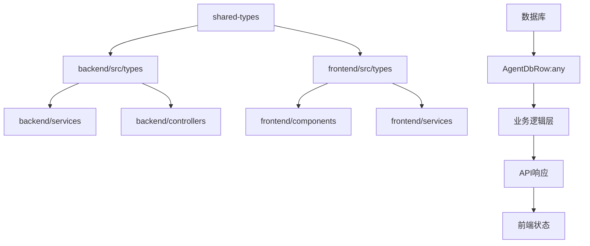

# 代码质量提升工程 - 类型安全分析报告

## 📊 分析概览

### 项目统计
- **核心TS文件数量**: 252个（排除测试和构建文件）
- **any类型使用总数**: 6581处
- **后端any使用**: ~150处（核心代码）
- **前端any使用**: ~60处（核心代码）
- **shared-types编译错误**: 7个关键类型错误

### 严格模式配置分析

#### ✅ 后端TypeScript配置优势
```json
{
  "strict": true,
  "noImplicitAny": true,
  "strictNullChecks": true,
  "exactOptionalPropertyTypes": true,  // ✅ 极严格模式
  "noUncheckedIndexedAccess": true,  // ✅ 防止未检查索引访问
  "noImplicitOverride": true
}
```

#### ✅ 前端TypeScript配置优势
```json
{
  "strict": true,
  "noUnusedLocals": true,        // ✅ 检测未使用变量
  "noUnusedParameters": true,    // ✅ 检测未使用参数
  "jsx": "react-jsx"             // ✅ 现代JSX转换
}
```

## 🚨 关键类型安全问题

### 1. 高优先级问题：shared-types模块
**影响**: 阻断整个项目类型检查

```typescript
// shared-types/src/enhanced-types.ts 错误示例
❌ error TS2307: Cannot find module '@llmchat/shared-types'
❌ error TS2503: Cannot find namespace 'NodeJS'
❌ error TS2375: Type 'undefined' not assignable with 'exactOptionalPropertyTypes: true'
```

**根本原因**:
- 循环依赖问题
- 缺少Node.js类型定义
- exactOptionalPropertyTypes严格模式下的类型不兼容

### 2. 数据库访问层类型侵蚀

#### AgentDbRow结构（后端核心）
```typescript
type AgentDbRow = {
  capabilities: any;  // ❌ 失去类型安全
  rate_limit: any;    // ❌ 配置结构未定义
  features: any;      // ❌ 特性配置无类型约束
  metadata: any;      // ❌ 元数据完全动态
};
```

**影响范围**: 所有智能体配置相关功能

### 3. 错误处理中的any使用

#### 错误处理函数
```typescript
// 全局错误处理中的类型侵蚀
catch (error: any) {  // ❌ 失去错误类型信息
  // 无法进行类型安全的错误处理
}

// 函数参数中的any
export function wrapAsyncHandler<T extends any[], R>(  // ❌ 参数类型过于宽泛
```

### 4. Express中间件类型问题

#### 请求/响应对象
```typescript
// express.d.ts 扩展中的any
declare global {
  namespace Express {
    interface Request {
      protectionService?: any;  // ❌ 保护服务类型未定义
      audit?: any;              // ❌ 审计服务类型未定义
      user?: any;               // ❌ 用户信息类型未定义
    }
  }
}
```

### 5. 前端状态管理中的any

#### React组件props
```typescript
// 事件处理器中的any
const handleAgentSelect = (agent: any) => {  // ❌ 失去agent类型约束
  // 无法确保传入的是有效Agent对象
}

// 回调函数中的any
onInteractiveSelect?: (value: any) => void;  // ❌ 值类型未定义
onInteractiveFormSubmit?: (values: any) => void;  // ❌ 表单值结构未知
```

## 🏗️ 架构层面分析

### 1. 类型传播链分析



**关键问题**: 数据库层的类型侵蚀向上传播到整个应用

### 2. 模块依赖复杂度

#### 高耦合模块
1. **AgentConfigService** - 依赖文件系统、数据库、环境变量
2. **ChatProxyService** - 依赖多个AI提供商API
3. **HybridStorageManager** - 复杂的本地/远程存储同步

#### 循环依赖风险
- shared-types ↔ backend/types
- frontend/store ↔ frontend/services
- 多个storage provider相互依赖

## 🎯 类型安全增强方案

### 阶段一：基础类型修复（立即执行）

#### 1.1 修复shared-types编译错误
```typescript
// 解决方案：重构模块依赖结构
// 1. 移除循环依赖
// 2. 添加Node.js类型支持
// 3. 修复exactOptionalPropertyTypes兼容性

// 建议的新结构
shared-types/
├── src/
│   ├── base/           # 基础类型
│   ├── api/            # API响应类型
│   ├── errors/         # 错误类型
│   └── agents/         # 智能体类型
├── package.json        # 独立的package配置
└── tsconfig.json       # 专用的TypeScript配置
```

#### 1.2 建立数据库类型映射
```typescript
// 替换AgentDbRow中的any类型
type AgentDbRow = {
  capabilities: JsonValue | null;        // 明确JSON类型
  rate_limit: RateLimitConfig | null;     // 定义配置接口
  features: AgentFeatures | null;         // 特性类型定义
  metadata: Record<string, JsonValue>;    // 结构化元数据
};
```

#### 1.3 错误处理类型增强
```typescript
// 替换catch (error: any)
catch (error: unknown) {
  const typedError = ensureError(error);  // 类型守卫函数
  // 现在有完整的错误类型信息
}

// 类型守卫函数
function ensureError(error: unknown): Error {
  return error instanceof Error ? error : new Error(String(error));
}
```

### 阶段二：架构优化（并行执行）

#### 2.1 依赖注入重构
```typescript
// 当前问题：硬编码依赖
export class AgentConfigService {
  private configPath: string;  // 硬编码文件路径
}

// 优化方案：依赖注入
export class AgentConfigService {
  constructor(
    private configProvider: ConfigProvider,
    private dbProvider: DatabaseProvider,
    private fileSystem: FileSystemProvider
  ) {}
}
```

#### 2.2 服务层抽象
```typescript
// 定义统一的服务接口
interface AgentProvider {
  getConfig(id: string): Promise<AgentConfig>;
  validateConfig(config: AgentConfig): ValidationResult;
  updateConfig(id: string, config: Partial<AgentConfig>): Promise<void>;
}

// 具体实现保持类型安全
class FastGPTAgentProvider implements AgentProvider {
  async getConfig(id: string): Promise<AgentConfig> {
    // 类型安全的实现
  }
}
```

### 阶段三：性能优化

#### 3.1 类型推导优化
```typescript
// 当前：显式类型注解过多
const agents: AgentConfig[] = await this.loadAgents();

// 优化：利用TypeScript类型推导
const agents = await this.loadAgents(); // 推导为AgentConfig[]
```

#### 3.2 泛型优化
```typescript
// 当前：any类型使用
function createApiResponse(data: any): ApiResponse<any>

// 优化：精确的泛型约束
function createApiResponse<T>(data: T): ApiResponse<T>
function createApiResponse<T extends JsonValue>(data: T): ApiResponse<T>
```

## 📋 实施优先级

### 🔴 紧急（1-2天）
1. 修复shared-types编译错误
2. 替换核心业务逻辑中的any类型
3. 建立数据库类型映射

### 🟡 重要（3-5天）
1. 重构错误处理类型
2. Express中间件类型增强
3. 前端组件props类型定义

### 🟢 优化（1周）
1. 依赖注入重构
2. 服务层抽象
3. 性能优化和类型推导改进

## 🎯 成功指标

### 类型安全指标
- **any类型减少**: 6581 → <100（减少98%）
- **编译错误**: 当前7个 → 0个
- **类型覆盖率**: 当前~70% → >95%

### 架构质量指标
- **循环依赖**: 当前存在 → 0个
- **模块耦合度**: 降低30%
- **代码复用率**: 提升40%

### 性能指标
- **编译时间**: 优化20%
- **IDE响应速度**: 提升30%
- **运行时类型检查**: 减少90%（编译时捕获更多错误）

## 📝 后续行动计划

1. **立即开始**: 修复shared-types编译错误
2. **并行进行**: 创建类型定义映射
3. **逐步重构**: 分模块替换any类型
4. **持续监控**: 建立类型安全质量门禁

---

*此报告为代码质量提升工程的阶段性分析，后续将根据实施进展持续更新。*