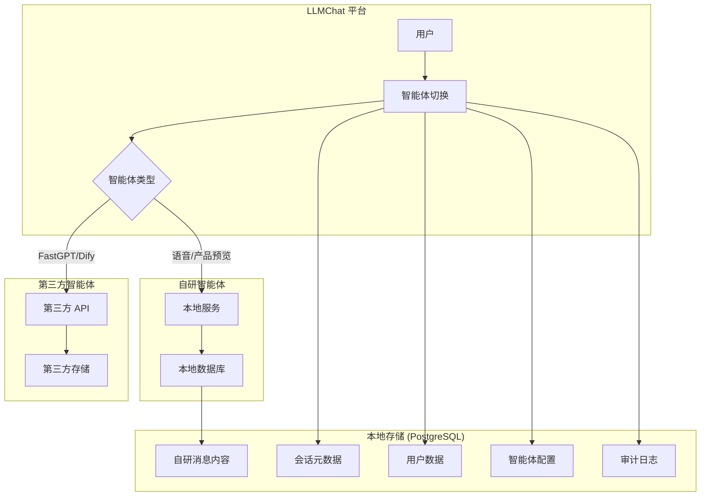
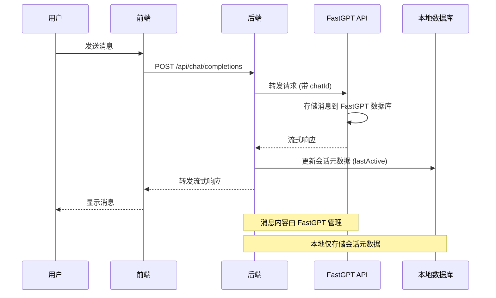
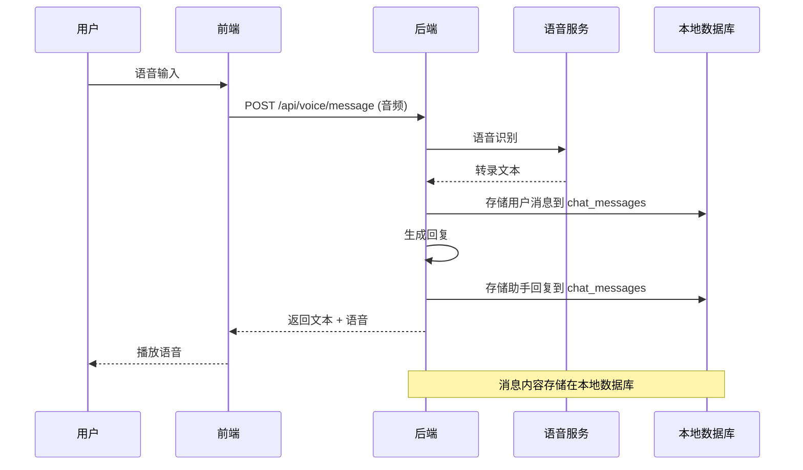

# 数据存储架构说明

## 概述

LLMChat 是一个**智能体切换平台**，采用**混合存储架构**：
- **第三方智能体**（FastGPT、Dify、OpenAI、Anthropic）- 消息内容由其平台管理
- **自研智能体**（语音电话、产品预览等）- 消息内容存储在本地数据库

## 架构原则

### 1. 数据所有权分离



### 2. 数据分类

| 数据类型 | 存储位置 | 适用范围 | 说明 |
|---------|---------|---------|------|
| **用户信息** | 本地数据库 | 全局 | 认证、授权、个人配置 |
| **智能体配置** | 本地数据库 | 全局 | 端点、密钥、功能配置 |
| **会话元数据** | 本地数据库 | 全局 | 会话ID、标题、创建时间 |
| **第三方消息** | 第三方平台 | FastGPT/Dify等 | 消息内容、历史记录 |
| **自研消息** | 本地数据库 | 语音电话/产品预览 | 完整消息内容 |
| **审计日志** | 本地数据库 | 全局 | 操作审计、安全日志 |

## 数据库表设计

### 1. `chat_sessions` - 会话元数据表

**用途**: 存储所有智能体的会话元数据（不含消息内容）

```sql
CREATE TABLE chat_sessions (
  id TEXT PRIMARY KEY,
  agent_id TEXT NOT NULL REFERENCES agent_configs(id),
  title TEXT,
  user_id TEXT,
  -- 第三方平台的会话ID
  external_session_id TEXT,
  provider TEXT NOT NULL,  -- fastgpt, dify, openai, voice-call, product-preview
  metadata JSONB,
  created_at TIMESTAMPTZ DEFAULT NOW(),
  updated_at TIMESTAMPTZ DEFAULT NOW()
);
```

**使用场景**:
- **第三方智能体**: 存储 `external_session_id` 用于关联第三方平台的会话
- **自研智能体**: 存储会话基本信息，关联 `chat_messages` 表

**示例数据**:

```json
// FastGPT 会话
{
  "id": "session_123",
  "agent_id": "fastgpt-assistant",
  "external_session_id": "64f8a0d4d8d8d8d8d8d8d8d8",
  "provider": "fastgpt",
  "title": "产品咨询",
  "user_id": "user_001"
}

// 语音电话会话 (自研)
{
  "id": "session_456",
  "agent_id": "voice-conversation-assistant",
  "external_session_id": null,
  "provider": "voice-call",
  "title": "语音通话 2025-10-02",
  "user_id": "user_001",
  "metadata": {
    "duration": 300,
    "audio_quality": "high"
  }
}
```

### 2. `chat_messages` - 消息内容表

**用途**: **仅用于自研智能体**的消息内容存储

```sql
CREATE TABLE chat_messages (
  id TEXT PRIMARY KEY,
  session_id TEXT NOT NULL REFERENCES chat_sessions(id),
  role TEXT NOT NULL,  -- user, assistant, system
  content TEXT NOT NULL,
  metadata JSONB,
  created_at TIMESTAMPTZ DEFAULT NOW()
);
```

**使用场景**:
- ✅ 语音电话智能体 - 存储转录文本
- ✅ 产品预览智能体 - 存储用户输入和生成结果
- ✅ 其他自研智能体 - 需要本地存储的场景
- ❌ FastGPT/Dify - **不使用此表**

**示例数据**:

```json
// 语音电话消息
{
  "id": "msg_001",
  "session_id": "session_456",
  "role": "user",
  "content": "你好，请帮我查询订单状态",
  "metadata": {
    "audio_url": "https://storage.example.com/audio/001.wav",
    "duration_ms": 2500,
    "recognition_confidence": 0.95
  }
}

// 产品预览消息
{
  "id": "msg_002",
  "session_id": "session_789",
  "role": "assistant",
  "content": "已生成产品现场效果图",
  "metadata": {
    "image_url": "https://storage.example.com/images/preview_001.jpg",
    "generation_time_ms": 3500,
    "model": "wanx-stylepro-v1"
  }
}
```

## 数据流向

### 场景1: 第三方智能体（FastGPT）



### 场景2: 自研智能体（语音电话）



## 查询策略

### 获取会话历史

**第三方智能体**:
```typescript
// 1. 从本地获取会话元数据
const session = await db.query('SELECT * FROM chat_sessions WHERE id = $1', [sessionId]);

// 2. 调用第三方API获取消息内容
if (session.provider === 'fastgpt') {
  const messages = await fastgptService.getChatHistory(session.external_session_id);
  return messages;
} else if (session.provider === 'dify') {
  const messages = await difyService.getConversationMessages(session.external_session_id);
  return messages;
}
```

**自研智能体**:
```typescript
// 直接从本地数据库查询
const messages = await db.query(
  'SELECT * FROM chat_messages WHERE session_id = $1 ORDER BY created_at ASC',
  [sessionId]
);
return messages;
```

## 数据保留策略

### 第三方智能体

- **会话元数据**: 保留 90 天（可配置）
- **消息内容**: 由第三方平台管理，不受本平台控制
- **清理策略**: 定期清理 `chat_sessions` 表中的过期元数据

### 自研智能体

- **会话元数据**: 保留 90 天
- **消息内容**: 保留 30 天（可配置）
- **清理策略**: 
  - 软删除: 标记为已删除，保留归档
  - 硬删除: 超过归档期后物理删除

**清理脚本示例**:

```sql
-- 清理过期的第三方会话元数据 (90天)
DELETE FROM chat_sessions
WHERE provider IN ('fastgpt', 'dify', 'openai', 'anthropic')
  AND updated_at < NOW() - INTERVAL '90 days';

-- 清理过期的自研消息内容 (30天)
DELETE FROM chat_messages
WHERE session_id IN (
  SELECT id FROM chat_sessions
  WHERE provider IN ('voice-call', 'product-preview')
    AND updated_at < NOW() - INTERVAL '30 days'
);
```

## 隐私与合规

### 数据分类

| 数据类型 | 敏感级别 | GDPR 适用 | 存储位置 | 责任方 |
|---------|---------|-----------|---------|--------|
| 用户凭证 | 高 | 是 | 本地数据库 | LLMChat |
| 会话元数据 | 中 | 是 | 本地数据库 | LLMChat |
| 第三方消息 | 高 | 是 | 第三方平台 | 第三方提供商 |
| 自研消息 | 高 | 是 | 本地数据库 | LLMChat |
| 审计日志 | 中 | 是 | 本地数据库 | LLMChat |

### 用户数据删除

**完全删除请求（GDPR "被遗忘权"）**:

```typescript
async function deleteUserData(userId: string): Promise<void> {
  // 1. 删除本地会话和消息
  await db.query('DELETE FROM chat_messages WHERE session_id IN (SELECT id FROM chat_sessions WHERE user_id = $1)', [userId]);
  await db.query('DELETE FROM chat_sessions WHERE user_id = $1', [userId]);
  
  // 2. 通知第三方平台删除（需要实现）
  const externalSessions = await db.query(
    'SELECT external_session_id, provider FROM chat_sessions WHERE user_id = $1 AND external_session_id IS NOT NULL',
    [userId]
  );
  
  for (const session of externalSessions) {
    if (session.provider === 'fastgpt') {
      await fastgptService.deleteConversation(session.external_session_id);
    } else if (session.provider === 'dify') {
      await difyService.deleteConversation(session.external_session_id);
    }
  }
  
  // 3. 删除用户账户
  await db.query('DELETE FROM users WHERE id = $1', [userId]);
  
  // 4. 记录审计日志（但不关联用户ID）
  await auditService.log({
    action: AuditAction.USER_DELETE,
    resourceType: ResourceType.USER,
    status: AuditStatus.SUCCESS,
    details: { deletedAt: new Date(), method: 'GDPR_REQUEST' }
  });
}
```

## 性能优化

### 索引策略

```sql
-- 会话查询优化 (按用户和时间)
CREATE INDEX idx_chat_sessions_user_updated ON chat_sessions(user_id, updated_at DESC);

-- 消息查询优化 (按会话和时间)
CREATE INDEX idx_chat_messages_session_created ON chat_messages(session_id, created_at ASC);

-- 第三方会话关联优化
CREATE INDEX idx_chat_sessions_external ON chat_sessions(external_session_id, provider) WHERE external_session_id IS NOT NULL;
```

### 分区策略

对于大量消息的自研智能体，使用时间分区：

```sql
-- 按月分区 (PostgreSQL 12+)
CREATE TABLE chat_messages (
    id TEXT NOT NULL,
    session_id TEXT NOT NULL,
    role TEXT NOT NULL,
    content TEXT NOT NULL,
    metadata JSONB,
    created_at TIMESTAMPTZ NOT NULL DEFAULT NOW()
) PARTITION BY RANGE (created_at);

-- 创建月度分区
CREATE TABLE chat_messages_2025_10 PARTITION OF chat_messages
    FOR VALUES FROM ('2025-10-01') TO ('2025-11-01');

CREATE TABLE chat_messages_2025_11 PARTITION OF chat_messages
    FOR VALUES FROM ('2025-11-01') TO ('2025-12-01');
```

## 迁移和备份

### 数据迁移

**从第三方平台导入历史**:
- FastGPT → 使用其导出 API 获取历史会话
- Dify → 批量导入已有对话
- 存储策略: 仅导入会话元数据，不导入消息内容

**自研智能体数据导出**:
- 支持 JSON/CSV 格式导出
- 包含完整的消息内容和元数据
- 用于备份和迁移

### 备份策略

**本地数据库备份**:
```bash
# 每日全量备份
pg_dump llmchat > backup_$(date +%Y%m%d).sql

# 差异备份 (WAL 归档)
archive_command = 'cp %p /backup/wal/%f'
```

**第三方数据备份**:
- 依赖第三方平台的备份策略
- 定期验证第三方平台的数据可用性

## 监控指标

### 关键指标

| 指标 | 说明 | 告警阈值 |
|-----|------|----------|
| `session_create_rate` | 会话创建速率 | >100/min |
| `message_store_latency` | 消息存储延迟 | >100ms |
| `external_api_failure_rate` | 第三方API失败率 | >5% |
| `db_connection_pool_usage` | 数据库连接池使用率 | >80% |
| `chat_messages_table_size` | 消息表大小 | >100GB |

### 监控查询

```sql
-- 各智能体的会话数量
SELECT provider, COUNT(*) as session_count, 
       COUNT(*) FILTER (WHERE created_at > NOW() - INTERVAL '24 hours') as sessions_today
FROM chat_sessions
GROUP BY provider;

-- 自研智能体的消息量统计
SELECT 
  cs.provider,
  COUNT(cm.id) as message_count,
  AVG(LENGTH(cm.content)) as avg_content_length,
  MAX(cm.created_at) as last_message_at
FROM chat_messages cm
JOIN chat_sessions cs ON cm.session_id = cs.id
GROUP BY cs.provider;

-- 存储空间使用情况
SELECT 
  schemaname,
  tablename,
  pg_size_pretty(pg_total_relation_size(schemaname||'.'||tablename)) as size
FROM pg_tables
WHERE tablename IN ('chat_sessions', 'chat_messages')
ORDER BY pg_total_relation_size(schemaname||'.'||tablename) DESC;
```

## 故障排查

### 常见问题

**问题1: 第三方会话历史无法加载**

检查清单:
- [ ] `chat_sessions.external_session_id` 是否正确
- [ ] 第三方API密钥是否有效
- [ ] 第三方平台会话是否被删除
- [ ] 网络连接是否正常

**问题2: 自研消息存储失败**

检查清单:
- [ ] 数据库连接是否正常
- [ ] `chat_messages` 表是否存在
- [ ] 外键约束是否满足（`session_id` 存在）
- [ ] 磁盘空间是否充足

## 未来扩展

### 计划支持

- [ ] **多区域部署**: 消息就近存储,降低延迟
- [ ] **冷热数据分离**: 旧消息归档到对象存储
- [ ] **搜索功能**: 集成 Elasticsearch 支持全文搜索
- [ ] **数据导出**: 支持用户导出所有会话记录
- [ ] **统一查询接口**: 抽象第三方和自研数据的查询差异

---

**文档版本**: 1.0  
**最后更新**: 2025-10-02  
**维护者**: LLMChat 开发团队

