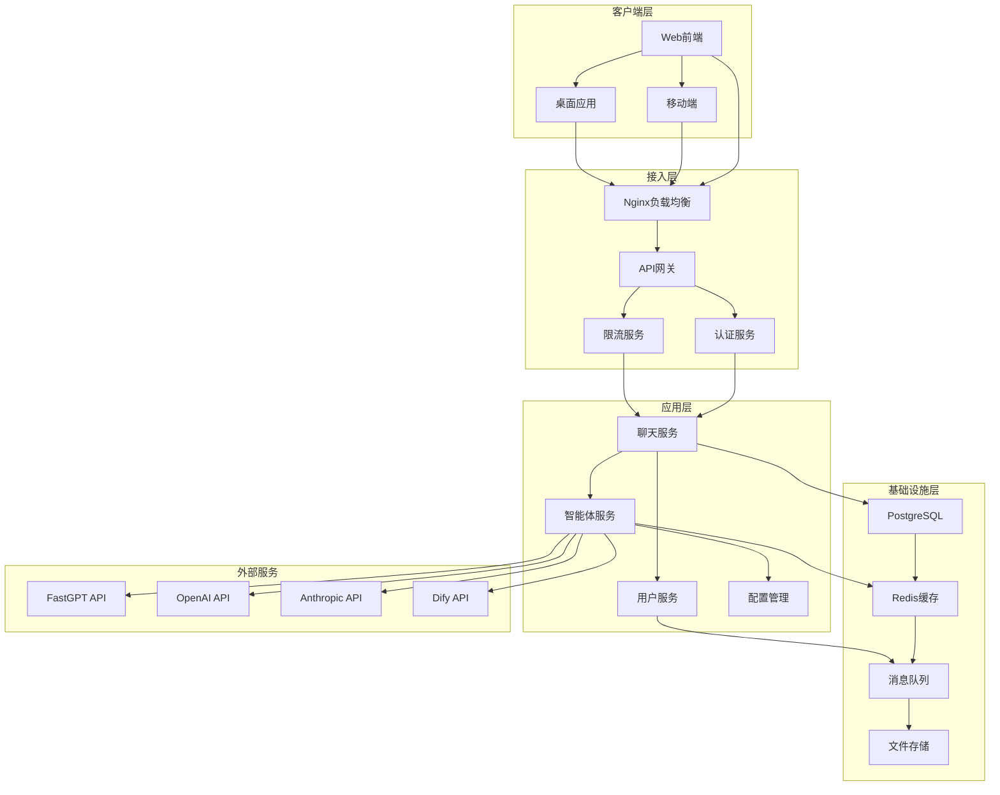
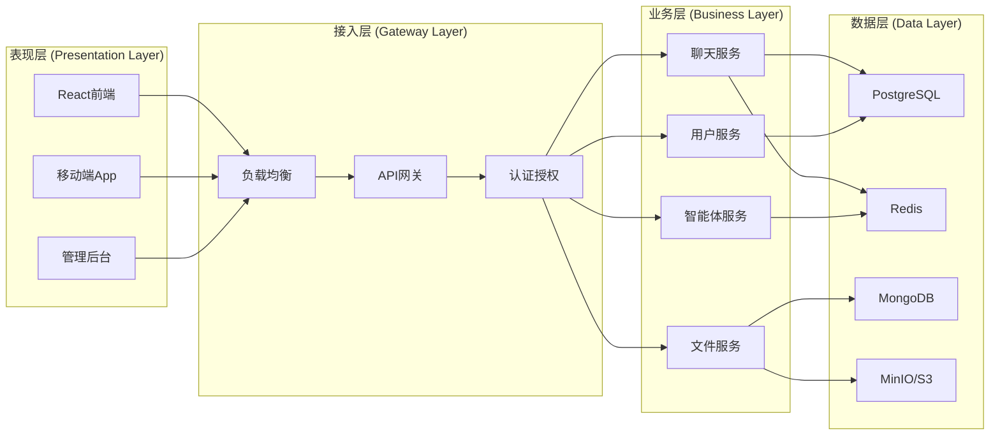
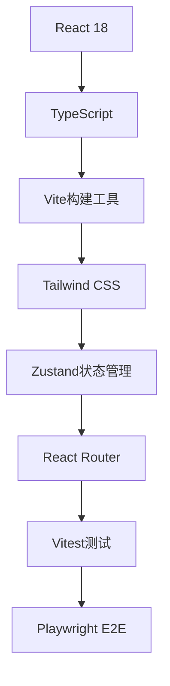
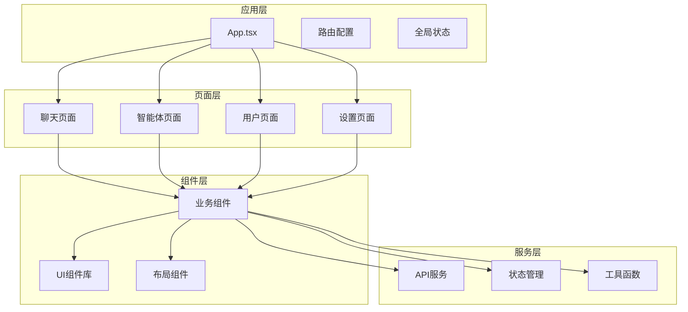
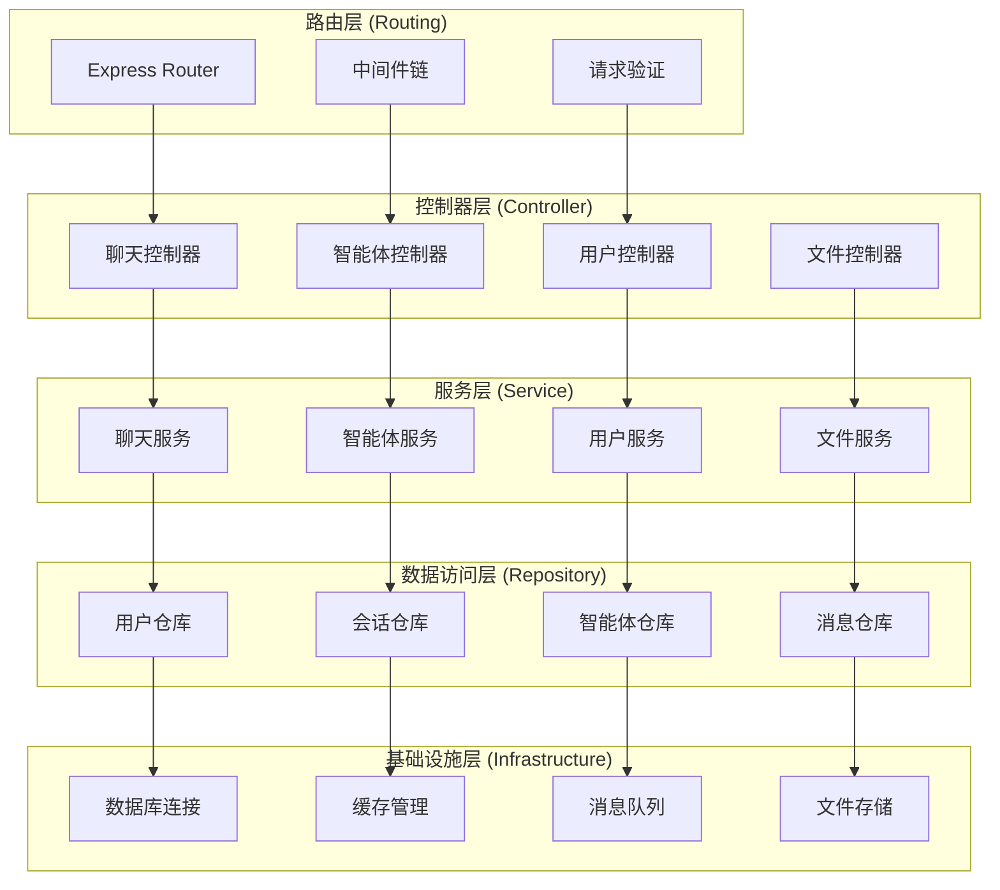
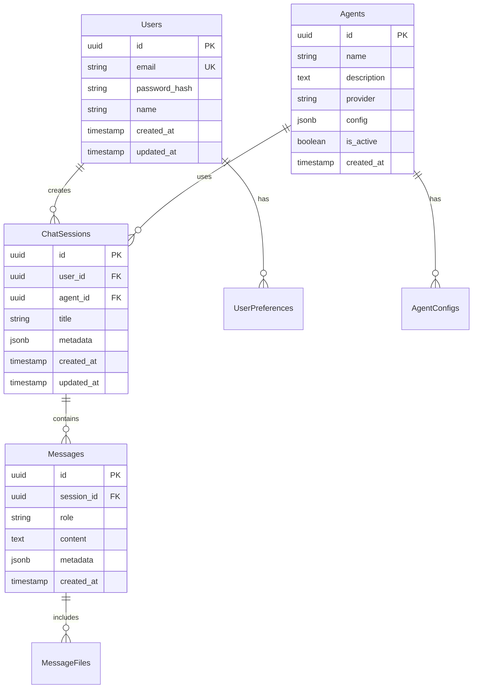
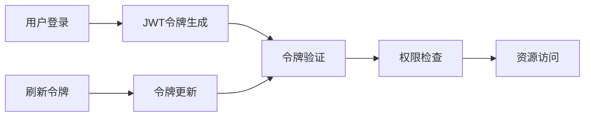
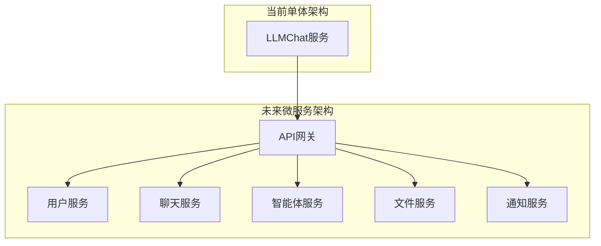

# LLMChat 系统架构指南

> **企业级架构设计文档 - Spec-Kit合规版本**
> **文档版本**: v1.0.0
> **最后更新**: 2025-10-18
> **适用对象**: 架构师、高级开发人员、技术决策者

## 📋 目录

- [1. 架构概述](#1-架构概述)
- [2. 技术架构](#2-技术架构)
- [3. 数据架构](#3-数据架构)
- [4. 安全架构](#4-安全架构)
- [5. 部署架构](#5-部署架构)
- [6. 性能架构](#6-性能架构)
- [7. 监控架构](#7-监控架构)
- [8. 扩展性设计](#8-扩展性设计)
- [9. 技术选型](#9-技术选型)
- [10. 架构演进](#10-架构演进)

## 1. 架构概述

LLMChat 是一个**企业级多智能体聊天平台**，采用现代化前端+后端分离架构，支持多个 AI 提供商（FastGPT、OpenAI、Anthropic、Dify）之间的动态切换，提供统一的服务端配置与代理能力。

### 核心特性

- **多AI提供商支持**: FastGPT、OpenAI、Anthropic、Dify等
- **智能体动态配置**: 支持运行时智能体配置热重载
- **实时流式聊天**: 基于SSE的流式响应
- **多租户架构**: 支持用户隔离和权限管理
- **高可用设计**: 支持水平扩展和故障转移
- **可观测性**: 完整的监控、日志和追踪体系

### 架构图



## 系统架构

### 分层架构设计



### 服务拆分原则

1. **按业务领域拆分**: 聊天、智能体、用户、文件等
2. **单一职责**: 每个服务专注于特定业务功能
3. **低耦合高内聚**: 服务间通过API通信
4. **数据独立性**: 每个服务拥有独立的数据存储
5. **可独立部署**: 服务可独立开发、测试、部署

## 前端架构

### 技术栈



### 组件架构



### 状态管理架构

```typescript
// 状态管理设计
interface AppState {
  // 用户状态
  user: UserSlice;

  // 聊天状态
  chat: ChatSlice;

  // 智能体状态
  agents: AgentSlice;

  // UI状态
  ui: UISlice;

  // 应用配置
  config: ConfigSlice;
}

// Zustand Store实现
const useAppStore = create<AppState>()(
  persist(
    (set, get) => ({
      // User slice
      user: {
        profile: null,
        isAuthenticated: false,
        login: async (credentials) => { /* ... */ },
        logout: () => { /* ... */ }
      },

      // Chat slice
      chat: {
        currentSession: null,
        messages: [],
        isTyping: false,
        sendMessage: async (message) => { /* ... */ },
        loadHistory: async (sessionId) => { /* ... */ }
      },

      // Agent slice
      agents: {
        available: [],
        current: null,
        fetchAgents: async () => { /* ... */ },
        selectAgent: (agentId) => { /* ... */ }
      }
    }),
    {
      name: 'llmchat-store',
      partialize: (state) => ({
        user: state.user,
        agents: state.agents
      })
    }
  )
);
```

### 路由架构

```typescript
// 路由设计
const routes = [
  {
    path: '/',
    element: <Layout />,
    children: [
      {
        index: true,
        element: <HomePage />
      },
      {
        path: 'chat',
        element: <ChatPage />,
        children: [
          {
            path: ':sessionId',
            element: <ChatSession />
          }
        ]
      },
      {
        path: 'agents',
        element: <AgentsPage />,
        children: [
          {
            index: true,
            element: <AgentsList />
          },
          {
            path: ':agentId',
            element: <AgentDetail />
          }
        ]
      }
    ]
  },
  {
    path: '/auth',
    element: <AuthLayout />,
    children: [
      {
        path: 'login',
        element: <LoginPage />
      },
      {
        path: 'register',
        element: <RegisterPage />
      }
    ]
  }
];
```

## 后端架构

### 分层架构



### 服务架构设计

```typescript
// 服务接口定义
interface IChatService {
  sendMessage(request: ChatRequest): Promise<ChatResponse>;
  getMessages(sessionId: string): Promise<Message[]>;
  deleteMessage(messageId: string): Promise<void>;
}

interface IAgentService {
  getAgents(): Promise<Agent[]>;
  getAgent(id: string): Promise<Agent>;
  createAgent(agent: CreateAgentRequest): Promise<Agent>;
  updateAgent(id: string, agent: UpdateAgentRequest): Promise<Agent>;
  deleteAgent(id: string): Promise<void>;
}

// 服务实现
class ChatService implements IChatService {
  constructor(
    private messageRepository: IMessageRepository,
    private aiProviderFactory: AIProviderFactory,
    private cacheService: ICacheService
  ) {}

  async sendMessage(request: ChatRequest): Promise<ChatResponse> {
    // 1. 验证请求
    await this.validateRequest(request);

    // 2. 获取AI提供商
    const provider = await this.aiProviderFactory.getProvider(request.agentId);

    // 3. 调用AI服务
    const response = await provider.sendMessage(request);

    // 4. 保存消息
    await this.saveMessage(request, response);

    // 5. 更新缓存
    await this.cacheService.updateSession(request.sessionId, response);

    return response;
  }
}
```

### 中间件架构

```typescript
// 中间件链设计
const middlewareChain = [
  helmet(),                           // 安全头部
  cors(),                             // 跨域处理
  compression(),                       // 响应压缩
  express.json({ limit: '10mb' }),   // JSON解析
  cookieParser(),                     // Cookie解析
  rateLimit({                         // 限流
    windowMs: 15 * 60 * 1000,        // 15分钟
    max: 1000                         // 最多1000次请求
  }),
  requestLogger(),                    // 请求日志
  authMiddleware(),                   // 认证中间件
  validationMiddleware(),             // 参数验证
  errorHandler                       // 错误处理
];

// 认证中间件
const authMiddleware = async (req: Request, res: Response, next: NextFunction) => {
  try {
    const token = extractTokenFromHeader(req);
    const payload = await verifyJWT(token);
    req.user = payload;
    next();
  } catch (error) {
    res.status(401).json({
      code: 'UNAUTHORIZED',
      message: '无效的认证令牌'
    });
  }
};
```

## 数据架构

### 数据库设计



### 数据层抽象

```typescript
// 仓库模式
interface IRepository<T> {
  create(entity: Partial<T>): Promise<T>;
  findById(id: string): Promise<T | null>;
  findAll(filter?: Partial<T>): Promise<T[]>;
  update(id: string, entity: Partial<T>): Promise<T>;
  delete(id: string): Promise<void>;
}

// 具体实现
class UserRepository implements IRepository<User> {
  constructor(private db: Database) {}

  async create(userData: Partial<User>): Promise<User> {
    const query = `
      INSERT INTO users (email, password_hash, name)
      VALUES ($1, $2, $3)
      RETURNING *
    `;

    const result = await this.db.query(query, [
      userData.email,
      userData.passwordHash,
      userData.name
    ]);

    return result.rows[0];
  }

  async findById(id: string): Promise<User | null> {
    const query = 'SELECT * FROM users WHERE id = $1';
    const result = await this.db.query(query, [id]);
    return result.rows[0] || null;
  }
}
```

### 缓存架构

```typescript
// 缓存策略
interface ICacheService {
  get<T>(key: string): Promise<T | null>;
  set<T>(key: string, value: T, options?: CacheOptions): Promise<void>;
  delete(key: string): Promise<void>;
  clear(pattern?: string): Promise<void>;
}

// Redis缓存实现
class RedisCacheService implements ICacheService {
  constructor(private redis: Redis) {}

  async get<T>(key: string): Promise<T | null> {
    const value = await this.redis.get(key);
    return value ? JSON.parse(value) : null;
  }

  async set<T>(key: string, value: T, options?: CacheOptions): Promise<void> {
    const serialized = JSON.stringify(value);

    if (options?.ttl) {
      await this.redis.setex(key, options.ttl, serialized);
    } else {
      await this.redis.set(key, serialized);
    }
  }

  // 缓存预热
  async warmup(): Promise<void> {
    const agents = await this.agentService.getAgents();
    await this.set('agents:list', agents, { ttl: 3600 });
  }
}
```

## 安全架构

### 认证授权



```typescript
// JWT认证实现
interface IAuthService {
  generateToken(payload: JWTPayload): Promise<string>;
  verifyToken(token: string): Promise<JWTPayload>;
  refreshToken(refreshToken: string): Promise<string>;
}

class AuthService implements IAuthService {
  constructor(
    private readonly secret: string,
    private readonly algorithm: Algorithm = 'HS256'
  ) {}

  async generateToken(payload: JWTPayload): Promise<string> {
    return jwt.sign(payload, this.secret, {
      algorithm: this.algorithm,
      expiresIn: '1h',
      issuer: 'llmchat',
      audience: 'llmchat-users'
    });
  }

  async verifyToken(token: string): Promise<JWTPayload> {
    try {
      const decoded = jwt.verify(token, this.secret, {
        algorithms: [this.algorithm],
        issuer: 'llmchat',
        audience: 'llmchat-users'
      }) as JWTPayload;

      return decoded;
    } catch (error) {
      throw new UnauthorizedError('无效的认证令牌');
    }
  }
}
```

### 权限控制

```typescript
// RBAC权限模型
interface Role {
  id: string;
  name: string;
  permissions: Permission[];
}

interface Permission {
  id: string;
  resource: string;
  action: string;
}

// 权限中间件
const requirePermission = (resource: string, action: string) => {
  return async (req: Request, res: Response, next: NextFunction) => {
    const user = req.user as User;

    if (!await hasPermission(user, resource, action)) {
      return res.status(403).json({
        code: 'FORBIDDEN',
        message: '权限不足'
      });
    }

    next();
  };
};

// 使用示例
app.get('/api/admin/users',
  authenticateToken,
  requirePermission('users', 'read'),
  getUsersController
);
```

## 部署架构

### 容器化部署

```dockerfile
# Dockerfile示例
FROM node:18-alpine AS base

# 依赖安装阶段
FROM base AS deps
WORKDIR /app
COPY package.json pnpm-lock.yaml ./
RUN npm install -g pnpm && pnpm install --frozen-lockfile

# 构建阶段
FROM base AS builder
WORKDIR /app
COPY . .
COPY --from=deps /app/node_modules ./node_modules
RUN pnpm run build

# 生产阶段
FROM base AS runner
WORKDIR /app
RUN addgroup --system --gid 1001 nodejs
RUN adduser --system --uid 1001 nodejs

COPY --from=builder /app/dist ./dist
COPY --from=builder /app/node_modules ./node_modules
COPY --from=builder /app/package.json ./package.json

USER nodejs
EXPOSE 3001
CMD ["node", "dist/index.js"]
```

### Kubernetes部署

```yaml
# k8s部署配置
apiVersion: apps/v1
kind: Deployment
metadata:
  name: llmchat-backend
spec:
  replicas: 3
  selector:
    matchLabels:
      app: llmchat-backend
  template:
    metadata:
      labels:
        app: llmchat-backend
    spec:
      containers:
      - name: backend
        image: llmchat/backend:latest
        ports:
        - containerPort: 3001
        env:
        - name: NODE_ENV
          value: "production"
        - name: DATABASE_URL
          valueFrom:
            secretKeyRef:
              name: llmchat-secrets
              key: database-url
        resources:
          requests:
            memory: "256Mi"
            cpu: "250m"
          limits:
            memory: "512Mi"
            cpu: "500m"
        livenessProbe:
          httpGet:
            path: /health
            port: 3001
          initialDelaySeconds: 30
          periodSeconds: 10
        readinessProbe:
          httpGet:
            path: /health
            port: 3001
          initialDelaySeconds: 5
          periodSeconds: 5
---
apiVersion: v1
kind: Service
metadata:
  name: llmchat-backend-service
spec:
  selector:
    app: llmchat-backend
  ports:
  - protocol: TCP
    port: 80
    targetPort: 3001
  type: ClusterIP
```

## 技术选型

### 前端技术选型

| 技术 | 版本 | 选择理由 |
|------|------|----------|
| React | 18.x | 生态成熟，性能优秀，开发效率高 |
| TypeScript | 5.x | 类型安全，代码质量高 |
| Vite | 5.x | 构建速度快，开发体验好 |
| Tailwind CSS | 3.x | 实用优先，设计系统一致 |
| Zustand | 4.x | 轻量级状态管理，API简洁 |

### 后端技术选型

| 技术 | 版本 | 选择理由 |
|------|------|----------|
| Node.js | 18.x | JavaScript生态，异步性能好 |
| Express.js | 4.x | 成熟稳定，中间件丰富 |
| PostgreSQL | 15.x | 功能强大，数据一致性好 |
| Redis | 7.x | 高性能缓存，数据结构丰富 |
| JWT | - | 无状态认证，易于扩展 |

### 基础设施选型

| 技术 | 版本 | 选择理由 |
|------|------|----------|
| Docker | 24.x | 容器化部署，环境一致性 |
| Kubernetes | 1.28.x | 容器编排，自动扩缩容 |
| Nginx | 1.24.x | 反向代理，负载均衡 |
| GitHub Actions | - | CI/CD自动化 |

## 设计原则

### 1. 单一职责原则
每个模块、类、函数只负责一个明确的职责。

### 2. 开放封闭原则
对扩展开放，对修改封闭。

### 3. 依赖倒置原则
高层模块不依赖低层模块，都依赖抽象。

### 4. 接口隔离原则
使用专门的接口，避免臃肿的接口。

### 5. 最少知识原则
模块间尽量减少依赖，降低耦合。

## 扩展性设计

### 水平扩展

```typescript
// 无状态服务设计
class ChatService {
  // 不在服务内部保存状态
  // 所有状态存储在外部（数据库、缓存）

  async sendMessage(request: ChatRequest): Promise<ChatResponse> {
    // 1. 从缓存获取会话状态
    const session = await this.cache.getSession(request.sessionId);

    // 2. 处理消息
    const response = await this.processMessage(request, session);

    // 3. 更新缓存状态
    await this.cache.updateSession(request.sessionId, response);

    return response;
  }
}
```

### 微服务拆分



### 数据库扩展

```typescript
// 读写分离
class DatabaseService {
  private readDb: Database;
  private writeDb: Database;

  constructor(readConfig: DBConfig, writeConfig: DBConfig) {
    this.readDb = new Database(readConfig);
    this.writeDb = new Database(writeConfig);
  }

  async query(sql: string, params?: any[]): Promise<any> {
    return this.readDb.query(sql, params);
  }

  async execute(sql: string, params?: any[]): Promise<any> {
    return this.writeDb.query(sql, params);
  }
}

// 分库分表策略
interface ShardingStrategy {
  getShardKey(data: any): string;
  getShard(shardKey: string): Database;
}

class ChatShardingStrategy implements ShardingStrategy {
  getShardKey(data: { sessionId: string }): string {
    return data.sessionId.substring(0, 2);
  }

  getShard(shardKey: string): Database {
    return this.shards[shardKey] || this.defaultShard;
  }
}
```

---

*最后更新时间: 2025-10-18*
*文档版本: v1.0*
*维护者: 架构团队*