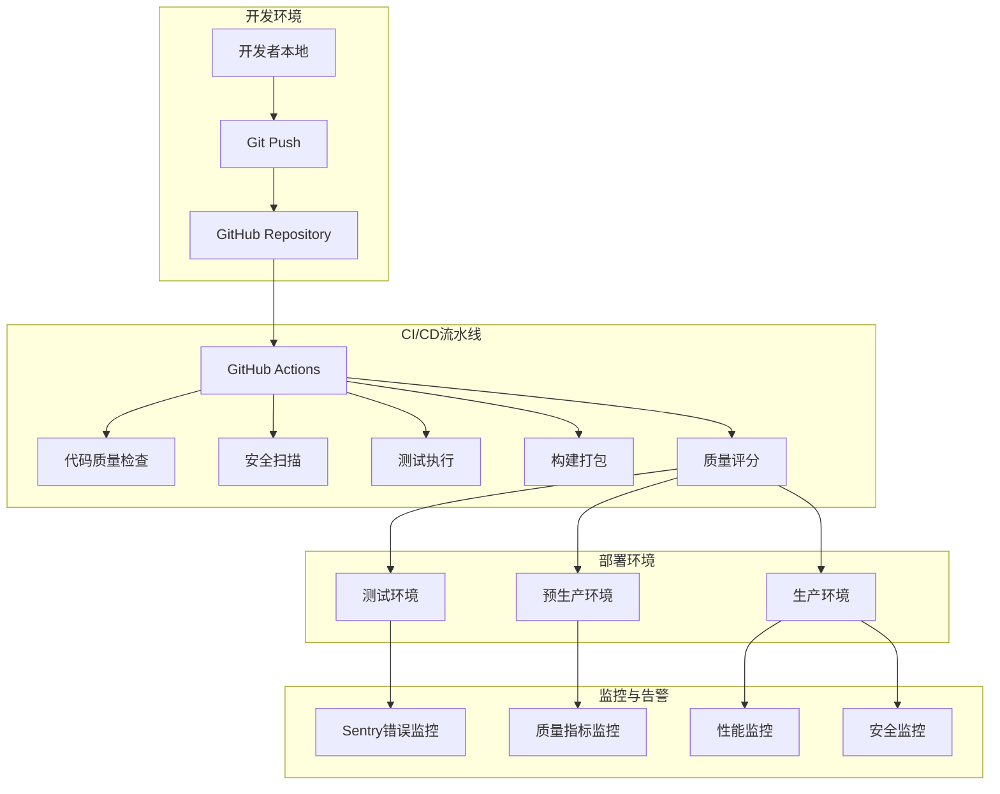
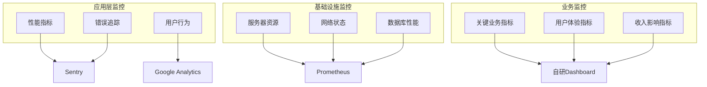

# LLMChat 企业级CI/CD架构指南

> **版本**: 1.0.0
> **最后更新**: 2025-10-18
> **状态**: 生产就绪
> **适用范围**: 企业级多环境部署

---

## 📋 目录

1. [架构概述](#架构概述)
2. [核心设计原则](#核心设计原则)
3. [CI/CD流水线架构](#cicd流水线架构)
4. [部署策略](#部署策略)
5. [质量保证体系](#质量保证体系)
6. [安全合规框架](#安全合规框架)
7. [监控与可观测性](#监控与可观测性)
8. [配置管理](#配置管理)
9. [操作手册](#操作手册)
10. [故障排除指南](#故障排除指南)
11. [最佳实践](#最佳实践)

---

## 🎯 架构概述

### 系统架构图



### 核心组件

| 组件 | 功能 | 技术栈 | 状态 |
|------|------|--------|------|
| **GitHub Actions** | CI/CD自动化 | GitHub Actions | ✅ 生产就绪 |
| **质量评分系统** | 代码质量评估 | Node.js + 自研算法 | ✅ 生产就绪 |
| **测试覆盖率监控** | 测试质量跟踪 | Node.js + Jest | ✅ 生产就绪 |
| **安全扫描管理器** | 多维度安全检查 | Node.js + 第三方工具 | ✅ 生产就绪 |
| **部署管理器** | 零失败部署 | Node.js + 多策略支持 | ✅ 生产就绪 |
| **监控系统** | 全方位监控 | Sentry + 自研 | ✅ 生产就绪 |

---

## 🏗️ 核心设计原则

### 1. 零失败部署 (Zero-Failure Deployment)
- **蓝绿部署**: 零停机切换，自动回滚
- **金丝雀发布**: 渐进式流量控制，风险最小化
- **滚动更新**: 平滑升级，保持服务可用性

### 2. 质量左移 (Shift-Left Quality)
- **预防优于检测**: 在开发阶段发现问题
- **自动化质量门禁**: 阻止低质量代码进入生产
- **持续反馈**: 实时质量指标和改进建议

### 3. 安全优先 (Security-First)
- **深度防御**: 多层安全控制
- **自动化安全检查**: 依赖、代码、基础设施全方位扫描
- **合规性保证**: 符合NIST、GDPR等标准

### 4. 可观测性 (Observability)
- **全链路监控**: 从代码提交到生产部署的完整追踪
- **实时告警**: 关键指标异常即时通知
- **趋势分析**: 质量和性能趋势洞察

---

## 🔄 CI/CD流水线架构

### 流水线阶段设计

```yaml
# 完整流水线配置
stages:
  - 📥 代码获取 (Checkout)
  - 🔍 环境验证 (Environment Validation)
  - 🧪 质量检查 (Quality Checks)
  - 🔒 安全扫描 (Security Scanning)
  - 🏗️ 构建打包 (Build & Package)
  - 🧪 测试执行 (Testing)
  - 📊 质量评估 (Quality Assessment)
  - 🚀 部署执行 (Deployment)
  - 🔍 部署验证 (Deployment Validation)
  - 📈 监控配置 (Monitoring Setup)
```

### GitHub Actions工作流

```yaml
# .github/workflows/enterprise-ci-cd.yml
name: 🚀 Enterprise CI/CD Pipeline

on:
  push:
    branches: [main, develop]
  pull_request:
    branches: [main]
  schedule:
    - cron: '0 2 * * *'  # 每日凌晨2点安全扫描

env:
  NODE_VERSION: '18'
  PNPM_VERSION: '8.15.0'

jobs:
  # 阶段1: 代码质量检查
  quality-checks:
    name: 🔍 代码质量检查
    runs-on: ubuntu-latest
    outputs:
      quality-score: ${{ steps.scoring.outputs.score }}
      security-status: ${{ steps.security.outputs.status }}

    steps:
      - name: 📥 获取代码
        uses: actions/checkout@v4
        with:
          fetch-depth: 0

      - name: 🔧 设置Node.js环境
        uses: actions/setup-node@v4
        with:
          node-version: ${{ env.NODE_VERSION }}
          cache: 'npm'

      - name: 📦 安装pnpm
        run: npm install -g pnpm@${{ env.PNPM_VERSION }}

      - name: 📦 安装依赖
        run: pnpm install --frozen-lockfile

      - name: 🔍 TypeScript类型检查
        run: pnpm run type-check

      - name: 🧹 代码规范检查
        run: pnpm run lint

      - name: 📊 企业质量评分
        id: scoring
        run: |
          SCORE=$(pnpm run enterprise:score:ci)
          echo "score=$SCORE" >> $GITHUB_OUTPUT
          echo "🎯 质量评分: $SCORE/100"

      - name: 🔒 安全扫描
        id: security
        run: |
          STATUS=$(pnpm run security:scan:ci)
          echo "status=$STATUS" >> $GITHUB_OUTPUT
          echo "🔒 安全状态: $STATUS"

      - name: 📈 测试覆盖率监控
        run: pnpm run test-coverage:monitor:ci

      - name: 📊 质量报告生成
        if: always()
        run: pnpm run quality-report

  # 阶段2: 测试执行
  comprehensive-testing:
    name: 🧪 综合测试
    runs-on: ubuntu-latest
    needs: quality-checks

    strategy:
      matrix:
        test-type: [unit, integration, e2e]

    steps:
      - name: 📥 获取代码
        uses: actions/checkout@v4

      - name: 🔧 设置环境
        uses: actions/setup-node@v4
        with:
          node-version: ${{ env.NODE_VERSION }}
          cache: 'npm'

      - name: 📦 安装依赖
        run: |
          npm install -g pnpm@${{ env.PNPM_VERSION }}
          pnpm install --frozen-lockfile

      - name: 🏗️ 构建应用
        run: pnpm run build

      - name: 🧪 执行${{ matrix.test-type }}测试
        run: |
          case "${{ matrix.test-type }}" in
            unit)
              pnpm run test:unit
              ;;
            integration)
              pnpm run test:integration
              ;;
            e2e)
              pnpm run test:e2e
              ;;
          esac

  # 阶段3: 部署执行
  deploy-staging:
    name: 🚀 部署到测试环境
    runs-on: ubuntu-latest
    needs: [quality-checks, comprehensive-testing]
    if: github.ref == 'refs/heads/main'

    environment: staging

    steps:
      - name: 📥 获取代码
        uses: actions/checkout@v4

      - name: 🚀 零失败部署管理器
        run: |
          pnpm run deployment:staging \
            --environment=staging \
            --strategy=blue-green \
            --verbose

      - name: 🔍 部署验证
        run: |
          pnpm run deployment:dry-run \
            --environment=staging

  # 阶段4: 生产部署（手动触发）
  deploy-production:
    name: 🚀 部署到生产环境
    runs-on: ubuntu-latest
    needs: [quality-checks, comprehensive-testing, deploy-staging]
    if: github.ref == 'refs/heads/main'

    environment: production

    steps:
      - name: 📥 获取代码
        uses: actions/checkout@v4

      - name: 🚀 生产环境部署
        run: |
          pnpm run deployment:production \
            --environment=production \
            --strategy=canary \
            --verbose

      - name: 🔍 生产环境验证
        run: |
          curl -f https://api.your-domain.com/health || exit 1
          curl -f https://your-domain.com/health || exit 1

  # 阶段5: 质量监控配置
  setup-monitoring:
    name: 📊 配置质量监控
    runs-on: ubuntu-latest
    needs: [deploy-production]
    if: github.ref == 'refs/heads/main'

    steps:
      - name: 📊 启动质量监控
        run: |
          pnpm run quality-monitor

      - name: 📈 生成质量趋势报告
        run: |
          pnpm run quality-trend

      - name: 🔔 配置告警
        run: |
          echo "✅ 质量监控配置完成"
```

### 质量门禁配置

```json
// .quality-gates.config.json
{
  "version": "1.0.0",
  "environments": {
    "development": {
      "quality_threshold": 70,
      "security_threshold": 80,
      "coverage_threshold": 70,
      "performance_threshold": 60
    },
    "staging": {
      "quality_threshold": 85,
      "security_threshold": 90,
      "coverage_threshold": 80,
      "performance_threshold": 75
    },
    "production": {
      "quality_threshold": 90,
      "security_threshold": 95,
      "coverage_threshold": 85,
      "performance_threshold": 85
    }
  },
  "weighting": {
    "code_quality": 35,
    "security": 25,
    "performance": 20,
    "testing": 15,
    "documentation": 5
  },
  "blocking_rules": {
    "critical_security_issues": 0,
    "critical_bugs": 0,
    "type_errors": 0,
    "test_failures": 0
  }
}
```

---

## 🚀 部署策略

### 1. 蓝绿部署 (Blue-Green Deployment)

**适用场景**: 生产环境关键服务更新

**配置示例**:
```javascript
// 蓝绿部署配置
const blueGreenConfig = {
  strategy: 'blue-green',
  environments: {
    production: {
      blue: {
        url: 'https://blue-api.yourdomain.com',
        loadBalancer: 'blue-lb'
      },
      green: {
        url: 'https://green-api.yourdomain.com',
        loadBalancer: 'green-lb'
      }
    }
  },
  healthCheck: {
    endpoint: '/health',
    timeout: 30000,
    retries: 3,
    interval: 5000
  },
  rollback: {
    automatic: true,
    triggers: ['error_rate > 5%', 'response_time > 2000ms'],
    delay: 30000
  }
};
```

**执行流程**:
1. 🔄 流量指向当前环境（Blue）
2. 🏗️ 部署新版本到备用环境（Green）
3. 🔍 对Green环境执行健康检查
4. 🧪 运行冒烟测试
5. 🔄 切换流量到Green环境
6. 👀 监控新环境运行状态
7. ⚠️ 异常时自动回滚到Blue

### 2. 金丝雀发布 (Canary Deployment)

**适用场景**: 高风险功能发布，需要逐步验证

**配置示例**:
```javascript
// 金丝雀发布配置
const canaryConfig = {
  strategy: 'canary',
  trafficSplitting: {
    phases: [
      { percentage: 5, duration: '10m' },
      { percentage: 25, duration: '30m' },
      { percentage: 50, duration: '1h' },
      { percentage: 100, duration: 'permanent' }
    ]
  },
  monitoring: {
    metrics: ['error_rate', 'response_time', 'throughput'],
    thresholds: {
      error_rate: 1,
      response_time_p95: 500,
      throughput_drop: 20
    }
  },
  rollback: {
    automatic: true,
    manual_approval: false
  }
};
```

### 3. 滚动更新 (Rolling Update)

**适用场景**: 常规功能更新，需要平滑升级

**配置示例**:
```javascript
// 滚动更新配置
const rollingConfig = {
  strategy: 'rolling',
  update: {
    maxUnavailable: '25%',
    maxSurge: '25%',
    progressDeadlineSeconds: 600
  },
  healthCheck: {
    path: '/health',
    initialDelaySeconds: 30,
    periodSeconds: 10,
    timeoutSeconds: 5,
    failureThreshold: 3
  }
};
```

---

## 📊 质量保证体系

### 1. 企业质量评分系统

**评分维度**:
- **代码质量** (35%): ESLint规则、复杂度、可维护性
- **安全性** (25%): 漏洞扫描、依赖安全、代码安全
- **性能** (20%): 构建时间、包大小、运行时性能
- **测试** (15%): 覆盖率、测试质量、测试稳定性
- **文档** (5%): API文档、代码注释、README

**评分算法**:
```javascript
// 质量评分计算
function calculateQualityScore(metrics) {
  const weights = {
    code_quality: 0.35,
    security: 0.25,
    performance: 0.20,
    testing: 0.15,
    documentation: 0.05
  };

  const scores = {
    code_quality: calculateCodeQualityScore(metrics.code),
    security: calculateSecurityScore(metrics.security),
    performance: calculatePerformanceScore(metrics.performance),
    testing: calculateTestingScore(metrics.testing),
    documentation: calculateDocumentationScore(metrics.documentation)
  };

  return Object.entries(weights).reduce((total, [key, weight]) => {
    return total + (scores[key] * weight);
  }, 0);
}
```

### 2. 测试覆盖率监控

**监控层级**:
- **单元测试覆盖**: 函数、语句、分支、行覆盖
- **集成测试覆盖**: API接口、数据库操作、外部服务
- **E2E测试覆盖**: 用户流程、关键业务场景

**报告格式**:
```json
{
  "timestamp": "2025-10-18T10:00:00Z",
  "overall": {
    "coverage": 85.2,
    "target": 80,
    "status": "pass"
  },
  "breakdown": {
    "unit": {
      "statements": 88.5,
      "functions": 85.2,
      "branches": 82.1,
      "lines": 87.9
    },
    "integration": {
      "api_endpoints": 90.0,
      "database_operations": 85.0,
      "external_services": 80.0
    },
    "e2e": {
      "user_workflows": 75.0,
      "critical_paths": 95.0
    }
  },
  "trends": {
    "current": 85.2,
    "previous": 83.1,
    "change": "+2.1"
  }
}
```

### 3. 回归检测

**检测指标**:
- 质量评分下降 (>5%)
- 测试覆盖率下降 (>3%)
- 新增安全漏洞
- 性能回归 (>10%)
- 构建时间增长 (>20%)

---

## 🔒 安全合规框架

### 1. 多维度安全扫描

**扫描类型**:
- **依赖安全扫描**: npm audit, Snyk, WhiteSource
- **代码安全扫描**: Semgrep, CodeQL, SonarQube
- **密钥泄露检测**: GitLeaks, TruffleHog
- **基础设施安全**: Checkov, Terraform Security

**扫描流程**:
```bash
# 1. 依赖漏洞扫描
pnpm audit --audit-level high
npx snyk test --severity-threshold high

# 2. 代码安全扫描
npx semgrep --config=auto .
npx codeql database analyze --format=json

# 3. 密钥泄露检测
npx gitLeaks --repo-path=. --verbose

# 4. 容器安全扫描
docker scan llmchat/backend:latest
npx trivy image llmchat/backend:latest
```

### 2. OWASP Top 10 合规

**检查项目**:
- ✅ **A01:2021 – 访问控制失效**: JWT认证、RBAC权限控制
- ✅ **A02:2021 – 加密机制失效**: TLS 1.3、密码哈希、数据加密
- ✅ **A03:2021 – 注入漏洞**: SQL注入、XSS防护、输入验证
- ✅ **A04:2021 – 不安全设计**: 安全架构设计、威胁建模
- ✅ **A05:2021 – 安全配置错误**: 安全配置检查、默认设置移除
- ✅ **A06:2021 – 易受攻击组件**: 依赖扫描、组件更新
- ✅ **A07:2021 – 身份认证失效**: 强密码策略、MFA支持
- ✅ **A08:2021 – 软件数据完整性**: 数字签名、数据验证
- ✅ **A09:2021 – 安全日志不足**: 审计日志、安全监控
- ✅ **A10:2021 – 服务端请求伪造**: URL验证、白名单控制

### 3. 合规标准支持

**支持标准**:
- **NIST Cybersecurity Framework**: 识别、保护、检测、响应、恢复
- **GDPR**: 数据保护、隐私权、数据删除权
- **SOC 2**: 安全性、可用性、处理完整性、机密性、隐私
- **ISO 27001**: 信息安全管理体系

---

## 📈 监控与可观测性

### 1. 全链路监控

**监控层级**:


### 2. 关键性能指标 (KPIs)

**技术指标**:
- **可用性**: > 99.9%
- **响应时间**: P95 < 200ms
- **错误率**: < 0.1%
- **吞吐量**: > 1000 RPS
- **CPU使用率**: < 70%
- **内存使用率**: < 80%

**业务指标**:
- **用户注册成功率**: > 95%
- **聊天完成率**: > 90%
- **API调用成功率**: > 99%
- **用户满意度**: > 4.5/5

### 3. 告警配置

**告警级别**:
- **P0 (紧急)**: 系统完全不可用，15分钟内响应
- **P1 (高)**: 核心功能异常，1小时内响应
- **P2 (中)**: 非核心功能异常，4小时内响应
- **P3 (低)**: 性能下降或警告，24小时内响应

**告警渠道**:
- **即时通知**: Slack、钉钉、企业微信
- **邮件通知**: 详细告警信息
- **短信通知**: P0级别紧急告警
- **电话告警**: 关键系统故障

---

## ⚙️ 配置管理

### 1. 环境配置

**配置层级**:
```yaml
# 基础配置
base:
  app_name: "LLMChat"
  version: "1.0.0"
  node_version: "18"

# 开发环境
development:
  extends: base
  debug: true
  hot_reload: true
  database:
    url: "postgresql://localhost:5432/llmchat_dev"
  redis:
    url: "redis://localhost:6379"

# 测试环境
staging:
  extends: base
  debug: false
  monitoring: true
  database:
    url: "${STAGING_DATABASE_URL}"
  redis:
    url: "${STAGING_REDIS_URL}"

# 生产环境
production:
  extends: base
  debug: false
  monitoring: true
  security:
    level: "high"
    encryption: true
  database:
    url: "${PRODUCTION_DATABASE_URL}"
    ssl: true
  redis:
    url: "${PRODUCTION_REDIS_URL}"
    password: "${REDIS_PASSWORD}"
```

### 2. 密钥管理

**管理策略**:
- **环境变量**: 敏感配置通过环境变量传递
- **密钥管理服务**: AWS Secrets Manager / HashiCorp Vault
- **加密存储**: 数据库密码使用AES-256加密
- **访问控制**: 基于角色的密钥访问权限

**安全最佳实践**:
```bash
# 1. 环境变量加密
echo "DATABASE_URL=postgresql://..." | openssl enc -aes-256-cbc -base64

# 2. 密钥轮换
export JWT_SECRET=$(openssl rand -base64 32)
export DATABASE_ENCRYPTION_KEY=$(openssl rand -hex 32)

# 3. 安全配置验证
node -e "
const config = require('./src/config/SecurityConfig');
const validation = config.validate();
console.log('安全配置验证:', validation);
"
```

---

## 📚 操作手册

### 1. 日常运维操作

**每日检查清单**:
- [ ] 检查系统健康状态
- [ ] 查看错误监控报告
- [ ] 检查性能指标趋势
- [ ] 审查安全扫描结果
- [ ] 备份关键数据

**每周检查清单**:
- [ ] 更新依赖包
- [ ] 清理过期日志
- [ ] 优化数据库性能
- [ ] 检查SSL证书有效期
- [ ] 更新安全策略

**每月检查清单**:
- [ ] 全面安全审计
- [ ] 灾难恢复演练
- [ ] 性能基准测试
- [ ] 容量规划评估
- [ ] 文档更新

### 2. 部署操作流程

**标准部署流程**:
```bash
# 1. 准备部署
git checkout main
git pull origin main
pnpm install

# 2. 质量检查
pnpm run type-check
pnpm run lint
pnpm test
pnpm run build

# 3. 安全检查
pnpm audit
pnpm run security:scan

# 4. 部署执行
pnpm run deployment:staging
# 验证测试环境
pnpm run deployment:production

# 5. 部署验证
curl -f https://api.yourdomain.com/health
curl -f https://yourdomain.com/health

# 6. 监控配置
pnpm run quality-monitor
```

### 3. 应急响应流程

**P0 - 系统完全不可用**:
1. ⚠️ **立即响应** (15分钟内)
   - 评估影响范围
   - 启动应急响应团队
   - 通知相关人员

2. 🔍 **快速诊断** (30分钟内)
   - 检查监控指标
   - 查看错误日志
   - 确定故障根因

3. 🛠️ **紧急修复** (1小时内)
   - 实施临时解决方案
   - 回滚到稳定版本
   - 恢复服务可用性

4. 📊 **根因分析** (24小时内)
   - 深入分析问题原因
   - 制定预防措施
   - 更新应急响应流程

**P1 - 核心功能异常**:
1. ⚠️ **响应时间** (1小时内)
2. 🔍 **诊断修复** (4小时内)
3. 📊 **后续分析** (48小时内)

---

## 🛠️ 故障排除指南

### 1. 常见问题诊断

**构建失败**:
```bash
# 检查构建环境
node --version
pnpm --version

# 清理缓存
pnpm store prune
rm -rf node_modules
pnpm install

# 检查TypeScript编译
pnpm run type-check

# 检查ESLint规则
pnpm run lint
```

**测试失败**:
```bash
# 运行特定测试
pnpm test -- --testNamePattern="specific test"

# 调试模式
pnpm test -- --verbose --debug

# 覆盖率报告
pnpm run test:coverage

# 集成测试
pnpm run test:integration
```

**部署失败**:
```bash
# 检查部署权限
ssh user@server "whoami"
ssh user@server "ls -la /deployment/path"

# 检查磁盘空间
ssh user@server "df -h"

# 检查服务状态
ssh user@server "systemctl status nginx"
ssh user@server "systemctl status pm2"

# 检查端口占用
ssh user@server "netstat -tlnp | grep :3001"
```

### 2. 性能问题排查

**响应时间慢**:
```bash
# 检查数据库性能
psql -U user -d database -c "
SELECT query, mean_exec_time, calls
FROM pg_stat_statements
ORDER BY mean_exec_time DESC
LIMIT 10;"

# 检查内存使用
free -h
ps aux --sort=-%mem | head

# 检查CPU使用
top
ps aux --sort=-%cpu | head

# 检查网络延迟
ping -c 10 api.yourdomain.com
```

**内存泄漏**:
```bash
# 监控内存使用
pm2 monit

# 检查Node.js堆内存
node --inspect dist/index.js
# 使用Chrome DevTools Memory tab

# 分析内存快照
node --heap-prof dist/index.js
```

### 3. 安全事件响应

**发现安全漏洞**:
1. 🚨 **立即隔离**
   ```bash
   # 阻止恶意流量
   iptables -A INPUT -s [malicious_ip] -j DROP

   # 临时关闭受影响服务
   systemctl stop nginx
   ```

2. 🔍 **漏洞评估**
   ```bash
   # 详细安全扫描
   npx semgrep --config=security .
   npx codeql database analyze

   # 检查访问日志
   grep "malicious" /var/log/nginx/access.log
   ```

3. 🛠️ **修复部署**
   ```bash
   # 应用安全补丁
   pnpm audit fix
   pnpm update package-with-vulnerability

   # 重新构建部署
   pnpm run build
   pnpm run deployment:production
   ```

4. 📊 **事后分析**
   ```bash
   # 生成安全报告
   pnpm run security:scan:ci

   # 更新安全策略
   # .github/workflows/security.yml
   ```

---

## 🎯 最佳实践

### 1. 开发最佳实践

**代码质量**:
- ✅ 使用TypeScript严格模式
- ✅ 遵循ESLint规则
- ✅ 编写单元测试，保持>80%覆盖率
- ✅ 使用语义化版本控制
- ✅ 编写清晰的提交信息

**安全开发**:
- ✅ 输入验证和输出编码
- ✅ 最小权限原则
- ✅ 安全的密码存储
- ✅ HTTPS加密通信
- ✅ 定期安全审计

**性能优化**:
- ✅ 代码分割和懒加载
- ✅ 图片优化和CDN使用
- ✅ 数据库查询优化
- ✅ 缓存策略实施
- ✅ 压缩和最小化

### 2. CI/CD最佳实践

**流水线设计**:
- ✅ 快速反馈，<10分钟完成基础检查
- ✅ 并行执行，最大化资源利用
- ✅ 质量门禁，阻止低质量代码
- ✅ 自动化测试，减少人工干预
- ✅ 环境一致性，避免环境差异

**部署策略**:
- ✅ 蓝绿部署，零停机更新
- ✅ 金丝雀发布，风险可控
- ✅ 自动回滚，快速恢复
- ✅ 健康检查，确保服务可用
- ✅ 监控告警，及时发现问题

### 3. 运维最佳实践

**监控告警**:
- ✅ 全方位监控，覆盖所有关键指标
- ✅ 分级告警，避免告警疲劳
- ✅ 自动化恢复，减少人工干预
- ✅ 趋势分析，预防问题发生
- ✅ 定期演练，保证应急响应能力

**文档管理**:
- ✅ 及时更新，保持文档准确性
- ✅ 版本控制，追踪变更历史
- ✅ 知识共享，促进团队协作
- ✅ 标准化流程，提高工作效率
- ✅ 培训传承，保证团队能力

---

## 📞 支持与联系方式

### 技术支持
- **GitHub Issues**: [项目Issues页面](https://github.com/wilson323/llmchat/issues)
- **文档**: [项目Wiki](https://github.com/wilson323/llmchat/wiki)
- **Slack**: #llmchat-support

### 紧急联系
- **运维团队**: ops@yourdomain.com
- **安全团队**: security@yourdomain.com
- **产品团队**: product@yourdomain.com

---

## 📄 附录

### A. 相关文档
- [部署指南](./DEPLOYMENT_GUIDE.md)
- [开发指南](./DEVELOPMENT_GUIDE.md)
- [安全指南](./SECURITY_GUIDE.md)
- [故障排除](./TROUBLESHOOTING.md)

### B. 工具配置
- [GitHub Actions配置](../.github/workflows/)
- [质量评分工具](../../scripts/enterprise-quality-scoring.js)
- [安全扫描工具](../../scripts/security-scan-manager.js)
- [部署管理器](../../scripts/deployment-manager.js)

### C. 监控仪表板
- [质量监控面板](https://quality.yourdomain.com)
- [性能监控面板](https://performance.yourdomain.com)
- [安全监控面板](https://security.yourdomain.com)
- [业务监控面板](https://business.yourdomain.com)

---

**文档维护**: 本文档随系统更新持续维护，最后更新时间: 2025-10-18

**版本历史**:
- v1.0.0 (2025-10-18): 初始版本，完整CI/CD架构指南
- 后续版本将根据系统演进持续更新

---

*本文档遵循企业级CI/CD最佳实践，确保LLMChat系统的高质量、高安全、高可用交付。*