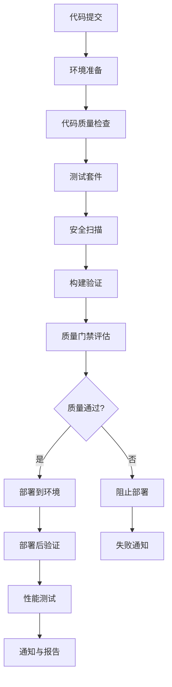

# LLMChat CI/CD架构指南

## 📋 目录
- [架构概述](#架构概述)
- [CI/CD流水线设计](#cicd流水线设计)
- [质量保证体系](#质量保证体系)
- [多环境部署策略](#多环境部署策略)
- [安全集成](#安全集成)
- [监控与告警](#监控与告警)
- [运维最佳实践](#运维最佳实践)

## 🏗️ 架构概述

### 设计原则
- **安全第一**: 零信任架构，多层安全防护
- **质量优先**: 严格的代码质量门禁和自动化测试
- **快速反馈**: 左移测试，尽早发现问题
- **可扩展性**: 支持微服务和多环境部署
- **可观测性**: 全链路监控和日志追踪

### 技术栈
- **CI/CD平台**: GitHub Actions
- **包管理**: pnpm workspace
- **构建工具**: TypeScript, Vite, ESBuild
- **测试框架**: Jest (后端), Vitest (前端), Playwright (E2E)
- **代码质量**: ESLint, Prettier, SonarQube
- **安全扫描**: Snyk, Semgrep, Gitleaks
- **容器化**: Docker, Kubernetes (可选)
- **监控**: Sentry, Prometheus, Grafana

## 🚀 CI/CD流水线设计

### 流水线阶段架构



### 触发条件
- **Push事件**: main/develop/release/* 分支
- **Pull Request**: 代码审查触发完整流水线
- **Release事件**: 版本发布触发生产部署
- **定时任务**: 每日安全扫描和质量检查
- **手动触发**: 支持环境选择和功能开关

## 🛡️ 质量保证体系

### 代码质量标准
```yaml
质量指标:
  TypeScript编译: 0错误 (零容忍)
  ESLint检查: 0错误，警告<5个
  测试覆盖率: ≥80% (核心模块100%)
  构建成功率: 100%
  代码复杂度: 圈复杂度≤10

质量门禁:
  开发环境: 质量分数≥70分
  测试环境: 质量分数≥80分
  生产环境: 质量分数≥90分
```

### 测试策略
1. **单元测试** (70%)
   - 后端API逻辑测试
   - 前端组件和Hook测试
   - 工具函数测试
   - 覆盖率要求: ≥80%

2. **集成测试** (20%)
   - API集成测试
   - 数据库集成测试
   - 第三方服务集成测试
   - 端到端业务流程测试

3. **E2E测试** (10%)
   - 用户核心流程测试
   - 跨浏览器兼容性测试
   - 性能基准测试
   - 可访问性测试

### 性能基准
```yaml
API性能:
  响应时间: P95 < 200ms
  吞吐量: > 1000 RPS
  错误率: < 0.1%
  并发处理: ≥100用户

前端性能:
  首屏加载: < 3s
  LCP: < 2.5s
  FID: < 100ms
  CLS: < 0.1
```

## 🌍 多环境部署策略

### 环境架构
```yaml
开发环境 (development):
  分支: develop
  域名: dev.llmchat.example.com
  数据库: PostgreSQL (开发实例)
  缓存: Redis (开发实例)
  特性: 开启调试日志，热重载

测试环境 (staging):
  分支: main
  域名: staging.llmchat.example.com
  数据库: PostgreSQL (测试实例)
  缓存: Redis (测试实例)
  特性: 生产级配置，完整测试

生产环境 (production):
  分支: main (tag)
  域名: llmchat.example.com
  数据库: PostgreSQL (高可用集群)
  缓存: Redis (集群模式)
  特性: 最高安全，性能优化
```

### 部署策略
1. **开发环境**: 自动部署 (develop分支推送)
2. **测试环境**: 自动部署 (main分支合并)
3. **生产环境**: 手动触发 + 自动验证

### 回滚机制
- **自动回滚**: 健康检查失败自动回滚
- **手动回滚**: 一键回滚到稳定版本
- **蓝绿部署**: 零停机时间部署
- **金丝雀发布**: 渐进式流量切换

## 🔒 安全集成

### 安全扫描层级
1. **依赖安全扫描**
   - Snyk漏洞扫描
   - npm audit安全审计
   - 许可证合规检查

2. **代码安全扫描**
   - Semgrep静态分析
   - 代码注入检测
   - 敏感信息泄露检查

3. **基础设施安全**
   - Docker镜像安全扫描
   - Kubernetes安全策略
   - 网络安全配置

4. **运行时安全**
   - WAF防护
   - 速率限制
   - 访问控制

### 安全配置
```yaml
安全策略:
  密钥管理: GitHub Secrets / HashiCorp Vault
  访问控制: RBAC + MFA
  网络安全: VPC + 防火墙规则
  数据加密: TLS 1.3 + AES-256
  审计日志: 90天保留期

合规要求:
  GDPR: 个人数据保护
  SOC 2: 安全控制
  ISO 27001: 信息安全管理
```

## 📊 监控与告警

### 监控体系架构
```yaml
应用监控:
  APM: Sentry + OpenTelemetry
  错误追踪: 实时错误收集和分析
  性能监控: 响应时间、吞吐量、错误率
  业务指标: 用户行为、功能使用统计

基础设施监控:
  服务器: Prometheus + Node Exporter
  数据库: PostgreSQL Exporter
  缓存: Redis Exporter
  容器: cAdvisor + Kube-state-metrics

日志管理:
  收集: Fluentd / Logstash
  存储: Elasticsearch
  分析: Kibana / Grafana
  告警: AlertManager
```

### 告警策略
```yaml
告警级别:
  P0 (紧急): 系统不可用，15分钟内响应
  P1 (高): 核心功能异常，1小时内响应
  P2 (中): 非核心功能异常，4小时内响应
  P3 (低): 性能下降，24小时内响应

通知渠道:
  即时通知: Slack / 钉钉 / 企业微信
  邮件通知: 详细告警信息
  短信通知: P0级别告警
  电话告警: P0级别持续告警
```

## 🔧 运维最佳实践

### 配置管理
- **环境变量管理**: 统一配置模板，环境特定覆盖
- **密钥管理**: 集中密钥存储，定期轮换
- **配置验证**: 部署前配置完整性检查
- **版本控制**: 配置变更可追溯

### 数据库管理
- **迁移管理**: 版本化数据库迁移脚本
- **备份策略**: 每日自动备份，异地存储
- **性能优化**: 查询优化，索引管理
- **容量规划**: 存储空间监控和扩展

### 故障处理
```yaml
故障响应流程:
  1. 故障检测: 自动监控告警
  2. 影响评估: 评估影响范围和严重程度
  3. 应急响应: 快速恢复服务
  4. 根因分析: 深入分析问题根源
  5. 改进措施: 制定预防措施
  6. 复盘总结: 团队经验分享

MTTR目标:
  检测时间: < 5分钟
  响应时间: < 15分钟
  修复时间: < 1小时
  验证时间: < 30分钟
```

### 容量规划
- **资源监控**: CPU、内存、磁盘、网络使用率
- **性能基准**: 建立性能基线和趋势分析
- **扩展策略**: 水平扩展和垂直扩展
- **成本优化**: 资源使用效率优化

## 📚 持续改进

### 质量指标追踪
- **部署频率**: 每周部署次数
- **变更失败率**: 部署失败百分比
- **平均恢复时间**: 故障恢复时间
- **变更前置时间**: 从提交到生产时间

### 流程优化
- **自动化程度**: 手动操作自动化
- **反馈循环**: 缩短问题发现到修复时间
- **知识管理**: 建立故障处理知识库
- **团队培训**: 定期技能培训和演练

## 🚀 未来规划

### 技术演进
- **云原生**: Kubernetes部署和管理
- **微服务架构**: 服务拆分和治理
- **AI辅助**: 智能测试和代码审查
- **边缘计算**: CDN和边缘节点部署

### 流程优化
- **GitOps**: 基于Git的运维自动化
- **ChatOps**: 聊天机器人运维集成
- **DevSecOps**: 安全左移和自动化
- **AIOps**: 智能运维和预测性维护

---

## 📞 支持与联系

- **文档**: [项目Wiki](https://github.com/your-org/llmchat/wiki)
- **问题反馈**: [GitHub Issues](https://github.com/your-org/llmchat/issues)
- **团队沟通**: 内部Slack频道 #llmchat-devops
- **紧急联系**: oncall@yourcompany.com

---

*最后更新: 2025-01-18*
*版本: v1.0.0*
*维护者: DevOps团队*