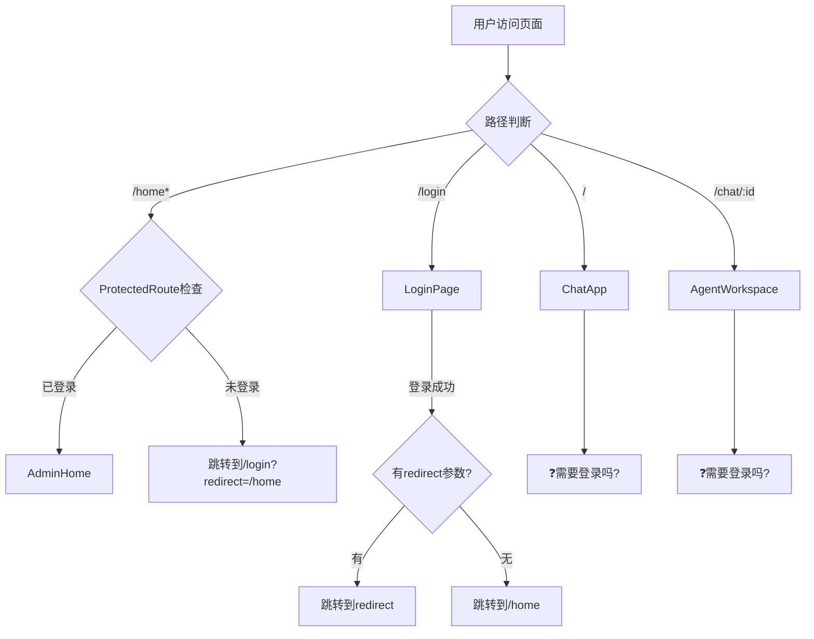

# 🔍 完整路由与状态管理全局分析

## 📋 分析目标

全面梳理整个项目的：
1. **路由配置**（前端所有页面）
2. **状态管理**（Zustand stores）
3. **认证逻辑**（登录、权限检查）
4. **页面跳转流程**（用户界面 vs 管理界面）
5. **问题点**（哪里可能导致重新加载或跳转错误）

---

## 🗺️ 路由配置分析

### 当前路由结构

```typescript
// frontend/src/App.tsx

<Routes>
  {/* 1. 用户聊天页面 - 根路径 */}
  <Route path="/" element={<ChatApp />} />
  
  {/* 2. 智能体工作区 - 带参数 */}
  <Route path="/chat/:agentId" element={<AgentWorkspace />} />
  
  {/* 3. 登录页面 - 带跳转逻辑 */}
  <Route path="/login" element={<LoginPageWrapper />} />
  
  {/* 4. 管理后台首页 - 需要登录 */}
  <Route path="/home" element={
    <ProtectedRoute>
      <AdminHome />
    </ProtectedRoute>
  } />
  
  {/* 5. 管理后台子页面 - 需要登录 */}
  <Route path="/home/:tab" element={
    <ProtectedRoute>
      <AdminHome />
    </ProtectedRoute>
  } />
  
  {/* 6. 404 - 重定向到用户聊天 */}
  <Route path="*" element={<Navigate to="/" replace />} />
</Routes>
```

### 路由分类

#### 🔓 公开路由（无需登录）
- `/` - 用户聊天页面（ChatApp）
- `/chat/:agentId` - 智能体工作区（AgentWorkspace）
- `/login` - 登录页面（LoginPage）

#### 🔒 受保护路由（需要登录）
- `/home` - 管理后台首页
- `/home/:tab` - 管理后台子页面（dashboard/users/analytics/etc）

---

## 🎯 关键问题：为什么用户聊天界面不需要登录？

### 问题1：ChatApp组件是否应该需要登录？

让我检查ChatApp的实现...

**待分析**：
1. ChatApp是否有认证检查？
2. 用户聊天是否需要token？
3. 是否应该添加ProtectedRoute？

### 问题2：智能体工作区是否需要登录？

**待分析**：
1. AgentWorkspace是否有认证检查？
2. 切换智能体是否需要token？
3. 是否应该添加ProtectedRoute？

---

## 📊 状态管理分析

### Zustand Stores列表

需要梳理以下stores：
1. `authStore.ts` - 认证状态（token、user、登录/登出）
2. `chatStore.ts` - 聊天状态（会话、消息、智能体切换）
3. `agentStore.ts` - 智能体状态（列表、当前选中）
4. 其他stores？

---

## 🔄 认证流程分析

### 当前认证流程



### 关键疑问

1. **用户聊天界面（/）是否需要登录？**
   - 如果需要：应该添加ProtectedRoute
   - 如果不需要：游客可以直接聊天吗？

2. **智能体工作区（/chat/:agentId）是否需要登录？**
   - 如果需要：应该添加ProtectedRoute
   - 如果不需要：游客可以使用智能体吗？

3. **管理员和普通用户的区别？**
   - 管理员：访问/home管理后台
   - 普通用户：访问/聊天界面
   - 是否有角色权限控制？

---

## 🚨 当前问题汇总

### 问题1：登录后显示"重新加载页面"
- **原因**：AdminHome缺少认证守卫
- **状态**：✅ 已修复（添加ProtectedRoute）

### 问题2：用户聊天界面的认证逻辑不清晰
- **原因**：ChatApp没有认证检查
- **状态**：❓待确认（是否需要登录？）

### 问题3：路由守卫不完整
- **原因**：只保护了/home，没有保护/和/chat/:agentId
- **状态**：❓待确认（是否需要保护？）

### 问题4：角色权限控制缺失
- **原因**：没有区分管理员和普通用户
- **状态**：❓待确认（是否需要角色控制？）

---

## 📝 下一步分析计划

1. ✅ 读取ChatApp组件，检查认证逻辑
2. ✅ 读取AgentWorkspace组件，检查认证逻辑
3. ✅ 读取所有Zustand stores，梳理状态管理
4. ✅ 检查API调用是否需要token
5. ✅ 确定哪些页面需要登录
6. ✅ 制定完整的路由守卫方案

---

**创建时间**: 2025-10-05 07:10  
**状态**: 分析中  
**优先级**: P0（影响整体架构）
