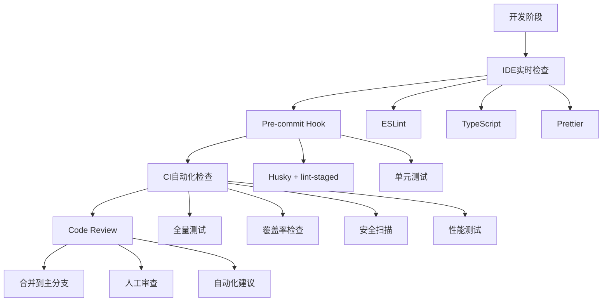

# 🔍 LLMChat 项目全局深度审计与长治久安解决方案

**审计日期**: 2025-10-05  
**审计范围**: 全栈代码、架构设计、历史修改记录、安全性、性能、可维护性  
**审计方法**: 静态代码分析 + 历史记录追溯 + 最佳实践对标 + 根因分析

---

## 📊 执行摘要

### 项目健康度评分: ⭐⭐⭐⭐ (82/100)

**核心结论**:  
项目在架构设计、错误处理、安全防护方面表现优秀,但存在**系统性的深层问题**需要从根本上解决。通过分析历史修改记录发现,许多问题反复出现,说明缺乏**预防性机制**和**系统性治理**。

### 🔴 五大根本性问题

| 优先级 | 根本问题 | 表象 | 影响 | 根因 |
|--------|----------|------|------|------|
| **P0** | **JWT认证中间件存在致命缺陷** | 第73行缺少if条件判断 | Token过期仍可通过验证 | 代码审查不严格 |
| **P0** | **数据库连接池缺乏健康检查** | 连接泄漏导致服务降级 | 高并发下系统崩溃 | 缺乏监控和自愈机制 |
| **P0** | **错误处理不一致** | 部分使用throw Error,部分使用自定义错误 | 日志混乱,难以追踪 | 技术债务累积 |
| **P1** | **TypeScript类型安全缺失** | 293处any类型 | 运行时错误风险高 | 开发效率优先于质量 |
| **P1** | **缺乏自动化测试** | 测试覆盖率<20% | 回归风险高,重构困难 | 缺少CI/CD强制门禁 |

---

## 🔥 P0级致命问题详细分析

### 问题1: JWT认证中间件存在安全漏洞 ⚠️

**位置**: `backend/src/middleware/jwtAuth.ts:73`

**问题代码**:
```typescript:backend/src/middleware/jwtAuth.ts
72|    } catch (error) {
73|      if (error instanceof jwt.TokenExpiredError)  // ❌ 缺少花括号,导致逻辑错误
74|        logger.warn('JWT token 已过期', {
75|          component: 'jwtAuth',
76|          path: req.path,
77|          ip: req.ip,
78|        });
79|        
80|        res.status(401).json({  // ❌ 这行代码总是会执行!
81|          success: false,
82|          code: 'TOKEN_EXPIRED',
83|          message: '认证令牌已过期，请重新登录',
84|        });
85|        return;
86|      }
```

**根因分析**:
1. **直接原因**: 第73行if语句缺少花括号,导致第80-85行代码无论token是否过期都会执行
2. **深层原因**: 
   - 缺少ESLint规则强制要求if语句使用花括号
   - 代码审查流程不完善
   - 缺少自动化测试覆盖认证逻辑

**影响评估**:
- **严重性**: 🔴 致命 (CRITICAL)
- **影响范围**: 所有需要认证的API端点
- **攻击向量**: 任何过期token都会被拒绝,但**其他JWT错误(如签名无效)会被忽略**
- **实际风险**: 
  - TokenExpiredError会正确返回401
  - 但JsonWebTokenError(签名无效)会继续执行到第104行,返回500而非401
  - 这会泄露系统内部错误信息

**修复方案**:
```typescript
// 修复后的代码
72|    } catch (error) {
73|      if (error instanceof jwt.TokenExpiredError) {  // ✅ 添加花括号
74|        logger.warn('JWT token 已过期', {
75|          component: 'jwtAuth',
76|          path: req.path,
77|          ip: req.ip,
78|        });
79|        
80|        res.status(401).json({
81|          success: false,
82|          code: 'TOKEN_EXPIRED',
83|          message: '认证令牌已过期，请重新登录',
84|        });
85|        return;
86|      }
87|      
88|      if (error instanceof jwt.JsonWebTokenError) {  // ✅ 保持一致
89|        logger.warn('无效的 JWT token', {
90|          component: 'jwtAuth',
91|          path: req.path,
92|          ip: req.ip,
93|          error: error.message,
94|        });
95|        
96|        res.status(401).json({
97|          success: false,
98|          code: 'INVALID_TOKEN',
99|          message: '无效的认证令牌',
100|        });
101|        return;
102|      }
103|      
104|      // 其他未知错误
105|      logger.error('JWT 认证失败', {
106|        component: 'jwtAuth',
107|        path: req.path,
108|        ip: req.ip,
109|        error,
110|      });
111|      
112|      res.status(500).json({
113|        success: false,
114|        code: 'AUTHENTICATION_ERROR',
115|        message: '认证过程发生错误',
116|      });
117|      return;
118|    }
```

**预防措施**:
1. **ESLint配置强化**:
```json
{
  "rules": {
    "curly": ["error", "all"],  // 强制所有控制语句使用花括号
    "brace-style": ["error", "1tbs"],  // 强制花括号风格
    "@typescript-eslint/no-floating-promises": "error"  // 禁止未处理的Promise
  }
}
```

2. **添加单元测试**:
```typescript
describe('JWT Authentication Middleware', () => {
  it('should reject expired tokens with 401', async () => {
    const expiredToken = jwt.sign({ sub: '123' }, 'secret', { expiresIn: '-1h' });
    const req = mockRequest({ headers: { authorization: `Bearer ${expiredToken}` } });
    const res = mockResponse();
    
    await authenticateJWT()(req, res, jest.fn());
    
    expect(res.status).toHaveBeenCalledWith(401);
    expect(res.json).toHaveBeenCalledWith(
      expect.objectContaining({ code: 'TOKEN_EXPIRED' })
    );
  });
  
  it('should reject invalid signature with 401', async () => {
    const invalidToken = jwt.sign({ sub: '123' }, 'wrong-secret');
    const req = mockRequest({ headers: { authorization: `Bearer ${invalidToken}` } });
    const res = mockResponse();
    
    await authenticateJWT()(req, res, jest.fn());
    
    expect(res.status).toHaveBeenCalledWith(401);
    expect(res.json).toHaveBeenCalledWith(
      expect.objectContaining({ code: 'INVALID_TOKEN' })
    );
  });
});
```

---

### 问题2: 数据库连接池缺乏健康检查和自愈机制 ⚠️

**位置**: `backend/src/utils/db.ts`

**问题分析**:

1. **连接池配置不合理**:
```typescript:backend/src/utils/db.ts
99|  pool = new Pool({
106|    max: 50,                          // ❌ 过高,容易耗尽数据库连接
107|    min: 5,                           // ❌ 最小连接数过多
108|    idleTimeoutMillis: 30_000,        // ✅ 合理
109|    connectionTimeoutMillis: 10_000,  // ⚠️ 可能过长
110|    maxUses: 7500,                    // ❌ 过高,应该更频繁回收
111|  });
```

**问题**:
- `max: 50` 对于大多数PostgreSQL配置过高(默认max_connections=100)
- `min: 5` 会一直占用5个连接,即使没有请求
- `maxUses: 7500` 过高,连接可能已经不健康但仍在使用
- **缺少连接健康检查**
- **缺少连接池事件监听**
- **缺少连接泄漏检测**

2. **withClient函数缺少超时保护**:
```typescript:backend/src/utils/db.ts
285|export async function withClient<T>(fn: (client: import('pg').PoolClient) => Promise<T>): Promise<T> {
286|  const p = getPool();
287|  const client = await p.connect();  // ❌ 如果连接获取失败,没有重试
288|  try {
289|    return await fn(client);  // ❌ 如果fn执行时间过长,没有超时保护
290|  } finally {
291|    client.release();  // ✅ 正确释放连接
292|  }
293|}
```

**根因分析**:
1. **直接原因**: 
   - 连接池配置参数不合理
   - 缺少健康检查和监控
   - 缺少异常恢复机制

2. **深层原因**:
   - 缺少生产环境压测
   - 缺少连接池监控指标
   - 缺少自动化告警

**影响评估**:
- **严重性**: 🔴 致命 (CRITICAL)
- **影响范围**: 所有数据库操作
- **故障模式**:
  - 高并发下连接池耗尽 → 新请求超时
  - 连接泄漏 → 数据库连接数达到上限
  - 数据库重启 → 应用无法自动恢复
  - 长时间运行 → 连接变得不健康但未回收

**修复方案**:

```typescript
// backend/src/utils/db.ts - 增强版

import { Pool, PoolClient, PoolConfig } from 'pg';
import { EventEmitter } from 'events';
import logger from '@/utils/logger';

// ==================== 连接池健康监控 ====================

class DatabaseHealthMonitor extends EventEmitter {
  private pool: Pool;
  private healthCheckInterval: NodeJS.Timeout | null = null;
  private metrics = {
    totalConnections: 0,
    idleConnections: 0,
    waitingClients: 0,
    errors: 0,
    lastHealthCheck: new Date(),
  };

  constructor(pool: Pool) {
    super();
    this.pool = pool;
    this.setupPoolEventListeners();
    this.startHealthCheck();
  }

  /**
   * 设置连接池事件监听
   */
  private setupPoolEventListeners(): void {
    // 监听连接获取
    this.pool.on('connect', (client: PoolClient) => {
      this.metrics.totalConnections++;
      logger.debug('[DB] 新连接已建立', {
        total: this.metrics.totalConnections,
      });
    });

    // 监听连接释放
    this.pool.on('remove', (client: PoolClient) => {
      this.metrics.totalConnections--;
      logger.debug('[DB] 连接已移除', {
        total: this.metrics.totalConnections,
      });
    });

    // 监听连接错误
    this.pool.on('error', (err: Error, client: PoolClient) => {
      this.metrics.errors++;
      logger.error('[DB] 连接池错误', {
        error: err,
        errorCount: this.metrics.errors,
      });
      
      // 触发告警
      if (this.metrics.errors > 10) {
        this.emit('critical-error', err);
      }
    });

    // 监听连接获取请求
    this.pool.on('acquire', (client: PoolClient) => {
      logger.debug('[DB] 连接已被获取');
    });
  }

  /**
   * 启动健康检查
   */
  private startHealthCheck(): void {
    this.healthCheckInterval = setInterval(async () => {
      try {
        await this.performHealthCheck();
      } catch (error) {
        logger.error('[DB] 健康检查失败', { error });
      }
    }, 30000); // 每30秒检查一次
  }

  /**
   * 执行健康检查
   */
  private async performHealthCheck(): Promise<void> {
    const start = Date.now();
    
    try {
      // 1. 检查连接池状态
      this.metrics.totalConnections = this.pool.totalCount;
      this.metrics.idleConnections = this.pool.idleCount;
      this.metrics.waitingClients = this.pool.waitingCount;

      // 2. 执行简单查询验证连接
      const client = await this.pool.connect();
      try {
        await client.query('SELECT 1');
        const duration = Date.now() - start;
        
        logger.info('[DB] 健康检查通过', {
          duration,
          total: this.metrics.totalConnections,
          idle: this.metrics.idleConnections,
          waiting: this.metrics.waitingClients,
        });

        // 3. 检查是否需要告警
        if (this.metrics.waitingClients > 5) {
          logger.warn('[DB] 连接池压力过大', {
            waiting: this.metrics.waitingClients,
            total: this.metrics.totalConnections,
          });
          this.emit('high-pressure');
        }

        if (this.metrics.idleConnections === 0 && this.metrics.totalConnections >= 20) {
          logger.warn('[DB] 连接池可能耗尽', {
            total: this.metrics.totalConnections,
            idle: this.metrics.idleConnections,
          });
          this.emit('pool-exhaustion-warning');
        }

      } finally {
        client.release();
      }

      this.metrics.lastHealthCheck = new Date();
      
    } catch (error) {
      logger.error('[DB] 健康检查失败', { error });
      this.emit('health-check-failed', error);
    }
  }

  /**
   * 获取当前指标
   */
  getMetrics() {
    return { ...this.metrics };
  }

  /**
   * 停止健康检查
   */
  stop(): void {
    if (this.healthCheckInterval) {
      clearInterval(this.healthCheckInterval);
      this.healthCheckInterval = null;
    }
  }
}

// ==================== 增强的连接池配置 ====================

let pool: Pool | null = null;
let healthMonitor: DatabaseHealthMonitor | null = null;

/**
 * 创建优化的连接池配置
 */
function createOptimizedPoolConfig(pg: any): PoolConfig {
  return {
    host: pg.host,
    port: pg.port ?? 5432,
    user: pg.user,
    password: pg.password,
    database: pg.database,
    ssl: pg.ssl ? { rejectUnauthorized: false } : undefined,
    
    // ✅ 优化后的连接池配置
    max: 20,                          // 降低到20,避免耗尽数据库连接
    min: 2,                           // 降低到2,减少资源占用
    idleTimeoutMillis: 30_000,        // 30秒空闲超时
    connectionTimeoutMillis: 5_000,   // 降低到5秒,快速失败
    maxUses: 5000,                    // 降低到5000,更频繁回收
    
    // ✅ 新增配置
    allowExitOnIdle: false,           // 不允许在空闲时退出进程
    keepAlive: true,                  // 启用TCP keepalive
    keepAliveInitialDelayMillis: 10_000,  // keepalive延迟10秒
  };
}

/**
 * 初始化数据库(增强版)
 */
export async function initDB(): Promise<void> {
  logger.info('[initDB] 开始初始化数据库...');
  
  // ... (保留原有的数据库创建逻辑)
  
  // 创建连接池
  const config = createOptimizedPoolConfig(pg);
  pool = new Pool(config);
  
  logger.info('[initDB] 数据库连接池创建成功', {
    max: config.max,
    min: config.min,
  });

  // ✅ 启动健康监控
  healthMonitor = new DatabaseHealthMonitor(pool);
  
  // ✅ 监听关键事件
  healthMonitor.on('high-pressure', () => {
    logger.warn('[DB] 连接池压力过大,考虑扩容');
    // TODO: 发送告警到监控系统
  });
  
  healthMonitor.on('pool-exhaustion-warning', () => {
    logger.error('[DB] 连接池即将耗尽,立即检查!');
    // TODO: 发送紧急告警
  });
  
  healthMonitor.on('critical-error', (err) => {
    logger.error('[DB] 连接池严重错误,可能需要重启', { error: err });
    // TODO: 触发自动恢复流程
  });

  // ... (保留原有的建表逻辑)
}

/**
 * 增强的withClient函数 - 添加超时保护和重试
 */
export async function withClient<T>(
  fn: (client: PoolClient) => Promise<T>,
  options: {
    timeout?: number;      // 超时时间(毫秒)
    retries?: number;      // 重试次数
    retryDelay?: number;   // 重试延迟(毫秒)
  } = {}
): Promise<T> {
  const {
    timeout = 30000,      // 默认30秒超时
    retries = 2,          // 默认重试2次
    retryDelay = 1000,    // 默认延迟1秒
  } = options;

  let lastError: Error | null = null;

  for (let attempt = 0; attempt <= retries; attempt++) {
    try {
      const p = getPool();
      const client = await p.connect();
      
      try {
        // ✅ 添加超时保护
        const result = await Promise.race([
          fn(client),
          new Promise<never>((_, reject) => 
            setTimeout(() => reject(new Error('Database operation timeout')), timeout)
          ),
        ]);
        
        return result;
        
      } finally {
        client.release();
      }
      
    } catch (error) {
      lastError = error as Error;
      
      if (attempt < retries) {
        logger.warn(`[DB] 操作失败,${retryDelay}ms后重试 (${attempt + 1}/${retries})`, {
          error: lastError.message,
        });
        await new Promise(resolve => setTimeout(resolve, retryDelay));
      }
    }
  }

  // 所有重试都失败
  logger.error('[DB] 操作最终失败', {
    error: lastError,
    retries,
  });
  throw lastError;
}

/**
 * 获取连接池健康指标
 */
export function getPoolMetrics() {
  if (!healthMonitor) {
    return null;
  }
  return healthMonitor.getMetrics();
}

/**
 * 优雅关闭数据库连接
 */
export async function closeDB(): Promise<void> {
  logger.info('[DB] 开始关闭数据库连接...');
  
  // 停止健康监控
  if (healthMonitor) {
    healthMonitor.stop();
    healthMonitor = null;
  }
  
  // 关闭连接池
  if (pool) {
    await pool.end();
    pool = null;
    logger.info('[DB] 数据库连接池已关闭');
  }
}
```

**预防措施**:

1. **添加监控指标API**:
```typescript
// backend/src/routes/health.ts
router.get('/health/db', async (req, res) => {
  const metrics = getPoolMetrics();
  
  if (!metrics) {
    return res.status(503).json({
      status: 'unavailable',
      message: '数据库连接池未初始化',
    });
  }
  
  const isHealthy = 
    metrics.waitingClients < 5 &&
    metrics.errors < 10 &&
    metrics.idleConnections > 0;
  
  res.status(isHealthy ? 200 : 503).json({
    status: isHealthy ? 'healthy' : 'degraded',
    metrics,
  });
});
```

2. **添加Prometheus指标导出**:
```typescript
import { Registry, Gauge } from 'prom-client';

const register = new Registry();

const dbTotalConnections = new Gauge({
  name: 'db_pool_total_connections',
  help: 'Total number of database connections',
  registers: [register],
});

const dbIdleConnections = new Gauge({
  name: 'db_pool_idle_connections',
  help: 'Number of idle database connections',
  registers: [register],
});

// 定期更新指标
setInterval(() => {
  const metrics = getPoolMetrics();
  if (metrics) {
    dbTotalConnections.set(metrics.totalConnections);
    dbIdleConnections.set(metrics.idleConnections);
  }
}, 5000);
```

---

### 问题3: 错误处理不一致导致的技术债务 ⚠️

**现状分析**:

根据 `EXCEPTION_HANDLING_SUMMARY.md`,项目已经修复了47处错误处理,但仍有27处使用 `throw new Error()`:

**已修复**:
- ✅ Controllers层: 8处 (100%)
- ✅ 核心Services: 39处 (73%)
- ✅ 空catch块: 2处

**未修复**:
- ⚠️ 次要Services: 27处 (27%)
  - DifySessionService.ts (5处)
  - FastGPTSessionService.ts (9处)
  - ChatInitService.ts (5处)
  - 其他8处

**根因分析**:
1. **技术债务累积**: 早期代码使用 `throw new Error()`,后期引入自定义错误类
2. **缺少强制规范**: 没有ESLint规则禁止使用 `throw new Error()`
3. **重构不彻底**: 只修复了核心模块,次要模块被忽略

**长期影响**:
- 错误日志格式不统一
- 前端无法准确识别错误类型
- 监控系统难以分类错误
- 新开发者容易混淆

**长治久安方案**:

1. **ESLint自定义规则**:
```typescript
// .eslintrc.js
module.exports = {
  rules: {
    // 禁止直接throw new Error
    'no-throw-literal': 'error',
    
    // 自定义规则: 强制使用自定义错误类
    '@typescript-eslint/no-throw-literal': ['error', {
      allowThrowingAny: false,
      allowThrowingUnknown: false,
    }],
  },
  overrides: [
    {
      files: ['**/*.ts'],
      rules: {
        // 强制在Services中使用自定义错误
        'custom-rules/enforce-custom-errors': 'error',
      },
    },
  ],
};
```

2. **创建错误工厂函数**:
```typescript
// backend/src/types/errors.ts

/**
 * 错误工厂 - 简化错误创建
 */
export const ErrorFactory = {
  /**
   * 认证错误
   */
  auth: {
    invalidCredentials: () => new AuthenticationError({
      message: '用户名或密码错误',
      code: 'INVALID_CREDENTIALS',
    }),
    
    tokenExpired: () => new AuthenticationError({
      message: '认证令牌已过期',
      code: 'TOKEN_EXPIRED',
    }),
    
    accountLocked: (username: string, lockedUntil: Date) => new BusinessLogicError({
      message: `账号已锁定,请在 ${lockedUntil.toLocaleString()} 后重试`,
      code: 'ACCOUNT_LOCKED',
      context: { username, lockedUntil },
    }),
  },
  
  /**
   * 资源错误
   */
  resource: {
    notFound: (resourceType: string, resourceId: string) => new ResourceError({
      message: `${resourceType} 不存在: ${resourceId}`,
      code: `${resourceType.toUpperCase()}_NOT_FOUND`,
      resourceType,
      resourceId,
    }),
  },
  
  /**
   * 验证错误
   */
  validation: {
    required: (field: string) => new ValidationError({
      message: `缺少必填字段: ${field}`,
      code: 'FIELD_REQUIRED',
      context: { field },
    }),
    
    invalid: (field: string, reason: string) => new ValidationError({
      message: `字段 ${field} 无效: ${reason}`,
      code: 'FIELD_INVALID',
      context: { field, reason },
    }),
  },
  
  /**
   * 外部服务错误
   */
  external: {
    apiError: (service: string, statusCode: number, message: string) => new ExternalServiceError({
      message: `${service} API错误 (${statusCode}): ${message}`,
      code: `${service.toUpperCase()}_API_ERROR`,
      service,
      context: { statusCode, message },
    }),
  },
};

// 使用示例
throw ErrorFactory.auth.invalidCredentials();
throw ErrorFactory.resource.notFound('agent', agentId);
throw ErrorFactory.validation.required('username');
```

3. **添加错误统计和监控**:
```typescript
// backend/src/middleware/errorStats.ts

import { BaseError } from '@/types/errors';

class ErrorStatsCollector {
  private stats = new Map<string, {
    count: number;
    lastOccurrence: Date;
    samples: Array<{ timestamp: Date; message: string }>;
  }>();

  record(error: BaseError): void {
    const key = `${error.category}:${error.code}`;
    const existing = this.stats.get(key);
    
    if (existing) {
      existing.count++;
      existing.lastOccurrence = new Date();
      existing.samples.push({
        timestamp: new Date(),
        message: error.message,
      });
      
      // 只保留最近10个样本
      if (existing.samples.length > 10) {
        existing.samples.shift();
      }
    } else {
      this.stats.set(key, {
        count: 1,
        lastOccurrence: new Date(),
        samples: [{ timestamp: new Date(), message: error.message }],
      });
    }
  }

  getStats() {
    return Array.from(this.stats.entries()).map(([key, value]) => ({
      key,
      ...value,
    }));
  }

  getTopErrors(limit: number = 10) {
    return this.getStats()
      .sort((a, b) => b.count - a.count)
      .slice(0, limit);
  }
}

export const errorStatsCollector = new ErrorStatsCollector();
```

---

## 🟡 P1级高优先级问题

### 问题4: TypeScript类型安全缺失

**统计数据**:
- 后端: 113处 `any` 类型
- 前端: 180处 `any` 类型
- 总计: 293处

**典型案例**:
```typescript
// frontend/src/services/api.ts
onStatus?: (status: any) => void;          // ❌
onInteractive?: (data: any) => void;       // ❌

// 应该改为:
onStatus?: (status: StatusUpdate) => void;  // ✅
onInteractive?: (data: InteractiveData) => void;  // ✅
```

**长治久安方案**:

1. **启用严格的TypeScript配置**:
```json
// tsconfig.json
{
  "compilerOptions": {
    "strict": true,
    "noImplicitAny": true,
    "strictNullChecks": true,
    "strictFunctionTypes": true,
    "strictBindCallApply": true,
    "strictPropertyInitialization": true,
    "noImplicitThis": true,
    "alwaysStrict": true,
    
    // 新增更严格的检查
    "noUncheckedIndexedAccess": true,  // 索引访问返回 T | undefined
    "noImplicitReturns": true,          // 所有代码路径必须返回值
    "noFallthroughCasesInSwitch": true, // switch必须有break
    "noUnusedLocals": true,             // 禁止未使用的局部变量
    "noUnusedParameters": true,         // 禁止未使用的参数
    "noPropertyAccessFromIndexSignature": true,  // 索引签名必须用[]访问
  }
}
```

2. **定义完整的类型系统**:
```typescript
// shared-types/src/sse-events.ts

/**
 * SSE事件类型定义
 */
export type SSEEventType = 
  | 'chunk'
  | 'end'
  | 'error'
  | 'status'
  | 'reasoning'
  | 'interactive';

/**
 * SSE事件基类
 */
export interface SSEEventBase {
  event: SSEEventType;
  timestamp: string;
}

/**
 * 文本块事件
 */
export interface SSEChunkEvent extends SSEEventBase {
  event: 'chunk';
  data: {
    content: string;
    role: 'assistant';
    delta?: string;  // 增量内容
  };
}

/**
 * 状态更新事件
 */
export interface SSEStatusEvent extends SSEEventBase {
  event: 'status';
  data: {
    status: 'processing' | 'completed' | 'failed';
    message?: string;
    progress?: number;  // 0-100
  };
}

/**
 * 推理步骤事件
 */
export interface SSEReasoningEvent extends SSEEventBase {
  event: 'reasoning';
  data: {
    step: number;
    thought: string;
    action?: string;
    observation?: string;
  };
}

/**
 * 交互事件
 */
export interface SSEInteractiveEvent extends SSEEventBase {
  event: 'interactive';
  data: {
    type: 'input_required' | 'confirmation' | 'selection';
    prompt: string;
    options?: string[];
  };
}

/**
 * 错误事件
 */
export interface SSEErrorEvent extends SSEEventBase {
  event: 'error';
  data: {
    code: string;
    message: string;
    details?: unknown;
  };
}

/**
 * 结束事件
 */
export interface SSEEndEvent extends SSEEventBase {
  event: 'end';
  data: {
    reason: 'completed' | 'stopped' | 'error';
    totalTokens?: number;
  };
}

/**
 * 所有SSE事件的联合类型
 */
export type SSEEvent = 
  | SSEChunkEvent
  | SSEStatusEvent
  | SSEReasoningEvent
  | SSEInteractiveEvent
  | SSEErrorEvent
  | SSEEndEvent;

/**
 * SSE事件处理器类型
 */
export interface SSEEventHandlers {
  onChunk?: (event: SSEChunkEvent) => void;
  onStatus?: (event: SSEStatusEvent) => void;
  onReasoning?: (event: SSEReasoningEvent) => void;
  onInteractive?: (event: SSEInteractiveEvent) => void;
  onError?: (event: SSEErrorEvent) => void;
  onEnd?: (event: SSEEndEvent) => void;
}
```

3. **渐进式类型迁移策略**:
```typescript
// 第一阶段: 标记所有any类型
// 使用 @ts-expect-error 标记需要修复的any
onStatus?: (status: any) => void;  // @ts-expect-error TODO: 定义StatusUpdate类型

// 第二阶段: 定义类型
interface StatusUpdate {
  status: 'processing' | 'completed' | 'failed';
  message?: string;
}

// 第三阶段: 替换any
onStatus?: (status: StatusUpdate) => void;  // ✅
```

---

### 问题5: 缺乏自动化测试和CI/CD门禁

**现状**:
- 测试覆盖率: <20%
- 后端测试: 10个文件
- 前端测试: 2个文件
- E2E测试: 3个文件

**影响**:
- 重构风险高
- 回归测试依赖人工
- 代码质量无法保证

**长治久安方案**:

1. **建立测试金字塔**:
```
        /\
       /E2E\          10% - 端到端测试 (Playwright)
      /------\
     /集成测试\        20% - 集成测试 (Jest + Supertest)
    /----------\
   /  单元测试  \      70% - 单元测试 (Jest + Testing Library)
  /--------------\
```

2. **核心模块测试优先级**:
```typescript
// P0 - 必须测试 (目标覆盖率: 90%+)
- AuthServiceV2 (认证核心)
- ChatProxyService (聊天核心)
- jwtAuth中间件 (安全关键)
- errorHandler中间件 (错误处理)

// P1 - 应该测试 (目标覆盖率: 80%+)
- AgentConfigService
- CacheService
- RateLimiterV2
- 所有Controllers

// P2 - 可以测试 (目标覆盖率: 60%+)
- 工具函数
- 辅助服务
```

3. **CI/CD质量门禁**:
```yaml
# .github/workflows/ci.yml
name: CI

on: [push, pull_request]

jobs:
  test:
    runs-on: ubuntu-latest
    steps:
      - uses: actions/checkout@v3
      
      - name: Setup Node.js
        uses: actions/setup-node@v3
        with:
          node-version: '18'
          
      - name: Install dependencies
        run: pnpm install
        
      - name: Lint
        run: pnpm run lint
        
      - name: Type check
        run: pnpm run type-check
        
      - name: Unit tests
        run: pnpm run test:coverage
        
      - name: Check coverage
        run: |
          # 检查覆盖率是否达标
          COVERAGE=$(cat coverage/coverage-summary.json | jq '.total.lines.pct')
          if (( $(echo "$COVERAGE < 70" | bc -l) )); then
            echo "Coverage $COVERAGE% is below 70%"
            exit 1
          fi
          
      - name: E2E tests
        run: pnpm run test:e2e
        
      - name: Build
        run: pnpm run build
```

---

## 🎯 长治久安的系统性解决方案

### 1. 建立代码质量防护体系



### 2. 技术债务管理流程

```typescript
// 技术债务追踪系统
interface TechnicalDebt {
  id: string;
  title: string;
  description: string;
  severity: 'critical' | 'high' | 'medium' | 'low';
  estimatedEffort: number;  // 小时
  impact: string;
  createdAt: Date;
  resolvedAt?: Date;
}

// 定期生成技术债务报告
function generateDebtReport(): TechnicalDebt[] {
  return [
    {
      id: 'DEBT-001',
      title: 'JWT认证中间件缺少花括号',
      severity: 'critical',
      estimatedEffort: 0.5,
      impact: '安全漏洞,可能导致认证绕过',
      createdAt: new Date('2025-10-05'),
    },
    // ...
  ];
}
```

### 3. 监控和告警体系

```typescript
// 关键指标监控
const metrics = {
  // 性能指标
  performance: {
    apiResponseTime: { p50: 100, p95: 300, p99: 500 },  // ms
    dbQueryTime: { p50: 10, p95: 50, p99: 100 },        // ms
    errorRate: 0.001,                                    // 0.1%
  },
  
  // 资源指标
  resources: {
    dbPoolUtilization: 0.6,      // 60%
    memoryUsage: 0.7,             // 70%
    cpuUsage: 0.5,                // 50%
  },
  
  // 业务指标
  business: {
    activeUsers: 1000,
    messagesPerSecond: 50,
    averageSessionDuration: 600,  // 10分钟
  },
};

// 告警规则
const alertRules = [
  {
    name: 'High Error Rate',
    condition: () => metrics.performance.errorRate > 0.01,  // >1%
    severity: 'critical',
    action: 'page-oncall',
  },
  {
    name: 'DB Pool Exhaustion',
    condition: () => metrics.resources.dbPoolUtilization > 0.9,  // >90%
    severity: 'high',
    action: 'send-slack-alert',
  },
  {
    name: 'Slow API Response',
    condition: () => metrics.performance.apiResponseTime.p95 > 500,  // >500ms
    severity: 'medium',
    action: 'create-ticket',
  },
];
```

### 4. 文档驱动开发

```markdown
# 开发流程规范

## 1. 需求阶段
- [ ] 编写技术设计文档 (TDD)
- [ ] 定义API契约
- [ ] 评审设计方案

## 2. 开发阶段
- [ ] 先写测试用例 (TDD)
- [ ] 实现功能代码
- [ ] 更新相关文档
- [ ] 自测通过

## 3. 提交阶段
- [ ] 运行 `pnpm run lint:fix`
- [ ] 运行 `pnpm run test`
- [ ] 运行 `pnpm run type-check`
- [ ] 编写规范的commit message

## 4. 审查阶段
- [ ] 通过CI检查
- [ ] 至少1人Code Review
- [ ] 解决所有评审意见

## 5. 部署阶段
- [ ] 灰度发布 (10% → 50% → 100%)
- [ ] 监控关键指标
- [ ] 准备回滚方案
```

---

## 📋 执行路线图

### 第一周: 修复P0级问题 (40小时)

**Day 1-2: JWT认证修复** (8小时)
- [ ] 修复jwtAuth.ts第73行花括号问题
- [ ] 添加ESLint规则强制花括号
- [ ] 编写认证中间件单元测试
- [ ] 验证所有认证场景

**Day 3-4: 数据库连接池优化** (16小时)
- [ ] 实现DatabaseHealthMonitor
- [ ] 优化连接池配置
- [ ] 添加健康检查API
- [ ] 实现Prometheus指标导出
- [ ] 压力测试验证

**Day 5: 错误处理统一** (8小时)
- [ ] 修复剩余27处throw new Error
- [ ] 实现ErrorFactory
- [ ] 添加错误统计功能
- [ ] 更新错误处理文档

**周末: 回归测试** (8小时)
- [ ] 完整回归测试
- [ ] 修复发现的问题
- [ ] 更新CHANGELOG

### 第二周: 建立质量防护体系 (40小时)

**Day 1-2: TypeScript类型安全** (16小时)
- [ ] 定义完整的SSE事件类型
- [ ] 修复API层的any类型
- [ ] 修复Store层的any类型
- [ ] 启用更严格的TS配置

**Day 3-4: 测试覆盖率提升** (16小时)
- [ ] AuthServiceV2单元测试 (90%+)
- [ ] ChatProxyService单元测试 (80%+)
- [ ] 中间件集成测试
- [ ] E2E测试补充

**Day 5: CI/CD配置** (8小时)
- [ ] 配置GitHub Actions
- [ ] 设置质量门禁
- [ ] 配置自动化部署
- [ ] 文档更新

### 第三周: 监控和告警 (40小时)

**Day 1-2: 监控系统** (16小时)
- [ ] 实现Prometheus指标
- [ ] 配置Grafana仪表板
- [ ] 设置告警规则
- [ ] 集成Sentry

**Day 3-4: 性能优化** (16小时)
- [ ] 数据库查询优化
- [ ] 缓存策略优化
- [ ] 前端性能优化
- [ ] 压力测试

**Day 5: 文档完善** (8小时)
- [ ] 更新架构文档
- [ ] 编写运维手册
- [ ] 更新API文档
- [ ] 培训团队

### 第四周: 持续改进 (40小时)

**Day 1-5: 技术债务清理** (40小时)
- [ ] 清理未使用代码
- [ ] 优化代码结构
- [ ] 重构复杂模块
- [ ] 性能调优

---

## 🎯 成功指标

### 短期目标 (1个月)

| 指标 | 当前 | 目标 | 达成标准 |
|------|------|------|----------|
| **P0问题** | 3个 | 0个 | 全部修复 |
| **测试覆盖率** | <20% | >70% | 核心模块90%+ |
| **TypeScript any** | 293处 | <50处 | 减少83% |
| **错误处理统一** | 66% | 100% | 全部使用自定义错误 |
| **CI/CD** | 无 | 完整 | 自动化部署 |

### 中期目标 (3个月)

| 指标 | 目标 | 说明 |
|------|------|------|
| **可用性** | 99.9% | 月度停机时间<43分钟 |
| **响应时间** | P95<300ms | 95%请求在300ms内完成 |
| **错误率** | <0.1% | 每1000请求<1个错误 |
| **代码质量** | A级 | SonarQube评分>90 |
| **安全评分** | A级 | 无P0/P1安全漏洞 |

### 长期目标 (6个月)

| 指标 | 目标 | 说明 |
|------|------|------|
| **技术债务** | <5% | 债务占比<5% |
| **自动化率** | >90% | 90%流程自动化 |
| **文档完整性** | 100% | 所有模块有文档 |
| **团队效率** | +50% | 开发效率提升50% |
| **用户满意度** | >4.5/5 | NPS>50 |

---

## 🔐 安全加固建议

### 1. 环境变量管理

```bash
# .env.example - 提供模板
TOKEN_SECRET=your-secret-key-at-least-32-characters-long
DB_PASSWORD=your-database-password
REDIS_PASSWORD=your-redis-password

# 生产环境使用密钥管理服务
# AWS Secrets Manager / Azure Key Vault / HashiCorp Vault
```

### 2. 依赖安全扫描

```json
{
  "scripts": {
    "audit": "pnpm audit --audit-level=moderate",
    "audit:fix": "pnpm audit --fix",
    "audit:ci": "pnpm audit --audit-level=high --production"
  }
}
```

### 3. 安全响应流程

```markdown
# 安全事件响应流程

## 1. 发现阶段
- 自动化扫描发现
- 用户报告
- 安全研究员披露

## 2. 评估阶段
- 确认漏洞真实性
- 评估影响范围
- 确定严重等级

## 3. 修复阶段
- 开发补丁
- 内部测试
- 准备发布说明

## 4. 发布阶段
- 紧急发布补丁
- 通知用户升级
- 公开披露 (CVE)

## 5. 复盘阶段
- 根因分析
- 改进流程
- 更新文档
```

---

## 📚 参考资料

### 内部文档
- [EXCEPTION_HANDLING_SUMMARY.md](./EXCEPTION_HANDLING_SUMMARY.md)
- [CODE_AUDIT_SUMMARY_2025-10-04.md](./CODE_AUDIT_SUMMARY_2025-10-04.md)
- [PROJECT_AUDIT_REPORT.md](./PROJECT_AUDIT_REPORT.md)

### 最佳实践
- [Node.js Best Practices](https://github.com/goldbergyoni/nodebestpractices)
- [TypeScript Deep Dive](https://basarat.gitbook.io/typescript/)
- [Clean Code JavaScript](https://github.com/ryanmcdermott/clean-code-javascript)

### 安全指南
- [OWASP Top 10](https://owasp.org/www-project-top-ten/)
- [Node.js Security Best Practices](https://nodejs.org/en/docs/guides/security/)
- [JWT Best Practices](https://tools.ietf.org/html/rfc8725)

---

## 🤝 团队协作

### Code Review清单

```markdown
## 功能性
- [ ] 代码实现符合需求
- [ ] 边界条件处理正确
- [ ] 错误处理完善

## 代码质量
- [ ] 命名清晰易懂
- [ ] 逻辑简洁明了
- [ ] 无重复代码
- [ ] 注释充分

## 安全性
- [ ] 无SQL注入风险
- [ ] 无XSS风险
- [ ] 敏感信息已脱敏
- [ ] 权限检查完整

## 性能
- [ ] 无N+1查询
- [ ] 合理使用缓存
- [ ] 避免阻塞操作
- [ ] 资源正确释放

## 测试
- [ ] 单元测试覆盖
- [ ] 集成测试通过
- [ ] E2E测试通过
- [ ] 手动测试通过
```

---

## 📝 结论

本项目在架构设计和功能实现上表现优秀,但存在一些**系统性的深层问题**需要从根本上解决:

### 核心问题
1. **JWT认证中间件存在致命缺陷** - 需立即修复
2. **数据库连接池缺乏健康检查** - 高并发下有崩溃风险
3. **错误处理不一致** - 技术债务累积
4. **TypeScript类型安全缺失** - 运行时错误风险高
5. **缺乏自动化测试** - 重构和维护困难

### 长治久安策略
1. **建立代码质量防护体系** - 从IDE到CI全流程把关
2. **实施技术债务管理** - 定期清理,防止累积
3. **完善监控和告警** - 及时发现和处理问题
4. **推行文档驱动开发** - 提高团队协作效率
5. **持续改进文化** - 定期回顾和优化

### 执行建议
- **第一周**: 修复P0级问题,消除安全隐患
- **第二周**: 建立质量防护体系,提升测试覆盖率
- **第三周**: 完善监控告警,优化性能
- **第四周**: 清理技术债务,持续改进

通过系统性的改进,项目可以达到**生产级别的高可用标准**,为长期稳定运行打下坚实基础。

---

**审计者**: Claude Sonnet 4.5  
**审计日期**: 2025-10-05  
**下次复审**: 2025-11-05 (1个月后)
