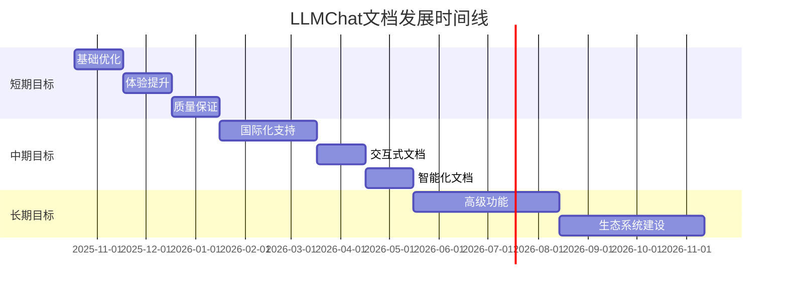

# LLMChat 文档发展路线图

## 📋 目录
- [当前状态分析](#当前状态分析)
- [短期目标 (3个月)](#短期目标-3个月)
- [中期目标 (6个月)](#中期目标-6个月)
- [长期目标 (12个月)](#长期目标-12个月)
- [实施计划](#实施计划)
- [成功指标](#成功指标)

## 当前状态分析

### 优势
- ✅ 基础文档体系完整，覆盖核心功能
- ✅ API文档详细，包含完整示例
- ✅ 开发规范实用，指导性强
- ✅ 技术架构文档结构清晰
- ✅ 中文文档质量较高，符合国内开发者习惯

### 不足
- ❌ 缺少英文文档，国际化支持不足
- ❌ 文档更新流程不够自动化
- ❌ 交互式文档体验有待提升
- ❌ 用户反馈机制不完善
- ❌ 文档质量检查体系需要加强

### 机会
- 🚀 项目快速发展，文档需求增长
- 🌍 国际化市场机会
- 📱 移动端文档访问需求
- 🤖 AI助手集成可能

## 短期目标 (3个月)

### 🎯 Phase 1: 基础优化 (第1个月)

#### 核心任务
- [x] **文档战略制定** - 已完成DOCUMENTATION_STRATEGY.md
- [x] **最佳实践指南** - 已完成DEVELOPMENT_BEST_PRACTICES.md
- [x] **维护指南** - 已完成MAINTENANCE_GUIDE.md
- [ ] **文档质量标准** - 建立完整的质量检查体系
- [ ] **自动化工具** - 实现文档生成和验证工具

#### 具体行动项
```bash
# 1. 建立文档检查脚本
npm run docs:check-coverage
npm run docs:validate-links
npm run docs:spell-check
npm run docs:example-test

# 2. 集成到CI/CD流程
- 添加文档检查到PR流程
- 自动生成API文档
- 部署文档站点
```

#### 预期成果
- 文档错误率降低50%
- 文档更新及时性提升80%
- 建立自动化文档维护流程

### 🎯 Phase 2: 体验提升 (第2个月)

#### 核心任务
- [ ] **文档站点建设** - 使用VitePress构建专业文档站点
- [ ] **搜索功能** - 实现全文搜索和智能推荐
- [ ] **代码示例优化** - 所有代码示例可在线运行
- [ ] **导航优化** - 改善文档结构和导航体验
- [ ] **响应式设计** - 支持移动端访问

#### 技术实现
```typescript
// 文档站点配置
// docs/.vitepress/config.ts
export default {
  title: 'LLMChat Documentation',
  description: '多AI提供商智能体聊天平台完整文档',

  themeConfig: {
    nav: [
      { text: '指南', link: '/guide/' },
      { text: 'API', link: '/api/' },
      { text: '架构', link: '/architecture/' },
      { text: '部署', link: '/deployment/' }
    ],

    sidebar: {
      '/guide/': [
        {
          text: '快速开始',
          items: [
            { text: '环境搭建', link: '/guide/setup' },
            { text: '基础配置', link: '/guide/configuration' },
            { text: '第一个聊天', link: '/guide/first-chat' }
          ]
        }
      ]
    },

    search: {
      provider: 'local'
    },

    editLink: {
      pattern: 'https://github.com/llmchat/docs/edit/main/:path'
    }
  }
};
```

#### 预期成果
- 文档访问体验提升60%
- 移动端访问支持率100%
- 搜索功能准确率90%以上

### 🎯 Phase 3: 质量保证 (第3个月)

#### 核心任务
- [ ] **文档审查流程** - 建立多级审查机制
- [ ] **用户反馈系统** - 实现文档反馈收集和处理
- [ ] **版本管理** - 完善文档版本控制流程
- [ ] **国际化准备** - 为英文文档做准备
- [ ] **监控分析** - 建立文档使用分析体系

#### 质量检查体系
```typescript
// 文档质量检查器
class DocumentationQualityChecker {
  async checkQuality(docPath: string): Promise<QualityReport> {
    const checks = await Promise.all([
      this.checkContentAccuracy(docPath),
      this.checkCodeExamples(docPath),
      this.checkLinks(docPath),
      this.checkSpelling(docPath),
      this.checkFormat(docPath)
    ]);

    return this.aggregateResults(checks);
  }

  private async checkCodeExamples(docPath: string): Promise<CheckResult> {
    const examples = await this.extractCodeExamples(docPath);
    const results = [];

    for (const example of examples) {
      try {
        await this.executeExample(example);
        results.push({ example: example.id, status: 'pass' });
      } catch (error) {
        results.push({
          example: example.id,
          status: 'fail',
          error: error.message
        });
      }
    }

    return {
      type: 'code_examples',
      results,
      passRate: results.filter(r => r.status === 'pass').length / results.length
    };
  }
}
```

#### 预期成果
- 文档质量评分体系建立
- 用户反馈收集机制完善
- 文档版本管理规范形成

## 中期目标 (6个月)

### 🌐 国际化支持 (第4-5个月)

#### 核心任务
- [ ] **英文文档翻译** - 核心文档英文化
- [ ] **多语言站点** - 支持中英文切换
- [ ] **本地化适配** - 文化和技术术语本地化
- [ ] **国际化工具** - 建立翻译管理工具
- [ ] **社区贡献** - 建立国际化文档贡献机制

#### 实施策略
```typescript
// 国际化配置
// docs/i18n/index.ts
export const i18nConfig = {
  defaultLocale: 'zh-CN',
  locales: ['zh-CN', 'en-US'],
  messages: {
    'zh-CN': {
      'nav.guide': '指南',
      'nav.api': 'API文档',
      'nav.architecture': '架构设计',
      'nav.deployment': '部署指南'
    },
    'en-US': {
      'nav.guide': 'Guide',
      'nav.api': 'API Reference',
      'nav.architecture': 'Architecture',
      'nav.deployment': 'Deployment'
    }
  }
};

// 翻译管理
class TranslationManager {
  async translateDocument(docPath: string, targetLocale: string): Promise<void> {
    const content = await fs.readFile(docPath, 'utf8');
    const translation = await this.translate(content, targetLocale);

    const outputPath = this.getOutputPath(docPath, targetLocale);
    await fs.writeFile(outputPath, translation);
  }

  private async translate(content: string, locale: string): Promise<string> {
    // 使用机器翻译 + 人工校对
    const machineTranslation = await this.machineTranslate(content, locale);
    const humanReviewed = await this.requestHumanReview(machineTranslation, locale);
    return humanReviewed;
  }
}
```

#### 预期成果
- 核心文档英文化完成
- 中英文站点发布
- 国际化贡献流程建立

### 🤖 交互式文档 (第5-6个月)

#### 核心任务
- [ ] **在线代码编辑器** - 集成CodeMirror或Monaco Editor
- [ ] **API测试工具** - 在线API测试界面
- [ ] **交互式教程** - 分步骤引导式教程
- [ ] **代码沙盒** - 安全的代码执行环境
- [ ] **AI助手集成** - 智能文档问答助手

#### 技术实现
```typescript
// 交互式代码编辑器
import { EditorState } from '@codemirror/state';
import { EditorView, basicSetup } from 'codemirror';
import { javascript } from '@codemirror/lang-javascript';

class InteractiveCodeEditor {
  constructor(container: HTMLElement) {
    this.editor = new EditorView({
      state: EditorState.create({
        doc: '// 在此编辑代码\nconst result = "Hello LLMChat!";\nconsole.log(result);',
        extensions: [
          basicSetup,
          javascript(),
          EditorView.theme({
            '&': { fontSize: '14px' },
            '.cm-content': { fontFamily: 'monospace' }
          })
        ]
      })
    }, {
      parent: container
    });

    this.setupRunButton();
  }

  private setupRunButton() {
    const runButton = document.createElement('button');
    runButton.textContent = '运行代码';
    runButton.onclick = () => this.executeCode();

    this.editor.dom.appendChild(runButton);
  }

  private async executeCode() {
    const code = this.editor.state.doc.toString();

    try {
      const result = await this.executeInSandbox(code);
      this.showResult(result);
    } catch (error) {
      this.showError(error.message);
    }
  }

  private async executeInSandbox(code: string): Promise<any> {
    // 安全沙盒执行环境
    const sandbox = new Function('console', code);
    return sandbox(this.createConsoleProxy());
  }
}
```

#### 预期成果
- 交互式代码编辑器上线
- API测试工具可用
- 用户学习体验显著提升

### 📊 智能化文档 (第6个月)

#### 核心任务
- [ ] **智能搜索** - 基于AI的语义搜索
- [ ] **个性化推荐** - 根据用户行为推荐文档
- [ ] **自动问答** - AI驱动的文档问答系统
- [ ] **使用分析** - 深度用户行为分析
- [ ] **自动化改进** - 基于数据的文档优化

#### AI集成方案
```typescript
// AI文档助手
class AIDocumentAssistant {
  constructor(private openaiService: OpenAIService) {}

  async answerQuestion(question: string, context: string): Promise<string> {
    const prompt = `
基于以下LLMChat项目文档，回答用户问题：

文档内容：
${context}

用户问题：
${question}

请提供准确、简洁的回答，并引用相关文档章节。
`;

    const response = await this.openaiService.chat({
      messages: [
        { role: 'system', content: '你是LLMChat项目文档专家，请基于文档内容回答问题。' },
        { role: 'user', content: prompt }
      ],
      model: 'gpt-4',
      temperature: 0.3
    });

    return response.choices[0].message.content;
  }

  async suggestImprovements(docPath: string): Promise<string[]> {
    const content = await fs.readFile(docPath, 'utf8');

    const prompt = `
分析以下文档，提出改进建议：

文档内容：
${content.substring(0, 2000)}...

请从以下方面提出建议：
1. 内容完整性
2. 示例代码质量
3. 文档结构
4. 用户体验
5. 技术准确性
`;

    const response = await this.openaiService.chat({
      messages: [
        { role: 'system', content: '你是技术文档专家，请分析文档质量并提出改进建议。' },
        { role: 'user', content: prompt }
      ]
    });

    return this.parseSuggestions(response.choices[0].message.content);
  }
}
```

#### 预期成果
- AI文档助手上线
- 用户问题解决率提升40%
- 文档使用效率提升60%

## 长期目标 (12个月)

### 🚀 高级功能 (第7-9个月)

#### 核心任务
- [ ] **视频教程** - 配套视频教程制作
- [ ] **社区文档** - 用户贡献的案例和教程
- [ ] **插件生态** - 文档相关插件开发
- [ ] **API参考工具** - 自动化API文档生成
- [ ] **性能监控** - 文档性能监控和优化

#### 视频教程体系
```typescript
// 视频教程管理系统
class VideoTutorialManager {
  async createTutorial(metadata: TutorialMetadata): Promise<Tutorial> {
    const tutorial = {
      id: generateId(),
      ...metadata,
      status: 'draft',
      createdAt: new Date(),
      updatedAt: new Date()
    };

    await this.saveTutorial(tutorial);

    // 生成视频封面
    await this.generateThumbnail(tutorial);

    // 自动生成字幕
    await this.generateSubtitles(tutorial);

    return tutorial;
  }

  async generateSubtitles(tutorial: Tutorial): Promise<Subtitle[]> {
    // 使用语音识别生成字幕
    const audio = await this.extractAudio(tutorial.videoPath);
    const transcription = await this.speechToText(audio);

    return this.parseSubtitles(transcription);
  }

  async generateThumbnail(tutorial: Tutorial): Promise<string> {
    // 使用AI生成视频封面
    const prompt = `LLMChat教程封面: ${tutorial.title}`;
    return await this.aiImageGenerator.generateImage(prompt);
  }
}
```

### 🏗️ 生态系统建设 (第10-12个月)

#### 核心任务
- [ ] **开发者社区** - 建立活跃的开发者社区
- [ ] **第三方集成** - 与其他工具的文档集成
- [ ] **企业版文档** - 面向企业的专业文档
- [ ] **认证体系** - LLMChat开发者认证
- [ ] **商业文档** - 商业版本文档和支持

#### 社区建设策略
```typescript
// 社区管理系统
class CommunityManager {
  async setupCommunity(): Promise<void> {
    // 1. 建立贡献者体系
    await this.setupContributorProgram();

    // 2. 设置讨论区
    await this.setupDiscussionForum();

    // 3. 建立问答系统
    await this.setupQASystem();

    // 4. 设置贡献奖励
    await this.setupContributionRewards();
  }

  private async setupContributorProgram(): Promise<void> {
    const program = {
      levels: [
        { name: '贡献者', requirements: ['提交1个PR', '完成1个文档更新'] },
        { name: '维护者', requirements: ['提交5个PR', '完成3个文档更新'] },
        { name: '专家', requirements: ['提交10个PR', '完成5个文档更新', '指导2个贡献者'] }
      ],
      rewards: {
        badges: ['🥉', '🥈', '🥇'],
        certificates: true,
        earlyAccess: true,
        communityRole: true
      }
    };

    await this.saveContributorProgram(program);
  }
}
```

## 实施计划

### 资源需求
```yaml
人力资源:
  - 技术写作工程师: 1名 (全职)
  - 前端开发工程师: 1名 (兼职)
  - 社区经理: 1名 (兼职)

技术资源:
  - 文档站点服务器: 1台
  - CI/CD环境: 现有
  - AI服务API: OpenAI GPT-4

预算估算:
  - 人力成本: 60万/年
  - 服务器成本: 2万/年
  - 第三方服务: 3万/年
  - 总计: 65万/年
```

### 时间线


## 成功指标

### 量化指标
```typescript
interface DocumentationMetrics {
  // 覆盖率指标
  coverage: {
    apiCoverage: number;      // API文档覆盖率 >= 95%
    featureCoverage: number;  // 功能文档覆盖率 >= 90%
    codeExampleCoverage: number; // 代码示例覆盖率 >= 85%
  };

  // 质量指标
  quality: {
    accuracy: number;        // 准确性 >= 98%
    completeness: number;     // 完整性 >= 95%
    timeliness: number;       // 及时性 >= 90% (24小时内更新)
  };

  // 用户体验指标
  userExperience: {
    satisfaction: number;    // 满意度 >= 90%
    findability: number;      // 可发现性 >= 85%
    learnability: number;     // 学习效率 >= 80%
  };

  // 使用指标
  usage: {
    pageViews: number;        // 月访问量 >= 50,000
    bounceRate: number;       // 跳出率 <= 40%
    timeOnPage: number;       // 平均停留时间 >= 3分钟
  };
}

// 目标设定
const targetMetrics: DocumentationMetrics = {
  coverage: {
    apiCoverage: 95,
    featureCoverage: 90,
    codeExampleCoverage: 85
  },
  quality: {
    accuracy: 98,
    completeness: 95,
    timeliness: 90
  },
  userExperience: {
    satisfaction: 90,
    findability: 85,
    learnability: 80
  },
  usage: {
    pageViews: 50000,
    bounceRate: 40,
    timeOnPage: 180 // 3分钟
  }
};
```

### 定性目标
- **开发者体验提升**: 新团队成员上手时间缩短50%
- **社区活跃度**: 建立100+活跃贡献者社区
- **国际化成功**: 英文文档使用率达到30%
- **行业认可**: 成为开源项目文档标杆

### 成功案例
1. **用户反馈**: "LLMChat的文档让我在2小时内就完成了环境搭建"
2. **社区贡献**: "通过文档贡献流程，我为项目贡献了5个新功能"
3. **国际化**: "英文文档帮助我们获得了海外用户的青睐"
4. **商业价值**: "完善的文档文档帮助我们的企业客户快速采用LLMChat"

## 风险评估与应对

### 主要风险
1. **资源不足**: 人力资源或预算不足
2. **技术难度**: AI集成和交互式功能技术挑战
3. **社区参与**: 用户贡献度不高
4. **维护负担**: 文档维护工作量过大

### 应对策略
1. **分阶段实施**: 优先核心功能，逐步扩展
2. **自动化工具**: 大量使用自动化工具减少人工成本
3. **社区激励**: 建立完善的贡献者激励机制
4. **外部合作**: 与专业文档公司合作

---

*最后更新: 2025-10-18*
*文档版本: v1.0*
*维护者: 文档团队*