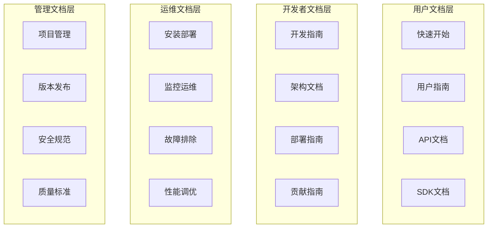

# LLMChat 文档战略与标准

## 📋 目录
- [文档战略目标](#文档战略目标)
- [文档架构设计](#文档架构设计)
- [文档标准规范](#文档标准规范)
- [维护更新机制](#维护更新机制)
- [质量保证体系](#质量保证体系)
- [工具链建设](#工具链建设)

## 文档战略目标

### 核心目标
1. **提升开发者体验**: 降低上手门槛，提高开发效率
2. **确保文档质量**: 保持准确性、完整性、及时性
3. **支持国际化**: 中英文双语文档体系
4. **自动化维护**: 减少人工维护成本，提高更新效率

### 成功指标
- 文档覆盖率 ≥ 95%
- 开发者满意度 ≥ 90%
- 文档更新延迟 ≤ 1天
- 文档错误率 ≤ 1%

## 文档架构设计

### 文档分层架构



### 文档分类体系

#### 1. 核心文档 (P0 - 必读)
- `README.md` - 项目总览和快速开始
- `QUICK_START_GUIDE.md` - 快速启动指南
- `DEVELOPMENT_GUIDE.md` - 开发规范
- `API_DOCUMENTATION.md` - API完整文档
- `ARCHITECTURE_GUIDE.md` - 架构设计文档

#### 2. 重要文档 (P1 - 推荐)
- `DEPLOYMENT_GUIDE.md` - 部署指南
- `TROUBLESHOOTING.md` - 故障排除
- `CONTRIBUTING.md` - 贡献指南
- `CHANGELOG.md` - 版本变更日志
- `SECURITY_GUIDE.md` - 安全指南

#### 3. 参考文档 (P2 - 可选)
- `PERFORMANCE_GUIDE.md` - 性能优化
- `TESTING_GUIDE.md` - 测试指南
- `FAQ.md` - 常见问题
- `GLOSSARY.md` - 术语表
- `REFERENCES.md` - 参考资料

## 文档标准规范

### 文档格式标准

#### Markdown规范
```markdown
# 文档标题 (H1)
## 章节标题 (H2)
### 小节标题 (H3)

### 代码块
```typescript
// 代码示例必须有语言标识
const example = "Hello World";
```

### 表格
| 参数名 | 类型 | 必填 | 描述 |
|--------|------|------|------|

### 警告提示
> ⚠️ **注意**: 重要提示信息
>
> ✅ **正确**: 推荐做法
>
> ❌ **错误**: 禁止做法
```

#### 文档结构模板
```markdown
# [文档标题]

## 概述
- 功能描述
- 适用场景
- 前置条件

## 快速开始
### 环境要求
### 安装步骤
### 基础使用

## 详细说明
### 核心概念
### 配置选项
### 使用示例

## 高级用法
### 最佳实践
### 常见问题
### 故障排除

## API参考
### 接口列表
### 请求参数
### 响应格式
### 错误码

## 相关链接
- [相关文档]
- [外部资源]

---
*最后更新: YYYY-MM-DD*
*维护者: [姓名]*
```

### 内容质量标准

#### 准确性要求
- 所有代码示例必须可执行
- API文档必须与实际实现一致
- 配置示例必须经过验证
- 版本信息必须准确

#### 完整性要求
- 涵盖所有主要功能
- 包含完整的参数说明
- 提供丰富的示例
- 包含边界情况处理

#### 易读性要求
- 使用清晰简洁的语言
- 提供丰富的代码示例
- 包含必要的图表说明
- 保持逻辑层次清晰

## 维护更新机制

### 自动化更新流程

#### 1. 代码变更触发文档更新
```yaml
# .github/workflows/docs-update.yml
name: Documentation Update
on:
  push:
    paths:
      - 'backend/src/**/*.ts'
      - 'frontend/src/**/*.ts'
      - 'config/**/*.json'

jobs:
  update-docs:
    runs-on: ubuntu-latest
    steps:
      - uses: actions/checkout@v3
      - name: Update API Documentation
        run: npm run docs:generate
      - name: Update Architecture Diagrams
        run: npm run docs:diagrams
      - name: Check Documentation Coverage
        run: npm run docs:check-coverage
```

#### 2. 定期文档审查
```bash
# 每周执行的文档检查脚本
#!/bin/bash
echo "🔍 开始文档质量检查..."

# 检查文档覆盖率
npm run docs:coverage-check

# 检查链接有效性
npm run docs:link-check

# 检查拼写错误
npm run docs:spell-check

# 检查代码示例可执行性
npm run docs:example-test

# 生成质量报告
npm run docs:quality-report
```

### 版本管理策略

#### 文档版本控制
- **主版本更新**: 重大架构变更时更新所有相关文档
- **次版本更新**: 新功能增加时更新对应文档
- **修订版本更新**: Bug修复时更新相关文档

#### 文档发布流程
1. **开发阶段**: 文档随代码同步更新
2. **测试阶段**: 文档准确性验证
3. **发布前**: 文档完整性检查
4. **发布时**: 文档版本标记
5. **发布后**: 文档推广和反馈收集

## 质量保证体系

### 文档质量检查清单

#### 内容质量检查
- [ ] 标题层次结构正确
- [ ] 代码示例可执行
- [ ] 链接有效性验证
- [ ] 图片和图表完整性
- [ ] 术语使用一致性

#### 格式规范检查
- [ ] Markdown语法正确
- [ ] 代码块语言标识
- [ ] 表格格式规范
- [ ] 列表缩进正确
- [ ] 引用格式统一

#### 技术准确性检查
- [ ] API接口与实现一致
- [ ] 配置参数说明准确
- [ ] 版本信息正确
- [ ] 依赖关系说明完整
- [ ] 命令示例可执行

### 文档评审流程

#### 技术评审
1. **开发人员自检**: 完成功能开发后检查相关文档
2. **技术负责人评审**: 验证技术准确性
3. **文档专员审核**: 检查格式规范和语言表达
4. **用户体验测试**: 验证文档的实用性

#### 用户反馈机制
```typescript
// 文档反馈组件
interface DocumentationFeedback {
  documentId: string;
  rating: 1 | 2 | 3 | 4 | 5;
  feedback: string;
  userId?: string;
  timestamp: Date;
  suggestions?: string[];
}

// 反馈收集API
POST /api/docs/feedback
{
  "documentId": "api-documentation",
  "rating": 4,
  "feedback": "文档很详细，但缺少错误处理示例",
  "suggestions": ["添加错误处理示例", "增加更多边界情况说明"]
}
```

## 工具链建设

### 文档生成工具

#### 1. API文档自动生成
```typescript
// 使用TypeScript编译器API生成API文档
const generateAPIDocs = async () => {
  const program = ts.createProgram([ './src/**/*.ts' ], tsConfig);
  const sourceFiles = program.getSourceFiles();

  for (const file of sourceFiles) {
    if (file.isDeclarationFile) continue;

    const exports = analyzeExports(file);
    const apiDocs = generateAPIDocumentation(exports);
    await writeDocumentation(apiDocs);
  }
};
```

#### 2. 架构图自动生成
```typescript
// 自动生成架构图
const generateArchitectureDiagram = async () => {
  const dependencies = analyzeDependencies();
  const diagram = createMermaidDiagram(dependencies);
  await saveDiagram(diagram, 'docs/architecture/overview.md');
};
```

### 文档验证工具

#### 1. 链接检查器
```bash
# 检查文档中的链接有效性
npm install -g markdown-link-check

# 检查所有markdown文件的链接
find docs/ -name "*.md" -exec markdown-link-check {} \;
```

#### 2. 拼写检查器
```bash
# 安装拼写检查工具
npm install -g cspell

# 检查文档拼写
cspell docs/**/*.md
```

#### 3. 代码示例验证
```typescript
// 自动验证文档中的代码示例
const validateCodeExamples = async () => {
  const docs = await loadDocumentation();
  const examples = extractCodeExamples(docs);

  for (const example of examples) {
    try {
      await executeCodeExample(example);
      console.log(`✅ 示例验证通过: ${example.id}`);
    } catch (error) {
      console.error(`❌ 示例验证失败: ${example.id}`, error);
    }
  }
};
```

### 文档发布平台

#### 1. 静态站点生成
```yaml
# 使用VitePress构建文档站点
# docs/.vitepress/config.ts
export default {
  title: 'LLMChat Documentation',
  description: '多AI提供商智能体聊天平台',

  themeConfig: {
    nav: [
      { text: '指南', link: '/guide/' },
      { text: 'API', link: '/api/' },
      { text: '架构', link: '/architecture/' }
    ],

    sidebar: {
      '/guide/': [
        { text: '快速开始', link: '/guide/quick-start' },
        { text: '开发指南', link: '/guide/development' }
      ]
    }
  }
};
```

#### 2. 多语言支持
```typescript
// 国际化配置
const i18nConfig = {
  defaultLocale: 'zh-CN',
  locales: ['zh-CN', 'en-US'],

  messages: {
    'zh-CN': {
      'nav.guide': '指南',
      'nav.api': 'API文档',
      'nav.architecture': '架构设计'
    },
    'en-US': {
      'nav.guide': 'Guide',
      'nav.api': 'API Reference',
      'nav.architecture': 'Architecture'
    }
  }
};
```

## 实施计划

### 第一阶段 (2周): 基础建设
- [ ] 制定文档标准规范
- [ ] 建立文档模板库
- [ ] 配置自动化工具链
- [ ] 完善现有文档结构

### 第二阶段 (3周): 质量提升
- [ ] 更新核心文档内容
- [ ] 建立质量检查流程
- [ ] 实施自动化验证
- [ ] 完善用户反馈机制

### 第三阶段 (2周): 体验优化
- [ ] 构建文档发布平台
- [ ] 实现多语言支持
- [ ] 优化搜索和导航
- [ ] 建立文档分析体系

### 第四阶段 (1周): 持续改进
- [ ] 建立文档监控体系
- [ ] 完善维护流程
- [ ] 培训文档维护团队
- [ ] 建立持续改进机制

## 成功标准

### 量化指标
- **文档覆盖率**: 从当前85%提升到95%
- **更新及时性**: 代码变更后24小时内文档更新
- **用户满意度**: 通过问卷调查达到90%以上
- **错误率**: 文档错误率降低到1%以下

### 定性指标
- **开发者体验**: 新团队成员能够在1小时内完成环境搭建
- **文档可用性**: 用户能够在3分钟内找到所需信息
- **维护效率**: 文档维护工作量减少50%
- **国际化程度**: 支持中英文双语

---

*最后更新: 2025-10-18*
*文档版本: v1.0*
*维护者: 技术文档团队*