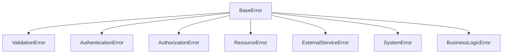

# LLMChat 项目异常处理指南

## 1. 概述

本文档详细描述了LLMChat项目中异常处理的设计和实现方案。项目采用统一的、类型安全的异常处理机制，确保前后端错误处理的一致性和可维护性。

## 2. 设计原则

### 2.1 类型安全
- 使用TypeScript类型系统确保错误处理的类型安全
- 避免使用`any`类型处理错误
- 所有错误都继承自统一的基类[BaseError](file:///f:/ss/aa/sssss/llmchat/backend/src/types/errors.ts#L12-L65)

### 2.2 统一格式
- 前后端使用统一的错误响应格式
- 所有API错误遵循标准的[ApiError](file:///f:/ss/aa/sssss/llmchat/backend/src/types/index.ts#L55-L64)接口

### 2.3 可追踪性
- 每个错误都有唯一的错误ID
- 完整的错误上下文信息记录
- 结构化日志便于问题排查

### 2.4 可分类性
- 按错误类型分类（验证错误、认证错误、系统错误等）
- 按严重级别分类（低、中、高、严重）

## 3. 后端异常处理架构

### 3.1 错误类型体系

项目定义了完整的错误类型体系，所有自定义错误都继承自[BaseError](file:///f:/ss/aa/sssss/llmchat/backend/src/types/errors.ts#L12-L65)：



### 3.2 错误处理中间件

后端使用统一的错误处理中间件[errorHandler](file:///f:/ss/aa/sssss/llmchat/backend/src/middleware/errorHandler.ts#L15-L85)，负责：

1. 捕获所有未处理的错误
2. 将未知错误转换为自定义错误类型
3. 记录结构化日志
4. 返回统一格式的错误响应

### 3.3 异步错误处理

使用[asyncErrorHandler](file:///f:/ss/aa/sssss/llmchat/backend/src/middleware/errorHandler.ts#L246-L252)包装所有异步路由处理器：

```typescript
import { asyncErrorHandler } from '@/middleware/errorHandler';

// 路由定义
app.post('/api/chat', asyncErrorHandler(chatController.handleChat));
```

## 4. 前端异常处理架构

### 4.1 错误边界组件

使用统一的[ErrorBoundary](file:///f:/ss/aa/sssss/llmchat/frontend/src/components/ErrorBoundary.tsx#L22-L112)组件捕获React组件树中的错误：

```tsx
<ErrorBoundary>
  <ChatApp />
</ErrorBoundary>
```

### 4.2 错误处理Hook

使用[useErrorHandler](file:///f:/ss/aa/sssss/llmchat/frontend/src/hooks/useErrorHandler.ts#L10-L59) Hook处理函数组件中的错误：

```typescript
const { handleApiError, handleGenericError } = useErrorHandler();

const handleAsyncOperation = async () => {
  try {
    await someAsyncOperation();
  } catch (error) {
    handleApiError(error);
  }
};
```

### 4.3 增强版日志记录

使用[enhancedLogger](file:///f:/ss/aa/sssss/llmchat/frontend/src/lib/enhancedLogger.ts#L55-L255)记录详细的错误信息：

```typescript
import { enhancedLogger } from '@/lib/enhancedLogger';

try {
  // 操作代码
} catch (error) {
  enhancedLogger.error('操作失败', error, {
    component: 'UserService',
    operation: 'fetchUserData',
  });
}
```

## 5. 错误响应格式

所有API错误响应遵循统一格式：

```json
{
  "code": "ERROR_CODE",
  "message": "错误描述",
  "category": "错误类别",
  "severity": "错误严重性",
  "details": {},
  "timestamp": "时间戳",
  "userId": "用户ID",
  "requestId": "请求ID"
}
```

### 5.1 错误类别定义

| 类别 | 描述 |
|------|------|
| validation | 验证错误 |
| authentication | 身份验证错误 |
| authorization | 权限错误 |
| network | 网络错误 |
| external_service | 外部服务错误 |
| resource | 资源错误 |
| business_logic | 业务逻辑错误 |
| system | 系统错误 |

### 5.2 错误严重性级别

| 级别 | 描述 |
|------|------|
| low | 低优先级 |
| medium | 中优先级 |
| high | 高优先级 |
| critical | 关键优先级 |

## 6. 实现细节

### 6.1 后端实现

#### 6.1.1 错误类型定义

```typescript
// BaseError基类
class BaseError extends Error {
  id: string;
  code: string;
  category: string;
  severity: 'low' | 'medium' | 'high' | 'critical';
  context?: Record<string, unknown>;
  timestamp: string;
  
  constructor(options: BaseErrorOptions) {
    super(options.message);
    this.id = generateErrorId();
    this.code = options.code;
    this.category = options.category;
    this.severity = options.severity;
    this.context = options.context;
    this.timestamp = new Date().toISOString();
  }
  
  toApiError(): ApiError {
    return {
      code: this.code,
      message: this.message,
      category: this.category,
      severity: this.severity,
      details: this.context,
      timestamp: this.timestamp,
      userId: this.context?.userId as string,
      requestId: this.context?.requestId as string,
    };
  }
}
```

#### 6.1.2 错误处理中间件

```typescript
export const errorHandler = (
  unknownError: unknown,
  req: Request,
  res: Response,
  next: NextFunction,
): void => {
  // 使用类型安全基础设施创建结构化错误
  const typedError = createErrorFromUnknown(unknownError, {
    component: 'ErrorHandler',
    operation: 'globalErrorHandling',
    url: req.originalUrl,
    method: req.method,
  });

  // 结构化日志记录
  logger.error('统一错误处理', {
    errorId: typedError.id,
    code: typedError.code,
    message: typedError.message,
    component: typedError.context?.component,
    operation: typedError.context?.operation,
    url: req.originalUrl,
    method: req.method,
    timestamp: typedError.timestamp,
    stack: typedError.stack,
  });

  // 生成统一的API错误响应
  const errorResponse = typedError.toApiError();
  const statusCode = getErrorStatusCode(typedError);

  res.status(statusCode).json(errorResponse);
};
```

### 6.2 前端实现

#### 6.2.1 错误边界组件

```tsx
class ErrorBoundary extends Component<Props, State> {
  public override state: State = {
    hasError: false,
  };

  public static getDerivedStateFromError(error: Error): State {
    return { hasError: true, error };
  }

  public override componentDidCatch(error: Error, errorInfo: React.ErrorInfo) {
    console.error('Uncaught error:', error, errorInfo);
    
    // 记录错误信息到日志系统
    logger.error('React Error Boundary', error, {
      componentStack: errorInfo.componentStack,
    });
  }

  public override render() {
    if (this.state.hasError) {
      // 渲染错误UI
      return <ErrorBoundaryUI error={this.state.error} />;
    }

    return this.props.children;
  }
}
```

#### 6.2.2 错误处理Hook

```typescript
export function useErrorHandler() {
  const handleApiError = useCallback((error: unknown, context?: Record<string, unknown>) => {
    // 记录错误日志
    logger.error('API请求失败', error instanceof Error ? error : new Error(String(error)), context);
  }, []);

  const handleGenericError = useCallback((error: unknown, context?: Record<string, unknown>) => {
    // 记录通用错误日志
    logger.error('操作失败', error instanceof Error ? error : new Error(String(error)), context);
  }, []);

  return {
    handleApiError,
    handleGenericError,
  };
}
```

## 7. 最佳实践

### 7.1 后端最佳实践

1. **使用自定义错误类型**
   ```typescript
   // 推荐
   throw new ValidationError({
     message: 'Agent ID is required',
     field: 'agentId',
     code: 'AGENT_ID_REQUIRED',
   });
   
   // 不推荐
   throw new Error('Agent ID is required');
   ```

2. **类型安全的错误捕获**
   ```typescript
   // 推荐
   catch (unknownError: unknown) {
     const error = createErrorFromUnknown(unknownError, {
       component: 'ComponentName',
       operation: 'operationName'
     });
     logger.error('操作失败', error.toLogObject());
   }
   
   // 不推荐
   catch (error: any) {
     logger.error('操作失败', { error });
   }
   ```

3. **使用错误处理中间件**
   ```typescript
   import { asyncErrorHandler } from '@/middleware/errorHandler';
   
   app.post('/api/route', asyncErrorHandler(controller.method));
   ```

### 7.2 前端最佳实践

1. **使用错误边界**
   ```tsx
   <ErrorBoundary>
     <MyComponent />
   </ErrorBoundary>
   ```

2. **使用错误处理Hook**
   ```typescript
   const { handleApiError } = useErrorHandler();
   
   try {
     await apiCall();
   } catch (error) {
     handleApiError(error);
   }
   ```

3. **使用增强版日志**
   ```typescript
   enhancedLogger.serviceCall('chatService', 'sendMessage', {
     agentId: currentAgent.id,
     messageLength: message.length,
   });
   ```

## 8. 测试策略

### 8.1 后端测试

为所有错误处理逻辑编写单元测试：

```typescript
describe('ErrorHandler Middleware', () => {
  test('should handle ValidationError correctly', async () => {
    const validationError = new ValidationError({
      message: 'Invalid input',
      field: 'email',
      value: 'invalid-email',
    });

    const mockReq = {} as Request;
    const mockRes = {
      status: jest.fn().mockReturnThis(),
      json: jest.fn(),
    } as unknown as Response;

    errorHandler(validationError, mockReq, mockRes, jest.fn());

    expect(mockRes.status).toHaveBeenCalledWith(400);
    expect(mockRes.json).toHaveBeenCalledWith(
      expect.objectContaining({
        code: 'VALIDATION_ERROR',
        message: 'Invalid input',
      })
    );
  });
});
```

### 8.2 前端测试

测试错误边界组件和错误处理Hook：

```typescript
describe('ErrorBoundary', () => {
  test('should render fallback UI when error occurs', () => {
    const ThrowError: React.FC = () => {
      throw new Error('Test error');
    };

    const { getByText } = render(
      <ErrorBoundary>
        <ThrowError />
      </ErrorBoundary>
    );

    expect(getByText('应用遇到了错误')).toBeInTheDocument();
  });
});
```

## 9. 监控和告警

### 9.1 错误监控

项目集成Sentry进行错误监控，确保所有错误都被正确记录和上报。

### 9.2 告警机制

对于高优先级错误和服务器错误，系统会自动触发告警：

```typescript
export const shouldAlert = (error: BaseError): boolean => {
  // Critical和High严重级别需要告警
  if (error.severity === 'critical' || error.severity === 'high') {
    return true;
  }

  // 5xx服务器错误需要告警
  const statusCode = getErrorStatusCode(error);
  if (isServerError(statusCode)) {
    return true;
  }

  // 特定错误码需要告警
  const alertCodes = [
    'DATABASE_ERROR',
    'REDIS_ERROR',
    'CIRCUIT_BREAKER_OPEN',
    'SERVICE_UNAVAILABLE',
  ];

  return alertCodes.includes(error.code);
};
```

## 10. 总结

通过实施统一的异常处理机制，LLMChat项目实现了：

1. **类型安全**：避免运行时类型错误
2. **一致性**：前后端错误处理风格统一
3. **可维护性**：清晰的错误分类和处理流程
4. **可追踪性**：完整的错误日志和上下文信息
5. **可测试性**：完善的错误处理测试覆盖

这为项目的稳定运行和快速问题排查提供了坚实的基础。