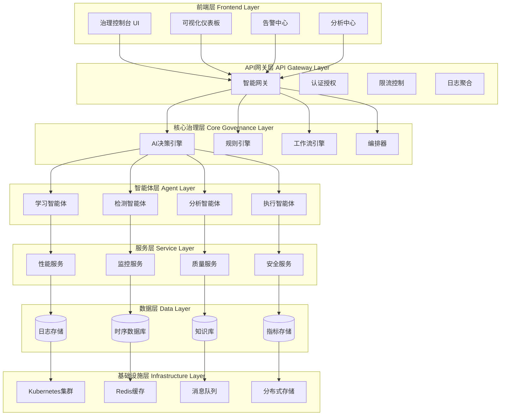

# IAGP 智能化治理体系架构设计

## 📋 架构概述

### 1.1 设计原则

**IAGP (Intelligent Automated Governance Protocol)** 智能化治理协议基于以下核心原则：

- **智能化决策**: 基于AI/ML的数据驱动决策机制
- **自动化执行**: 减少人工干预的自动化治理流程
- **实时响应**: 毫秒级问题检测和响应能力
- **自适应学习**: 持续优化和改进的治理策略
- **分布式协作**: 多智能体协同的治理架构
- **可扩展性**: 支持大规模复杂系统的治理需求

### 1.2 架构目标

| 目标 | 指标 | 实现方式 |
|------|------|---------|
| 治理效率提升 | 80%+ 减少人工干预 | AI自动化决策引擎 |
| 问题响应速度 | < 5秒检测和响应 | 实时监控和预警系统 |
| 治理覆盖率 | 100% 全生命周期覆盖 | 多维度监控体系 |
| 系统可用性 | 99.9% | 分布式容错架构 |
| 决策准确性 | 95%+ | ML模型持续优化 |
| 可扩展性 | 支持10倍规模增长 | 微服务架构设计 |

## 🏗️ 系统架构设计

### 2.1 整体架构图



### 2.2 核心组件架构

#### 2.2.1 AI决策引擎架构

```typescript
// AI决策引擎核心接口
interface IAIDecisionEngine {
  // 智能决策
  makeDecision(context: DecisionContext): Promise<DecisionResult>;

  // 模式识别
  detectPatterns(data: MonitoringData): Promise<Pattern[]>;

  // 预测分析
  predictOutcomes(scenario: Scenario): Promise<Prediction>;

  // 学习优化
  optimizeStrategy(feedback: FeedbackData): Promise<void>;
}

interface DecisionContext {
  systemMetrics: SystemMetrics;
  historicalData: HistoricalData;
  governanceRules: GovernanceRule[];
  currentIssues: Issue[];
  businessConstraints: BusinessConstraints;
}

interface DecisionResult {
  action: GovernanceAction;
  confidence: number;
  reasoning: string;
  impact: ImpactAssessment;
  executionPlan: ExecutionPlan;
}
```

#### 2.2.2 智能体协作架构

```typescript
// 智能体基础接口
interface IAgent {
  id: string;
  type: AgentType;
  capabilities: Capability[];

  // 生命周期管理
  initialize(): Promise<void>;
  execute(task: AgentTask): Promise<TaskResult>;
  shutdown(): Promise<void>;

  // 协作能力
  collaborate(agents: IAgent[]): Promise<CollaborationResult>;
  communicate(message: AgentMessage): Promise<void>;
}

enum AgentType {
  DETECTOR = 'detector',
  ANALYZER = 'analyzer',
  EXECUTOR = 'executor',
  LEARNER = 'learner',
  COORDINATOR = 'coordinator'
}

// 智能体协调器
class AgentOrchestrator {
  private agents: Map<string, IAgent> = new Map();
  private taskQueue: PriorityQueue<AgentTask>;

  async orchestrateGovernanceWorkflow(
    trigger: GovernanceTrigger
  ): Promise<GovernanceResult> {
    // 1. 分析触发条件
    const analysis = await this.analyzeTrigger(trigger);

    // 2. 选择合适的智能体
    const selectedAgents = this.selectAgents(analysis);

    // 3. 编排执行流程
    const workflow = this.createWorkflow(selectedAgents);

    // 4. 执行并监控
    return await this.executeWorkflow(workflow);
  }
}
```

## 🤖 AI/ML集成策略

### 3.1 机器学习模型架构

#### 3.1.1 预测分析模型

```typescript
// 时间序列预测模型
class TimeSeriesPredictor {
  private model: any; // TensorFlow.js模型

  async trainModel(data: HistoricalData): Promise<void> {
    // 1. 数据预处理
    const preprocessedData = this.preprocessData(data);

    // 2. 特征工程
    const features = this.extractFeatures(preprocessedData);

    // 3. 模型训练
    await this.model.fit(features);

    // 4. 模型验证
    await this.validateModel();
  }

  async predict(
    horizon: number,
    context: PredictionContext
  ): Promise<Prediction[]> {
    const predictions = await this.model.predict(horizon, context);
    return this.postProcessPredictions(predictions);
  }
}

// 异常检测模型
class AnomalyDetector {
  private isolationForest: IsolationForest;
  private autoencoder: Autoencoder;

  async detectAnomalies(
    metrics: SystemMetrics
  ): Promise<Anomaly[]> {
    // 1. 统计异常检测
    const statisticalAnomalies =
      await this.isolationForest.detect(metrics);

    // 2. 深度学习异常检测
    const deepAnomalies =
      await this.autoencoder.detect(metrics);

    // 3. 融合检测结果
    return this.fuseAnomalies(
      statisticalAnomalies,
      deepAnomalies
    );
  }
}
```

#### 3.1.2 自然语言处理模型

```typescript
// 日志分析和分类
class LogAnalyzer {
  private nlpModel: any; // NLP模型
  private classifier: TextClassifier;

  async analyzeLogs(logs: LogEntry[]): Promise<LogAnalysis> {
    // 1. 文本预处理
    const cleanedTexts = logs.map(log => this.preprocessText(log.message));

    // 2. 主题建模
    const topics = await this.nlpModel.extractTopics(cleanedTexts);

    // 3. 情感分析
    const sentiments = await this.analyzeSentiments(cleanedTexts);

    // 4. 异常日志识别
    const anomalies = await this.identifyAnomalousLogs(logs);

    return {
      topics,
      sentiments,
      anomalies,
      insights: this.generateInsights(topics, sentiments, anomalies)
    };
  }
}

// 代码质量分析
class CodeQualityAnalyzer {
  private codeModel: any;

  async analyzeCodeQuality(
    codeFiles: CodeFile[]
  ): Promise<QualityAssessment> {
    const assessments = await Promise.all(
      codeFiles.map(file => this.analyzeFile(file))
    );

    return this.aggregateAssessments(assessments);
  }

  private async analyzeFile(file: CodeFile): Promise<FileAssessment> {
    // 1. 复杂度分析
    const complexity = await this.analyzeComplexity(file.content);

    // 2. 潜在缺陷检测
    const defects = await this.detectDefects(file.content);

    // 3. 代码风格检查
    const style = await this.checkCodeStyle(file.content);

    return {
      filePath: file.path,
      complexity,
      defects,
      style,
      score: this.calculateQualityScore(complexity, defects, style)
    };
  }
}
```

### 3.2 实时推理架构

```typescript
// 实时推理引擎
class RealTimeInferenceEngine {
  private modelRegistry: ModelRegistry;
  private inferenceCache: InferenceCache;

  async processRealTimeData(
    dataStream: DataStream
  ): Promise<InferenceResult[]> {
    const results: InferenceResult[] = [];

    for await (const data of dataStream) {
      // 1. 缓存检查
      const cached = await this.inferenceCache.get(data);
      if (cached) {
        results.push(cached);
        continue;
      }

      // 2. 模型选择
      const model = await this.modelRegistry.selectModel(data);

      // 3. 实时推理
      const result = await model.inference(data);

      // 4. 缓存结果
      await this.inferenceCache.set(data, result);

      results.push(result);
    }

    return results;
  }
}

// 边缘计算推理
class EdgeInferenceEngine {
  private lightweightModels: Map<string, any>;

  async deployLightweightModel(
    modelSpec: ModelSpecification
  ): Promise<void> {
    // 1. 模型压缩
    const compressedModel = await this.compressModel(modelSpec);

    // 2. 量化处理
    const quantizedModel = await this.quantizeModel(compressedModel);

    // 3. 部署到边缘
    this.lightweightModels.set(modelSpec.id, quantizedModel);
  }
}
```

## ⚙️ 自动化决策和执行引擎

### 4.1 决策引擎架构

```typescript
// 自动化决策引擎
class AutomatedDecisionEngine {
  private ruleEngine: RuleEngine;
  private mlEngine: MLEngine;
  private knowledgeBase: KnowledgeBase;

  async makeGovernanceDecision(
    context: GovernanceContext
  ): Promise<Decision> {
    // 1. 基于规则的决策
    const ruleBasedDecision = await this.ruleEngine.evaluate(context);

    // 2. 基于ML的决策
    const mlBasedDecision = await this.mlEngine.predict(context);

    // 3. 知识库查询
    const knowledgeInsights = await this.knowledgeBase.query(context);

    // 4. 决策融合
    return this.fuseDecisions(
      ruleBasedDecision,
      mlBasedDecision,
      knowledgeInsights
    );
  }

  private fuseDecisions(
    ...decisions: PartialDecision[]
  ): Decision {
    // 加权决策融合算法
    const weights = this.calculateDecisionWeights(decisions);
    const finalDecision = this.weightedFusion(decisions, weights);

    // 置信度计算
    const confidence = this.calculateConfidence(decisions);

    return {
      ...finalDecision,
      confidence,
      reasoning: this.generateReasoning(decisions),
      alternatives: this.generateAlternatives(decisions)
    };
  }
}

// 规则引擎
class RuleEngine {
  private rules: GovernanceRule[] = [];
  private reteNetwork: ReteNetwork;

  async evaluate(context: GovernanceContext): Promise<RuleDecision> {
    // 1. 构建推理网络
    const network = await this.buildReteNetwork();

    // 2. 模式匹配
    const matches = await network.match(context);

    // 3. 规则冲突解决
    const resolvedRules = this.resolveConflicts(matches);

    // 4. 执行规则
    const actions = await this.executeRules(resolvedRules, context);

    return {
      actions,
      firedRules: resolvedRules,
      confidence: this.calculateRuleConfidence(resolvedRules)
    };
  }
}
```

### 4.2 执行引擎架构

```typescript
// 自动化执行引擎
class AutomatedExecutionEngine {
  private executors: Map<ExecutorType, IExecutor>;
  private taskQueue: TaskQueue;
  private executionMonitor: ExecutionMonitor;

  async executeGovernanceActions(
    actions: GovernanceAction[]
  ): Promise<ExecutionResult[]> {
    const results: ExecutionResult[] = [];

    for (const action of actions) {
      // 1. 执行器选择
      const executor = this.selectExecutor(action);

      // 2. 执行准备
      const preparedAction = await this.prepareExecution(action);

      // 3. 异步执行
      const execution = this.taskQueue.enqueue(async () => {
        return await executor.execute(preparedAction);
      });

      // 4. 执行监控
      this.executionMonitor.monitor(execution);

      results.push(await execution);
    }

    return results;
  }
}

// 执行器接口
interface IExecutor {
  type: ExecutorType;
  capabilities: string[];

  execute(action: GovernanceAction): Promise<ExecutionResult>;
  rollback(executionId: string): Promise<void>;
  getStatus(executionId: string): Promise<ExecutionStatus>;
}

// 代码修复执行器
class CodeFixExecutor implements IExecutor {
  type = ExecutorType.CODE_FIX;

  async execute(action: CodeFixAction): Promise<ExecutionResult> {
    try {
      // 1. 备份原始状态
      const backup = await this.createBackup(action.targets);

      // 2. 应用修复
      const fixResults = await this.applyFixes(action.fixes);

      // 3. 验证修复结果
      const validation = await this.validateFixes(fixResults);

      return {
        success: validation.success,
        changes: fixResults,
        backup: backup.id,
        validation,
        metrics: this.calculateMetrics(fixResults)
      };
    } catch (error) {
      return {
        success: false,
        error: error.message,
        rollbackId: await this.rollback(action.targets)
      };
    }
  }
}
```

## 📊 数据驱动的持续改进机制

### 5.1 数据收集和分析架构

```typescript
// 数据收集器
class GovernanceDataCollector {
  private collectors: Map<DataType, IDataCollector>;
  private dataPipeline: DataPipeline;

  async collectGovernanceData(): Promise<GovernanceData> {
    const data = await Promise.all([
      this.collectMetrics(),
      this.collectLogs(),
      this.collectEvents(),
      this.collectFeedback()
    ]);

    return this.aggregateData(data);
  }

  private async collectMetrics(): Promise<SystemMetrics> {
    return {
      performance: await this.collectPerformanceMetrics(),
      quality: await this.collectQualityMetrics(),
      security: await this.collectSecurityMetrics(),
      compliance: await this.collectComplianceMetrics()
    };
  }
}

// 数据分析引擎
class GovernanceAnalyticsEngine {
  private analyzers: Map<AnalysisType, IAnalyzer>;

  async analyzeGovernanceData(
    data: GovernanceData
  ): Promise<AnalysisResults> {
    const analyses = await Promise.all([
      this.analyzeTrends(data),
      this.analyzePatterns(data),
      this.anomalyDetection(data),
      this.predictiveAnalysis(data),
      this.rootCauseAnalysis(data)
    ]);

    return this.synthesizeResults(analyses);
  }

  private async analyzeTrends(data: GovernanceData): Promise<TrendAnalysis> {
    // 时间序列分析
    const timeSeries = this.extractTimeSeries(data);
    const trends = await this.detectTrends(timeSeries);
    const seasonality = await this.detectSeasonality(timeSeries);

    return {
      trends,
      seasonality,
      forecast: await this.forecastTrends(timeSeries),
      confidence: this.calculateTrendConfidence(trends)
    };
  }
}
```

### 5.2 学习和优化机制

```typescript
// 持续学习引擎
class ContinuousLearningEngine {
  private models: Map<string, MLModel>;
  private optimizer: ModelOptimizer;
  private feedbackProcessor: FeedbackProcessor;

  async learnFromExperience(
    experiences: GovernanceExperience[]
  ): Promise<LearningResults> {
    // 1. 反馈处理
    const processedFeedback = await this.feedbackProcessor.process(experiences);

    // 2. 模型更新
    const modelUpdates = await this.updateModels(processedFeedback);

    // 3. 策略优化
    const strategyOptimizations = await this.optimizeStrategies(modelUpdates);

    // 4. 知识库更新
    await this.updateKnowledgeBase(strategyOptimizations);

    return {
      modelUpdates,
      strategyOptimizations,
      performanceImprovement: await this.measureImprovement()
    };
  }

  private async updateModels(
    feedback: ProcessedFeedback
  ): Promise<ModelUpdate[]> {
    const updates: ModelUpdate[] = [];

    for (const [modelId, model] of this.models) {
      // 1. 增量学习
      const incrementalUpdate = await model.incrementalLearn(feedback);

      // 2. 超参数优化
      const hyperparameterOptimization =
        await this.optimizer.optimizeHyperparameters(model, feedback);

      // 3. 模型验证
      const validation = await this.validateModel(model);

      if (validation.acceptable) {
        updates.push({
          modelId,
          incrementalUpdate,
          hyperparameterOptimization,
          performanceGain: validation.performanceGain
        });
      }
    }

    return updates;
  }
}

// 自动优化器
class AutoOptimizer {
  private optimizationStrategies: Map<OptimizationType, IOptimizerStrategy>;

  async optimizeGovernanceSystem(
    currentState: SystemState,
    performanceTargets: PerformanceTargets
  ): Promise<OptimizationPlan> {
    // 1. 性能差距分析
    const gaps = await this.analyzePerformanceGaps(
      currentState,
      performanceTargets
    );

    // 2. 优化机会识别
    const opportunities = await this.identifyOptimizationOpportunities(gaps);

    // 3. 优化策略选择
    const strategies = await this.selectOptimizationStrategies(opportunities);

    // 4. 优化计划生成
    return await this.generateOptimizationPlan(strategies);
  }
}
```

## 🌐 分布式自组织治理架构

### 6.1 分布式智能体架构

```typescript
// 分布式智能体管理器
class DistributedAgentManager {
  private agentNodes: Map<string, AgentNode>;
  private consensusManager: ConsensusManager;
  private loadBalancer: LoadBalancer;

  async orchestrateDistributedGovernance(
    governanceRequest: GovernanceRequest
  ): Promise<DistributedResult> {
    // 1. 智能体节点选择
    const selectedNodes = await this.selectAgentNodes(governanceRequest);

    // 2. 任务分解
    const subtasks = await this.decomposeTask(governanceRequest, selectedNodes);

    // 3. 分布式执行
    const executionPlan = await this.createExecutionPlan(subtasks);

    // 4. 共识协调
    const consensus = await this.consensusManager.reachConsensus(executionPlan);

    // 5. 执行监控
    return await this.monitorDistributedExecution(consensus);
  }

  private async selectAgentNodes(
    request: GovernanceRequest
  ): Promise<AgentNode[]> {
    const criteria = {
      capabilities: request.requiredCapabilities,
      loadThreshold: 0.8,
      latencyThreshold: 100, // ms
      availabilityThreshold: 0.95
    };

    return this.loadBalancer.selectNodes(criteria);
  }
}

// 共识管理器
class ConsensusManager {
  private consensusAlgorithm: ConsensusAlgorithm;
  private blockchain: GovernanceBlockchain;

  async reachConsensus(
    proposal: GovernanceProposal
  ): Promise<ConsensusResult> {
    // 1. 提案广播
    await this.broadcastProposal(proposal);

    // 2. 投票收集
    const votes = await this.collectVotes(proposal);

    // 3. 共识计算
    const consensus = await this.consensusAlgorithm.compute(votes);

    // 4. 结果记录
    if (consensus.agreed) {
      await this.blockchain.recordConsensus(consensus);
    }

    return consensus;
  }
}
```

### 6.2 自组织协调机制

```typescript
// 自组织协调器
class SelfOrganizingCoordinator {
  private swarmIntelligence: SwarmIntelligence;
  private emergenceDetector: EmergenceDetector;

  async enableSelfOrganization(
    systemState: SystemState
  ): Promise<SelfOrganizationResult> {
    // 1. 系统状态分析
    const stateAnalysis = await this.analyzeSystemState(systemState);

    // 2. 自组织需求识别
    const organizationNeeds = await this.identifyOrganizationNeeds(stateAnalysis);

    // 3. 群体智能优化
    const swarmOptimization = await this.swarmIntelligence.optimize(
      organizationNeeds
    );

    // 4. 涌现行为检测
    const emergencePatterns = await this.emergenceDetector.detect(
      swarmOptimization
    );

    // 5. 自组织调整
    return await this.adjustSelfOrganization(
      swarmOptimization,
      emergencePatterns
    );
  }
}

// 群体智能算法
class SwarmIntelligence {
  private particles: Particle[] = [];
  private globalBest: Solution;

  async optimize(problem: OptimizationProblem): Promise<Solution> {
    // 1. 初始化粒子群
    await this.initializeSwarm(problem);

    // 2. 迭代优化
    for (let iteration = 0; iteration < this.maxIterations; iteration++) {
      // 2.1 粒子位置更新
      await this.updateParticlePositions();

      // 2.2 适应度评估
      await this.evaluateFitness();

      // 2.3 最优解更新
      await this.updateGlobalBest();

      // 2.4 收敛检查
      if (this.hasConverged()) break;
    }

    return this.globalBest;
  }

  private async updateParticlePositions(): Promise<void> {
    for (const particle of this.particles) {
      // 粒子群算法核心更新公式
      const velocity = this.calculateVelocity(particle);
      const newPosition = this.calculateNewPosition(particle, velocity);

      particle.position = newPosition;
      particle.velocity = velocity;
    }
  }
}
```

## 🚨 实时告警和响应机制

### 7.1 实时监控系统

```typescript
// 实时监控引擎
class RealTimeMonitoringEngine {
  private sensors: Map<SensorType, ISensor>;
  private eventStream: EventStream;
  private alertProcessor: AlertProcessor;

  async startRealTimeMonitoring(): Promise<void> {
    // 1. 传感器部署
    await this.deploySensors();

    // 2. 事件流处理
    this.eventStream.on('data', this.processEvent.bind(this));

    // 3. 异常检测
    setInterval(() => this.detectAnomalies(), 1000);

    // 4. 实时仪表板更新
    setInterval(() => this.updateDashboard(), 500);
  }

  private async processEvent(event: MonitoringEvent): Promise<void> {
    // 1. 事件分类
    const category = await this.classifyEvent(event);

    // 2. 严重性评估
    const severity = await this.assessSeverity(event, category);

    // 3. 告警触发
    if (severity >= SeverityThreshold.ALERT) {
      await this.triggerAlert(event, severity);
    }

    // 4. 事件存储
    await this.storeEvent(event, category, severity);
  }
}

// 智能告警系统
class IntelligentAlertSystem {
  private alertCorrelator: AlertCorrelator;
  private alertPrioritizer: AlertPrioritizer;
  private falsePositiveFilter: FalsePositiveFilter;

  async processAlert(alert: RawAlert): Promise<ProcessedAlert> {
    // 1. 告警关联分析
    const correlations = await this.alertCorrelator.correlate(alert);

    // 2. 优先级评估
    const priority = await this.alertPrioritizer.prioritize(alert, correlations);

    // 3. 误报过滤
    const isFalsePositive = await this.falsePositiveFilter.filter(alert);

    if (isFalsePositive) {
      return this.createSuppressedAlert(alert, 'False positive filtered');
    }

    // 4. 告警增强
    return await this.enhanceAlert(alert, {
      correlations,
      priority,
      recommendedActions: await this.recommendActions(alert),
      impactAssessment: await this.assessImpact(alert)
    });
  }

  private async recommendActions(alert: ProcessedAlert): Promise<Action[]> {
    // 基于历史数据和ML模型推荐处理动作
    const similarAlerts = await this.findSimilarAlerts(alert);
    const successfulActions = this.extractSuccessfulActions(similarAlerts);

    return this.rankActionsBySuccessRate(successfulActions);
  }
}
```

### 7.2 自动响应系统

```typescript
// 自动响应引擎
class AutoResponseEngine {
  private responseStrategies: Map<AlertType, IResponseStrategy>;
  private executionEngine: ExecutionEngine;
  private rollbackManager: RollbackManager;

  async executeAutoResponse(alert: ProcessedAlert): Promise<ResponseResult> {
    // 1. 响应策略选择
    const strategy = this.selectResponseStrategy(alert);

    // 2. 执行计划生成
    const executionPlan = await strategy.generatePlan(alert);

    // 3. 安全检查
    const safetyCheck = await this.performSafetyCheck(executionPlan);
    if (!safetyCheck.safe) {
      return this.createManualEscalation(alert, safetyCheck.reasons);
    }

    // 4. 执行响应
    const execution = await this.executionEngine.execute(executionPlan);

    // 5. 回滚点设置
    await this.rollbackManager.createCheckpoint(execution.id);

    return {
      executionId: execution.id,
      actions: execution.actions,
      status: execution.status,
      rollbackAvailable: true
    };
  }

  private async performSafetyCheck(
    plan: ExecutionPlan
  ): Promise<SafetyCheckResult> {
    const checks = await Promise.all([
      this.checkImpact(plan),
      this.checkPermissions(plan),
      this.checkDependencies(plan),
      this.checkRollbackPossibility(plan)
    ]);

    const failedChecks = checks.filter(check => !check.passed);

    return {
      safe: failedChecks.length === 0,
      reasons: failedChecks.map(check => check.reason),
      recommendations: failedChecks.map(check => check.recommendation)
    };
  }
}

// 自适应响应策略
class AdaptiveResponseStrategy implements IResponseStrategy {
  private mlModel: any;
  private feedbackLoop: FeedbackLoop;

  async generatePlan(alert: ProcessedAlert): Promise<ExecutionPlan> {
    // 1. 上下文分析
    const context = await this.analyzeContext(alert);

    // 2. 历史成功案例查询
    const successfulCases = await this.querySuccessfulCases(alert);

    // 3. ML预测最优策略
    const predictedStrategy = await this.mlModel.predict({
      alert,
      context,
      successfulCases
    });

    // 4. 执行计划生成
    return await this.generateExecutionPlan(predictedStrategy);
  }

  async learnFromFeedback(
    responseId: string,
    feedback: ResponseFeedback
  ): Promise<void> {
    // 反馈学习，改进策略
    await this.feedbackLoop.process({
      responseId,
      feedback,
      timestamp: new Date()
    });
  }
}
```

## 🔧 技术栈和实现方案

### 8.1 后端技术栈

#### 8.1.1 核心框架和库

```json
{
  "dependencies": {
    "express": "^4.18.0",
    "typescript": "^5.0.0",
    "@tensorflow/tfjs-node": "^4.0.0",
    "@tensorflow/tfjs-node-gpu": "^4.0.0",
    "bull": "^4.10.0",
    "redis": "^4.6.0",
    "mongoose": "^7.0.0",
    "influxdb": "^5.9.0",
    "ws": "^8.13.0",
    "socket.io": "^4.6.0",
    "winston": "^3.8.0",
    "joi": "^17.9.0",
    "jsonwebtoken": "^9.0.0",
    "bcrypt": "^5.1.0",
    "helmet": "^6.1.0",
    "cors": "^2.8.5",
    "compression": "^1.7.4",
    "express-rate-limit": "^6.7.0"
  }
}
```

#### 8.1.2 AI/ML技术栈

```typescript
// AI模型管理器
class AIModelManager {
  private models: Map<string, AIModel> = new Map();
  private modelRegistry: ModelRegistry;

  async loadModel(modelConfig: ModelConfig): Promise<AIModel> {
    switch (modelConfig.type) {
      case ModelType.TIME_SERIES:
        return await this.loadTimeSeriesModel(modelConfig);
      case ModelType.ANOMALY_DETECTION:
        return await this.loadAnomalyDetectionModel(modelConfig);
      case ModelType.NLP:
        return await this.loadNLPModel(modelConfig);
      case ModelType.RECOMMENDATION:
        return await this.loadRecommendationModel(modelConfig);
      default:
        throw new Error(`Unsupported model type: ${modelConfig.type}`);
    }
  }

  private async loadTimeSeriesModel(config: ModelConfig): Promise<TimeSeriesModel> {
    const model = new TimeSeriesModel();
    await model.load(config.path);

    return {
      predict: model.predict.bind(model),
      train: model.train.bind(model),
      evaluate: model.evaluate.bind(model),
      config
    };
  }
}

// TensorFlow.js时间序列模型
class TimeSeriesModel {
  private model: tf.LayersModel;
  private scaler: DataScaler;

  async load(modelPath: string): Promise<void> {
    this.model = await tf.loadLayersModel(`file://${modelPath}`);
    this.scaler = new DataScaler();
  }

  async predict(input: number[], steps: number): Promise<number[]> {
    // 数据预处理
    const scaledInput = this.scaler.transform(input);
    const tfInput = tf.tensor2d([scaledInput]);

    // 模型预测
    const predictions = this.model.predict(tfInput) as tf.Tensor;

    // 后处理
    const output = await predictions.data();
    return this.scaler.inverseTransform(Array.from(output));
  }
}
```

### 8.2 前端技术栈

#### 8.2.1 React组件架构

```typescript
// 治理控制台主组件
const GovernanceConsole: React.FC = () => {
  const [governanceState, setGovernanceState] = useState<GovernanceState>();
  const [alerts, setAlerts] = useState<Alert[]>([]);
  const [metrics, setMetrics] = useState<SystemMetrics>();

  useEffect(() => {
    // WebSocket连接实时数据
    const ws = new WebSocket('ws://localhost:3001/governance-stream');

    ws.onmessage = (event) => {
      const data = JSON.parse(event.data);

      switch (data.type) {
        case 'GOVERNANCE_STATE_UPDATE':
          setGovernanceState(data.payload);
          break;
        case 'NEW_ALERT':
          setAlerts(prev => [...prev, data.payload]);
          break;
        case 'METRICS_UPDATE':
          setMetrics(data.payload);
          break;
      }
    };

    return () => ws.close();
  }, []);

  return (
    <div className="governance-console">
      <Header />
      <div className="main-content">
        <Sidebar />
        <div className="dashboard">
          <MetricsPanel metrics={metrics} />
          <AlertsPanel alerts={alerts} />
          <GovernanceActionsPanel state={governanceState} />
          <AnalyticsPanel />
        </div>
      </div>
    </div>
  );
};

// 实时监控仪表板
const MonitoringDashboard: React.FC = () => {
  const [timeSeriesData, setTimeSeriesData] = useState<TimeSeriesPoint[]>([]);
  const chartRef = useRef<any>(null);

  useEffect(() => {
    const chart = echarts.init(chartRef.current);

    const option = {
      title: { text: '系统治理指标实时监控' },
      tooltip: { trigger: 'axis' },
      legend: { data: ['质量分数', '性能指标', '安全评分'] },
      xAxis: { type: 'time' },
      yAxis: { type: 'value' },
      series: [
        {
          name: '质量分数',
          type: 'line',
          data: timeSeriesData.map(point => [point.timestamp, point.quality])
        },
        {
          name: '性能指标',
          type: 'line',
          data: timeSeriesData.map(point => [point.timestamp, point.performance])
        },
        {
          name: '安全评分',
          type: 'line',
          data: timeSeriesData.map(point => [point.timestamp, point.security])
        }
      ]
    };

    chart.setOption(option);

    return () => chart.dispose();
  }, [timeSeriesData]);

  return <div ref={chartRef} className="monitoring-chart" />;
};
```

### 8.3 数据存储方案

#### 8.3.1 多层存储架构

```typescript
// 存储管理器
class StorageManager {
  private timeseriesDB: InfluxDB;
  private documentDB: MongoDB;
  private graphDB: Neo4j;
  private cache: Redis;

  async storeGovernanceData(data: GovernanceData): Promise<void> {
    // 1. 时序数据存储
    await this.timeseriesDB.insertPoints({
      measurement: 'governance_metrics',
      tags: data.tags,
      fields: data.metrics,
      timestamp: new Date()
    });

    // 2. 文档数据存储
    await this.documentDB.collection('governance_events').insertOne({
      ...data,
      timestamp: new Date(),
      processed: false
    });

    // 3. 图数据存储（关系分析）
    await this.graphDB.run(
      'CREATE (e:GovernanceEvent {id: $id, type: $type, timestamp: $timestamp})',
      { id: data.id, type: data.type, timestamp: data.timestamp }
    );

    // 4. 缓存热点数据
    await this.cache.setex(
      `governance:${data.id}`,
      3600,
      JSON.stringify(data)
    );
  }

  async queryGovernanceData(
    query: GovernanceQuery
  ): Promise<GovernanceData[]> {
    // 查询路由优化
    if (query.timeRange) {
      // 时序数据查询
      return await this.queryTimeSeriesData(query);
    } else if (query.relationships) {
      // 图数据查询
      return await this.queryGraphData(query);
    } else {
      // 文档数据查询
      return await this.queryDocumentData(query);
    }
  }
}

// 数据分层策略
enum DataTier {
  HOT = 'hot',      // Redis缓存，毫秒级访问
  WARM = 'warm',    // MongoDB，秒级访问
  COLD = 'cold',    // InfluxDB，分析查询
  ARCHIVE = 'archive' // 对象存储，长期归档
}

class DataLifecycleManager {
  async manageDataLifecycle(): Promise<void> {
    // 1. 热数据迁移
    await this.migrateHotToWarm();

    // 2. 温数据归档
    await this.archiveWarmToCold();

    // 3. 冷数据压缩
    await this.compressColdData();

    // 4. 过期数据清理
    await this.cleanupExpiredData();
  }

  private async migrateHotToWarm(): Promise<void> {
    // 7天未访问的数据从热迁移到温
    const threshold = new Date(Date.now() - 7 * 24 * 60 * 60 * 1000);

    const hotData = await this.redis.keys('*');
    for (const key of hotData) {
      const lastAccess = await this.redis.object('idletime', key);
      if (lastAccess > 7 * 24 * 60 * 60) { // 7天
        const data = await this.redis.get(key);
        await this.mongoDB.insertOne(JSON.parse(data));
        await this.redis.del(key);
      }
    }
  }
}
```

## 🚀 部署和运维方案

### 9.1 容器化部署

#### 9.1.1 Docker配置

```dockerfile
# 主应用Dockerfile
FROM node:18-alpine AS base
WORKDIR /app

# 依赖安装阶段
FROM base AS deps
COPY package*.json ./
RUN npm ci --only=production

# 构建阶段
FROM base AS builder
COPY package*.json ./
RUN npm ci
COPY . .
RUN npm run build

# 生产镜像
FROM base AS runner
COPY --from=deps /app/node_modules ./node_modules
COPY --from=builder /app/dist ./dist
COPY --from=builder /app/public ./public

EXPOSE 3001
CMD ["node", "dist/index.js"]
```

#### 9.1.2 Kubernetes部署配置

```yaml
# governance-system.yaml
apiVersion: apps/v1
kind: Deployment
metadata:
  name: iagp-governance-system
  labels:
    app: iagp-governance
spec:
  replicas: 3
  selector:
    matchLabels:
      app: iagp-governance
  template:
    metadata:
      labels:
        app: iagp-governance
    spec:
      containers:
      - name: governance-api
        image: iagp/governance-system:latest
        ports:
        - containerPort: 3001
        env:
        - name: NODE_ENV
          value: "production"
        - name: DATABASE_URL
          valueFrom:
            secretKeyRef:
              name: governance-secrets
              key: database-url
        - name: REDIS_URL
          valueFrom:
            secretKeyRef:
              name: governance-secrets
              key: redis-url
        resources:
          requests:
            memory: "512Mi"
            cpu: "500m"
          limits:
            memory: "1Gi"
            cpu: "1000m"
        livenessProbe:
          httpGet:
            path: /health
            port: 3001
          initialDelaySeconds: 30
          periodSeconds: 10
        readinessProbe:
          httpGet:
            path: /ready
            port: 3001
          initialDelaySeconds: 5
          periodSeconds: 5

---
apiVersion: v1
kind: Service
metadata:
  name: iagp-governance-service
spec:
  selector:
    app: iagp-governance
  ports:
    - protocol: TCP
      port: 80
      targetPort: 3001
  type: LoadBalancer
```

### 9.2 监控和运维

#### 9.2.1 Prometheus监控配置

```yaml
# prometheus-config.yaml
global:
  scrape_interval: 15s
  evaluation_interval: 15s

rule_files:
  - "governance_rules.yml"

scrape_configs:
  - job_name: 'iagp-governance'
    static_configs:
      - targets: ['iagp-governance-service:80']
    metrics_path: /metrics
    scrape_interval: 10s

  - job_name: 'node-exporter'
    static_configs:
      - targets: ['node-exporter:9100']

alerting:
  alertmanagers:
    - static_configs:
        - targets:
          - alertmanager:9093
```

#### 9.2.2 Grafana仪表板配置

```json
{
  "dashboard": {
    "title": "IAGP 治理系统监控",
    "panels": [
      {
        "title": "AI决策成功率",
        "type": "stat",
        "targets": [
          {
            "expr": "rate(ai_decisions_successful_total[5m]) / rate(ai_decisions_total[5m]) * 100",
            "legendFormat": "决策成功率"
          }
        ]
      },
      {
        "title": "系统治理指标",
        "type": "graph",
        "targets": [
          {
            "expr": "governance_quality_score",
            "legendFormat": "质量分数"
          },
          {
            "expr": "governance_performance_score",
            "legendFormat": "性能指标"
          },
          {
            "expr": "governance_security_score",
            "legendFormat": "安全评分"
          }
        ]
      },
      {
        "title": "告警处理时间",
        "type": "heatmap",
        "targets": [
          {
            "expr": "histogram_quantile(0.95, rate(alert_processing_duration_seconds_bucket[5m]))",
            "legendFormat": "95th percentile"
          }
        ]
      }
    ]
  }
}
```

## 📈 性能和可扩展性考虑

### 10.1 性能优化策略

#### 10.1.1 缓存策略

```typescript
// 多级缓存管理器
class MultiLevelCacheManager {
  private l1Cache: MemoryCache;    // 内存缓存
  private l2Cache: RedisCache;     // Redis缓存
  private l3Cache: DatabaseCache;  // 数据库缓存

  async get<T>(key: string): Promise<T | null> {
    // L1缓存查询
    let result = await this.l1Cache.get<T>(key);
    if (result) {
      return result;
    }

    // L2缓存查询
    result = await this.l2Cache.get<T>(key);
    if (result) {
      // 回填L1缓存
      await this.l1Cache.set(key, result, 300); // 5分钟
      return result;
    }

    // L3缓存查询
    result = await this.l3Cache.get<T>(key);
    if (result) {
      // 回填L1和L2缓存
      await this.l2Cache.set(key, result, 3600); // 1小时
      await this.l1Cache.set(key, result, 300);
      return result;
    }

    return null;
  }

  async set<T>(key: string, value: T, ttl: number): Promise<void> {
    await Promise.all([
      this.l1Cache.set(key, value, Math.min(ttl, 300)),
      this.l2Cache.set(key, value, ttl),
      this.l3Cache.set(key, value, ttl)
    ]);
  }
}

// 智能缓存预热
class CacheWarmupManager {
  async warmupCache(): Promise<void> {
    // 1. 热点数据识别
    const hotData = await this.identifyHotData();

    // 2. 预测性加载
    const predictedData = await this.predictAccessPatterns();

    // 3. 批量预加载
    await this.batchPreload([...hotData, ...predictedData]);
  }

  private async identifyHotData(): Promise<string[]> {
    // 基于访问频率识别热点数据
    const accessPatterns = await this.analyzeAccessPatterns();
    return accessPatterns
      .sort((a, b) => b.frequency - a.frequency)
      .slice(0, 1000)
      .map(item => item.key);
  }
}
```

#### 10.1.2 数据库优化

```typescript
// 查询优化器
class QueryOptimizer {
  async optimizeQuery(query: GovernanceQuery): Promise<OptimizedQuery> {
    // 1. 查询分析
    const analysis = await this.analyzeQuery(query);

    // 2. 索引建议
    const indexSuggestions = await this.suggestIndexes(analysis);

    // 3. 查询重写
    const rewrittenQuery = await this.rewriteQuery(query, indexSuggestions);

    // 4. 执行计划生成
    return await this.generateExecutionPlan(rewrittenQuery);
  }

  private async suggestIndexes(
    analysis: QueryAnalysis
  ): Promise<IndexSuggestion[]> {
    const suggestions: IndexSuggestion[] = [];

    // 基于查询模式建议索引
    for (const pattern of analysis.patterns) {
      if (pattern.type === 'range_query') {
        suggestions.push({
          fields: pattern.fields,
          type: 'btree',
          priority: 'high'
        });
      } else if (pattern.type === 'aggregation') {
        suggestions.push({
          fields: pattern.groupByFields,
          type: 'hash',
          priority: 'medium'
        });
      }
    }

    return suggestions;
  }
}

// 分片管理器
class ShardingManager {
  private shards: Map<string, DatabaseShard> = new Map();

  async distributeData(data: GovernanceData): Promise<void> {
    // 1. 分片键计算
    const shardKey = this.calculateShardKey(data);

    // 2. 目标分片选择
    const targetShard = this.selectShard(shardKey);

    // 3. 数据存储
    await targetShard.store(data);

    // 4. 分片元数据更新
    await this.updateShardMetadata(shardKey, targetShard.id);
  }

  private calculateShardKey(data: GovernanceData): string {
    // 基于时间和租户ID的分片策略
    const timeSlot = Math.floor(data.timestamp.getTime() / (24 * 60 * 60 * 1000)); // 按天分片
    const tenantHash = this.hashTenant(data.tenantId);

    return `${timeSlot}-${tenantHash}`;
  }
}
```

### 10.2 可扩展性架构

#### 10.2.1 水平扩展设计

```typescript
// 自动扩缩容管理器
class AutoScalingManager {
  private k8sClient: KubernetesClient;
  private metricsCollector: MetricsCollector;

  async enableAutoScaling(): Promise<void> {
    // 1. 性能指标监控
    const metrics = await this.collectPerformanceMetrics();

    // 2. 扩缩容决策
    const scalingDecision = await this.makeScalingDecision(metrics);

    // 3. 执行扩缩容
    if (scalingDecision.action !== ScalingAction.NONE) {
      await this.executeScaling(scalingDecision);
    }
  }

  private async makeScalingDecision(
    metrics: PerformanceMetrics
  ): Promise<ScalingDecision> {
    const rules = [
      {
        condition: metrics.cpuUtilization > 80,
        action: ScalingAction.SCALE_UP,
        reason: 'High CPU utilization'
      },
      {
        condition: metrics.memoryUtilization > 85,
        action: ScalingAction.SCALE_UP,
        reason: 'High memory utilization'
      },
      {
        condition: metrics.responseTime > 1000,
        action: ScalingAction.SCALE_UP,
        reason: 'High response time'
      },
      {
        condition: metrics.cpuUtilization < 20 && metrics.memoryUtilization < 30,
        action: ScalingAction.SCALE_DOWN,
        reason: 'Low resource utilization'
      }
    ];

    for (const rule of rules) {
      if (rule.condition) {
        return {
          action: rule.action,
          targetReplicas: this.calculateTargetReplicas(metrics, rule.action),
          reason: rule.reason
        };
      }
    }

    return { action: ScalingAction.NONE, targetReplicas: 0, reason: 'No scaling needed' };
  }
}

// 负载均衡器
class IntelligentLoadBalancer {
  private backends: BackendService[] = [];
  private routingStrategy: RoutingStrategy;

  async routeRequest(request: GovernanceRequest): Promise<BackendService> {
    // 1. 健康检查
    const healthyBackends = this.backends.filter(backend => backend.isHealthy());

    // 2. 负载评估
    const backendLoads = await this.assessBackendLoads(healthyBackends);

    // 3. 智能路由
    const selectedBackend = this.routingStrategy.select(
      request,
      healthyBackends,
      backendLoads
    );

    // 4. 路由决策记录
    await this.recordRoutingDecision(request, selectedBackend);

    return selectedBackend;
  }

  private async assessBackendLoads(
    backends: BackendService[]
  ): Promise<BackendLoad[]> {
    return await Promise.all(
      backends.map(async backend => ({
        backend,
        cpuLoad: await backend.getCpuLoad(),
        memoryLoad: await backend.getMemoryLoad(),
        activeConnections: await backend.getActiveConnections(),
        averageResponseTime: await backend.getAverageResponseTime()
      }))
    );
  }
}
```

## 📚 总结和实施路线图

### 11.1 架构总结

IAGP智能化治理体系架构通过以下核心技术实现：

1. **AI驱动的决策引擎**: 基于机器学习的智能决策和预测能力
2. **分布式智能体架构**: 支持大规模并行处理的自组织系统
3. **实时响应机制**: 毫秒级问题检测和自动化处理
4. **多维度监控体系**: 全方位的系统健康状态监控
5. **持续学习优化**: 自适应的治理策略和持续改进机制

### 11.2 实施路线图

#### Phase 1: 基础架构搭建 (3个月)
- 核心治理框架开发
- 基础AI模型集成
- 监控系统建设
- 数据存储架构

#### Phase 2: 智能化功能开发 (4个月)
- AI决策引擎实现
- 自动化执行系统
- 智能体协作机制
- 实时告警系统

#### Phase 3: 分布式扩展 (3个月)
- 分布式架构部署
- 负载均衡和扩缩容
- 多租户支持
- 性能优化

#### Phase 4: 高级功能 (2个月)
- 自组织机制
- 预测性治理
- 高级分析功能
- 可视化界面

### 11.3 预期收益

- **治理效率提升**: 80%+ 减少人工干预
- **问题响应速度**: < 5秒检测和响应
- **系统可用性**: 99.9% 高可用性保障
- **决策准确性**: 95%+ AI辅助决策准确率
- **可扩展性**: 支持10倍规模增长

通过这个全面的智能化治理体系架构，可以实现真正的自动化、智能化、可扩展的软件治理系统，显著提升软件开发和维护的效率和质量。