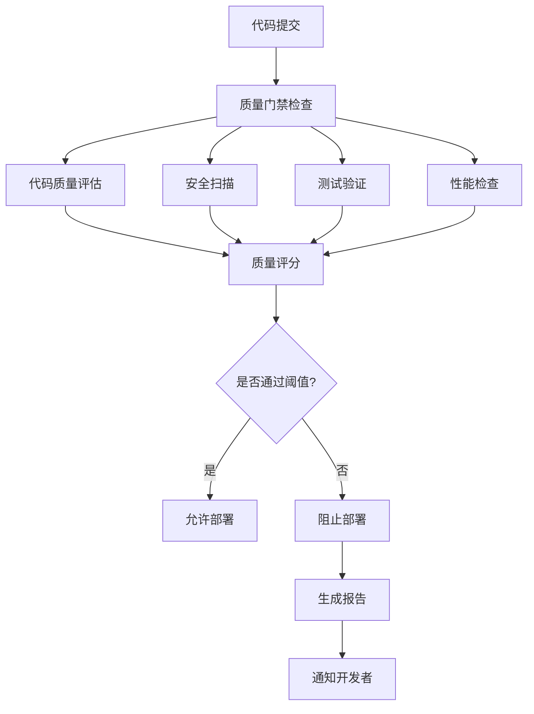

# LLMChat 质量门禁配置指南

> **版本**: 1.0.0
> **最后更新**: 2025-10-18
> **状态**: 生产就绪
> **适用范围**: 企业级质量门禁配置和自定义

---

## 📋 目录

1. [配置概述](#配置概述)
2. [质量门禁架构](#质量门禁架构)
3. [配置文件详解](#配置文件详解)
4. [环境特定配置](#环境特定配置)
5. [自定义质量规则](#自定义质量规则)
6. [质量评分算法](#质量评分算法)
7. [集成指南](#集成指南)
8. [最佳实践](#最佳实践)
9. [故障排除](#故障排除)

---

## 🎯 配置概述

### 什么是质量门禁？

质量门禁是CI/CD流水线中的自动化检查点，确保代码在部署到生产环境之前满足预定义的质量标准。它包括代码质量、安全性、性能、测试覆盖率等多个维度的评估。

### 质量门禁的目标

- **预防质量问题**: 在代码合并到主分支之前发现和修复问题
- **标准化质量**: 确保所有代码都符合相同的质量标准
- **降低风险**: 防止低质量代码进入生产环境
- **持续改进**: 通过量化指标推动质量改进

### 核心组件



---

## 🏗️ 质量门禁架构

### 1. 评分体系架构

```javascript
// 质量评分系统架构
const QualityGateSystem = {
  dimensions: {
    code_quality: {
      weight: 0.35,
      metrics: ['eslint_errors', 'eslint_warnings', 'typescript_errors', 'complexity']
    },
    security: {
      weight: 0.25,
      metrics: ['vulnerabilities', 'secrets', 'code_security_issues']
    },
    performance: {
      weight: 0.20,
      metrics: ['build_time', 'bundle_size', 'runtime_performance']
    },
    testing: {
      weight: 0.15,
      metrics: ['coverage', 'test_success_rate', 'test_stability']
    },
    documentation: {
      weight: 0.05,
      metrics: ['api_docs', 'code_comments', 'readme_completeness']
    }
  }
};
```

### 2. 检查流程

```yaml
# 质量门禁检查流程
quality_gate_flow:
  1. 预检查:
    - 环境验证
    - 依赖安装
    - 工具版本检查

  2. 代码质量检查:
    - TypeScript编译
    - ESLint检查
    - 代码复杂度分析
    - 代码格式检查

  3. 安全扫描:
    - 依赖漏洞扫描
    - 代码安全分析
    - 敏感信息检测
    - 容器安全检查

  4. 测试验证:
    - 单元测试执行
    - 集成测试执行
    - 覆盖率分析
    - 测试稳定性检查

  5. 性能评估:
    - 构建性能测试
    - 包大小分析
    - 运行时性能基准
    - 内存使用分析

  6. 综合评分:
    - 各维度评分计算
    - 加权总分计算
    - 阈值比较
    - 决策生成
```

---

## ⚙️ 配置文件详解

### 1. 主配置文件 (.quality-gates.config.json)

```json
{
  "version": "1.0.0",
  "description": "LLMChat 企业质量门禁配置",
  "environments": {
    "development": {
      "name": "开发环境",
      "description": "开发环境质量要求，相对宽松",
      "enabled": true,
      "mode": "standard"
    },
    "staging": {
      "name": "预发布环境",
      "description": "预发布环境质量要求，较为严格",
      "enabled": true,
      "mode": "strict"
    },
    "production": {
      "name": "生产环境",
      "description": "生产环境质量要求，非常严格",
      "enabled": true,
      "mode": "enterprise"
    }
  },
  "thresholds": {
    "development": {
      "overall_score": 70,
      "code_quality": 65,
      "security": 75,
      "performance": 60,
      "testing": 65,
      "documentation": 50
    },
    "staging": {
      "overall_score": 85,
      "code_quality": 80,
      "security": 90,
      "performance": 75,
      "testing": 80,
      "documentation": 70
    },
    "production": {
      "overall_score": 90,
      "code_quality": 85,
      "security": 95,
      "performance": 85,
      "testing": 85,
      "documentation": 80
    }
  },
  "weighting": {
    "code_quality": 35,
    "security": 25,
    "performance": 20,
    "testing": 15,
    "documentation": 5
  },
  "blocking_rules": {
    "critical_security_issues": {
      "enabled": true,
      "threshold": 0,
      "action": "block"
    },
    "critical_bugs": {
      "enabled": true,
      "threshold": 0,
      "action": "block"
    },
    "type_errors": {
      "enabled": true,
      "threshold": 0,
      "action": "block"
    },
    "test_failures": {
      "enabled": true,
      "threshold": 0,
      "action": "block"
    },
    "build_failures": {
      "enabled": true,
      "threshold": 0,
      "action": "block"
    }
  },
  "rules": {
    "failOnWarning": {
      "development": false,
      "staging": true,
      "production": true
    },
    "skipSlowChecks": {
      "development": true,
      "staging": false,
      "production": false
    },
    "generateReports": {
      "development": true,
      "staging": true,
      "production": true
    },
    "notifyOnFailure": {
      "development": false,
      "staging": true,
      "production": true
    }
  },
  "integrations": {
    "github": {
      "prComments": true,
      "statusChecks": true,
      "commitStatus": true
    },
    "slack": {
      "enabled": true,
      "webhook": "${SLACK_WEBHOOK_URL}",
      "channels": ["#quality-alerts"]
    },
    "email": {
      "enabled": true,
      "recipients": ["dev-team@yourdomain.com"]
    }
  }
}
```

### 2. 代码质量配置 (.quality-gates.code-quality.json)

```json
{
  "typescript": {
    "enabled": true,
    "strict": true,
    "rules": {
      "noImplicitAny": {
        "severity": "error",
        "weight": 10
      },
      "strictNullChecks": {
        "severity": "error",
        "weight": 8
      },
      "noUnusedLocals": {
        "severity": "warning",
        "weight": 3
      },
      "noUnusedParameters": {
        "severity": "warning",
        "weight": 3
      },
      "exactOptionalPropertyTypes": {
        "severity": "error",
        "weight": 5
      }
    }
  },
  "eslint": {
    "enabled": true,
    "configFile": ".eslintrc.cjs",
    "rules": {
      "no-console": {
        "severity": "warning",
        "weight": 2,
        "environments": ["production"]
      },
      "prefer-const": {
        "severity": "warning",
        "weight": 1
      },
      "no-var": {
        "severity": "error",
        "weight": 5
      },
      "complexity": {
        "severity": "warning",
        "weight": 4,
        "max": 10
      },
      "max-lines-per-function": {
        "severity": "warning",
        "weight": 2,
        "max": 50
      }
    }
  },
  "complexity": {
    "enabled": true,
    "metrics": {
      "cyclomatic": {
        "threshold": 10,
        "weight": 3
      },
      "cognitive": {
        "threshold": 15,
        "weight": 2
      },
      "halstead": {
        "threshold": 100,
        "weight": 1
      }
    }
  }
}
```

### 3. 安全配置 (.quality-gates.security.json)

```json
{
  "dependencyAudit": {
    "enabled": true,
    "auditLevel": "moderate",
    "rules": {
      "critical": {
        "action": "block",
        "weight": 10
      },
      "high": {
        "action": "block",
        "weight": 7
      },
      "moderate": {
        "action": "warn",
        "weight": 3
      },
      "low": {
        "action": "info",
        "weight": 1
      }
    }
  },
  "codeSecurity": {
    "enabled": true,
    "tools": ["semgrep", "eslint-security"],
    "rules": {
      "hardcodedSecrets": {
        "action": "block",
        "weight": 10,
        "patterns": [
          "password",
          "api_key",
          "secret",
          "token"
        ]
      },
      "sqlInjection": {
        "action": "block",
        "weight": 9
      },
      "xss": {
        "action": "block",
        "weight": 8
      },
      "pathTraversal": {
        "action": "block",
        "weight": 7
      }
    }
  },
  "containerSecurity": {
    "enabled": true,
    "tools": ["trivy", "docker-scan"],
    "rules": {
      "critical": {
        "action": "block",
        "weight": 10
      },
      "high": {
        "action": "warn",
        "weight": 5
      }
    }
  }
}
```

### 4. 测试配置 (.quality-gates.testing.json)

```json
{
  "coverage": {
    "enabled": true,
    "thresholds": {
      "statements": {
        "development": 70,
        "staging": 80,
        "production": 85
      },
      "functions": {
        "development": 70,
        "staging": 80,
        "production": 85
      },
      "branches": {
        "development": 60,
        "staging": 75,
        "production": 80
      },
      "lines": {
        "development": 70,
        "staging": 80,
        "production": 85
      }
    },
    "excludes": [
      "**/*.test.{ts,js}",
      "**/*.stories.{ts,tsx}",
      "**/*.spec.{ts,js}",
      "node_modules/**",
      "dist/**"
    ]
  },
  "testExecution": {
    "enabled": true,
    "timeout": 30000,
    "retries": 2,
    "rules": {
      "flakyTests": {
        "threshold": 5,
        "action": "warn"
      },
      "slowTests": {
        "threshold": 5000,
        "action": "warn"
      }
    }
  },
  "testTypes": {
    "unit": {
      "enabled": true,
      "weight": 0.6
    },
    "integration": {
      "enabled": true,
      "weight": 0.3
    },
    "e2e": {
      "enabled": true,
      "weight": 0.1
    }
  }
}
```

### 5. 性能配置 (.quality-gates.performance.json)

```json
{
  "build": {
    "enabled": true,
    "metrics": {
      "buildTime": {
        "threshold": {
          "development": 180000,
          "staging": 120000,
          "production": 60000
        },
        "weight": 3
      },
      "bundleSize": {
        "threshold": {
          "development": "5MB",
          "staging": "3MB",
          "production": "2MB"
        },
        "weight": 4
      }
    }
  },
  "runtime": {
    "enabled": true,
    "metrics": {
      "startupTime": {
        "threshold": 5000,
        "weight": 2
      },
      "memoryUsage": {
        "threshold": "512MB",
        "weight": 3
      },
      "cpuUsage": {
        "threshold": 70,
        "weight": 2
      }
    }
  },
  "optimization": {
    "enabled": true,
    "rules": {
      "codeSplitting": {
        "required": true,
        "weight": 2
      },
      "lazyLoading": {
        "required": true,
        "weight": 2
      },
      "treeShaking": {
        "required": true,
        "weight": 1
      }
    }
  }
}
```

---

## 🌍 环境特定配置

### 1. 开发环境配置

```json
{
  "mode": "standard",
  "strictness": "lenient",
  "performance": "development",
  "features": {
    "fastFeedback": true,
    "skipSlowChecks": true,
    "detailedLogging": true,
    "autoFix": true
  },
  "thresholds": {
    "overall_score": 70,
    "code_quality": 65,
    "security": 75,
    "testing": 65,
    "performance": 60,
    "documentation": 50
  },
  "exemptions": {
    "coverage": ["experimental/**", "poc/**"],
    "complexity": ["legacy/**"],
    "security": ["test/**", "mock/**"]
  }
}
```

### 2. 测试环境配置

```json
{
  "mode": "strict",
  "strictness": "standard",
  "performance": "staging",
  "features": {
    "comprehensiveTesting": true,
    "performanceMonitoring": true,
    "securityScanning": true,
    "generateReports": true
  },
  "thresholds": {
    "overall_score": 85,
    "code_quality": 80,
    "security": 90,
    "testing": 80,
    "performance": 75,
    "documentation": 70
  },
  "notifications": {
    "slack": true,
    "email": true,
    "githubStatus": true
  }
}
```

### 3. 生产环境配置

```json
{
  "mode": "enterprise",
  "strictness": "very_strict",
  "performance": "production",
  "features": {
    "fullCompliance": true,
    "extensiveValidation": true,
    "realTimeMonitoring": true,
    "complianceReporting": true
  },
  "thresholds": {
    "overall_score": 90,
    "code_quality": 85,
    "security": 95,
    "testing": 85,
    "performance": 85,
    "documentation": 80
  },
  "blocking": {
    "allFailures": true,
    "warningsAsErrors": true,
    "regressions": true
  },
  "compliance": {
    "gdpr": true,
    "sox": true,
    "iso27001": true
  }
}
```

---

## 🔧 自定义质量规则

### 1. 创建自定义规则

```javascript
// scripts/custom-quality-rules.js
const CustomQualityRules = {
  businessLogic: {
    name: "业务逻辑规则",
    rules: [
      {
        name: "error_handling",
        description: "所有API端点必须有错误处理",
        pattern: /app\.(get|post|put|delete)\(/.*\)/,
        validator: (node) => {
          // 检查是否有try-catch或错误处理中间件
          return hasErrorHandling(node);
        },
        weight: 5,
        severity: 'error'
      },
      {
        name: "input_validation",
        description: "所有用户输入必须验证",
        pattern: /req\.(body|query|params)/,
        validator: (node) => {
          // 检查是否有验证逻辑
          return hasInputValidation(node);
        },
        weight: 4,
        severity: 'error'
      }
    ]
  },
  performance: {
    name: "性能规则",
    rules: [
      {
        name: "no_sync_io",
        description: "避免同步IO操作",
        pattern: /\.(readFileSync|writeFileSync|existsSync)/,
        validator: (node) => {
          // 检查是否在非初始化代码中
          return !isInInitializationCode(node);
        },
        weight: 3,
        severity: 'warning'
      }
    ]
  }
};

module.exports = CustomQualityRules;
```

### 2. 集成自定义规则

```javascript
// scripts/quality-gates-with-custom-rules.js
const baseQualityGates = require('./enterprise-quality-scoring');
const customRules = require('./custom-quality-rules');

class CustomQualityGates extends baseQualityGates {
  constructor(config) {
    super(config);
    this.customRules = customRules;
  }

  async runCustomRules(codebase) {
    const results = [];

    for (const [category, rules] of Object.entries(this.customRules)) {
      for (const rule of rules.rules) {
        const violations = await this.checkRule(rule, codebase);
        results.push({
          category,
          rule: rule.name,
          violations,
          weight: rule.weight,
          severity: rule.severity
        });
      }
    }

    return results;
  }

  async checkRule(rule, codebase) {
    const violations = [];
    const files = await this.getFiles(codebase);

    for (const file of files) {
      const content = await fs.readFile(file, 'utf-8');
      const ast = this.parseAST(content);

      const matches = this.findPatternMatches(ast, rule.pattern);
      for (const match of matches) {
        if (!rule.validator(match)) {
          violations.push({
            file,
            line: match.line,
            column: match.column,
            message: `违反规则: ${rule.description}`
          });
        }
      }
    }

    return violations;
  }
}

module.exports = CustomQualityGates;
```

### 3. 规则配置示例

```json
// .quality-gates.custom-rules.json
{
  "customRules": {
    "enabled": true,
    "rulesDirectory": "./scripts/custom-rules",
    "rules": [
      {
        "name": "api_documentation",
        "filePattern": "**/controllers/**/*.ts",
        "requireJSDoc": true,
        "requireExamples": true,
        "weight": 3
      },
      {
        "name": "test_naming",
        "filePattern": "**/*.test.ts",
        "pattern": "^(describe|it|test)\\(",
        "weight": 2
      },
      {
        "name": "error_boundaries",
        "filePattern": "**/services/**/*.ts",
        "requireTryCatch": true,
        "weight": 5
      }
    ]
  }
}
```

---

## 📊 质量评分算法

### 1. 评分计算公式

```javascript
// 质量评分计算算法
class QualityScoreCalculator {
  constructor(config) {
    this.config = config;
    this.weights = config.weighting;
    this.thresholds = config.thresholds[config.environment];
  }

  calculateOverallScore(metrics) {
    const scores = {
      code_quality: this.calculateCodeQualityScore(metrics.code_quality),
      security: this.calculateSecurityScore(metrics.security),
      performance: this.calculatePerformanceScore(metrics.performance),
      testing: this.calculateTestingScore(metrics.testing),
      documentation: this.calculateDocumentationScore(metrics.documentation)
    };

    // 加权平均计算
    const weightedSum = Object.entries(scores).reduce((sum, [key, score]) => {
      return sum + (score * this.weights[key] / 100);
    }, 0);

    return {
      overall: Math.round(weightedSum),
      dimensions: scores,
      passed: weightedSum >= this.thresholds.overall_score,
      details: this.generateScoreDetails(scores)
    };
  }

  calculateCodeQualityScore(metrics) {
    let score = 100;
    const weights = {
      typescript_errors: 10,
      eslint_errors: 8,
      eslint_warnings: 3,
      complexity_issues: 5
    };

    score -= (metrics.typescript_errors || 0) * weights.typescript_errors;
    score -= (metrics.eslint_errors || 0) * weights.eslint_errors;
    score -= (metrics.eslint_warnings || 0) * weights.eslint_warnings;
    score -= (metrics.complexity_issues || 0) * weights.complexity_issues;

    return Math.max(0, score);
  }

  calculateSecurityScore(metrics) {
    let score = 100;
    const weights = {
      critical_vulnerabilities: 50,
      high_vulnerabilities: 25,
      moderate_vulnerabilities: 10,
      low_vulnerabilities: 5,
      secrets_found: 30
    };

    score -= (metrics.critical_vulnerabilities || 0) * weights.critical_vulnerabilities;
    score -= (metrics.high_vulnerabilities || 0) * weights.high_vulnerabilities;
    score -= (metrics.moderate_vulnerabilities || 0) * weights.moderate_vulnerabilities;
    score -= (metrics.low_vulnerabilities || 0) * weights.low_vulnerabilities;
    score -= (metrics.secrets_found || 0) * weights.secrets_found;

    return Math.max(0, score);
  }

  calculateTestingScore(metrics) {
    let score = 0;
    const coverageWeight = 0.7;
    const executionWeight = 0.3;

    // 覆盖率分数 (70%权重)
    const avgCoverage = (
      (metrics.coverage?.statements || 0) +
      (metrics.coverage?.functions || 0) +
      (metrics.coverage?.branches || 0) +
      (metrics.coverage?.lines || 0)
    ) / 4;

    score += avgCoverage * coverageWeight * 100;

    // 测试执行分数 (30%权重)
    const testSuccessRate = metrics.test_success_rate || 0;
    const testStability = metrics.test_stability || 1;
    score += (testSuccessRate * testStability) * executionWeight * 100;

    return Math.min(100, score);
  }

  calculatePerformanceScore(metrics) {
    let score = 100;
    const weights = {
      build_time_penalty: 20,
      bundle_size_penalty: 15,
      runtime_issues: 25
    };

    // 构建时间惩罚
    const buildTimeRatio = (metrics.build_time_actual || 0) / (metrics.build_time_threshold || 60000);
    if (buildTimeRatio > 1) {
      score -= Math.min(weights.build_time_penalty, (buildTimeRatio - 1) * 100);
    }

    // 包大小惩罚
    const bundleSizeRatio = (metrics.bundle_size_actual || 0) / (metrics.bundle_size_threshold || 3145728);
    if (bundleSizeRatio > 1) {
      score -= Math.min(weights.bundle_size_penalty, (bundleSizeRatio - 1) * 100);
    }

    // 运行时问题惩罚
    score -= (metrics.runtime_issues || 0) * weights.runtime_issues;

    return Math.max(0, score);
  }

  calculateDocumentationScore(metrics) {
    let score = 0;
    const criteria = {
      api_docs: metrics.api_docs_complete ? 30 : 0,
      code_comments: Math.min(20, metrics.comment_ratio * 100),
      readme_completeness: metrics.readme_score || 0,
      changelog_exists: metrics.changelog_exists ? 20 : 0,
      examples_exists: metrics.examples_exists ? 15 : 0,
      contributing_exists: metrics.contributing_exists ? 15 : 0
    };

    score = Object.values(criteria).reduce((sum, value) => sum + value, 0);
    return Math.min(100, score);
  }

  generateScoreDetails(scores) {
    return {
      summary: this.generateSummary(scores),
      recommendations: this.generateRecommendations(scores),
      trends: this.calculateTrends(scores),
      comparison: this.compareToBenchmark(scores)
    };
  }
}

module.exports = QualityScoreCalculator;
```

### 2. 阈值检查逻辑

```javascript
// 阈值检查器
class ThresholdChecker {
  constructor(config) {
    this.config = config;
    this.thresholds = config.thresholds[config.environment];
    this.blockingRules = config.blocking_rules;
  }

  checkThresholds(scoreResult) {
    const checks = {
      overall: this.checkThreshold('overall_score', scoreResult.overall),
      dimensions: {},
      blocking: this.checkBlockingRules(scoreResult),
      warnings: []
    };

    // 检查各维度阈值
    for (const [dimension, score] of Object.entries(scoreResult.dimensions)) {
      checks.dimensions[dimension] = this.checkThreshold(dimension, score);

      if (checks.dimensions[dimension].status === 'warning') {
        checks.warnings.push({
          dimension,
          current: score,
          threshold: this.thresholds[dimension],
          message: `${dimension} 分数低于阈值要求`
        });
      }
    }

    return {
      passed: checks.overall.status === 'pass' && checks.blocking.passed,
      status: checks.overall.status,
      checks,
      details: this.generateThresholdDetails(checks)
    };
  }

  checkThreshold(key, value) {
    const threshold = this.thresholds[key];
    const status = value >= threshold ? 'pass' : (value >= threshold * 0.9 ? 'warning' : 'fail');

    return {
      status,
      current: value,
      threshold,
      difference: value - threshold,
      percentage: Math.round((value / threshold - 1) * 100)
    };
  }

  checkBlockingRules(scoreResult) {
    const blockingChecks = [];
    let passed = true;

    for (const [rule, config] of Object.entries(this.blockingRules)) {
      if (!config.enabled) continue;

      const currentValue = this.getRuleValue(rule, scoreResult);
      const thresholdMet = currentValue <= config.threshold;

      blockingChecks.push({
        rule,
        current: currentValue,
        threshold: config.threshold,
        passed: thresholdMet,
        action: config.action,
        severity: this.getRuleSeverity(rule)
      });

      if (!thresholdMet && config.action === 'block') {
        passed = false;
      }
    }

    return {
      passed,
      checks: blockingChecks
    };
  }

  getRuleValue(rule, scoreResult) {
    const ruleMap = {
      'critical_security_issues': () => scoreResult.security?.critical_vulnerabilities || 0,
      'critical_bugs': () => scoreResult.testing?.critical_failures || 0,
      'type_errors': () => scoreResult.code_quality?.typescript_errors || 0,
      'test_failures': () => scoreResult.testing?.failed_tests || 0,
      'build_failures': () => scoreResult.performance?.build_failed ? 1 : 0
    };

    return ruleMap[rule] ? ruleMap[rule]() : 0;
  }
}

module.exports = ThresholdChecker;
```

---

## 🔗 集成指南

### 1. GitHub Actions 集成

```yaml
# .github/workflows/quality-gates.yml
name: 🏛️ Quality Gates Check

on:
  pull_request:
    branches: [main]
  push:
    branches: [main]

jobs:
  quality-gates:
    runs-on: ubuntu-latest
    steps:
      - name: Checkout code
        uses: actions/checkout@v4

      - name: Setup Node.js
        uses: actions/setup-node@v4
        with:
          node-version: '18'
          cache: 'npm'

      - name: Install dependencies
        run: |
          npm install -g pnpm
          pnpm install --frozen-lockfile

      - name: Run Quality Gates
        id: quality-gates
        run: |
          RESULT=$(pnpm run quality-gates:ci)
          echo "result=$RESULT" >> $GITHUB_OUTPUT
          echo "$RESULT"

      - name: Comment PR
        if: always()
        uses: actions/github-script@v6
        with:
          script: |
            const result = JSON.parse(`${{ steps.quality-gates.outputs.result }}`);

            if (result.passed) {
              await github.rest.issues.createComment({
                issue_number: context.issue.number,
                owner: context.repo.owner,
                repo: context.repo.repo,
                body: `✅ 质量检查通过！\n\n总分: ${result.score.overall}/100\n${result.details.summary}`
              });
            } else {
              await github.rest.issues.createComment({
                issue_number: context.issue.number,
                owner: context.repo.owner,
                repo: context.repo.repo,
                body: `❌ 质量检查失败！\n\n总分: ${result.score.overall}/100\n\n失败原因:\n${result.details.blocking_reasons.map(r => `• ${r}`).join('\n')}\n\n请修复后重新提交。`
              });
            }

      - name: Update Status Check
        if: always()
        uses: actions/github-script@v6
        with:
          script: |
            const result = JSON.parse(`${{ steps.quality-gates.outputs.result }}`);

            await github.rest.repos.createCommitStatus({
              owner: context.repo.owner,
              repo: context.repo.repo,
              sha: context.sha,
              state: result.passed ? 'success' : 'failure',
              target_url: `https://your-domain.com/quality-report/${context.sha}`,
              description: `质量评分: ${result.score.overall}/100`,
              context: 'quality-gates'
            });
```

### 2. Slack 集成

```javascript
// scripts/slack-notifier.js
class SlackNotifier {
  constructor(config) {
    this.webhook = config.slack.webhook;
    this.channels = config.slack.channels;
  }

  async notify(result, context) {
    const message = this.formatMessage(result, context);

    for (const channel of this.channels) {
      await this.sendMessage(channel, message);
    }
  }

  formatMessage(result, context) {
    const color = result.passed ? 'good' : 'danger';
    const emoji = result.passed ? '✅' : '❌';

    return {
      attachments: [{
        color,
        title: `${emoji} 质量门禁检查结果`,
        fields: [
          {
            title: '总体评分',
            value: `${result.score.overall}/100`,
            short: true
          },
          {
            title: '状态',
            value: result.passed ? '通过' : '失败',
            short: true
          },
          {
            title: '提交',
            value: context.commit,
            short: true
          },
          {
            title: '作者',
            value: context.author,
            short: true
          }
        ],
        actions: result.passed ? [] : [{
          type: 'button',
          text: '查看详情',
          url: result.details.report_url
        }]
      }]
    };
  }

  async sendMessage(channel, message) {
    const response = await fetch(this.webhook, {
      method: 'POST',
      headers: {
        'Content-Type': 'application/json',
      },
      body: JSON.stringify({
        channel,
        ...message
      })
    });

    if (!response.ok) {
      throw new Error(`Slack notification failed: ${response.statusText}`);
    }
  }
}

module.exports = SlackNotifier;
```

### 3. 邮件集成

```javascript
// scripts/email-notifier.js
const nodemailer = require('nodemailer');

class EmailNotifier {
  constructor(config) {
    this.transporter = nodemailer.createTransporter({
      host: config.email.smtp.host,
      port: config.email.smtp.port,
      secure: config.email.smtp.secure,
      auth: {
        user: config.email.smtp.user,
        pass: config.email.smtp.pass
      }
    });
  }

  async notify(result, context) {
    const html = this.generateEmailHTML(result, context);

    await this.transporter.sendMail({
      from: config.email.from,
      to: config.email.recipients.join(','),
      subject: `质量门禁检查${result.passed ? '通过' : '失败'} - ${context.project}`,
      html
    });
  }

  generateEmailHTML(result, context) {
    const statusColor = result.passed ? '#28a745' : '#dc3545';
    const statusIcon = result.passed ? '✅' : '❌';

    return `
      <html>
        <body style="font-family: Arial, sans-serif;">
          <div style="background-color: ${statusColor}; color: white; padding: 20px; text-align: center;">
            <h1>${statusIcon} 质量门禁检查${result.passed ? '通过' : '失败'}</h1>
            <p>项目: ${context.project}</p>
            <p>提交: ${context.commit}</p>
            <p>作者: ${context.author}</p>
          </div>

          <div style="padding: 20px;">
            <h2>评分详情</h2>
            <table style="width: 100%; border-collapse: collapse;">
              <tr>
                <th style="border: 1px solid #ddd; padding: 8px;">维度</th>
                <th style="border: 1px solid #ddd; padding: 8px;">分数</th>
                <th style="border: 1px solid #ddd; padding: 8px;">阈值</th>
                <th style="border: 1px solid #ddd; padding: 8px;">状态</th>
              </tr>
              ${this.generateScoreTable(result)}
            </table>

            ${result.passed ? '' : this.generateFailureSection(result)}
          </div>
        </body>
      </html>
    `;
  }

  generateScoreTable(result) {
    return Object.entries(result.score.dimensions).map(([dimension, score]) => `
      <tr>
        <td style="border: 1px solid #ddd; padding: 8px;">${this.formatDimensionName(dimension)}</td>
        <td style="border: 1px solid #ddd; padding: 8px;">${score}</td>
        <td style="border: 1px solid #ddd; padding: 8px;">${result.thresholds[dimension]}</td>
        <td style="border: 1px solid #ddd; padding: 8px; color: ${score >= result.thresholds[dimension] ? 'green' : 'red'};">
          ${score >= result.thresholds[dimension] ? '✅ 通过' : '❌ 失败'}
        </td>
      </tr>
    `).join('');
  }

  formatDimensionName(dimension) {
    const names = {
      code_quality: '代码质量',
      security: '安全性',
      performance: '性能',
      testing: '测试',
      documentation: '文档'
    };
    return names[dimension] || dimension;
  }
}

module.exports = EmailNotifier;
```

---

## 🎯 最佳实践

### 1. 配置管理最佳实践

**版本控制**:
```bash
# 配置文件版本管理
.gitignore
# .quality-gates.local.json
# .quality-gates.secrets.json

# 配置文件模板
.quality-gates.template.json
.quality-gates.development.json
.quality-gates.staging.json
.quality-gates.production.json
```

**环境变量管理**:
```javascript
// 使用环境变量覆盖配置
const config = {
  ...baseConfig,
  ...environmentConfig,
  // 环境变量覆盖
  ...overrideConfigFromEnv(),
  // 密钥配置
  secrets: loadSecretsFromVault()
};

function overrideConfigFromEnv() {
  return {
    environment: process.env.QUALITY_ENVIRONMENT || 'development',
    strictness: process.env.QUALITY_STRICTNESS || 'standard',
    customRules: process.env.QUALITY_CUSTOM_RULES_PATH
  };
}
```

### 2. 规则设计最佳实践

**渐进式规则应用**:
```json
{
  "ruleApplication": {
    "development": {
      "enabledRules": ["basic", "essential"],
      "strictness": "lenient"
    },
    "staging": {
      "enabledRules": ["basic", "essential", "comprehensive"],
      "strictness": "standard"
    },
    "production": {
      "enabledRules": ["basic", "essential", "comprehensive", "strict"],
      "strictness": "very_strict"
    }
  }
}
```

**规则可配置性**:
```javascript
// 规则配置模板
const ruleTemplate = {
  name: "string",
  description: "string",
  enabled: "boolean",
  severity: "error|warning|info",
  weight: "number",
  threshold: "number",
  pattern: "string|RegExp",
  validator: "function",
  exemptions: "array"
};

// 规则验证
function validateRule(rule) {
  const required = ['name', 'description', 'enabled', 'severity', 'weight'];
  for (const field of required) {
    if (!rule[field]) {
      throw new Error(`规则缺少必需字段: ${field}`);
    }
  }

  if (rule.weight < 0 || rule.weight > 10) {
    throw new Error(`规则权重必须在0-10之间: ${rule.weight}`);
  }
}
```

### 3. 性能优化最佳实践

**并行执行**:
```javascript
// 并行质量检查
class ParallelQualityChecker {
  async runChecks(codebase) {
    const checks = [
      this.checkCodeQuality(codebase),
      this.checkSecurity(codebase),
      this.checkTesting(codebase),
      this.checkPerformance(codebase),
      this.checkDocumentation(codebase)
    ];

    const results = await Promise.allSettled(checks);
    return this.aggregateResults(results);
  }
}
```

**缓存机制**:
```javascript
// 检查结果缓存
class CachedQualityChecker {
  constructor(cacheManager) {
    this.cache = cacheManager;
    this.cacheKeyPrefix = 'quality-check:';
    this.cacheTTL = 300000; // 5分钟
  }

  async checkWithCache(checkName, codebase) {
    const cacheKey = `${this.cacheKeyPrefix}${checkName}`;
    const cacheKeyHash = this.generateCacheKey(codebase);

    const cached = await this.cache.get(cacheKey, cacheKeyHash);
    if (cached && !this.isExpired(cached)) {
      return cached.result;
    }

    const result = await this.performCheck(checkName, codebase);
    await this.cache.set(cacheKey, cacheKeyHash, {
      result,
      timestamp: Date.now(),
      ttl: this.cacheTTL
    });

    return result;
  }
}
```

---

## 🔧 故障排除

### 1. 常见配置问题

**问题1: 配置文件格式错误**
```bash
# 验证配置文件
node -e "JSON.parse(require('fs').readFileSync('.quality-gates.config.json'))"

# 使用配置验证工具
pnpm run quality-gates:validate-config
```

**问题2: 环境变量缺失**
```bash
# 检查环境变量
echo $QUALITY_ENVIRONMENT
echo $QUALITY_STRICTNESS

# 设置默认环境变量
export QUALITY_ENVIRONMENT=${QUALITY_ENVIRONMENT:-development}
export QUALITY_STRICTNESS=${QUALITY_STRICTNESS:-standard}
```

### 2. 规则执行问题

**问题3: 自定义规则无法加载**
```javascript
// 调试自定义规则加载
const fs = require('fs');
const path = require('path');

function debugRuleLoading() {
  const rulesDir = './scripts/custom-rules';

  if (!fs.existsSync(rulesDir)) {
    console.error(`规则目录不存在: ${rulesDir}`);
    return;
  }

  const ruleFiles = fs.readdirSync(rulesDir)
    .filter(file => file.endsWith('.js'))
    .map(file => path.join(rulesDir, file));

  console.log('发现规则文件:', ruleFiles);

  for (const file of ruleFiles) {
    try {
      const rule = require(file);
      console.log(`✅ 成功加载规则: ${file}`);
      console.log(`规则配置:`, rule);
    } catch (error) {
      console.error(`❌ 加载规则失败: ${file}`, error);
    }
  }
}
```

### 3. 性能问题诊断

**问题4: 质量检查执行慢**
```javascript
// 性能分析工具
class QualityCheckProfiler {
  constructor() {
    this.metrics = {};
  }

  startTimer(name) {
    this.metrics[name] = {
      start: process.hrtime.bigint()
    };
  }

  endTimer(name) {
    if (!this.metrics[name]) return;

    const end = process.hrtime.bigint();
    const duration = Number(end - this.metrics[name].start) / 1000000;

    console.log(`⏱️ ${name}: ${duration.toFixed(2)}ms`);

    delete this.metrics[name];
  }

  async profileCheck(checkName, checkFunction) {
    this.startTimer(checkName);
    try {
      const result = await checkFunction();
      this.endTimer(checkName);
      return result;
    } catch (error) {
      this.endTimer(checkName);
      throw error;
    }
  }
}
```

---

## 📞 支持与联系方式

### 技术支持
- **文档**: [配置指南](https://docs.yourdomain.com/quality-gates)
- **示例**: [配置示例](https://github.com/your-org/quality-gates-examples)
- **社区**: [讨论区](https://github.com/your-org/quality-gates/discussions)

### 反馈渠道
- **问题报告**: [GitHub Issues](https://github.com/your-org/quality-gates/issues)
- **功能请求**: [GitHub Discussions](https://github.com/your-org/quality-gates/discussions)
- **邮件支持**: quality-gates@yourdomain.com

---

**文档维护**: 本文档随系统更新持续维护，最后更新时间: 2025-10-18

**版本历史**:
- v1.0.0 (2025-10-18): 初始版本，完整质量门禁配置指南
- 后续版本将根据功能演进和用户反馈持续更新

---

*本指南帮助团队配置和自定义质量门禁，确保代码质量和系统稳定性。*