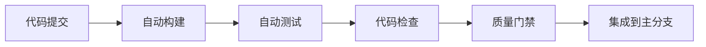
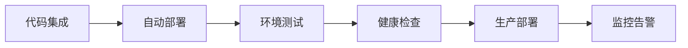

# LLMChat CI/CD 团队培训材料

## 📚 培训大纲

### 目标受众
- **开发工程师**: 了解CI/CD流程和最佳实践
- **运维工程师**: 掌握自动化部署和监控
- **测试工程师**: 熟悉自动化测试策略
- **技术负责人**: 理解整体CI/CD架构和决策

### 培训目标
- 理解CI/CD的基本概念和重要性
- 掌握LLMChat的CI/CD配置和最佳实践
- 具备故障排查和性能优化的能力
- 建立持续改进的思维方式

## 🎯 模块1: CI/CD基础概念

### 1.1 CI/CD概述
#### 学习目标
- 理解CI/CD的定义和价值
- 了解CI/CD的发展历程
- 掌握CI/CD的核心原则

#### 学习内容
**CI (Continuous Integration)**


**CD (Continuous Deployment)**


#### 实践练习
1. 分析现有CI/CD流程
2. 识别改进机会
3. 设计新的CI/CD架构

### 1.2 DevOps文化
#### 学习目标
- 理解DevOps文化的核心价值
- 掌握团队协作的最佳实践
- 建立持续改进的文化

#### 学习内容
**DevOps文化要素**
- **协作文化**: 开发、测试、运维的紧密协作
- **自动化文化**: 减少手动操作，提高效率
- **反馈文化**: 快速反馈，持续改进
- **学习文化**: 持续学习，知识分享

#### 案例分析
- Netflix的DevOps实践
- Amazon的CI/CD实践
- Google的SRE实践

## 🧪 模块2: 工具和技术栈

### 2.1 GitHub Actions深度学习
#### 学习目标
- 掌握GitHub Actions的核心概念
- 理解工作流语法和配置
- 学会编写复杂的CI/CD工作流

#### 学习内容
**GitHub Actions组件**
- **工作流(Workflow)**: 定义自动化流程
- **作业(Job)**: 并行执行的任务
- **步骤(Step)**: 具体的操作指令
- **行动器(Action)**: 可复用的操作组件

#### 实践练习
```yaml
# 基础工作流示例
name: CI Pipeline
on: [push, pull_request]

jobs:
  test:
    runs-on: ubuntu-latest
    steps:
      - name: Checkout code
        uses: actions/checkout@v4

      - name: Setup Node.js
        uses: actions/setup-node@v4
        with:
          node-version: '20'

      - name: Install dependencies
        run: npm install

      - name: Run tests
        run: npm test
```

### 2.2 Docker容器化
#### 学习目标
- 理解Docker的核心概念
- 掌握Dockerfile编写技巧
- 学会多阶段构建优化

#### 学习内容
**Docker核心概念**
- **镜像(Image)**: 应用的打包格式
- **容器(Container)**: 运行时的执行环境
- **仓库(Repository)**: 镜像的存储位置
- **Dockerfile**: 构建镜像的指令文件

#### 实践练习
```dockerfile
# 多阶段构建示例
FROM node:20-alpine AS base
WORKDIR /app
COPY package*.json ./
RUN npm ci --only=production

FROM base AS builder
COPY . .
RUN npm run build

FROM node:20-alpine AS production
COPY --from=base /app/node_modules ./node_modules
COPY --from=builder /app/dist ./dist
EXPOSE 3000
CMD ["node", "dist/index.js"]
```

### 2.3 Kubernetes基础
#### 学习目标
- 理解Kubernetes的核心概念
- 掌握基本的Kubernetes资源
- 学会编写Kubernetes配置文件

#### 学习内容
**Kubernetes核心概念**
- **Pod**: 最小的部署单元
- **Service**: 服务发现和负载均衡
- **Deployment**: 应用部署和管理
- **ConfigMap/Secret**: 配置和密钥管理

## 🔍 模块3: 质量保证

### 3.1 自动化测试策略
#### 学习目标
- 理解测试金字塔的概念
- 掌握不同类型的自动化测试
- 学会设计有效的测试策略

#### 学习内容
**测试金字塔**
```
    E2E Tests (10%)
       ↑
Integration Tests (20%)
       ↑
   Unit Tests (70%)
```

#### 实践练习
- 编写单元测试
- 设计集成测试
- 实现端到端测试

### 3.2 代码质量检查
#### 学习目标
- 理解代码质量的重要性
- 掌握静态代码分析工具
- 学会配置质量门禁

#### 学习内容
**代码质量工具**
- **ESLint**: JavaScript代码规范检查
- **TypeScript**: 类型安全检查
- **SonarQube**: 代码质量分析
- **Security Scanners**: 安全漏洞扫描

### 3.3 安全检查
#### 学习目标
- 理解应用安全的重要性
- 掌握安全扫描工具
- 学会配置安全策略

#### 学习内容
**安全检查工具**
- **Dependency Scanning**: 依赖漏洞扫描
- **Static Analysis**: 静态代码安全分析
- **Secret Detection**: 敏感信息检测
- **Container Scanning**: 容器镜像安全扫描

## 🚀 模块4: 自动化部署

### 4.1 部署策略
#### 学习目标
- 理解不同的部署策略
- 掌握各种部署方式的实现
- 学会选择合适的部署策略

#### 学习内容
**部署策略对比**
| 策略 | 优点 | 缺点 | 适用场景 |
|------|------|------|----------|
| Rolling | 简单，资源占用少 | 部署时间长，可能有服务中断 | 低风险更新 |
| Blue-Green | 零停机，快速回滚 | 需要双倍资源 | 高可用要求 |
| Canary | 风险低，逐步验证 | 配置复杂，监控要求高 | 重大变更 |

### 4.2 环境管理
#### 学习目标
- 理解多环境部署的概念
- 掌握环境隔离策略
- 学会环境配置管理

#### 学习内容
**环境类型**
- **开发环境**: 开发和测试
- **测试环境**: 集成测试和验证
- **预生产环境**: 生产前验证
- **生产环境**: 正式运行环境

### 4.3 发布管理
#### 学习目标
- 理解发布管理的流程
- 掌握发布策略的选择
- 学会发布风险的控制

#### 学习内容
**发布策略**
- **功能开关**: 通过配置控制功能
- **金丝雀发布**: 逐步发布验证
- **A/B测试**: 对比不同版本效果
- **蓝绿发布**: 无缝切换部署

## 📊 模块5: 监控和告警

### 5.1 监控系统
#### 学习目标
- 理解监控系统的重要性
- 掌握监控指标的收集
- 学会配置监控仪表板

#### 学习内容
**监控类型**
- **基础设施监控**: 服务器、网络、存储
- **应用监控**: 应用性能、错误率、响应时间
- **业务监控**: 用户行为、业务指标
- **安全监控**: 安全事件、漏洞扫描

#### 实践练习
- 配置Prometheus指标收集
- 设置Grafana监控仪表板
- 实现告警规则配置

### 5.2 日志管理
#### 学习目标
- 理解日志管理的重要性
- 掌握日志收集和分析
- 学会日志查询和检索

#### 学习内容
**日志类型**
- **应用日志**: 应用运行日志
- **访问日志**: 用户访问记录
- **错误日志**: 错误和异常记录
- **审计日志**: 操作审计记录

### 5.3 性能优化
#### 学习目标
- 理解性能优化的方法
- 掌握性能分析工具
- 学会性能瓶颈识别

#### 学习内容
**性能优化技术**
- **前端优化**: 代码分割、懒加载、缓存策略
- **后端优化**: 数据库优化、缓存机制、异步处理
- **网络优化**: CDN使用、压缩算法、协议优化

## 🔄 模块6: 故障恢复

### 6.1 故障检测
#### 学习目标
- 理解故障检测的重要性
- 掌握故障检测的方法
- 学会配置自动检测规则

#### 学习内容
**检测方法**
- **健康检查**: 应用健康状态检测
- **监控告警**: 异常情况告警
- **用户反馈**: 用户体验问题反馈
- **自动化检测**: 智能故障检测

### 6.2 故障恢复
#### 学习目标
- 理解故障恢复的策略
- 掌握自动恢复的实现
- 学会故障分析和预防

#### 学习内容
**恢复策略**
- **自动回滚**: 自动恢复到稳定版本
- **手动回滚**: 手动执行恢复操作
- **部分恢复**: 只恢复受影响的功能
- **完全恢复**: 恢复整个系统

### 6.3 灾难恢复
#### 学习目标
- 理解灾难恢复的重要性
- 掌握备份和恢复策略
- 学会灾难恢复计划制定

#### 学习内容
**恢复策略**
- **数据备份**: 定期数据备份
- **系统备份**: 系统配置备份
- **异地容灾**: 多地域部署
- **业务连续性**: 业务不中断

## 🛠️ 模块7: 工具和技巧

### 7.1 调试技巧
#### 学习目标
- 掌握常见的调试方法
- 学会使用调试工具
- 提高问题定位效率

#### 学习内容
**调试工具**
- **IDE调试**: 集成开发环境调试
- **浏览器调试**: 前端调试工具
- **日志调试**: 通过日志分析问题
- **远程调试**: 远程环境调试

### 7.2 性能分析
#### 学习目标
- 掌握性能分析的方法
- 学会使用性能分析工具
- 提高性能问题定位能力

#### 学习内容
**分析工具**
- **前端性能**: Lighthouse、Chrome DevTools
- **后端性能**: Node.js Profiler、APM工具
- **数据库性能**: 查询分析、索引优化
- **网络性能**: 网络分析、CDN优化

### 7.3 自动化技巧
#### 学习目标
- 掌握自动化脚本编写
- 学会使用自动化工具
- 提高工作效率

#### 学习内容
**自动化工具**
- **脚本语言**: Shell、Python、Node.js
- **任务调度**: Cron、Jenkins、GitHub Actions
- **配置管理**: Ansible、Terraform、Docker Compose
- **监控工具**: Prometheus、Grafana、ELK Stack

## 📈 模块8: 持续改进

### 8.1 性能优化
#### 学习目标
- 理解性能优化的方法
- 掌握性能优化的工具
- 学会性能优化的实践

#### 学习内容
**优化方法**
- **代码优化**: 算法优化、数据结构优化
- **架构优化**: 微服务拆分、缓存策略
- **基础设施优化**: 资源配置、网络优化
- **数据库优化**: 查询优化、索引优化

### 8.2 流程优化
#### 学习目标
- 理解流程优化的方法
- 掌握流程分析工具
- 学会流程改进技巧

#### 学习内容
**优化方法**
- **价值流图**: 分析流程价值
- **瓶颈识别**: 识别流程瓶颈
- **自动化改进**: 提高自动化水平
- **持续改进**: 持续优化流程

### 8.3 团队学习
#### 学习目标
- 建立团队学习文化
- 掌握知识分享方法
- 学会持续学习技巧

#### 学习内容
**学习方法**
- **技术分享**: 定期技术分享
- **代码审查**: 相互代码审查
- **培训学习**: 团队培训活动
- **外部交流**: 参加技术大会

## 📚 学习资源

### 推荐书籍
1. **《持续交付》** - Jez Humble 和 David Farley
2. **《DevOps Handbook》** - Gene Kim, Jez Humble, Patrick Debois
3. **《Site Reliability Engineering》** - Betsy Beyer, Chris Jones, Jennifer Petoff
4. **《Accelerate》 - Nicole Forsgren, Jez Humble, Gene Kim

### 在线课程
1. **GitHub Actions官方文档**
2. **Docker官方教程**
3. **Kubernetes官方文档**
4. **CNCF认证课程**

### 社区资源
1. **GitHub Community**
2. **Docker Community**
3. **Kubernetes Community**
4. **DevOps社区**

## 🎯 考核项目

### 项目1: CI/CD流程优化
**目标**: 优化现有CI/CD流程
**任务**:
- 分析现有流程瓶颈
- 设计优化方案
- 实施改进措施
- 验证优化效果

### 项目2: 监控系统建设
**目标**: 建立完整的监控体系
**任务**:
- 设计监控架构
- 配置监控工具
- 创建监控仪表板
- 实现告警机制

### 项目3: 性能优化实践
**目标**: 提升应用性能
**任务**:
- 性能基准测试
- 识别性能瓶颈
- 实施优化措施
- 验证优化效果

### 项目4: 自动化测试扩展
**目标**: 扩展自动化测试覆盖
**任务**:
- 分析测试覆盖现状
- 设计测试策略
- 实施新的测试
- 提升测试覆盖率

## 📋 培训评估

### 评估方式
- **理论考试**: 概念理解和知识掌握
- **实践操作**: 工具使用和配置实践
- **项目实战**: 实际项目应用能力
- **综合评估**: 整体能力评估

### 评估标准
- **优秀(90-100分)**: 全面掌握，能够独立设计和实施
- **良好(80-89分)**: 基本掌握，能够在指导下实施
- **合格(70-79分)**: 初步掌握，需要进一步学习
- **不合格(<70分)**: 需要重新学习

## 🎓 结业要求

### 技能要求
- 独立设计和实施CI/CD流程
- 熟练使用相关工具和技术
- 具备故障排查和优化能力
- 建立持续改进的思维方式

### 实践要求
- 完成所有实践项目
- 通过所有技能评估
- 具备独立工作的能力
- 能够指导团队成员

---

*培训材料持续更新，最后更新时间: 2025-10-18*