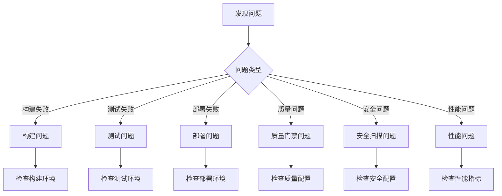

# LLMChat CI/CD 故障排除指南

> **版本**: 1.0.0
> **最后更新**: 2025-10-18
> **状态**: 生产就绪
> **适用范围**: CI/CD流水线故障诊断和解决方案

---

## 📋 目录

1. [快速诊断流程](#快速诊断流程)
2. [构建问题诊断](#构建问题诊断)
3. [测试问题诊断](#测试问题诊断)
4. [部署问题诊断](#部署问题诊断)
5. [质量门禁问题](#质量门禁问题)
6. [安全扫描问题](#安全扫描问题)
7. [性能问题诊断](#性能问题诊断)
8. [监控告警处理](#监控告警处理)
9. [应急响应预案](#应急响应预案)
10. [常见FAQ](#常见faq)

---

## 🔍 快速诊断流程

### 1. 问题分类



### 2. 快速检查清单

**环境检查**:
```bash
# 1. 基础环境
node --version && pnpm --version
git status

# 2. 依赖状态
pnpm ls --depth=0
pnpm audit

# 3. 配置验证
pnpm run validate:env
pnpm run type-check
```

**系统状态检查**:
```bash
# 1. 服务状态
systemctl status nginx
systemctl status pm2

# 2. 端口占用
netstat -tlnp | grep -E ":(3000|3001|80|443)"

# 3. 磁盘空间
df -h
du -sh /var/log
```

---

## 🔧 构建问题诊断

### 1. TypeScript编译错误

**常见错误类型**:
```typescript
// 错误1: 类型不匹配
error TS2322: Type 'string' is not assignable to type 'number'

// 错误2: 模块找不到
error TS2307: Cannot find module 'module-name' or its corresponding type declarations

// 错误3: 属性不存在
error TS2339: Property 'property' does not exist on type 'Type'
```

**诊断步骤**:
```bash
# 1. 详细编译检查
pnpm run type-check --verbose

# 2. 检查特定文件
npx tsc --noEmit --skipLibCheck src/problematic-file.ts

# 3. 清理缓存重新编译
rm -rf .tsbuildinfo
pnpm run build
```

**解决方案**:
```typescript
// 修复类型不匹配
const value: string = "123";
const number: number = parseInt(value, 10); // 正确的类型转换

// 修复模块导入
import type { SomeType } from './types'; // 使用import type
import { someFunction } from './utils'; // 运行时导入

// 修复属性不存在
interface User {
  name: string;
  age?: number; // 使用可选属性
}
```

### 2. ESLint错误

**常见错误**:
```javascript
// 错误1: 未使用变量
error 'unused-var' 'no-unused-vars'

// 错误2: 缺少分号
error 'missing-semi' 'semi'

// 错误3: 字符串拼接
error 'prefer-template' 'prefer-template'
```

**诊断命令**:
```bash
# 详细错误输出
pnpm run lint -- --format=verbose

# 检查特定规则
pnpm run lint -- --rule='no-unused-vars'

# 自动修复可修复的错误
pnpm run lint:fix
```

**修复策略**:
```javascript
// 修复未使用变量
const unusedVariable = 'value'; // ❌
// 删除或添加下划线前缀
const _unusedVariable = 'value'; // ✅

// 修复字符串拼接
const message = 'Hello ' + name; // ❌
const message = `Hello ${name}`; // ✅

// 修复函数声明
function oldFunction() { // ❌ 命名函数
  return 'value';
}

const newFunction = () => { // ✅ 箭头函数
  return 'value';
};
```

### 3. 依赖安装问题

**常见错误**:
```bash
# 错误1: 网络超时
npm ERR! network timeout

# 错误2: 权限问题
npm ERR! code EACCES

# 错误3: 版本冲突
npm ERR! peer dep missing
```

**解决方案**:
```bash
# 1. 清理缓存
pnpm store prune
rm -rf node_modules

# 2. 重新安装
pnpm install --force

# 3. 使用镜像源
pnpm config set registry https://registry.npmmirror.com/

# 4. 检查权限
sudo chown -R $(whoami) node_modules
```

---

## 🧪 测试问题诊断

### 1. 单元测试失败

**常见问题**:
```javascript
// 问题1: 异步测试超时
Error: Test timeout of 5000ms exceeded

// 问题2: Mock不正确
TypeError: mockFunction is not a function

// 问题3: 环境变量缺失
ReferenceError: process.env is not defined
```

**诊断步骤**:
```bash
# 1. 运行特定测试
pnpm test -- --testNamePattern="specific test"

# 2. 详细输出
pnpm test -- --verbose

# 3. 调试模式
pnpm test -- --inspect-brk
```

**修复示例**:
```javascript
// 修复异步测试
test('async function', async () => {
  const result = await asyncFunction();
  expect(result).toBe('expected');
}, 10000); // 增加超时时间

// 修复Mock
jest.mock('./module', () => ({
  functionToMock: jest.fn(() => 'mocked value')
}));

// 修复环境变量
process.env.NODE_ENV = 'test';
```

### 2. 集成测试失败

**常见问题**:
- 数据库连接失败
- 外部服务不可用
- 端口冲突
- 超时问题

**诊断脚本**:
```bash
#!/bin/bash
# test-env-check.sh

echo "🔍 检查测试环境..."

# 检查数据库连接
if ! nc -z localhost 5432; then
  echo "❌ 数据库端口5432不可用"
  exit 1
fi

# 检查Redis连接
if ! nc -z localhost 6379; then
  echo "❌ Redis端口6379不可用"
  exit 1
fi

# 检查测试端口占用
if netstat -tlnp | grep -q :3001; then
  echo "❌ 端口3001被占用"
  exit 1
fi

echo "✅ 测试环境检查通过"
```

### 3. E2E测试失败

**常见问题**:
- 浏览器启动失败
- 页面加载超时
- 元素定位失败
- 网络请求失败

**诊断和修复**:
```javascript
// playwright.config.ts
export default {
  timeout: 30000, // 增加超时时间
  retries: 2, // 添加重试
  use: {
    headless: process.env.CI === 'true',
    viewport: { width: 1280, height: 720 },
    ignoreHTTPSErrors: true, // 忽略HTTPS错误
  },
  projects: [
    {
      name: 'chromium',
      use: { ...devices['Desktop Chrome'] },
    },
  ],
};

// 修复元素定位
test('element interaction', async ({ page }) => {
  // 等待元素可见
  await page.waitForSelector('[data-testid="submit-button"]', {
    state: 'visible',
    timeout: 10000
  });

  // 点击元素
  await page.click('[data-testid="submit-button"]');
});
```

---

## 🚀 部署问题诊断

### 1. 构建产物问题

**检查构建产物**:
```bash
# 1. 检查构建文件
ls -la backend/dist/
ls -la frontend/dist/

# 2. 验证文件完整性
find backend/dist -name "*.js" -exec node -c {} \;
find frontend/dist -name "*.js" -exec node -c {} \;

# 3. 检查文件大小
du -sh backend/dist frontend/dist
```

**常见构建问题**:
```bash
# 问题1: 静态资源404
# 解决: 检查public目录配置
ls -la frontend/public/
ls -la frontend/dist/

# 问题2: 路径配置错误
# 解决: 检查vite.config.ts中的base配置
export default defineConfig({
  base: process.env.NODE_ENV === 'production' ? '/subpath/' : '/',
});

# 问题3: 环境变量未注入
# 解决: 检查.env文件和构建脚本
cat frontend/.env.production
```

### 2. 服务启动问题

**诊断服务状态**:
```bash
# 1. 检查PM2状态
pm2 status
pm2 logs llmchat-backend --lines 50

# 2. 检查Nginx状态
sudo nginx -t
sudo systemctl status nginx
sudo tail -50 /var/log/nginx/error.log

# 3. 检查端口占用
sudo netstat -tlnp | grep -E ":(80|443|3001)"
```

**常见启动错误**:
```bash
# 错误1: 端口被占用
Error: listen EADDRINUSE :::3001

# 解决: 查找并杀死占用进程
lsof -ti:3001 | xargs kill -9

# 错误2: 环境变量缺失
ReferenceError: DATABASE_URL is not defined

# 解决: 检查.env文件
cat .env | grep DATABASE_URL

# 错误3: 权限问题
Error: EACCES: permission denied

# 解决: 修改文件权限
chmod +x scripts/deploy.sh
sudo chown -R $USER:$USER /var/log/app
```

### 3. 反向代理问题

**Nginx配置诊断**:
```bash
# 1. 测试Nginx配置
sudo nginx -t

# 2. 重新加载配置
sudo nginx -s reload

# 3. 检查访问日志
sudo tail -f /var/log/nginx/access.log

# 4. 检查错误日志
sudo tail -f /var/log/nginx/error.log
```

**常见代理问题**:
```nginx
# 问题1: 502 Bad Gateway
# 解决: 检查后端服务状态
upstream backend {
    server localhost:3001;
    keepalive 32;
}

server {
    location /api/ {
        proxy_pass http://backend;
        proxy_http_version 1.1;
        proxy_set_header Upgrade $http_upgrade;
        proxy_set_header Connection 'upgrade';
        proxy_set_header Host $host;
        proxy_cache_bypass $http_upgrade;
    }
}

# 问题2: CORS错误
# 解决: 添加CORS头
location /api/ {
    proxy_pass http://backend;
    add_header Access-Control-Allow-Origin *;
    add_header Access-Control-Allow-Methods "GET, POST, PUT, DELETE, OPTIONS";
    add_header Access-Control-Allow-Headers "Content-Type, Authorization";

    if ($request_method = 'OPTIONS') {
        return 204;
    }
}
```

---

## 📊 质量门禁问题

### 1. 质量评分不达标

**检查质量评分详情**:
```bash
# 运行详细质量评分
pnpm run enterprise:score --format detailed

# 检查各维度评分
node scripts/enterprise-quality-scoring.js --dimensions all

# 生成HTML报告
pnpm run enterprise:score --output html --file quality-report.html
```

**常见质量问题**:
```javascript
// 问题1: 代码覆盖率不足
// 解决: 增加测试用例
describe('New Feature', () => {
  test('should handle edge cases', () => {
    // 测试边界条件
    expect(functionUnderTest(null)).toThrow();
    expect(functionUnderTest(undefined)).toThrow();
    expect(functionUnderTest('')).toBe('default');
  });
});

// 问题2: 复杂度过高
// 解决: 重构复杂函数
// 原始代码 (圈复杂度 > 10)
function complexFunction(data) {
  if (data.type === 'A') {
    if (data.status === 'active') {
      if (data.priority === 'high') {
        // 复杂逻辑
      }
    }
  }
}

// 重构后
function complexFunction(data) {
  if (!isValidData(data)) return null;

  return processByType(data);
}

function isValidData(data) {
  return data?.type && data?.status;
}

function processByType(data) {
  const handlers = {
    'A': processTypeA,
    'B': processTypeB,
  };

  return handlers[data.type]?.(data);
}
```

### 2. 性能回归检测

**性能基准测试**:
```bash
# 运行性能测试
pnpm run test:perf

# 对比性能基准
node scripts/performance-benchmark.js --compare

# 生成性能报告
pnpm run test:perf --report
```

**性能优化方案**:
```javascript
// 问题1: 构建时间过长
// 解决: 优化构建配置
// vite.config.ts
export default defineConfig({
  build: {
    rollupOptions: {
      output: {
        manualChunks: {
          vendor: ['react', 'react-dom'],
          utils: ['lodash', 'date-fns'],
        },
      },
    },
  },
});

// 问题2: 包大小过大
// 解决: 代码分割和懒加载
const LazyComponent = lazy(() => import('./LazyComponent'));

// 问题3: 运行时性能差
// 解决: 使用React.memo和useMemo
const ExpensiveComponent = React.memo(({ data }) => {
  const processedData = useMemo(() => {
    return expensiveCalculation(data);
  }, [data]);

  return <div>{processedData}</div>;
});
```

---

## 🔒 安全扫描问题

### 1. 依赖漏洞

**扫描依赖漏洞**:
```bash
# 详细漏洞扫描
pnpm audit --audit-level moderate

# 生成漏洞报告
pnpm audit --json > audit-report.json

# 自动修复漏洞
pnpm audit fix
```

**漏洞修复策略**:
```bash
# 1. 更新有漏洞的包
pnpm update package-with-vulnerability

# 2. 使用安全版本
pnpm add package@safe-version

# 3. 暂时忽略低危漏洞
echo "package-name@version" >> .npmignore
pnpm audit --audit-level high
```

### 2. 代码安全问题

**Semgrep扫描修复**:
```bash
# 运行安全扫描
npx semgrep --config=auto .

# 修复特定规则
npx semgrep --config=security .
```

**常见安全问题修复**:
```javascript
// 问题1: 硬编码密钥
const apiKey = "hardcoded-secret-key"; // ❌

// 解决: 使用环境变量
const apiKey = process.env.API_KEY; // ✅

// 问题2: SQL注入风险
const query = `SELECT * FROM users WHERE id = ${userId}`; // ❌

// 解决: 使用参数化查询
const query = 'SELECT * FROM users WHERE id = ?';
db.query(query, [userId]); // ✅

// 问题3: XSS漏洞
element.innerHTML = userInput; // ❌

// 解决: 使用textContent
element.textContent = userInput; // ✅
// 或使用DOMPurify
import DOMPurify from 'dompurify';
element.innerHTML = DOMPurify.sanitize(userInput); // ✅
```

---

## ⚡ 性能问题诊断

### 1. 响应时间慢

**性能分析工具**:
```bash
# 1. 数据库性能分析
psql -U user -d database -c "
SELECT query, mean_exec_time, calls, total_exec_time
FROM pg_stat_statements
ORDER BY mean_exec_time DESC
LIMIT 10;"

# 2. 应用性能分析
npm install -g clinic
clinic doctor -- node dist/index.js

# 3. 内存使用分析
node --inspect dist/index.js
# 在Chrome DevTools中分析
```

**性能优化措施**:
```javascript
// 数据库查询优化
// 原始查询 (慢)
const users = await User.findAll({
  include: [{ model: Profile }, { model: Orders }]
});

// 优化后 (快)
const users = await User.findAll({
  attributes: ['id', 'name', 'email'],
  include: [
    {
      model: Profile,
      attributes: ['avatar', 'bio']
    },
    {
      model: Orders,
      attributes: ['id', 'total'],
      where: { status: 'completed' }
    }
  ]
});

// 缓存策略
const cache = new Map();

async function getUserWithCache(id) {
  if (cache.has(id)) {
    return cache.get(id);
  }

  const user = await User.findById(id);
  cache.set(id, user);

  // 设置缓存过期
  setTimeout(() => cache.delete(id), 300000);

  return user;
}
```

### 2. 内存泄漏

**内存泄漏检测**:
```bash
# 1. 监控内存使用
pm2 monit

# 2. 生成堆快照
node --heap-prof dist/index.js

# 3. 分析内存使用
node --inspect dist/index.js
# Chrome DevTools > Memory > Take Heap Snapshot
```

**内存泄漏修复**:
```javascript
// 问题1: 事件监听器未移除
useEffect(() => {
  const handleResize = () => {
    // 处理逻辑
  };

  window.addEventListener('resize', handleResize);

  // 忘记移除监听器会导致内存泄漏
  return () => {
    window.removeEventListener('resize', handleResize); // ✅ 正确清理
  };
}, []);

// 问题2: 定时器未清理
useEffect(() => {
  const timer = setInterval(() => {
    // 定时逻辑
  }, 1000);

  return () => {
    clearInterval(timer); // ✅ 清理定时器
  };
}, []);

// 问题3: 闭包导致内存泄漏
function createLeakyFunction() {
  const largeData = new Array(1000000).fill('data');

  return function() {
    // 闭包引用largeData，导致largeData无法被回收
    console.log(largeData.length);
  };
}

// 解决: 避免在闭包中引用大对象
function createOptimizedFunction() {
  return function() {
    // 只引用必要的数据
    console.log(1000000);
  };
}
```

---

## 🚨 监控告警处理

### 1. P0级别告警处理

**响应流程**:
```bash
# 1. 立即检查服务状态
curl -f https://api.yourdomain.com/health
curl -f https://yourdomain.com/health

# 2. 检查系统负载
uptime
top -n 1 | head -5
free -h

# 3. 检查错误日志
tail -100 /var/log/nginx/error.log
pm2 logs llmchat-backend --lines 50

# 4. 快速回滚 (如果需要)
pm2 reload llmchat-backend
# 或
git checkout previous-stable-tag
pnpm run deployment:production
```

### 2. 告警分级处理

**告警分类处理**:
```yaml
# P0 - 系统不可用 (15分钟内响应)
actions:
  - 立即通知所有开发人员
  - 启动应急响应团队
  - 执行快速回滚或修复
  - 持续监控直到恢复

# P1 - 核心功能异常 (1小时内响应)
actions:
  - 通知相关开发人员
  - 分析问题根因
  - 制定修复计划
  - 安排修复时间

# P2 - 非核心功能异常 (4小时内响应)
actions:
  - 创建问题任务
  - 分配给相关开发人员
  - 纳入开发计划
  - 定期跟踪进度

# P3 - 性能下降或警告 (24小时内响应)
actions:
  - 记录到监控仪表板
  - 分析性能趋势
  - 制定优化计划
  - 在下个迭代中处理
```

---

## 🆘 应急响应预案

### 1. 系统完全不可用

**应急响应步骤**:
```bash
#!/bin/bash
# emergency-response.sh

echo "🚨 系统不可用 - 应急响应开始"

# 1. 快速诊断
echo "🔍 执行快速诊断..."
systemctl status nginx
pm2 status
curl -s https://api.yourdomain.com/health || echo "API不可用"
curl -s https://yourdomain.com/health || echo "前端不可用"

# 2. 立即回滚
echo "🔄 执行紧急回滚..."
git checkout previous-stable-tag
pnpm run build
pm2 reload llmchat-backend

# 3. 验证恢复
echo "✅ 验证系统恢复..."
sleep 10
if curl -f https://api.yourdomain.com/health; then
  echo "✅ 系统已恢复"
else
  echo "❌ 系统仍不可用，需要人工介入"
  # 发送紧急通知
  curl -X POST "https://hooks.slack.com/..." \
    -d '{"text":"🚨 系统不可用，需要立即人工介入"}'
fi

echo "📊 应急响应完成"
```

### 2. 数据库连接问题

**数据库问题诊断**:
```bash
# 1. 检查数据库状态
sudo systemctl status postgresql
pg_isready -h localhost -p 5432

# 2. 检查连接数
psql -U user -d database -c "
SELECT count(*) as active_connections
FROM pg_stat_activity
WHERE state = 'active';"

# 3. 检查慢查询
psql -U user -d database -c "
SELECT query, mean_exec_time, calls
FROM pg_stat_statements
WHERE mean_exec_time > 1000
ORDER BY mean_exec_time DESC
LIMIT 10;"

# 4. 重启数据库服务 (如果需要)
sudo systemctl restart postgresql
```

### 3. 安全事件响应

**安全事件处理流程**:
```bash
#!/bin/bash
# security-incident-response.sh

echo "🔒 安全事件响应开始"

# 1. 立即隔离
echo "🚨 立即隔离受影响系统..."
iptables -A INPUT -s [攻击IP] -j DROP
systemctl stop nginx

# 2. 收集证据
echo "📸 收集安全证据..."
cp /var/log/nginx/access.log /tmp/security-access-$(date +%Y%m%d%H%M%S).log
cp /var/log/nginx/error.log /tmp/security-error-$(date +%Y%m%d%H%M%S).log

# 3. 安全扫描
echo "🔍 执行安全扫描..."
npx semgrep --config=security . > /tmp/security-scan-$(date +%Y%m%d%H%M%S).json

# 4. 修复和恢复
echo "🛠️ 修复安全问题..."
pnpm audit fix
pnpm run build
systemctl start nginx

echo "✅ 安全事件响应完成"
```

---

## ❓ 常见FAQ

### Q1: 为什么质量评分突然下降？

**可能原因**:
- 新增了大量未测试的代码
- 引入了有安全漏洞的依赖
- 代码复杂度增加
- 构建时间变长

**诊断步骤**:
```bash
# 查看详细评分报告
pnpm run enterprise:score --format detailed

# 对比历史评分
node scripts/quality-score-comparison.js --days 7

# 检查具体问题
pnpm run enterprise:score --problems-only
```

### Q2: 如何处理测试覆盖率下降？

**解决方案**:
```bash
# 1. 生成覆盖率报告
pnpm run test:coverage

# 2. 查看未覆盖的文件
npx nyc report --reporter=text-summary

# 3. 生成HTML报告详细查看
open coverage/lcov-report/index.html

# 4. 添加缺失的测试
# 根据报告添加相应的测试用例
```

### Q3: 部署后出现502错误怎么办？

**排查步骤**:
```bash
# 1. 检查后端服务状态
pm2 status
pm2 logs llmchat-backend --lines 50

# 2. 检查Nginx配置
sudo nginx -t
sudo tail -50 /var/log/nginx/error.log

# 3. 检查端口连通性
curl -I http://localhost:3001/health

# 4. 重启服务
pm2 restart llmchat-backend
sudo systemctl reload nginx
```

### Q4: 如何解决内存使用过高的问题？

**诊断和解决**:
```bash
# 1. 监控内存使用
pm2 monit

# 2. 生成堆快照
node --heap-prof dist/index.js

# 3. 分析内存泄漏
node --inspect dist/index.js
# 使用Chrome DevTools Memory分析

# 4. 优化代码
# 查找并修复内存泄漏问题
```

### Q5: 安全扫描发现高危漏洞怎么处理？

**处理流程**:
```bash
# 1. 立即评估影响
pnpm audit --audit-level high

# 2. 查看具体漏洞详情
npm audit --json > audit-report.json
cat audit-report.json | jq '.vulnerabilities'

# 3. 修复漏洞
pnpm audit fix
# 或手动更新有问题的包
pnpm update vulnerable-package

# 4. 验证修复
pnpm audit --audit-level moderate
```

---

## 📞 联系方式

### 技术支持
- **紧急热线**: +86-xxx-xxxx-xxxx
- **技术支持邮箱**: support@yourdomain.com
- **Slack频道**: #emergency-support

### 升级路径
- **P0问题** -> 技术负责人 -> CTO -> CEO
- **P1问题** -> 技术负责人 -> CTO
- **P2问题** -> 团队负责人 -> 技术负责人
- **P3问题** -> 团队内部处理

---

**文档维护**: 本文档随系统更新持续维护，最后更新时间: 2025-10-18

**版本历史**:
- v1.0.0 (2025-10-18): 初始版本，完整故障排除指南
- 后续版本将根据实际问题补充更多解决方案

---

*本指南帮助快速诊断和解决CI/CD流水线中的常见问题，确保系统稳定运行。*