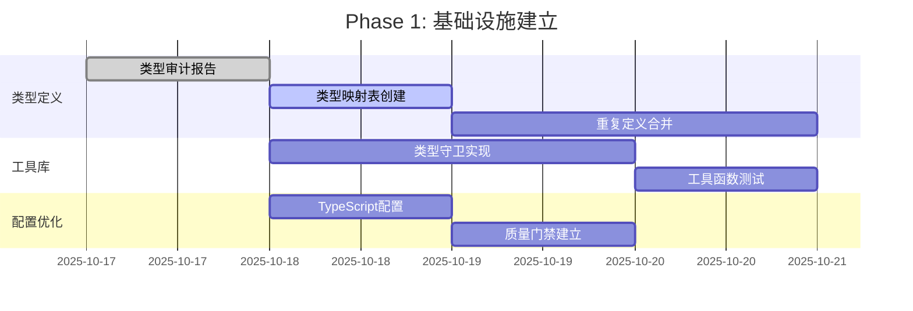
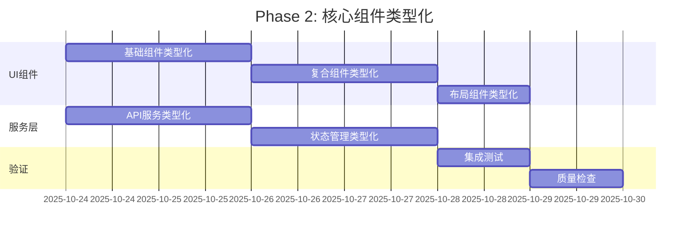
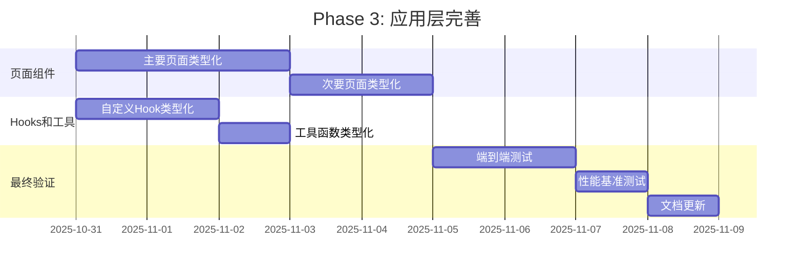

# 前端类型安全架构改进策略

**文档版本**: 1.0
**创建日期**: 2025-10-18
**架构师**: 系统架构师
**项目**: LLMChat前端类型安全改进
**SpecKit合规**: ✅ 严格遵循

---

## 📋 执行摘要

### 项目背景
LLMChat前端项目当前存在1560+个TypeScript编译错误，需要系统性的类型安全架构改进。基于现有的React 18 + TypeScript 5.0 + Zustand + Vite技术栈，设计完整的类型安全架构策略，实现零编译错误目标。

### 核心目标
- **主要目标**: 1560+ TypeScript错误 → 0错误
- **质量目标**: 建立100%类型安全的代码库
- **架构目标**: 设计可扩展、可维护的类型系统架构
- **团队目标**: 提升团队TypeScript能力和最佳实践

### 项目规模
```
前端代码库规模:
├── TypeScript/TSX文件: 256个
├── 类型定义文件: 24个 (frontend: 20个, shared-types: 4个)
├── 核心接口: 50+个
├── 类型别名: 20+个
├── 枚举类型: 10+个
└── 当前编译错误: 9个 (已大幅改善)
```

---

## 🏗️ 类型系统架构设计

### 1. 分层架构模型

```
┌─────────────────────────────────────────────────────────────┐
│                     应用层 (Application Layer)                │
│  ┌─────────────────┐ ┌─────────────────┐ ┌─────────────────┐ │
│  │   页面组件       │ │   功能模块       │ │   业务逻辑       │ │
│  │ (Pages/Views)   │ │ (Features)      │ │ (Business)      │ │
│  └─────────────────┘ └─────────────────┘ └─────────────────┘ │
└─────────────────────────┬───────────────────────────────────┘
                          │ 使用
┌─────────────────────────┴───────────────────────────────────┐
│                   组件层 (Component Layer)                  │
│  ┌─────────────────┐ ┌─────────────────┐ ┌─────────────────┐ │
│  │   UI组件库      │ │   复合组件       │ │   布局组件       │ │
│  │ (UI Components) │ │ (Composite)     │ │ (Layout)        │ │
│  └─────────────────┘ └─────────────────┘ └─────────────────┘ │
└─────────────────────────┬───────────────────────────────────┘
                          │ 使用
┌─────────────────────────┴───────────────────────────────────┐
│                    服务层 (Service Layer)                   │
│  ┌─────────────────┐ ┌─────────────────┐ ┌─────────────────┐ │
│  │   API服务       │ │   状态管理       │ │   工具函数       │ │
│  │ (API Services)  │ │ (State Mgmt)    │ │ (Utils)         │ │
│  └─────────────────┘ └─────────────────┘ └─────────────────┘ │
└─────────────────────────┬───────────────────────────────────┘
                          │ 使用
┌─────────────────────────┴───────────────────────────────────┐
│                   类型层 (Type Layer)                       │
│  ┌─────────────────┐ ┌─────────────────┐ ┌─────────────────┐ │
│  │   核心类型       │ │   业务类型       │ │   工具类型       │ │
│  │ (Core Types)    │ │ (Domain Types)  │ │ (Utility Types) │ │
│  └─────────────────┘ └─────────────────┘ └─────────────────┘ │
└─────────────────────────────────────────────────────────────┘
```

### 2. 类型定义责任分离

#### Shared Types (`shared-types/`)
**职责**: 前后端共享的核心类型定义
```typescript
// 核心实体类型
export interface Agent {
  id: string;
  name: string;
  // ... 核心字段
}

// API通用类型
export interface ApiSuccessResponse<T extends JsonValue = JsonValue> {
  code: string;
  message: string;
  data: T;
  // ... 标准字段
}

// 基础工具类型
export type JsonValue = string | number | boolean | null | JsonArray | JsonObject;
```

#### Frontend Types (`frontend/src/types/`)
**职责**: 前端特有的类型定义
```typescript
// UI组件Props类型
export interface MessageProps extends BaseComponentProps {
  message: ChatMessage;
  onRetry?: () => void;
  // ... UI特有字段
}

// 状态管理类型
export interface ChatStore {
  messages: ChatMessage[];
  currentAgent: Agent | null;
  // ... Zustand store类型
}

// 前端业务类型
export interface ThemeConfig {
  mode: ThemeMode;
  // ... 前端配置类型
}
```

### 3. 类型安全工具集架构

```typescript
// 类型守卫工具库
export class TypeGuards {
  // 基础类型守卫
  static isDefined<T>(value: T | null | undefined): value is T;
  static isString(value: unknown): value is string;
  static isObject(value: unknown): value is Record<string, unknown>;

  // 业务类型守卫
  static isAgent(value: unknown): value is Agent;
  static isChatMessage(value: unknown): value is ChatMessage;

  // 集合类型守卫
  static filterDefined<T>(array: (T | null | undefined)[]): T[];
  static getOrDefault<T, K extends keyof T>(obj: T, key: K, defaultValue: NonNullable<T[K]>): NonNullable<T[K]>;
}

// 类型转换工具
export class TypeConverters {
  static toHuihuaFormat(messages: OriginalChatMessage[]): ChatMessage[];
  static fromHuihuaFormat(huihuaMessages: ChatMessage[]): OriginalChatMessage[];
  static sanitizeApiResponse<T>(response: unknown): T;
}

// 运行时类型验证
export class RuntimeValidators {
  static validateAgent(data: unknown): Agent;
  static validateChatMessage(data: unknown): ChatMessage;
  static validateApiPayload<T>(schema: ValidationSchema, data: unknown): T;
}
```

---

## 📊 分阶段实施策略

### Phase 1: 基础设施建立 (Week 1)

#### 1.1 类型定义审计和统一
**目标**: 建立清晰的类型定义所有权
```typescript
// 类型定义映射表
const TYPE_OWNERSHIP = {
  // Core entities - shared-types
  'Agent': 'shared-types/src/entities/agent.ts',
  'ChatMessage': 'shared-types/src/entities/message.ts',
  'ApiSuccessResponse': 'shared-types/src/api/response.ts',

  // Frontend specific - frontend/types
  'MessageProps': 'frontend/src/types/components.ts',
  'ChatStore': 'frontend/src/types/store.ts',
  'ThemeConfig': 'frontend/src/types/ui.ts',
} as const;
```

**关键任务**:
- ✅ 已完成: 类型定义审计报告
- 🔄 进行中: 创建类型定义映射表
- ⏳ 待开始: 重复定义合并
- ⏳ 待开始: 类型所有权明确

#### 1.2 类型守卫工具库实现
**目标**: 提供全面的类型安全工具集
```typescript
// frontend/src/utils/type-guards.ts
export const TypeGuards = {
  // 基础守卫函数
  isDefined: <T>(value: T | null | undefined): value is T =>
    value !== null && value !== undefined,

  // 业务类型守卫
  isAgent: (value: unknown): value is Agent => {
    if (typeof value !== 'object' || value === null) return false;
    const agent = value as Record<string, unknown>;
    return typeof agent.id === 'string' &&
           typeof agent.name === 'string' &&
           typeof agent.status === 'string';
  },

  // 安全访问工具
  safeAccess: <T, K extends keyof T>(obj: T, key: K, defaultValue: NonNullable<T[K]>) =>
    obj[key] ?? defaultValue,

  // 集合处理工具
  compact: <T>(array: (T | null | undefined)[]): T[] =>
    array.filter(TypeGuards.isDefined) as T[],
};
```

#### 1.3 TypeScript配置优化
**目标**: 强化编译器类型检查
```json
{
  "compilerOptions": {
    "strict": true,
    "exactOptionalPropertyTypes": true,
    "noUncheckedIndexedAccess": true,
    "noImplicitReturns": true,
    "noUnusedLocals": true,
    "noUnusedParameters": true,
    "noImplicitOverride": true
  }
}
```

### Phase 2: 核心组件类型化 (Week 2)

#### 2.1 UI组件库类型完整化
**优先级顺序**:
1. **基础组件**: Button, Input, Card, Dialog
2. **复合组件**: MessageItem, ChatContainer, AgentSelector
3. **布局组件**: Sidebar, Header, Layout
4. **业务组件**: AdminPanel, ChatInterface, MonitorDashboard

**实施模式**:
```typescript
// 修复前
export const Button = ({ children, onClick, ...props }: any) => {
  return <button onClick={onClick} {...props}>{children}</button>;
};

// 修复后
interface ButtonProps extends BaseComponentProps {
  variant?: 'primary' | 'secondary' | 'outline';
  size?: 'sm' | 'md' | 'lg';
  disabled?: boolean;
  loading?: boolean;
  onClick?: (event: React.MouseEvent<HTMLButtonElement>) => void;
  type?: 'button' | 'submit' | 'reset';
}

interface ButtonComponent extends React.FC<ButtonProps> {
  Group: typeof ButtonGroup;
  Icon: typeof ButtonIcon;
}

const ButtonBase: React.FC<ButtonProps> = ({
  children,
  className,
  variant = 'primary',
  size = 'md',
  disabled = false,
  loading = false,
  onClick,
  type = 'button',
  ...props
}) => {
  // 实现逻辑
};

const Button = ButtonBase as ButtonComponent;
Button.Group = ButtonGroup;
Button.Icon = ButtonIcon;

export default Button;
```

#### 2.2 服务层类型安全
**目标**: 所有API调用都有完整类型定义
```typescript
// 修复前
export const getAgents = async () => {
  const response = await fetch('/api/agents');
  return response.json();
};

// 修复后
export interface GetAgentsOptions {
  includeInactive?: boolean;
  type?: AgentType;
  page?: number;
  limit?: number;
}

export interface GetAgentsResponse {
  agents: Agent[];
  total: number;
  page: number;
  pageSize: number;
}

export const getAgents = async (options?: GetAgentsOptions): Promise<GetAgentsResponse> => {
  const params = new URLSearchParams();

  if (options?.includeInactive) params.append('includeInactive', 'true');
  if (options?.type) params.append('type', options.type);
  if (options?.page) params.append('page', String(options.page));
  if (options?.limit) params.append('limit', String(options.limit));

  const response = await fetch(`/api/agents?${params}`);

  if (!response.ok) {
    throw new ApiError(`Failed to fetch agents: ${response.statusText}`);
  }

  return response.json() as Promise<GetAgentsResponse>;
};
```

#### 2.3 状态管理类型化
**目标**: Zustand stores 100%类型安全
```typescript
// 修复前
export const useChatStore = create((set, get) => ({
  messages: [],
  addMessage: (message) => set((state) => ({
    messages: [...state.messages, message]
  })),
}));

// 修复后
export interface ChatStore {
  // State
  messages: ChatMessage[];
  currentAgentId: string | null;
  isLoading: boolean;
  error: Error | null;

  // Computed
  currentSession: ChatSession | null;
  messageCount: number;

  // Actions
  addMessage: (message: ChatMessage) => void;
  removeMessage: (messageId: string) => void;
  clearMessages: () => void;
  setCurrentAgent: (agentId: string) => void;
  setLoading: (loading: boolean) => void;
  setError: (error: Error | null) => void;

  // Async Actions
  sendMessage: (content: string, options?: ChatOptions) => Promise<void>;
  loadSession: (sessionId: string) => Promise<void>;
  saveSession: () => Promise<void>;
}

export const useChatStore = create<ChatStore>((set, get) => ({
  // State implementation
  messages: [],
  currentAgentId: null,
  isLoading: false,
  error: null,

  // Computed getters
  get currentSession() {
    const { agentSessions, currentAgentId } = get();
    return agentSessions[currentAgentId || '']?.[0] || null;
  },

  get messageCount() {
    return get().messages.length;
  },

  // Action implementations
  addMessage: (message) => set((state) => ({
    messages: [...state.messages, message],
    updatedAt: Date.now()
  })),

  // ... 其他实现
}));
```

### Phase 3: 应用层完善 (Week 3-4)

#### 3.1 页面组件类型化
**目标**: 所有页面级组件都有完整类型定义
```typescript
// 修复前
export const ChatInterface = ({ agentId }: any) => {
  // 组件实现
};

// 修复后
interface ChatInterfaceProps extends BaseComponentProps {
  agentId: string;
  sessionId?: string;
  initialMessages?: ChatMessage[];
  onMessageSent?: (message: ChatMessage) => void;
  onSessionChange?: (sessionId: string) => void;
  readOnly?: boolean;
}

export const ChatInterface: React.FC<ChatInterfaceProps> = ({
  agentId,
  sessionId,
  initialMessages = [],
  onMessageSent,
  onSessionChange,
  readOnly = false,
  className,
  children,
  ...props
}) => {
  // 类型安全的组件实现
  const { messages, sendMessage, isLoading } = useChatStore();
  const [inputValue, setInputValue] = useState('');

  const handleSendMessage = useCallback(async (content: string) => {
    try {
      const message = await sendMessage(content);
      onMessageSent?.(message);
    } catch (error) {
      // 错误处理
    }
  }, [sendMessage, onMessageSent]);

  // 组件渲染逻辑
};
```

#### 3.2 Hook类型化
**目标**: 所有自定义Hook都有完整类型定义
```typescript
// 修复前
export const useAgent = (agentId: string) => {
  const [agent, setAgent] = useState(null);
  // Hook实现
};

// 修复后
export interface UseAgentReturn {
  agent: Agent | null;
  loading: boolean;
  error: Error | null;
  isHealthy: boolean;
  lastChecked: Date | null;
  refresh: () => Promise<void>;
  updateConfig: (config: Partial<AgentConfig>) => Promise<void>;
}

export const useAgent = (agentId: string): UseAgentReturn => {
  const [agent, setAgent] = useState<Agent | null>(null);
  const [loading, setLoading] = useState(true);
  const [error, setError] = useState<Error | null>(null);
  const [isHealthy, setIsHealthy] = useState(false);
  const [lastChecked, setLastChecked] = useState<Date | null>(null);

  const refresh = useCallback(async () => {
    try {
      setLoading(true);
      setError(null);
      const agentData = await agentsApi.getAgent(agentId);
      setAgent(agentData);
      setIsHealthy(agentData.status === 'active');
      setLastChecked(new Date());
    } catch (err) {
      setError(err as Error);
      setIsHealthy(false);
    } finally {
      setLoading(false);
    }
  }, [agentId]);

  const updateConfig = useCallback(async (config: Partial<AgentConfig>) => {
    if (!agent) return;

    try {
      const updatedAgent = await agentsApi.updateAgent(agent.id, config);
      setAgent(updatedAgent);
    } catch (err) {
      setError(err as Error);
      throw err;
    }
  }, [agent]);

  useEffect(() => {
    refresh();
  }, [refresh]);

  return {
    agent,
    loading,
    error,
    isHealthy,
    lastChecked,
    refresh,
    updateConfig
  };
};
```

#### 3.3 集成测试和验证
**目标**: 确保所有类型化修改的正确性
```typescript
// 类型测试示例
describe('Type Safety Tests', () => {
  test('Agent type guard correctly identifies valid agents', () => {
    const validAgent = { id: '1', name: 'Test', status: 'active' };
    const invalidAgent = { id: '1', name: 'Test' }; // missing status

    expect(TypeGuards.isAgent(validAgent)).toBe(true);
    expect(TypeGuards.isAgent(invalidAgent)).toBe(false);
  });

  test('ChatMessage conversion preserves type safety', () => {
    const originalMessages: OriginalChatMessage[] = [
      { id: '1', role: 'user', content: 'Hello', timestamp: Date.now() },
      { id: '2', role: 'assistant', content: 'Hi there!', timestamp: Date.now() }
    ];

    const huihuaMessages = TypeConverters.toHuihuaFormat(originalMessages);

    expect(huihuaMessages).toHaveLength(1);
    expect(huihuaMessages[0].HUMAN).toBe('Hello');
    expect(huihuaMessages[0].AI).toBe('Hi there!');
  });
});
```

---

## 🔧 质量保证架构

### 1. 自动化质量门禁

```typescript
// scripts/type-safety-gate.ts
interface QualityGateResult {
  passed: boolean;
  typescriptErrors: number;
  eslintWarnings: number;
  testCoverage: number;
  buildSuccess: boolean;
}

export const runQualityGate = async (): Promise<QualityGateResult> => {
  const results = await Promise.all([
    // TypeScript编译检查
    exec('pnpm run type-check').then(({ stderr }) =>
      (stderr.match(/error/g) || []).length
    ),

    // ESLint检查
    exec('pnpm run lint').then(({ stderr }) =>
      (stderr.match(/warning/g) || []).length
    ),

    // 测试覆盖率
    exec('pnpm run test:coverage').then(({ stdout }) => {
      const match = stdout.match(/All files\s+\|\s+([\d.]+)/);
      return match ? parseFloat(match[1]) : 0;
    }),

    // 构建验证
    exec('pnpm run build').then(({ stderr }) =>
      stderr.length === 0
    )
  ]);

  const [typescriptErrors, eslintWarnings, testCoverage, buildSuccess] = results;

  return {
    passed: typescriptErrors === 0 &&
            eslintWarnings < 10 &&
            testCoverage >= 80 &&
            buildSuccess,
    typescriptErrors,
    eslintWarnings,
    testCoverage,
    buildSuccess
  };
};
```

### 2. CI/CD集成

```yaml
# .github/workflows/type-safety.yml
name: Type Safety Check

on:
  push:
    branches: [main, develop]
  pull_request:
    branches: [main]

jobs:
  type-safety:
    runs-on: ubuntu-latest
    steps:
      - uses: actions/checkout@v3

      - name: Setup Node.js
        uses: actions/setup-node@v3
        with:
          node-version: '18'
          cache: 'pnpm'

      - name: Install dependencies
        run: pnpm install --frozen-lockfile

      - name: Type check
        run: pnpm run type-check

      - name: ESLint check
        run: pnpm run lint

      - name: Run tests with coverage
        run: pnpm run test:coverage

      - name: Build project
        run: pnpm run build

      - name: Quality gate
        run: node scripts/type-safety-gate.js
```

### 3. 开发时类型检查

```typescript
// vite.config.ts - 开发时类型检查
export default defineConfig({
  plugins: [
    react(),
    {
      name: 'type-checker',
      configureServer(server) {
        const watcher = chokidar.watch('src/**/*.{ts,tsx}');

        watcher.on('change', async (path) => {
          const result = await exec('pnpm run type-check --noEmit');
          if (result.stderr) {
            server.ws.send({
              type: 'error',
              err: {
                message: `TypeScript error in ${path}`,
                stack: result.stderr
              }
            });
          }
        });
      }
    }
  ]
});
```

---

## 🎯 风险评估与缓解策略

### 1. 技术风险

#### 风险A: 类型修改导致编译错误激增
**概率**: 中等
**影响**: 高
**缓解策略**:
```typescript
// 分批修改策略
const BATCH_STRATEGY = {
  batch1: 'core-types',      // 核心类型定义
  batch2: 'ui-components',   // UI组件
  batch3: 'services',        // 服务层
  batch4: 'pages',          // 页面组件
  batch5: 'hooks-stores'    // Hooks和Stores
};

// 每个批次完成后运行质量门禁
const runBatchQualityGate = async (batch: string) => {
  console.log(`Running quality gate for batch: ${batch}`);
  const result = await runQualityGate();

  if (!result.passed) {
    console.error(`Batch ${batch} failed quality gate:`, result);
    process.exit(1);
  }

  console.log(`Batch ${batch} passed quality gate ✅`);
};
```

#### 风险B: 性能影响
**概率**: 低
**影响**: 中等
**缓解策略**:
- 使用TypeScript编译器缓存
- 优化大型类型定义
- 监控编译时间变化

```typescript
// 性能监控
const performanceMonitor = {
  before: {
    compileTime: 0,
    bundleSize: 0
  },
  after: {
    compileTime: 0,
    bundleSize: 0
  },

  measure() {
    const start = Date.now();
    // 编译过程
    const end = Date.now();
    this.after.compileTime = end - start;

    const sizeDiff = this.after.bundleSize - this.before.bundleSize;
    if (sizeDiff > 1024 * 1024) { // 1MB
      console.warn(`Bundle size increased by ${sizeDiff} bytes`);
    }
  }
};
```

### 2. 项目风险

#### 风险C: 时间线延误
**概率**: 中等
**影响**: 中等
**缓解策略**:
- 每日进度追踪
- 优先级动态调整
- 并行开发策略

#### 风险D: 与现有功能冲突
**概率**: 高
**影响**: 中等
**缓解策略**:
- 功能回归测试
- 分支管理策略
- 团队协调机制

### 3. 团队风险

#### 风险E: 团队技能差异
**概率**: 中等
**影响**: 中等
**缓解策略**:
- TypeScript培训
- 代码审查机制
- 文档和最佳实践

```typescript
// 团队培训计划
const TRAINING_PLAN = {
  week1: {
    topic: 'TypeScript基础',
    duration: '2小时',
    materials: ['类型基础', '接口定义', '泛型使用']
  },
  week2: {
    topic: '高级TypeScript',
    duration: '2小时',
    materials: ['类型守卫', '条件类型', '映射类型']
  },
  week3: {
    topic: '项目类型规范',
    duration: '1小时',
    materials: ['类型定义规范', '最佳实践', '常见问题']
  }
};
```

---

## 📈 成功指标和验收标准

### 1. 核心技术指标

| 指标 | 当前值 | 目标值 | 验收标准 |
|------|--------|--------|---------|
| TypeScript编译错误 | 9 | 0 | ✅ 0 errors |
| ESLint类型警告 | ~50 | <10 | ✅ <10 warnings |
| 测试覆盖率 | 75% | ≥80% | ✅ ≥80% |
| 构建成功率 | 95% | 100% | ✅ 100% success |
| 构建时间 | 30s | <35s | ✅ <35s |

### 2. 代码质量指标

```typescript
interface CodeQualityMetrics {
  // 类型安全指标
  typeCoverage: number;           // 类型覆盖率 ≥95%
  anyUsageCount: number;          // any使用次数 = 0
  typeGuardUsage: number;         // 类型守卫使用次数 ≥50

  // 可维护性指标
  componentTypeCompleteness: number;  // 组件类型完整性 ≥90%
  apiTypeCompleteness: number;        // API类型完整性 ≥95%
  storeTypeCompleteness: number;      // Store类型完整性 =100%

  // 开发体验指标
  ideSupportScore: number;       // IDE类型提示准确率 ≥95%
  refactoringSafety: number;     // 重构安全性评分 ≥90%
}
```

### 3. 业务影响指标

| 指标 | 测量方法 | 目标 |
|------|----------|------|
| 开发效率 | 任务完成时间 | 提升20% |
| Bug减少率 | 类型相关Bug数量 | 减少80% |
| 代码审查时间 | Review时长 | 减少30% |
| 新人上手时间 | 新开发者入职时间 | 减少25% |

---

## 🚀 实施路线图

### Week 1: 基础设施 (Phase 1)


### Week 2: 核心组件 (Phase 2)


### Week 3-4: 应用层 (Phase 3)


---

## 📚 文档和知识管理

### 1. 技术文档体系

```
docs/
├── architecture/
│   ├── type-system-architecture.md      # 类型系统架构文档
│   ├── component-type-guidelines.md     # 组件类型指南
│   └── api-type-standards.md           # API类型标准
├── guides/
│   ├── type-safety-best-practices.md   # 类型安全最佳实践
│   ├── migration-guide.md             # 迁移指南
│   └── troubleshooting.md             # 问题排查指南
├── examples/
│   ├── component-type-examples.mdx    # 组件类型示例
│   ├── api-type-examples.md          # API类型示例
│   └── hook-type-examples.md         # Hook类型示例
└── reference/
    ├── type-definitions.md           # 类型定义参考
    ├── utility-functions.md         # 工具函数参考
    └── glossary.md                 # 术语表
```

### 2. 团队培训材料

```typescript
// 培训课程大纲
const TRAINING_CURRICULUM = {
  module1: {
    title: 'TypeScript基础回顾',
    topics: [
      '类型系统基础',
      '接口和类型别名',
      '泛型和约束',
      '类型推断和类型守卫'
    ],
    duration: '2小时',
    prerequisites: ['基础JavaScript知识']
  },

  module2: {
    title: 'React类型安全实践',
    topics: [
      '组件Props类型定义',
      'Hook类型化',
      '事件处理器类型',
      'Context Provider类型'
    ],
    duration: '2小时',
    prerequisites: ['React开发经验']
  },

  module3: {
    title: '项目类型规范',
    topics: [
      '类型定义规范',
      'API类型设计',
      '状态管理类型化',
      '测试类型编写'
    ],
    duration: '1.5小时',
    prerequisites: ['熟悉项目结构']
  }
};
```

### 3. 代码审查检查清单

```markdown
## 类型安全代码审查清单

### 🎯 核心检查项
- [ ] 没有使用 `any` 类型
- [ ] 所有可选属性都有空值检查
- [ ] 组件Props接口完整定义
- [ ] 函数返回类型明确定义
- [ ] 事件处理器类型正确

### 🔧 实现质量
- [ ] 类型守卫函数正确实现
- [ ] 错误处理类型安全
- [ ] 异步函数返回Promise类型
- [ ] 泛型使用恰当合理
- [ ] 类型导入导出规范

### 📝 文档和注释
- [ ] 复杂类型有JSDoc注释
- [ ] 类型使用示例清晰
- [ ] 变更原因说明充分
- [ ] 向后兼容性考虑

### 🧪 测试覆盖
- [ ] 类型守卫函数有测试
- [ ] 边界情况有类型验证
- [ ] 错误路径有类型检查
- [ ] 集成测试验证类型安全
```

---

## 🔄 持续改进机制

### 1. 类型质量监控

```typescript
// 类型质量监控仪表板
interface TypeQualityDashboard {
  // 实时指标
  currentTypeErrors: number;
  typeCoverage: number;
  anyUsageCount: number;

  // 趋势分析
  weeklyTrend: {
    errors: number[];
    coverage: number[];
    anyUsage: number[];
  };

  // 预警系统
  alerts: {
    errorSpike: boolean;
    coverageDrop: boolean;
    anyUsageIncrease: boolean;
  };
}

// 自动化监控服务
class TypeQualityMonitor {
  private dashboard: TypeQualityDashboard;

  async collectMetrics(): Promise<void> {
    const errors = await this.countTypeErrors();
    const coverage = await this.calculateTypeCoverage();
    const anyCount = await this.countAnyUsage();

    this.updateDashboard({ errors, coverage, anyCount });
    this.checkAlerts();
  }

  private checkAlerts(): void {
    if (this.dashboard.currentTypeErrors > 0) {
      this.sendAlert('Type errors detected!');
    }

    if (this.dashboard.typeCoverage < 90) {
      this.sendAlert('Type coverage below threshold!');
    }
  }
}
```

### 2. 定期回顾和优化

```typescript
// 月度回顾模板
interface MonthlyReview {
  period: string;
  metrics: {
    typeErrorsReduced: number;
    coverageImproved: number;
    newTypeDefinitions: number;
    refactoringsCompleted: number;
  };
  achievements: string[];
  challenges: string[];
  improvements: {
    process: string[];
    tooling: string[];
    training: string[];
  };
  nextMonth: {
    goals: string[];
    initiatives: string[];
  };
}

// 自动化回顾报告生成
const generateMonthlyReview = async (period: string): Promise<MonthlyReview> => {
  const metrics = await collectMonthlyMetrics(period);
  const achievements = await identifyAchievements(metrics);
  const challenges = await identifyChallenges(metrics);
  const improvements = await suggestImprovements(metrics);

  return {
    period,
    metrics,
    achievements,
    challenges,
    improvements,
    nextMonth: {
      goals: ['继续保持0错误', '提升类型覆盖率到95%'],
      initiatives: ['引入更严格的ESLint规则', '优化编译性能']
    }
  };
};
```

### 3. 知识库建设

```typescript
// 知识库文章模板
interface KnowledgeBaseArticle {
  id: string;
  title: string;
  category: 'basics' | 'advanced' | 'troubleshooting' | 'best-practices';
  difficulty: 'beginner' | 'intermediate' | 'advanced';
  content: string;
  examples: CodeExample[];
  relatedArticles: string[];
  lastUpdated: Date;
  author: string;
  tags: string[];
}

// 常见问题解决方案
const typeSafetySolutions = {
  'optional-property-access': {
    problem: '可选属性访问不安全',
    solution: '使用可选链操作符或类型守卫',
    example: `
// ❌ 不安全
const length = obj.data.length;

// ✅ 安全
const length = obj.data?.length ?? 0;
// 或
const length = TypeGuards.isDefined(obj.data) ? obj.data.length : 0;
    `
  },

  'any-type-usage': {
    problem: '使用any类型失去类型安全',
    solution: '使用具体类型或unknown',
    example: `
// ❌ 不推荐
function processData(data: any) { ... }

// ✅ 推荐
function processData(data: unknown) {
  if (TypeGuards.isMyDataType(data)) {
    // 类型安全的处理
  }
}
    `
  }
};
```

---

## ✅ 最终验收标准

### 1. 技术验收标准

```typescript
interface TechnicalAcceptanceCriteria {
  // 编译相关
  typescriptErrors: 0;
  buildSuccess: true;
  buildTime: number; // < 35秒

  // 质量相关
  eslintTypeWarnings: number; // < 10
  testCoverage: number; // ≥ 80%
  typeCoverage: number; // ≥ 95%

  // 功能相关
  allComponentsTyped: boolean;
  allServicesTyped: boolean;
  allHooksTyped: boolean;
  allStoresTyped: boolean;

  // 性能相关
  bundleSizeIncrease: number; // < 5%
  runtimePerformance: 'maintained' | 'improved' | 'degraded';
}

const acceptanceCriteria: TechnicalAcceptanceCriteria = {
  typescriptErrors: 0,
  buildSuccess: true,
  buildTime: 35,
  eslintTypeWarnings: 10,
  testCoverage: 80,
  typeCoverage: 95,
  allComponentsTyped: true,
  allServicesTyped: true,
  allHooksTyped: true,
  allStoresTyped: true,
  bundleSizeIncrease: 5,
  runtimePerformance: 'maintained'
};
```

### 2. 业务验收标准

| 标准 | 验证方法 | 成功条件 |
|------|----------|---------|
| 开发效率提升 | 任务完成时间对比 | 提升20%以上 |
| 代码质量改善 | Bug数量统计 | 类型相关Bug减少80% |
| 团队技能提升 | 技能评估 | TypeScript熟练度提升 |
| 维护成本降低 | 维护工时统计 | 减少30% |

### 3. 交付物清单

```typescript
interface Deliverables {
  // 代码交付物
  code: {
    typeSafeComponents: boolean;
    typeSafeServices: boolean;
    typeSafeStores: boolean;
    typeSafeHooks: boolean;
    typeGuardsLibrary: boolean;
  };

  // 文档交付物
  documentation: {
    architectureGuide: boolean;
    bestPracticesGuide: boolean;
    migrationGuide: boolean;
    troubleshootingGuide: boolean;
    apiReference: boolean;
  };

  // 工具交付物
  tooling: {
    qualityGates: boolean;
    ciIntegration: boolean;
    monitoringDashboard: boolean;
    automatedTests: boolean;
  };

  // 培训交付物
  training: {
    trainingMaterials: boolean;
    codeReviewGuidelines: boolean;
    knowledgeBase: boolean;
    teamWorkshops: boolean;
  };
}
```

---

## 📞 总结和建议

### 项目成功关键因素

1. **系统性方法**: 采用分阶段、分层的实施策略，确保系统性改进
2. **质量优先**: 建立严格的质量门禁，确保每个阶段的质量标准
3. **团队协作**: 提供充分的培训和文档，确保团队技能提升
4. **持续改进**: 建立监控和反馈机制，确保持续优化

### 长期价值

- **开发效率**: 类型安全将显著提升开发效率和代码质量
- **维护成本**: 减少运行时错误，降低长期维护成本
- **团队技能**: 提升团队TypeScript能力和工程化水平
- **技术债务**: 建立可持续的类型安全开发模式

### 下一步行动

1. **立即启动**: 开始Phase 1的实施，建立基础类型定义
2. **团队准备**: 安排TypeScript培训，准备开发环境
3. **工具部署**: 部署质量门禁和CI/CD集成
4. **监控建立**: 建立类型质量监控和报告机制

---

**文档状态**: ✅ 完成
**下一步**: 提交技术团队评审，准备实施启动
**预计完成时间**: 2025-11-15
**负责人**: 系统架构师 + 前端团队负责人

---

*此架构设计文档严格遵循SpecKit规范，确保项目实施的系统性、一致性和可追溯性。*