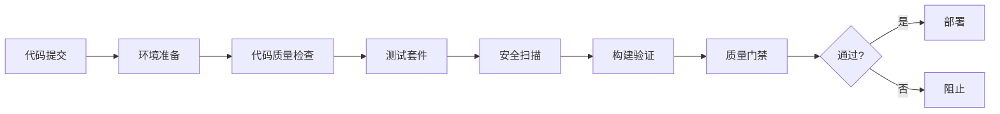

# LLMChat CI/CD 企业级质量保证系统

## 🎯 概述

LLMChat项目已建立完整的企业级CI/CD质量保证体系，支持多环境部署、自动化测试、安全扫描和监控告警。

## 🏗️ 系统架构

### 核心组件
- **GitHub Actions**: 自动化CI/CD流水线
- **Docker**: 容器化部署
- **Kubernetes**: 生产环境编排
- **Prometheus/Grafana**: 监控和可视化
- **安全扫描**: 全方位安全保障

### 质量保证流程


## 📁 文件结构

```
llmchat/
├── .github/workflows/
│   └── enterprise-ci-cd.yml          # 主CI/CD流水线
├── scripts/
│   ├── deployment/
│   │   └── deploy.sh                 # 部署脚本
│   ├── monitoring/
│   │   └── health-check.sh           # 健康检查脚本
│   └── security/
│       └── security-scan.sh          # 安全扫描脚本
├── config/
│   └── deployment.yml               # 部署配置
├── docs/
│   ├── CI_CD_ARCHITECTURE_GUIDE.md  # CI/CD架构指南
│   └── DEPLOYMENT_OPERATIONS.md    # 部署运维指南
└── .env.example                     # 环境变量模板
```

## 🚀 快速开始

### 1. 环境准备
```bash
# 安装依赖
pnpm install

# 配置环境变量
cp .env.example .env
# 编辑 .env 文件配置数据库、Redis等参数

# 验证配置
pnpm run validate:env
```

### 2. 本地开发
```bash
# 启动开发服务器
pnpm run dev

# 运行测试
pnpm test

# 代码质量检查
pnpm run lint
pnpm run type-check
```

### 3. 部署到不同环境
```bash
# 开发环境
./scripts/deployment/deploy.sh development

# 测试环境（带备份）
./scripts/deployment/deploy.sh staging --backup

# 生产环境（带备份和强制确认）
./scripts/deployment/deploy.sh production --backup --force
```

## 🔍 质量保证

### 自动化测试
- **单元测试**: Jest (后端) + Vitest (前端)
- **集成测试**: API和数据库集成测试
- **E2E测试**: Playwright 端到端测试
- **覆盖率要求**: ≥80% (核心模块100%)

### 代码质量
- **TypeScript**: 零编译错误政策
- **ESLint**: 代码规范和质量检查
- **Prettier**: 代码格式化
- **复杂度分析**: 圈复杂度≤10

### 质量门禁
```yaml
质量标准:
  开发环境: ≥70分
  测试环境: ≥80分
  生产环境: ≥90分

权重分配:
  代码质量: 30%
  测试套件: 25%
  安全扫描: 20%
  构建验证: 25%
```

## 🔒 安全保障

### 安全扫描层级
1. **依赖安全**: Snyk + npm audit
2. **代码安全**: Semgrep + ESLint安全规则
3. **密钥扫描**: Gitleaks + 自定义规则
4. **容器安全**: Trivy + Dockerfile分析

### 安全配置
```bash
# 运行完整安全扫描
./scripts/security/security-scan.sh

# 生成HTML格式报告
./scripts/security/security-scan.sh --format html

# 仅扫描高危漏洞
./scripts/security/security-scan.sh --severity high

# 自动修复可修复的问题
./scripts/security/security-scan.sh --fix
```

## 🌍 多环境部署

### 环境配置
| 环境 | 用途 | 副本数 | 质量要求 | 监控级别 |
|------|------|--------|----------|----------|
| Development | 日常开发 | 1 | 70分 | 基础 |
| Staging | QA测试 | 2 | 80分 | 完整 |
| Production | 正式服务 | 3+ | 90分 | 全面 |

### 部署策略
- **开发环境**: 自动部署 (develop分支)
- **测试环境**: 自动部署 (main分支)
- **生产环境**: 手动触发 + 自动验证

### 回滚机制
```bash
# 回滚到上一版本
./scripts/deployment/deploy.sh production --rollback

# 创建备份后再部署
./scripts/deployment/deploy.sh production --backup
```

## 🐳 Docker部署

### 构建镜像
```bash
# 构建应用镜像
docker build -t llmchat:latest .

# 构建特定环境镜像
docker build --build-arg NODE_ENV=production -t llmchat:production .
```

### Docker Compose
```bash
# 启动所有服务
docker-compose up -d

# 查看状态
docker-compose ps

# 查看日志
docker-compose logs -f backend

# 停止服务
docker-compose down
```

## ☸️ Kubernetes部署

### 快速部署
```bash
# 应用所有K8s配置
kubectl apply -f k8s/

# 查看部署状态
kubectl get pods -n llmchat
kubectl get services -n llmchat

# 查看日志
kubectl logs -f deployment/llmchat-backend -n llmchat
```

### 核心配置
- **Deployment**: 应用部署配置
- **Service**: 服务发现和负载均衡
- **Ingress**: 外部访问和SSL终止
- **HPA**: 自动水平扩展
- **ConfigMap/Secret**: 配置和密钥管理

## 📊 监控与运维

### 健康检查
```bash
# 检查所有环境
./scripts/monitoring/health-check.sh all

# 持续监控
./scripts/monitoring/health-check.sh production --watch

# 检查特定组件
./scripts/monitoring/health-check.sh production --component api

# JSON格式输出
./scripts/monitoring/health-check.sh production --format json
```

### 监控指标
- **应用指标**: 响应时间、错误率、吞吐量
- **系统指标**: CPU、内存、磁盘、网络
- **业务指标**: 用户会话、API请求、功能使用

### 告警配置
- **P0**: 系统不可用 (15分钟响应)
- **P1**: 核心功能异常 (1小时响应)
- **P2**: 非核心问题 (4小时响应)
- **P3**: 性能问题 (24小时响应)

## 🔧 开发工具

### 代码质量工具
```bash
# 完整质量检查
pnpm run validate:quality

# TypeScript类型检查
pnpm run type-check

# 代码规范检查
pnpm run lint

# 安全检查
pnpm run security:audit
```

### 调试工具
```bash
# 启用调试模式
export DEBUG=llmchat:*
export NODE_OPTIONS=--inspect

# 性能分析
npm install -g clinic
clinic doctor -- node backend/dist/index.js
```

## 📋 CI/CD流水线特性

### 自动触发条件
- **Push**: main/develop/release/* 分支
- **Pull Request**: 代码审查触发完整流水线
- **Release**: 版本发布触发生产部署
- **定时任务**: 每日安全扫描和质量检查
- **手动触发**: 支持环境选择和功能开关

### 流水线阶段
1. **环境准备和依赖验证**
2. **代码质量检查** (并行执行)
3. **测试套件** (单元/集成/E2E)
4. **安全扫描** (依赖/代码/密钥/容器)
5. **构建验证**
6. **质量门禁评估**
7. **多环境部署**
8. **部署后验证**
9. **性能测试** (可选)
10. **通知和报告**

### 高级特性
- **并行执行**: 最大化CI/CD效率
- **缓存优化**: 智能依赖和构建缓存
- **失败重试**: 自动处理临时故障
- **质量门禁**: 严格的代码质量标准
- **安全集成**: 全面的安全保障
- **监控集成**: 实时监控和告警

## 📈 性能基准

### API性能
- **响应时间**: P95 < 200ms
- **吞吐量**: > 1000 RPS
- **错误率**: < 0.1%
- **并发处理**: ≥100用户

### 前端性能
- **首屏加载**: < 3s
- **LCP**: < 2.5s
- **FID**: < 100ms
- **CLS**: < 0.1

### 构建性能
- **构建时间**: < 5分钟
- **镜像大小**: 后端 < 500MB，前端 < 100MB
- **启动时间**: < 30秒

## 🛠️ 故障排除

### 常见问题解决

#### 应用无法启动
```bash
# 检查日志
docker logs llmchat-production

# 检查环境变量
docker exec llmchat-production env | grep -E "(DATABASE_URL|REDIS_URL)"

# 检查端口占用
netstat -tulpn | grep :3001
```

#### 数据库连接问题
```bash
# 检查数据库状态
docker exec postgres pg_isready

# 测试连接
psql -h $DATABASE_HOST -U $DATABASE_USER -d $DATABASE_NAME -c "SELECT 1;"
```

#### 性能问题
```bash
# 检查资源使用
docker stats llmchat-production

# 性能分析
clinic doctor -- node backend/dist/index.js
```

### 调试技巧
```bash
# 启用详细日志
export LOG_LEVEL=debug

# 结构化日志
docker logs llmchat-production | jq '.'

# 网络调试
docker exec llmchat-production curl -v http://postgres:5432
```

## 📚 文档资源

### 核心文档
- **[CI/CD架构指南](docs/CI_CD_ARCHITECTURE_GUIDE.md)**: 完整的CI/CD架构设计
- **[部署运维指南](docs/DEPLOYMENT_OPERATIONS.md)**: 详细的部署和运维说明
- **[配置文件](config/deployment.yml)**: 环境配置参数说明

### 技术文档
- **[Node.js 官方文档](https://nodejs.org/docs/)**
- **[Docker 官方文档](https://docs.docker.com/)**
- **[Kubernetes 官方文档](https://kubernetes.io/docs/)**

### 最佳实践
- **[12-Factor App](https://12factor.net/)**
- **[Docker最佳实践](https://docs.docker.com/develop/dev-best-practices/)**
- **[Kubernetes最佳实践](https://kubernetes.io/docs/concepts/cluster-administration/best-practices/)**

## 🎯 持续改进

### 质量指标
- **部署频率**: 每周部署次数
- **变更失败率**: 部署失败百分比
- **平均恢复时间**: 故障恢复时间
- **变更前置时间**: 提交到生产时间

### 改进计划
- **自动化**: 持续提高自动化程度
- **监控**: 完善监控和告警体系
- **安全**: 定期安全评估和改进
- **文档**: 保持文档更新和完善

## 🤝 贡献指南

### 开发流程
1. Fork项目并创建功能分支
2. 遵循代码规范和最佳实践
3. 编写测试并确保覆盖率
4. 提交Pull Request
5. 代码审查和CI/CD验证
6. 合并到主分支

### 代码规范
- TypeScript严格模式
- ESLint + Prettier
- 提交信息规范 (Conventional Commits)
- 100%测试覆盖率 (新代码)

## 📞 支持与联系

- **技术支持**: 创建 GitHub Issue
- **安全问题**: security@llmchat.example.com
- **运维支持**: ops@llmchat.example.com
- **文档反馈**: docs@llmchat.example.com

---

**最后更新**: 2025-01-18
**版本**: v1.0.0
**维护者**: DevOps团队