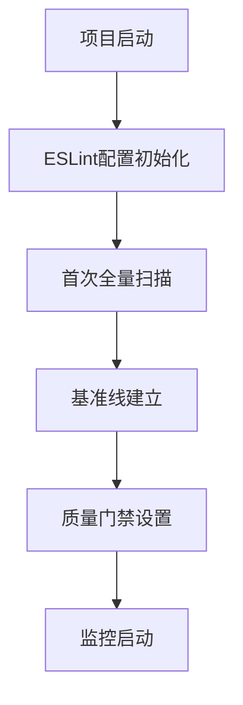
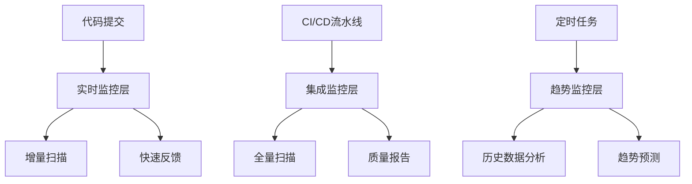

# ESLint质量基准线体系

## 1. 质量度量标准

### 1.1 核心质量指标

#### 错误级别指标 (Critical)
- **错误计数 (Error Count)**: 0 (绝对禁止)
- **致命错误 (Fatal Errors)**: 0 (系统崩溃级别)
- **类型安全错误 (Type Safety Errors)**: 0
- **未定义变量错误 (Undefined Variable Errors)**: 0
- **语法错误 (Syntax Errors)**: 0

#### 警告级别指标 (Warning)
- **警告计数 (Warning Count)**: ≤ 5 (新代码)
- **性能警告 (Performance Warnings)**: ≤ 3
- **最佳实践警告 (Best Practice Warnings)**: ≤ 10
- **潜在问题警告 (Potential Issue Warnings)**: ≤ 5

#### 代码复杂度指标
- **圈复杂度 (Cyclomatic Complexity)**: ≤ 10 (函数级别)
- **函数长度 (Function Length)**: ≤ 50 行
- **文件长度 (File Length)**: ≤ 500 行
- **嵌套深度 (Nesting Depth)**: ≤ 4 层
- **参数数量 (Parameter Count)**: ≤ 5 个

#### 类型安全指标
- **TypeScript严格模式**: 100% 覆盖
- **显式类型定义率**: ≥ 95%
- **any类型使用率**: ≤ 1%
- **未使用变量检测**: 100% 覆盖

### 1.2 质量评分体系

#### ESLint质量分数计算
```javascript
// 质量分数算法 (满分100分)
const qualityScore = {
  errorScore: Math.max(0, 100 - (errorCount * 50)),    // 错误扣50分/个
  warningScore: Math.max(0, 100 - (warningCount * 5)), // 警告扣5分/个
  complexityScore: Math.max(0, 100 - (avgComplexity * 2)), // 复杂度扣2分/点
  typeSafetyScore: typeCoveragePercentage,             // 类型覆盖率
  maintainabilityScore: calculateMaintainability(metrics)
};

const overallScore = (
  qualityScore.errorScore * 0.4 +
  qualityScore.warningScore * 0.2 +
  qualityScore.complexityScore * 0.2 +
  qualityScore.typeSafetyScore * 0.1 +
  qualityScore.maintainabilityScore * 0.1
);
```

#### 质量等级划分
- **A级 (优秀)**: 90-100分 - 生产就绪
- **B级 (良好)**: 80-89分 - 可接受，需要监控
- **C级 (合格)**: 70-79分 - 需要改进
- **D级 (不合格)**: 60-69分 - 必须修复
- **E级 (严重)**: <60分 - 阻止发布

## 2. 基准线建立流程

### 2.1 项目初始化基准线

#### 时间节点


#### 建立步骤
1. **第0周 - 配置准备**
   - 安装ESLint及相关插件
   - 配置TypeScript集成
   - 设置自定义规则集
   - 集成到CI/CD流水线

2. **第1周 - 基础扫描**
   - 执行全项目扫描
   - 识别现有问题
   - 建立问题分类
   - 生成初始报告

3. **第2周 - 基准线确定**
   - 分析问题优先级
   - 制定修复计划
   - 建立质量目标
   - 锁定基准线版本

### 2.2 基准线版本管理

#### 版本命名规则
```
baseline-v<major>.<minor>.<patch>
major: 重大规则变更
minor: 新增规则或阈值调整
patch: 配置文件修复或文档更新
```

#### 版本锁定机制
```json
{
  "baseline": {
    "version": "baseline-v1.0.0",
    "createdAt": "2024-01-01T00:00:00Z",
    "configHash": "sha256:abc123...",
    "metrics": {
      "errorCount": 0,
      "warningCount": 5,
      "qualityScore": 95
    }
  }
}
```

## 3. 配置验证标准

### 3.1 配置文件验证清单

#### 基础配置验证
```yaml
✅ 必需验证项:
  - 配置文件存在性: .eslintrc.{js,cjs,json}
  - 依赖包版本一致性
  - 解析器配置正确性
  - 插件安装完整性
  - 规则覆盖完整性

✅ TypeScript集成验证:
  - @typescript-eslint/parser配置
  - tsconfig.json路径映射
  - 类型检查集成
  - 项目根目录配置

✅ 环境特定配置验证:
  - 开发环境配置
  - 生产环境配置
  - 测试环境配置
  - CI/CD环境配置
```

#### 规则配置验证
```yaml
✅ 错误级别规则 (必须为error):
  - no-undef: undefined变量检测
  - no-unused-vars: 未使用变量检测
  - no-console: 生产环境console禁用
  - @typescript-eslint/no-explicit-any: any类型限制

✅ 警告级别规则 (建议为warn):
  - prefer-const: const优先使用
  - no-var: 禁用var声明
  - eqeqeq: 相等性比较
  - @typescript-eslint/no-inferrable-types: 可推断类型

✅ 代码质量规则:
  - max-len: 行长度限制
  - max-lines: 文件长度限制
  - max-depth: 嵌套深度限制
  - complexity: 复杂度限制
```

### 3.2 验证执行流程

#### 自动化验证脚本
```bash
#!/bin/bash
# 基准线验证脚本

# 1. 配置文件验证
echo "🔍 验证配置文件..."
node scripts/validate-eslint-config.js

# 2. 依赖完整性检查
echo "📦 检查依赖完整性..."
pnpm ls eslint @typescript-eslint/parser @typescript-eslint/eslint-plugin

# 3. 规则有效性测试
echo "🧪 测试规则有效性..."
pnpm run lint -- --format=json > lint-results.json

# 4. 基准线对比
echo "📊 对比基准线..."
node scripts/compare-baseline.js

# 5. 生成验证报告
echo "📄 生成验证报告..."
node scripts/generate-validation-report.js
```

## 4. 质量监控机制

### 4.1 监控架构设计

#### 三层监控体系


#### 监控指标收集
```javascript
// 监控数据收集器
class QualityMetricsCollector {
  collectMetrics(projectPath) {
    return {
      timestamp: new Date().toISOString(),
      commitHash: this.getCurrentCommit(),
      metrics: {
        errorCount: this.getErrorCount(),
        warningCount: this.getWarningCount(),
        ruleViolations: this.getRuleViolations(),
        fileMetrics: this.getFileMetrics(),
        complexityMetrics: this.getComplexityMetrics(),
        typeSafetyMetrics: this.getTypeSafetyMetrics()
      },
      trends: this.calculateTrends(),
      qualityScore: this.calculateQualityScore()
    };
  }
}
```

### 4.2 报警机制

#### 报警触发条件
```yaml
🚨 严重报警 (立即阻断):
  errorCount > 0
  criticalRuleViolations > 0
  qualityScore < 70
  securityVulnerabilities > 0

⚠️ 警告报警 (提醒关注):
  warningCount > 10
  qualityScore < 80
  complexityIncrease > 20%
  typeSafetyDecrease > 5%

📈 趋势报警 (长期监控):
  qualityScore下降超过10%
  错误率上升超过5%
  代码复杂度持续增长
  技术债务积累过快
```

#### 报警通知配置
```json
{
  "notification": {
    "channels": ["email", "slack", "webhook"],
    "severity": {
      "critical": {
        "immediate": true,
        "escalation": "team-lead"
      },
      "warning": {
        "immediate": false,
        "batch": "daily"
      },
      "trend": {
        "frequency": "weekly",
        "report": "quality-trend-report"
      }
    }
  }
}
```

## 5. 质量门禁配置

### 5.1 门禁阈值设置

#### Pre-Commit门禁
```yaml
触发条件: git pre-commit hook
检查范围: 暂存文件
执行模式: 快速扫描
允许时间: < 30秒

门禁规则:
  errorCount: 0 (绝对禁止)
  warningCount: ≤ 3
  syntaxErrors: 0
  typeErrors: 0

失败处理:
  阻止提交
  显示具体错误
  提供修复建议
```

#### Pre-Push门禁
```yaml
触发条件: git pre-push hook
检查范围: 整个仓库
执行模式: 全面扫描
允许时间: < 5分钟

门禁规则:
  errorCount: 0 (绝对禁止)
  warningCount: ≤ 10
  qualityScore: ≥ 80
  newSecurityIssues: 0

失败处理:
  阻止推送
  生成详细报告
  提供批量修复方案
```

#### CI/CD门禁
```yaml
触发条件: CI/CD流水线
检查范围: 完整构建
执行模式: 全面深度扫描
允许时间: < 15分钟

门禁规则:
  errorCount: 0 (绝对禁止)
  warningCount: ≤ 20
  qualityScore: ≥ 85
  coverageThreshold: ≥ 80%
  securityScan: 通过

失败处理:
  阻止部署
  回滚到稳定版本
  通知相关负责人
```

### 5.2 质量门禁脚本

#### 增强版质量门禁
```javascript
// enhanced-quality-gates.js
class EnhancedQualityGates {
  constructor(config) {
    this.config = config;
    this.metrics = new QualityMetricsCollector();
    this.notifications = new NotificationService();
  }

  async executeGate(context) {
    const startTime = Date.now();

    try {
      // 1. 收集指标
      const metrics = await this.metrics.collectMetrics(process.cwd());

      // 2. 验证门禁规则
      const gateResult = this.validateGates(metrics, context);

      // 3. 生成报告
      const report = this.generateReport(metrics, gateResult);

      // 4. 执行通知
      if (!gateResult.passed) {
        await this.notifications.sendAlert(gateResult);
      }

      // 5. 记录执行时间
      const executionTime = Date.now() - startTime;
      this.logPerformance(executionTime, gateResult);

      return {
        passed: gateResult.passed,
        report,
        metrics,
        executionTime
      };
    } catch (error) {
      this.handleError(error, context);
      throw error;
    }
  }

  validateGates(metrics, context) {
    const rules = this.config.gates[context.type];
    const violations = [];

    for (const [rule, threshold] of Object.entries(rules)) {
      const value = this.getMetricValue(metrics, rule);
      if (!this.evaluateRule(value, threshold)) {
        violations.push({
          rule,
          value,
          threshold,
          severity: this.getRuleSeverity(rule)
        });
      }
    }

    return {
      passed: violations.length === 0,
      violations,
      qualityScore: metrics.qualityScore
    };
  }
}
```

## 6. 长期质量趋势分析

### 6.1 趋势分析框架

#### 指标趋势跟踪
```javascript
// 质量趋势分析器
class QualityTrendAnalyzer {
  analyzeTrends(historicalData) {
    const trends = {
      errorRate: this.calculateTrend(historicalData, 'errorCount'),
      warningRate: this.calculateTrend(historicalData, 'warningCount'),
      qualityScore: this.calculateTrend(historicalData, 'qualityScore'),
      complexity: this.calculateTrend(historicalData, 'avgComplexity'),
      typeSafety: this.calculateTrend(historicalData, 'typeCoverage')
    };

    return {
      current: trends.current,
      trend: trends.direction,
      velocity: trends.velocity,
      prediction: this.predictFutureTrend(trends),
      recommendations: this.generateRecommendations(trends)
    };
  }

  predictFutureTrend(currentTrend) {
    // 使用线性回归预测未来4周趋势
    const predictions = [];
    const { slope, intercept } = this.linearRegression(currentTrend.data);

    for (let week = 1; week <= 4; week++) {
      const predictedValue = slope * week + intercept;
      predictions.push({
        week,
        value: Math.max(0, predictedValue),
        confidence: this.calculateConfidence(currentTrend, week)
      });
    }

    return predictions;
  }
}
```

#### 质量改进建议引擎
```javascript
// 持续改进建议
class ContinuousImprovementEngine {
  generateImprovementPlan(analysis) {
    const plan = {
      immediate: [],    // 立即修复项
      shortTerm: [],   // 短期改进项 (1-2周)
      longTerm: [],    // 长期改进项 (1个月+)
      preventive: []   // 预防性措施
    };

    // 基于趋势分析生成建议
    for (const [metric, trend] of Object.entries(analysis.trends)) {
      const recommendations = this.getMetricRecommendations(metric, trend);

      recommendations.forEach(rec => {
        plan[rec.priority].push({
          metric,
          action: rec.action,
          impact: rec.impact,
          effort: rec.effort,
          timeline: rec.timeline
        });
      });
    }

    return this.prioritizePlan(plan);
  }
}
```

### 6.2 质量仪表板

#### 实时监控仪表板
```typescript
// 质量监控仪表板组件
interface QualityDashboard {
  // 核心指标显示
  currentMetrics: QualityMetrics;
  trendCharts: TrendChart[];
  alertPanel: AlertPanel;

  // 交互功能
  filters: MetricFilter[];
  timeRangeSelector: TimeRangeSelector;
  drillDownCapability: DrillDownInterface;

  // 报告功能
  generateReport: (format: 'pdf' | 'html' | 'json') => Report;
  exportData: (metrics: string[]) => ExportData;
  scheduleReport: (frequency: 'daily' | 'weekly' | 'monthly') => void;
}

// 仪表板数据提供者
class DashboardDataProvider {
  async getRealTimeMetrics(): Promise<QualityMetrics> {
    const scanner = new ESLintScanner();
    return await scanner.scan(process.cwd());
  }

  async getHistoricalData(timeRange: TimeRange): Promise<HistoricalData[]> {
    return await this.metricsRepository.findByTimeRange(timeRange);
  }

  async getAlerts(severity: AlertSeverity[]): Promise<Alert[]> {
    return await this.alertService.getActiveAlerts(severity);
  }
}
```

## 7. 实施建议

### 7.1 分阶段实施计划

#### 第一阶段：基础建设 (1-2周)
1. 配置ESLint基础环境
2. 建立质量度量标准
3. 实现基础监控脚本
4. 集成到开发流程

#### 第二阶段：监控完善 (3-4周)
1. 实现质量趋势分析
2. 建立报警机制
3. 开发质量仪表板
4. 优化扫描性能

#### 第三阶段：持续改进 (5-8周)
1. 实施自动化修复
2. 建立质量门禁
3. 完善报告系统
4. 团队培训推广

### 7.2 团队协作机制

#### 质量责任制
- **开发人员**: 负责编写符合规则的代码
- **代码审查员**: 负责质量检查和指导
- **技术负责人**: 负责质量标准制定和监督
- **DevOps工程师**: 负责监控系统和报警配置

#### 质量改进循环
1. **发现问题**: 通过监控和报警识别质量问题
2. **分析原因**: 深入分析问题根本原因
3. **制定方案**: 设计针对性的改进措施
4. **实施改进**: 执行改进计划
5. **验证效果**: 监控改进效果并调整方案

---

本基准线体系为项目提供了完整的ESLint质量管理框架，确保代码质量持续改进并达到生产级别标准。