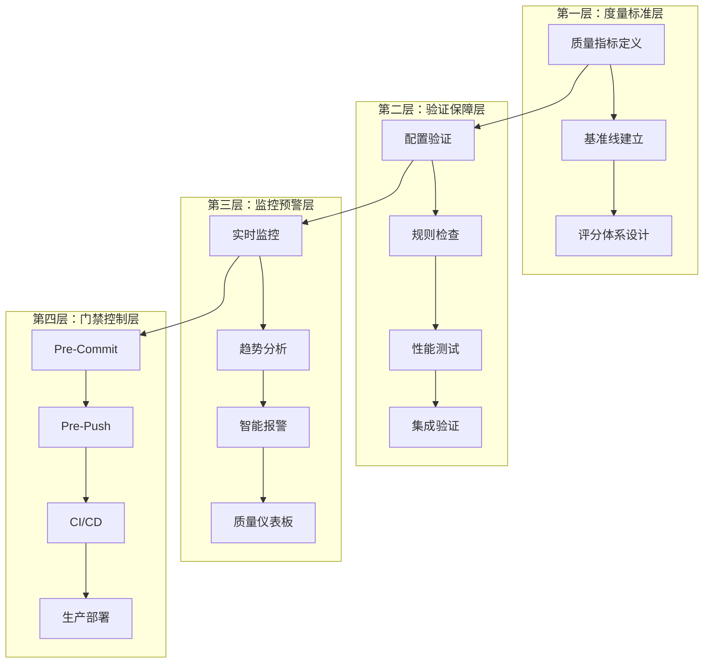
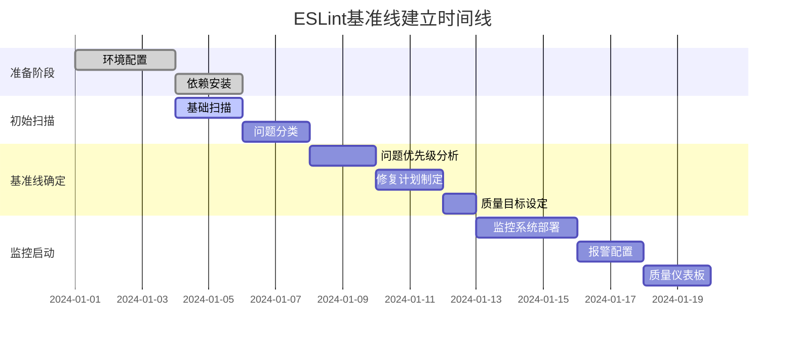

# ESLint质量基准线体系 - 完整实施指南

## 📋 项目概述

本文档提供了一套完整的ESLint质量基准线体系，专为智能体切换聊天应用项目设计，确保代码质量达到生产级别标准，并建立可持续的质量改进机制。

### 🎯 核心目标

1. **零容忍错误**：建立绝对禁止的错误级别门禁
2. **持续改进**：通过监控和报警机制推动质量提升
3. **自动化保障**：在开发全流程中集成自动化质量检查
4. **数据驱动**：基于量化指标进行质量决策

## 🏗️ 体系架构

### 四层架构设计



### 关键特性

- **零警告零错误验证**：严格的错误级别控制
- **配置版本锁定**：确保配置的一致性和稳定性
- **长期质量监控**：持续跟踪质量趋势和改进效果
- **质量趋势分析**：基于数据的预测性质量管理

## 📊 质量度量标准体系

### 核心质量指标

#### 1. 错误级别指标 (Critical - 绝对禁止)
```yaml
error_metrics:
  error_count: 0                    # 错误数量必须为0
  fatal_errors: 0                   # 致命错误必须为0
  type_safety_errors: 0             # 类型安全错误必须为0
  undefined_variables: 0            # 未定义变量必须为0
  syntax_errors: 0                   # 语法错误必须为0
```

#### 2. 警告级别指标 (Warning - 分级处理)
```yaml
warning_metrics:
  pre_commit_max: 3                 # Pre-Commit最多3个警告
  pre_push_max: 10                  # Pre-Push最多10个警告
  ci_cd_max: 20                     # CI/CD最多20个警告
  production_max: 5                 # 生产环境最多5个警告
```

#### 3. 代码复杂度指标
```yaml
complexity_metrics:
  cyclomatic_complexity: ≤ 10       # 圈复杂度不超过10
  function_length: ≤ 50 lines       # 函数长度不超过50行
  file_length: ≤ 500 lines         # 文件长度不超过500行
  nesting_depth: ≤ 4 levels         # 嵌套深度不超过4层
  parameter_count: ≤ 5              # 参数数量不超过5个
```

#### 4. 类型安全指标
```yaml
type_safety_metrics:
  typescript_strict_mode: 100%      # TypeScript严格模式100%覆盖
  explicit_type_definition: ≥ 95%   # 显式类型定义率≥95%
  any_type_usage: ≤ 1%              # any类型使用率≤1%
  unused_variable_detection: 100%   # 未使用变量检测100%覆盖
```

### 质量评分体系

#### 评分算法
```javascript
const qualityScore = {
  errorScore: Math.max(0, 100 - (errorCount * 50)),     // 错误扣50分/个
  warningScore: Math.max(0, 100 - (warningCount * 5)),  // 警告扣5分/个
  complexityScore: Math.max(0, 100 - (avgComplexity * 2)), // 复杂度扣2分/点
  typeSafetyScore: typeCoveragePercentage,               // 类型覆盖率
  maintainabilityScore: calculateMaintainability(metrics)
};

const overallScore = (
  qualityScore.errorScore * 0.4 +      // 40% 错误权重
  qualityScore.warningScore * 0.2 +    // 20% 警告权重
  qualityScore.complexityScore * 0.2 +  // 20% 复杂度权重
  qualityScore.typeSafetyScore * 0.1 +   // 10% 类型安全权重
  qualityScore.maintainabilityScore * 0.1 // 10% 可维护性权重
);
```

#### 质量等级划分
- **A级 (优秀)**: 90-100分 - 生产就绪
- **B级 (良好)**: 80-89分 - 可接受，需要监控
- **C级 (合格)**: 70-79分 - 需要改进
- **D级 (不合格)**: 60-69分 - 必须修复
- **E级 (严重)**: <60分 - 阻止发布

## 🔄 基准线建立流程

### 建立时间线



### 版本管理机制

#### 版本命名规则
```
baseline-v<major>.<minor>.<patch>
major: 重大规则变更
minor: 新增规则或阈值调整
patch: 配置文件修复或文档更新
```

#### 版本锁定配置
```json
{
  "baseline": {
    "version": "baseline-v1.0.0",
    "createdAt": "2024-01-01T00:00:00Z",
    "configHash": "sha256:abc123...",
    "metrics": {
      "errorCount": 0,
      "warningCount": 5,
      "qualityScore": 95
    },
    "frozenRules": [
      "no-undef",
      "no-unused-vars",
      "@typescript-eslint/no-explicit-any"
    ]
  }
}
```

## ✅ 配置验证标准

### 验证检查清单

#### 1. 基础配置验证
```yaml
✅ 配置文件存在性检查:
  - .eslintrc.cjs (根配置)
  - frontend/.eslintrc.cjs (前端配置)
  - backend/.eslintrc.cjs (后端配置)

✅ 依赖完整性检查:
  - eslint核心依赖
  - @typescript-eslint/parser
  - @typescript-eslint/eslint-plugin
  - 项目特定插件

✅ 解析器配置验证:
  - TypeScript解析器配置
  - tsconfig.json路径映射
  - 解析器选项完整性
```

#### 2. 规则配置验证
```yaml
✅ 错误级别规则 (必须为error):
  - no-undef: undefined变量检测
  - no-unused-vars: 未使用变量检测
  - no-console: 生产环境console禁用
  - @typescript-eslint/no-explicit-any: any类型限制

✅ 警告级别规则 (建议为warn):
  - prefer-const: const优先使用
  - no-var: 禁用var声明
  - eqeqeq: 相等性比较
  - max-len: 行长度限制

✅ 代码质量规则:
  - complexity: 复杂度限制
  - max-depth: 嵌套深度限制
  - max-params: 参数数量限制
```

### 验证执行流程

#### 自动化验证脚本
```bash
#!/bin/bash
# 基准线验证脚本

echo "🔍 ESLint配置基准线验证"

# 1. 配置文件验证
node scripts/validate-eslint-config.js

# 2. 依赖完整性检查
pnpm ls eslint @typescript-eslint/parser @typescript-eslint/eslint-plugin

# 3. 规则有效性测试
pnpm run lint -- --format=json > lint-results.json

# 4. 基准线对比
node scripts/compare-baseline.js

# 5. 生成验证报告
node scripts/generate-validation-report.js

echo "✅ 基准线验证完成"
```

## 📈 质量监控机制

### 三层监控体系

#### 1. 实时监控层
- **触发**: 代码提交
- **范围**: 增量扫描
- **反馈**: 即时通知
- **目标**: 快速发现问题

#### 2. 集成监控层
- **触发**: CI/CD流水线
- **范围**: 全量扫描
- **反馈**: 质量报告
- **目标**: 全面质量评估

#### 3. 趋势监控层
- **触发**: 定时任务
- **范围**: 历史数据分析
- **反馈**: 趋势预测
- **目标**: 长期质量规划

### 报警机制

#### 报警触发条件
```yaml
🚨 严重报警 (立即阻断):
  errorCount > 0                    # 任何错误
  criticalRuleViolations > 0         # 关键规则违规
  qualityScore < 70                  # 质量分数过低
  securityVulnerabilities > 0        # 安全漏洞

⚠️ 警告报警 (提醒关注):
  warningCount > 10                  # 警告数量过多
  qualityScore < 80                  # 质量分数偏低
  complexityIncrease > 20%           # 复杂度增长过快
  typeSafetyDecrease > 5%            # 类型安全下降

📈 趋势报警 (长期监控):
  qualityScore下降超过10%            # 质量持续下降
  错误率上升超过5%                  # 错误率增长
  代码复杂度持续增长                 # 复杂度失控
  技术债务积累过快                   # 技术债增加
```

#### 通知渠道配置
```json
{
  "notification": {
    "channels": ["email", "slack", "webhook", "github-comment"],
    "severity": {
      "critical": {
        "immediate": true,
        "escalation": "team-lead",
        "channels": ["slack", "email", "github-comment"]
      },
      "warning": {
        "immediate": false,
        "batch": "daily",
        "channels": ["slack", "email"]
      },
      "trend": {
        "frequency": "weekly",
        "report": "quality-trend-report",
        "channels": ["email"]
      }
    }
  }
}
```

## 🚪 质量门禁配置

### 分阶段门禁设计

#### Pre-Commit门禁
```yaml
触发条件: git pre-commit hook
检查范围: 暂存文件
执行模式: 快速扫描
允许时间: < 30秒

门禁规则:
  errorCount: 0 (绝对禁止)
  warningCount: ≤ 3
  syntaxErrors: 0
  typeErrors: 0

失败处理:
  阻止提交
  显示具体错误
  提供修复建议
```

#### Pre-Push门禁
```yaml
触发条件: git pre-push hook
检查范围: 整个仓库
执行模式: 全面扫描
允许时间: < 5分钟

门禁规则:
  errorCount: 0 (绝对禁止)
  warningCount: ≤ 10
  qualityScore: ≥ 80
  newSecurityIssues: 0

失败处理:
  阻止推送
  生成详细报告
  提供批量修复方案
```

#### CI/CD门禁
```yaml
触发条件: CI/CD流水线
检查范围: 完整构建
执行模式: 全面深度扫描
允许时间: < 15分钟

门禁规则:
  errorCount: 0 (绝对禁止)
  warningCount: ≤ 20
  qualityScore: ≥ 85
  coverageThreshold: ≥ 80%
  securityScan: 通过

失败处理:
  阻止部署
  回滚到稳定版本
  通知相关负责人
```

### 门禁配置示例
```json
{
  "version": "1.0.0",
  "project": "llmchat",
  "gates": {
    "pre_commit": {
      "enabled": true,
      "timeout": 30000,
      "rules": {
        "critical": {
          "error_count": { "threshold": 0, "action": "block" },
          "syntax_errors": { "threshold": 0, "action": "block" }
        },
        "warning": {
          "max_warnings": { "threshold": 3, "action": "warn" }
        }
      }
    },
    "pre_push": {
      "enabled": true,
      "full_scan": true,
      "timeout": 300000,
      "rules": {
        "quality_score": { "threshold": 80, "action": "block" },
        "max_warnings": { "threshold": 10, "action": "block" }
      }
    }
  }
}
```

## 📊 质量仪表板

### 实时监控界面

#### 核心指标展示
- **当前质量分数**: 实时质量评分
- **错误/警告统计**: 问题数量趋势
- **扫描性能**: 扫描时间监控
- **文件质量分布**: 按文件分类的质量指标

#### 趋势分析图表
- **质量分数趋势**: 30天质量变化
- **问题数量趋势**: 错误和警告趋势
- **复杂度分析**: 代码复杂度变化
- **类型安全趋势**: TypeScript类型安全状况

#### 活跃报警面板
- **实时报警列表**: 当前活跃的质量报警
- **报警历史**: 最近报警记录
- **处理状态**: 报警处理进度
- **解决方案**: 常见问题修复建议

### API服务接口
```typescript
// 主要API端点
GET  /api/quality/:projectId/latest      // 获取最新质量指标
GET  /api/quality/:projectId/trends     // 获取质量趋势数据
GET  /api/alerts/:projectId/active      // 获取活跃报警
POST /api/quality/:projectId/scan       // 手动触发扫描
GET  /api/quality/:projectId/report     // 获取质量报告
PUT  /api/alerts/:projectId/rules/:ruleId // 更新报警规则
```

## 🚀 实施建议

### 分阶段实施计划

#### 第一阶段：基础建设 (1-2周)
1. **配置ESLint基础环境**
   - 安装ESLint及相关插件
   - 配置TypeScript集成
   - 设置自定义规则集
   - 集成到开发流程

2. **建立质量度量标准**
   - 定义核心质量指标
   - 建立评分体系
   - 设置基准线版本
   - 创建验证脚本

3. **实现基础监控**
   - 开发质量收集器
   - 建立数据存储
   - 创建基础报告
   - 配置简单报警

#### 第二阶段：监控完善 (3-4周)
1. **实现质量趋势分析**
   - 开发趋势分析算法
   - 建立预测模型
   - 创建趋势报告
   - 配置趋势报警

2. **建立报警机制**
   - 开发智能报警引擎
   - 配置多渠道通知
   - 建立报警升级机制
   - 创建报警历史记录

3. **开发质量仪表板**
   - 设计实时监控界面
   - 实现趋势图表展示
   - 创建交互式报告
   - 配置数据刷新机制

#### 第三阶段：持续改进 (5-8周)
1. **实施自动化修复**
   - 开发自动修复工具
   - 集成到编辑器
   - 创建修复建议系统
   - 优化修复准确率

2. **建立质量门禁**
   - 实现分阶段门禁
   - 配置CI/CD集成
   - 建立门禁报告
   - 创建门禁优化机制

3. **完善报告系统**
   - 开发详细报告生成
   - 实现多格式导出
   - 创建报告模板
   - 配置自动分发

### 团队协作机制

#### 质量责任制
- **开发人员**: 负责编写符合规则的代码
- **代码审查员**: 负责质量检查和指导
- **技术负责人**: 负责质量标准制定和监督
- **DevOps工程师**: 负责监控系统和报警配置

#### 质量改进循环
1. **发现问题**: 通过监控和报警识别质量问题
2. **分析原因**: 深入分析问题根本原因
3. **制定方案**: 设计针对性的改进措施
4. **实施改进**: 执行改进计划
5. **验证效果**: 监控改进效果并调整方案

### 成功指标

#### 短期指标 (1-3个月)
- ESLint错误数量减少至0
- 警告数量控制在阈值范围内
- 质量分数达到80分以上
- 开发团队接受度达到90%

#### 中期指标 (3-6个月)
- 质量分数稳定在85分以上
- 技术债务增长得到控制
- 代码审查效率提升50%
- 自动化修复率达到80%

#### 长期指标 (6-12个月)
- 质量分数达到90分以上
- 建立持续改进文化
- 质量监控体系成熟运行
- 成为团队质量标杆

## 📚 相关文档

### 核心文档
- [ESLint质量基准线标准](./eslint-quality-baseline.md)
- [ESLint配置验证检查清单](./eslint-validation-checklist.md)
- [ESLint质量监控机制](./eslint-quality-monitoring.md)
- [ESLint质量门禁配置](./eslint-quality-gates.md)

### 实施工具
- 配置验证脚本
- 质量监控工具
- 报警系统配置
- 仪表板组件

### 最佳实践
- 团队培训材料
- 常见问题解答
- 故障排除指南
- 性能优化建议

---

## 🎯 总结

本ESLint质量基准线体系提供了完整的代码质量管理解决方案，通过严格的度量标准、自动化的监控机制和智能的质量门禁，确保项目代码质量持续改进并达到生产级别标准。

### 核心价值
1. **零容忍错误**: 建立绝对禁止的错误级别控制
2. **自动化保障**: 在开发全流程中集成自动化质量检查
3. **数据驱动**: 基于量化指标进行质量决策
4. **持续改进**: 建立可持续的质量提升机制

### 实施要点
1. **分阶段实施**: 渐进式建立质量体系
2. **团队培训**: 确保团队理解和支持质量标准
3. **持续监控**: 建立完善的监控和报警机制
4. **定期评估**: 根据实际情况调整质量标准

通过本体系的实施，项目将建立起世界级的代码质量管理能力，为产品的长期稳定发展提供坚实保障。