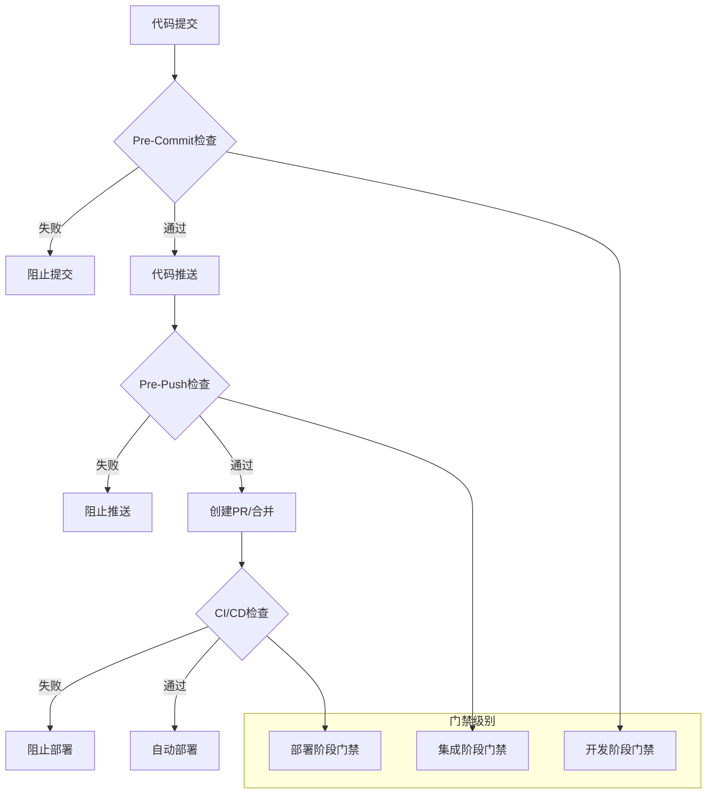

# ESLint质量门禁配置建议

## 1. 质量门禁概述

### 1.1 门禁体系架构



### 1.2 门禁检查矩阵

| 门禁阶段 | 检查范围 | 执行频率 | 失败处理 | 允许时间 |
|---------|---------|---------|---------|---------|
| Pre-Commit | 暂存文件 | 每次提交 | 阻止提交 | < 30秒 |
| Pre-Push | 整个仓库 | 每次推送 | 阻止推送 | < 5分钟 |
| CI/CD | 完整构建 | 每次PR/合并 | 阻止部署 | < 15分钟 |
| 定时扫描 | 完整代码库 | 每日/每周 | 生成报告 | < 30分钟 |

## 2. 门禁规则配置

### 2.1 核心质量指标门禁

#### 错误级别门禁 (Critical - 绝对禁止)
```yaml
critical_gates:
  error_count:
    threshold: 0
    description: "不允许任何ESLint错误"
    failure_action: "block_commit"

  syntax_errors:
    threshold: 0
    description: "不允许语法错误"
    failure_action: "block_commit"

  type_errors:
    threshold: 0
    description: "不允许TypeScript类型错误"
    failure_action: "block_commit"

  undefined_variables:
    threshold: 0
    description: "不允许未定义变量"
    failure_action: "block_commit"

  security_vulnerabilities:
    threshold: 0
    description: "不允许安全漏洞"
    failure_action: "block_commit"
```

#### 警告级别门禁 (Warning - 分级处理)
```yaml
warning_gates:
  pre_commit:
    max_warnings: 3
    description: "Pre-Commit阶段最多允许3个警告"
    failure_action: "warn_allow"

  pre_push:
    max_warnings: 10
    description: "Pre-Push阶段最多允许10个警告"
    failure_action: "warn_block"

  ci_cd:
    max_warnings: 20
    description: "CI/CD阶段最多允许20个警告"
    failure_action: "warn_block"

  production:
    max_warnings: 5
    description: "生产环境部署最多允许5个警告"
    failure_action: "block_deploy"
```

#### 代码复杂度门禁
```yaml
complexity_gates:
  cyclomatic_complexity:
    threshold: 10
    description: "函数圈复杂度不超过10"
    failure_action: "warn_block"

  function_length:
    threshold: 50
    unit: "lines"
    description: "函数长度不超过50行"
    failure_action: "warn_allow"

  file_length:
    threshold: 500
    unit: "lines"
    description: "文件长度不超过500行"
    failure_action: "warn_allow"

  nesting_depth:
    threshold: 4
    unit: "levels"
    description: "嵌套深度不超过4层"
    failure_action: "warn_block"

  parameter_count:
    threshold: 5
    unit: "parameters"
    description: "函数参数不超过5个"
    failure_action: "warn_allow"
```

### 2.2 项目特定门禁

#### 前端项目门禁
```yaml
frontend_gates:
  react_specific:
    no_direct_dom_manipulation:
      threshold: 0
      description: "禁止直接DOM操作"
      failure_action: "block_commit"

    hooks_rules:
      threshold: 0
      description: "React Hooks规则必须遵守"
      failure_action: "block_commit"

    prop_types:
      threshold: 0
      description: "生产环境必须定义PropTypes"
      failure_action: "warn_block"

  accessibility:
    wcag_violations:
      threshold: 0
      description: "不允许WCAG可访问性违规"
      failure_action: "warn_block"

    aria_attributes:
      threshold: 0
      description: "ARIA属性必须正确使用"
      failure_action: "warn_allow"

  performance:
    bundle_size_increase:
      threshold: "5%"
      description: "Bundle大小增长不超过5%"
      failure_action: "warn_block"

    unused_imports:
      threshold: 0
      description: "不允许未使用的导入"
      failure_action: "warn_allow"
```

#### 后端项目门禁
```yaml
backend_gates:
  security:
    sql_injection_risk:
      threshold: 0
      description: "不允许SQL注入风险"
      failure_action: "block_commit"

    xss_vulnerability:
      threshold: 0
      description: "不允许XSS漏洞"
      failure_action: "block_commit"

    authentication_bypass:
      threshold: 0
      description: "不允许认证绕过"
      failure_action: "block_commit"

  api_design:
    error_handling:
      threshold: 0
      description: "API必须有适当错误处理"
      failure_action: "warn_block"

    input_validation:
      threshold: 0
      description: "必须有输入验证"
      failure_action: "block_commit"

    logging:
      threshold: 0
      description: "关键操作必须有日志"
      failure_action: "warn_allow"

  database:
    query_performance:
      threshold: "1s"
      description: "查询时间不超过1秒"
      failure_action: "warn_block"

    transaction_management:
      threshold: 0
      description: "必须有适当事务管理"
      failure_action: "block_commit"
```

## 3. 分阶段门禁实现

### 3.1 Pre-Commit门禁实现

#### 快速检查门禁
```typescript
// pre-commit-gates.ts
interface PreCommitGateResult {
  passed: boolean;
  blocked: boolean;
  warnings: string[];
  errors: string[];
  metrics: {
    errors: number;
    warnings: number;
    filesScanned: number;
    scanTime: number;
  };
}

class PreCommitGates {
  private config: PreCommitConfig;
  private scanner: IncrementalScanner;

  constructor(config: PreCommitConfig) {
    this.config = config;
    this.scanner = new IncrementalScanner(config.scanner);
  }

  async execute(stagedFiles: string[]): Promise<PreCommitGateResult> {
    console.log('🔍 执行Pre-Commit质量门禁检查...');

    const startTime = Date.now();

    try {
      // 1. 快速扫描暂存文件
      const scanResult = await this.scanner.scanFiles(stagedFiles);

      // 2. 应用门禁规则
      const gateResult = this.applyGates(scanResult);

      // 3. 生成用户友好的输出
      this.displayResults(gateResult);

      return gateResult;

    } catch (error) {
      return {
        passed: false,
        blocked: true,
        errors: [`门禁检查失败: ${error.message}`],
        warnings: [],
        metrics: { errors: 0, warnings: 0, filesScanned: 0, scanTime: Date.now() - startTime }
      };
    }
  }

  private applyGates(scanResult: ESLintResult): PreCommitGateResult {
    const rules = this.config.gates;
    const errors: string[] = [];
    const warnings: string[] = [];
    let blocked = false;

    // 应用关键错误门禁
    if (scanResult.errorCount > rules.critical.errorCount.threshold) {
      errors.push(`❌ 发现 ${scanResult.errorCount} 个错误 (阈值: ${rules.critical.errorCount.threshold})`);
      blocked = true;
    }

    // 应用警告门禁
    if (scanResult.warningCount > rules.warning.max_warnings) {
      errors.push(`❌ 警告数量 ${scanResult.warningCount} 超过阈值 ${rules.warning.max_warnings}`);
      blocked = true;
    } else if (scanResult.warningCount > rules.warning.max_warnings / 2) {
      warnings.push(`⚠️ 警告数量 ${scanResult.warningCount} 接近阈值 ${rules.warning.max_warnings}`);
    }

    // 应用特定规则门禁
    for (const [ruleName, rule] of Object.entries(rules.specific_rules)) {
      const violations = scanResult.violations.filter(v => v.ruleId === ruleName);

      if (violations.length > rule.threshold) {
        const action = rule.failure_action;
        const message = `${this.getRuleDescription(ruleName)}: ${violations.length} 个违规 (阈值: ${rule.threshold})`;

        if (action === 'block_commit') {
          errors.push(`❌ ${message}`);
          blocked = true;
        } else if (action === 'warn_block') {
          errors.push(`❌ ${message}`);
          blocked = true;
        } else if (action === 'warn_allow') {
          warnings.push(`⚠️ ${message}`);
        }
      }
    }

    return {
      passed: errors.length === 0,
      blocked,
      errors,
      warnings,
      metrics: {
        errors: scanResult.errorCount,
        warnings: scanResult.warningCount,
        filesScanned: scanResult.filesScanned,
        scanTime: scanResult.scanTime
      }
    };
  }

  private displayResults(result: PreCommitGateResult): void {
    console.log('\n📊 Pre-Commit质量门禁结果');
    console.log('='.repeat(50));

    // 显示指标
    console.log(`📁 扫描文件: ${result.metrics.filesScanned}`);
    console.log(`⏱️ 扫描时间: ${result.metrics.scanTime}ms`);
    console.log(`❌ 错误数量: ${result.metrics.errors}`);
    console.log(`⚠️ 警告数量: ${result.metrics.warnings}`);

    // 显示错误
    if (result.errors.length > 0) {
      console.log('\n🚫 阻止性问题:');
      result.errors.forEach(error => console.log(`  ${error}`));
    }

    // 显示警告
    if (result.warnings.length > 0) {
      console.log('\n⚠️ 警告信息:');
      result.warnings.forEach(warning => console.log(`  ${warning}`));
    }

    // 显示最终结果
    if (result.passed) {
      console.log('\n✅ Pre-Commit质量门禁通过');
    } else {
      console.log('\n❌ Pre-Commit质量门禁未通过');
      console.log('💡 请修复上述问题后重新提交');
    }
  }
}
```

#### Pre-Commit Hook脚本
```bash
#!/bin/bash
# .husky/pre-commit

set -e

echo "🔍 执行Pre-Commit质量检查..."

# 获取暂存文件
STAGED_FILES=$(git diff --cached --name-only --diff-filter=ACM | grep -E '\.(ts|tsx|js|jsx)$' || true)

if [ -z "$STAGED_FILES" ]; then
  echo "✅ 没有需要检查的文件"
  exit 0
fi

echo "📁 检查文件:"
echo "$STAGED_FILES" | sed 's/^/  - /'

# 运行Pre-Commit门禁
node scripts/pre-commit-gates.js --files "$STAGED_FILES"

GATE_RESULT=$?

if [ $GATE_RESULT -eq 0 ]; then
  echo "✅ Pre-Commit质量检查通过"
  exit 0
else
  echo ""
  echo "❌ Pre-Commit质量检查失败"
  echo "💡 修复建议:"
  echo "  1. 运行 'npm run lint:fix' 自动修复部分问题"
  echo "  2. 手动修复剩余的错误和警告"
  echo "  3. 重新提交更改"
  exit 1
fi
```

### 3.2 Pre-Push门禁实现

#### 全面检查门禁
```typescript
// pre-push-gates.ts
interface PrePushGateConfig extends BaseGateConfig {
  fullScanRequired: boolean;
  maxWarnings: number;
  qualityThreshold: number;
  newSecurityIssues: number;
  performanceImpact: number;
}

class PrePushGates {
  constructor(private config: PrePushGateConfig) {}

  async execute(branchName: string): Promise<GateResult> {
    console.log('🔍 执行Pre-Push质量门禁检查...');
    console.log(`🌿 分支: ${branchName}`);

    const startTime = Date.now();

    try {
      // 1. 获取变更范围
      const changedFiles = await this.getChangedFiles(branchName);

      // 2. 执行全面扫描
      const scanResult = await this.performFullScan(changedFiles);

      // 3. 质量趋势分析
      const trendAnalysis = await this.analyzeQualityTrends(branchName);

      // 4. 安全检查
      const securityCheck = await this.performSecurityCheck(scanResult);

      // 5. 性能影响分析
      const performanceAnalysis = await this.analyzePerformanceImpact(scanResult);

      // 6. 综合门禁评估
      const gateResult = this.evaluateGates({
        scan: scanResult,
        trends: trendAnalysis,
        security: securityCheck,
        performance: performanceAnalysis
      });

      // 7. 生成详细报告
      this.generateReport(gateResult);

      return gateResult;

    } catch (error) {
      return {
        passed: false,
        blocked: true,
        errors: [`Pre-Push门禁检查失败: ${error.message}`],
        warnings: [],
        metrics: { scanTime: Date.now() - startTime }
      };
    }
  }

  private async evaluateGates(data: GateData): GateResult {
    const errors: string[] = [];
    const warnings: string[] = [];
    let blocked = false;

    // 基础质量门禁
    if (data.scan.errorCount > 0) {
      errors.push(`❌ 发现 ${data.scan.errorCount} 个错误，推送被阻止`);
      blocked = true;
    }

    if (data.scan.warningCount > this.config.maxWarnings) {
      errors.push(`❌ 警告数量 ${data.scan.warningCount} 超过阈值 ${this.config.maxWarnings}`);
      blocked = true;
    }

    // 质量分数门禁
    if (data.scan.qualityScore < this.config.qualityThreshold) {
      errors.push(`❌ 质量分数 ${data.scan.qualityScore} 低于阈值 ${this.config.qualityThreshold}`);
      blocked = true;
    }

    // 安全问题门禁
    if (data.security.criticalIssues > this.config.newSecurityIssues) {
      errors.push(`❌ 发现 ${data.security.criticalIssues} 个新安全问题`);
      blocked = true;
    }

    // 性能影响门禁
    if (data.performance.impactScore > this.config.performanceImpact) {
      warnings.push(`⚠️ 性能影响评分 ${data.performance.impactScore} 超过建议值 ${this.config.performanceImpact}`);
    }

    // 质量趋势门禁
    if (data.trends.qualityTrend < -10) {
      warnings.push(`⚠️ 质量呈下降趋势 (${data.trends.qualityTrend}%)`);
    }

    return {
      passed: errors.length === 0,
      blocked,
      errors,
      warnings,
      metrics: {
        scanTime: data.scan.scanTime,
        qualityScore: data.scan.qualityScore,
        filesScanned: data.scan.filesScanned
      }
    };
  }

  private generateReport(result: GateResult): void {
    console.log('\n📊 Pre-Push质量门禁报告');
    console.log('='.repeat(60));

    // 汇总信息
    console.log(`📊 质量分数: ${result.metrics.qualityScore}/100`);
    console.log(`📁 扫描文件: ${result.metrics.filesScanned}`);
    console.log(`⏱️ 扫描时间: ${result.metrics.scanTime}ms`);

    // 问题和建议
    if (result.errors.length > 0) {
      console.log('\n🚫 阻止推送的问题:');
      result.errors.forEach((error, index) => {
        console.log(`  ${index + 1}. ${error}`);
      });
    }

    if (result.warnings.length > 0) {
      console.log('\n⚠️ 警告信息:');
      result.warnings.forEach((warning, index) => {
        console.log(`  ${index + 1}. ${warning}`);
      });
    }

    // 修复建议
    if (!result.passed) {
      console.log('\n💡 修复建议:');
      console.log('  1. 运行 "npm run lint:fix" 修复可自动修复的问题');
      console.log('  2. 手动修复剩余的错误和严重警告');
      console.log('  3. 运行 "npm run test" 确保测试通过');
      console.log('  4. 重新尝试推送');
    }

    // 最终结果
    console.log('\n' + '='.repeat(60));
    if (result.passed) {
      console.log('✅ Pre-Push质量门禁通过，可以推送代码');
    } else {
      console.log('❌ Pre-Push质量门禁未通过，推送被阻止');
    }
  }
}
```

### 3.3 CI/CD门禁实现

#### 流水线集成门禁
```typescript
// ci-cd-gates.ts
interface CICDGateConfig extends BaseGateConfig {
  coverageThreshold: number;
  securityScanRequired: boolean;
  performanceTestRequired: boolean;
  documentationRequired: boolean;
  deploymentBlock: boolean;
}

class CICDGates {
  constructor(private config: CICDGateConfig) {}

  async execute(context: CIContext): Promise<GateResult> {
    console.log(`🔍 执行CI/CD质量门禁检查...`);
    console.log(`🔄 环境: ${context.environment}`);
    console.log(`🌿 分支: ${context.branch}`);
    console.log(`📦 构建: ${context.buildNumber}`);

    const startTime = Date.now();

    try {
      // 1. 代码质量检查
      const qualityCheck = await this.performQualityCheck(context);

      // 2. 测试覆盖率检查
      const coverageCheck = await this.checkTestCoverage(context);

      // 3. 安全扫描
      const securityCheck = await this.performSecurityScan(context);

      // 4. 性能测试
      const performanceCheck = await this.performPerformanceTest(context);

      // 5. 文档检查
      const documentationCheck = await this.checkDocumentation(context);

      // 6. 综合评估
      const gateResult = this.evaluateCICDGates({
        quality: qualityCheck,
        coverage: coverageCheck,
        security: securityCheck,
        performance: performanceCheck,
        documentation: documentationCheck
      }, context);

      // 7. 生成CI报告
      await this.generateCIReport(gateResult, context);

      return gateResult;

    } catch (error) {
      return {
        passed: false,
        blocked: true,
        errors: [`CI/CD门禁检查失败: ${error.message}`],
        warnings: [],
        metrics: { scanTime: Date.now() - startTime }
      };
    }
  }

  private async evaluateCICDGates(data: CICDData, context: CIContext): GateResult {
    const errors: string[] = [];
    const warnings: string[] = [];
    let blocked = false;

    // 生产环境严格检查
    if (context.environment === 'production') {
      if (data.quality.errorCount > 0) {
        errors.push(`❌ 生产环境不允许任何错误 (发现 ${data.quality.errorCount} 个)`);
        blocked = true;
      }

      if (data.quality.warningCount > 5) {
        errors.push(`❌ 生产环境警告数量过多 (${data.quality.warningCount} > 5)`);
        blocked = true;
      }

      if (data.coverage.percentage < this.config.coverageThreshold) {
        errors.push(`❌ 测试覆盖率不足 (${data.coverage.percentage}% < ${this.config.coverageThreshold}%)`);
        blocked = true;
      }

      if (data.security.criticalIssues > 0) {
        errors.push(`❌ 生产环境不允许安全问题 (发现 ${data.security.criticalIssues} 个)`);
        blocked = true;
      }

      if (data.performance.responseTime > 1000) {
        errors.push(`❌ 性能不达标 (响应时间 ${data.performance.responseTime}ms > 1000ms)`);
        blocked = true;
      }
    } else {
      // 开发/测试环境相对宽松
      if (data.quality.errorCount > 0) {
        errors.push(`❌ 发现 ${data.quality.errorCount} 个错误`);
        blocked = true;
      }

      if (data.quality.warningCount > 20) {
        errors.push(`❌ 警告数量过多 (${data.quality.warningCount} > 20)`);
        blocked = true;
      }

      if (data.security.criticalIssues > 0) {
        errors.push(`❌ 发现 ${data.security.criticalIssues} 个安全问题`);
        blocked = true;
      }
    }

    // 质量趋势检查
    if (data.quality.qualityTrend < -20) {
      warnings.push(`⚠️ 质量严重下降 (${data.quality.qualityTrend}%)`);
    }

    // 性能回归检查
    if (data.performance.regressionDetected) {
      warnings.push(`⚠️ 检测到性能回归`);
    }

    return {
      passed: errors.length === 0,
      blocked,
      errors,
      warnings,
      metrics: {
        scanTime: data.quality.scanTime,
        qualityScore: data.quality.qualityScore,
        coverage: data.coverage.percentage,
        securityIssues: data.security.criticalIssues,
        performanceScore: data.performance.score
      }
    };
  }

  private async generateCIReport(result: GateResult, context: CIContext): Promise<void> {
    const report = {
      timestamp: new Date().toISOString(),
      context,
      result: {
        passed: result.passed,
        blocked: result.blocked,
        errors: result.errors,
        warnings: result.warnings,
        metrics: result.metrics
      }
    };

    // 保存报告文件
    await fs.writeFile(
      `quality-gate-report-${context.buildNumber}.json`,
      JSON.stringify(report, null, 2)
    );

    // 生成HTML报告
    const htmlReport = this.generateHTMLReport(report);
    await fs.writeFile(
      `quality-gate-report-${context.buildNumber}.html`,
      htmlReport
    );

    // 上传到 artifacts
    if (process.env.CI) {
      console.log('📄 质量门禁报告已生成');
      console.log(`📊 JSON报告: quality-gate-report-${context.buildNumber}.json`);
      console.log(`🌐 HTML报告: quality-gate-report-${context.buildNumber}.html`);
    }
  }
}
```

## 4. 门禁配置文件

### 4.1 完整门禁配置示例
```json
{
  "version": "1.0.0",
  "project": "llmchat",
  "gates": {
    "pre_commit": {
      "enabled": true,
      "timeout": 30000,
      "rules": {
        "critical": {
          "error_count": { "threshold": 0, "action": "block" },
          "syntax_errors": { "threshold": 0, "action": "block" },
          "type_errors": { "threshold": 0, "action": "block" }
        },
        "warning": {
          "max_warnings": { "threshold": 3, "action": "warn" },
          "performance_warnings": { "threshold": 1, "action": "warn" }
        },
        "specific_rules": {
          "no-console": { "threshold": 0, "action": "warn", "env": "production" },
          "no-debugger": { "threshold": 0, "action": "block" },
          "@typescript-eslint/no-explicit-any": { "threshold": 0, "action": "warn" },
          "react-hooks/rules-of-hooks": { "threshold": 0, "action": "block" }
        }
      }
    },
    "pre_push": {
      "enabled": true,
      "full_scan": true,
      "timeout": 300000,
      "rules": {
        "quality_score": { "threshold": 80, "action": "block" },
        "max_warnings": { "threshold": 10, "action": "block" },
        "new_security_issues": { "threshold": 0, "action": "block" },
        "performance_impact": { "threshold": 20, "action": "warn" },
        "complexity_increase": { "threshold": 15, "action": "warn" }
      }
    },
    "ci_cd": {
      "enabled": true,
      "environments": {
        "development": {
          "error_count": { "threshold": 0, "action": "block" },
          "warning_count": { "threshold": 20, "action": "block" },
          "quality_score": { "threshold": 75, "action": "block" },
          "coverage_threshold": { "threshold": 70, "action": "warn" },
          "security_issues": { "threshold": 0, "action": "block" }
        },
        "staging": {
          "error_count": { "threshold": 0, "action": "block" },
          "warning_count": { "threshold": 10, "action": "block" },
          "quality_score": { "threshold": 85, "action": "block" },
          "coverage_threshold": { "threshold": 80, "action": "block" },
          "security_issues": { "threshold": 0, "action": "block" },
          "performance_test": { "threshold": "pass", "action": "block" }
        },
        "production": {
          "error_count": { "threshold": 0, "action": "block" },
          "warning_count": { "threshold": 5, "action": "block" },
          "quality_score": { "threshold": 90, "action": "block" },
          "coverage_threshold": { "threshold": 85, "action": "block" },
          "security_issues": { "threshold": 0, "action": "block" },
          "performance_test": { "threshold": "pass", "action": "block" },
          "documentation": { "threshold": "complete", "action": "block" }
        }
      }
    }
  },
  "notifications": {
    "slack": {
      "enabled": true,
      "webhook": "${SLACK_WEBHOOK}",
      "channels": {
        "critical": "#quality-alerts",
        "warning": "#quality-monitoring",
        "info": "#quality-reports"
      }
    },
    "email": {
      "enabled": true,
      "recipients": {
        "critical": ["team-lead@company.com", "devops@company.com"],
        "warning": ["dev-team@company.com"]
      }
    },
    "github": {
      "enabled": true,
      "auto_comment": true,
      "status_check": true
    }
  },
  "reporting": {
    "formats": ["json", "html", "junit"],
    "retention": {
      "reports": 30,
      "metrics": 90
    },
    "dashboard": {
      "enabled": true,
      "url": "https://quality-dashboard.company.com"
    }
  }
}
```

### 4.2 门禁配置验证
```typescript
// gate-config-validator.ts
class GateConfigValidator {
  validate(config: GateConfig): ValidationResult {
    const errors: string[] = [];
    const warnings: string[] = [];

    // 验证基本结构
    if (!config.version) {
      errors.push('配置缺少版本号');
    }

    if (!config.project) {
      errors.push('配置缺少项目名称');
    }

    // 验证门禁配置
    if (!config.gates) {
      errors.push('配置缺少门禁定义');
    } else {
      this.validateGates(config.gates, errors, warnings);
    }

    // 验证通知配置
    if (config.notifications) {
      this.validateNotifications(config.notifications, warnings);
    }

    // 验证报告配置
    if (config.reporting) {
      this.validateReporting(config.reporting, warnings);
    }

    return {
      valid: errors.length === 0,
      errors,
      warnings
    };
  }

  private validateGates(gates: any, errors: string[], warnings: string[]): void {
    const requiredGates = ['pre_commit', 'pre_push', 'ci_cd'];

    requiredGates.forEach(gate => {
      if (!gates[gate]) {
        errors.push(`缺少必需的门禁配置: ${gate}`);
      } else {
        this.validateGateConfig(gates[gate], gate, errors, warnings);
      }
    });
  }

  private validateGateConfig(gate: any, gateName: string, errors: string[], warnings: string[]): void {
    // 检查超时设置
    if (!gate.timeout || gate.timeout < 5000) {
      warnings.push(`${gateName} 门禁超时时间过短，建议至少5秒`);
    }

    // 检查规则配置
    if (!gate.rules) {
      errors.push(`${gateName} 门禁缺少规则配置`);
      return;
    }

    // 验证阈值合理性
    this.validateThresholds(gate.rules, gateName, warnings);
  }

  private validateThresholds(rules: any, gateName: string, warnings: string[]): void {
    // Pre-Commit规则验证
    if (gateName === 'pre_commit') {
      if (rules.warning?.max_warnings?.threshold > 5) {
        warnings.push('Pre-Commit警告阈值过高，建议设置不超过5');
      }

      if (rules.critical?.error_count?.threshold > 0) {
        warnings.push('Pre-Commit错误阈值应为0');
      }
    }

    // CI/CD规则验证
    if (gateName === 'ci_cd') {
      if (rules.environments?.production?.warning_count?.threshold > 10) {
        warnings.push('生产环境警告阈值过高，建议设置不超过10');
      }

      if (rules.environments?.production?.quality_score?.threshold < 90) {
        warnings.push('生产环境质量分数阈值过低，建议设置至少90');
      }
    }
  }
}
```

## 5. 门禁集成最佳实践

### 5.1 渐进式门禁实施

#### 分阶段实施策略
```yaml
implementation_phases:
  phase_1:
    name: "基础门禁建立"
    duration: "1-2周"
    gates:
      - pre_commit: 基础错误检查
      - pre_push: 完整扫描
    goals:
      - 阻止明显错误进入代码库
      - 建立质量意识
      - 收集基线数据

  phase_2:
    name: "质量标准提升"
    duration: "3-4周"
    gates:
      - 增强警告检查
      - 添加复杂度门禁
      - 集成CI/CD检查
    goals:
      - 提高代码质量标准
      - 减少技术债务
      - 建立质量趋势

  phase_3:
    name: "全面质量管控"
    duration: "5-8周"
    gates:
      - 性能门禁
      - 安全门禁
      - 文档门禁
    goals:
      - 建立完整质量体系
      - 实现自动化质量管控
      - 持续质量改进

  phase_4:
    name: "持续优化"
    duration: "持续进行"
    activities:
      - 监控门禁效果
      - 调整门禁阈值
      - 优化门禁性能
    goals:
      - 保持门禁有效性
      - 适应项目发展
      - 持续改进流程
```

### 5.2 团队培训和推广

#### 培训计划
```markdown
# ESLint质量门禁团队培训计划

## 培训目标
- 理解质量门禁的重要性
- 掌握门禁工具使用方法
- 建立质量第一的开发文化

## 培训内容

### 第一阶段：概念介绍 (1小时)
- 质量门禁概念和价值
- 项目质量现状分析
- 门禁实施计划介绍

### 第二阶段：工具使用 (2小时)
- ESLint配置详解
- 门禁工具使用方法
- 常见问题解决方案

### 第三阶段：实践操作 (3小时)
- 本地环境搭建
- 门禁问题修复实战
- 质量报告解读

### 第四阶段：持续改进 (1小时)
- 质量趋势分析
- 改进建议制定
- 最佳实践分享

## 培训材料
- 📖 ESLint配置指南
- 🛠️ 门禁工具手册
- 📊 质量报告模板
- 💡 最佳实践清单

## 考核方式
- 理论测试 (20%)
- 实践操作 (60%)
- 质量改进提案 (20%)
```

---

本质量门禁配置建议提供了完整的ESLint质量门禁实施方案，包括分阶段门禁、配置标准、实施工具和最佳实践，确保代码质量在开发全流程中得到有效保障。