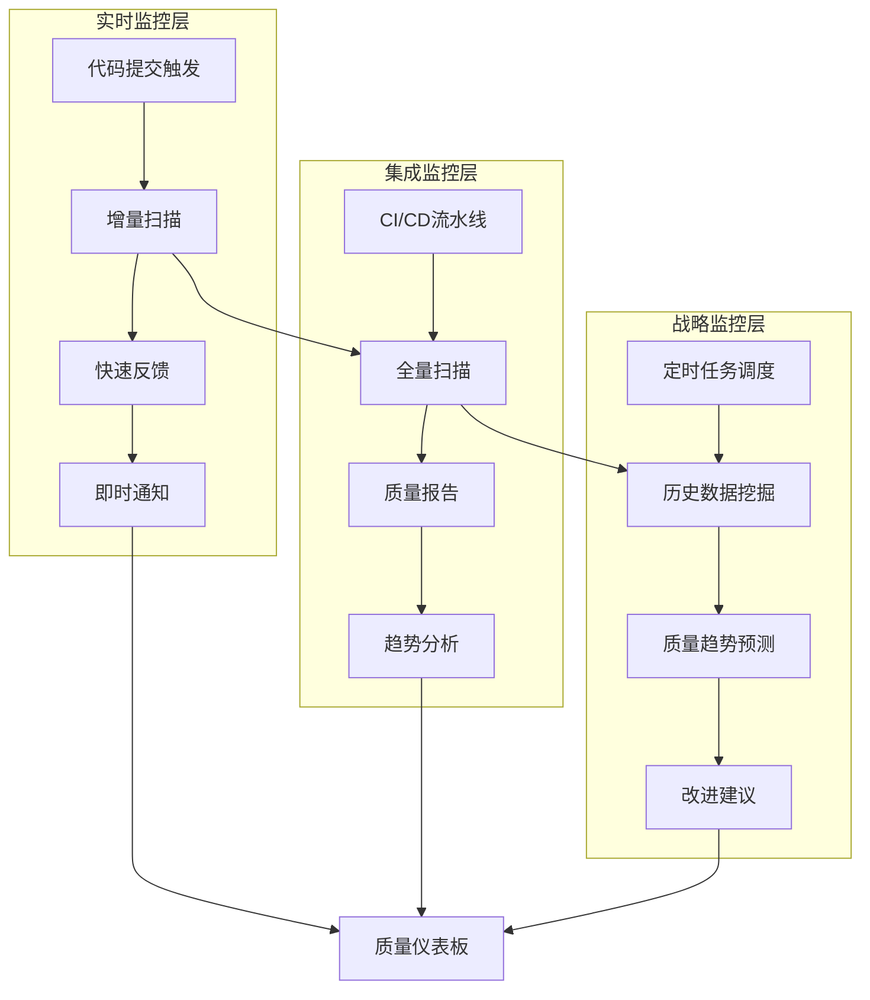
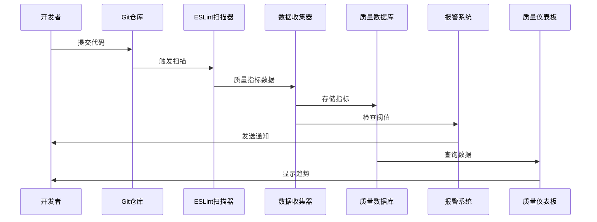

# ESLint质量监控机制设计方案

## 1. 监控架构总览

### 1.1 三层监控体系架构



### 1.2 监控数据流



## 2. 实时监控系统

### 2.1 增量扫描引擎

#### 高效增量扫描实现
```typescript
// incremental-scanner.ts
interface IncrementalScanResult {
  scanId: string;
  changedFiles: string[];
  metrics: QualityMetrics;
  violations: RuleViolation[];
  scanTime: number;
  impactedFiles: string[];
}

class IncrementalScanner {
  private cache: Map<string, FileMetrics> = new Map();
  private dependencyGraph: DependencyGraph;

  constructor(private config: ScannerConfig) {
    this.dependencyGraph = new DependencyGraph();
  }

  async scanChanges(commitHash: string): Promise<IncrementalScanResult> {
    const startTime = Date.now();

    // 1. 获取变更文件列表
    const changedFiles = await this.getChangedFiles(commitHash);

    // 2. 分析影响范围
    const impactedFiles = await this.analyzeImpact(changedFiles);

    // 3. 执行增量扫描
    const metrics = await this.scanFiles(impactedFiles);

    // 4. 生成扫描报告
    return {
      scanId: this.generateScanId(),
      changedFiles,
      metrics,
      violations: metrics.violations,
      scanTime: Date.now() - startTime,
      impactedFiles
    };
  }

  private async analyzeImpact(changedFiles: string[]): Promise<string[]> {
    const impacted = new Set<string>(changedFiles);

    // 分析依赖关系，找出受影响的文件
    for (const file of changedFiles) {
      const dependents = this.dependencyGraph.getDependents(file);
      dependents.forEach(dep => impacted.add(dep));
    }

    return Array.from(impacted);
  }

  private async scanFiles(files: string[]): Promise<QualityMetrics> {
    const eslint = new ESLint(this.config.eslintOptions);
    const results = await eslint.lintFiles(files);

    return this.aggregateResults(results);
  }
}
```

#### 依赖关系图构建
```typescript
// dependency-graph.ts
class DependencyGraph {
  private graph: Map<string, Set<string>> = new Map();
  private reverseGraph: Map<string, Set<string>> = new Map();

  buildGraph(projectRoot: string): void {
    const tsConfig = this.loadTSConfig(projectRoot);
    const program = ts.createProgram(tsConfig.fileNames, tsConfig.options);

    // 遍历所有源文件，构建依赖关系
    program.getSourceFiles().forEach(sourceFile => {
      if (!sourceFile.isDeclarationFile) {
        this.processFile(sourceFile);
      }
    });
  }

  private processFile(sourceFile: ts.SourceFile): void {
    const fileName = sourceFile.fileName;
    const imports = this.extractImports(sourceFile);

    this.graph.set(fileName, new Set(imports));

    imports.forEach(imp => {
      if (!this.reverseGraph.has(imp)) {
        this.reverseGraph.set(imp, new Set());
      }
      this.reverseGraph.get(imp)!.add(fileName);
    });
  }

  getDependents(file: string): string[] {
    return Array.from(this.reverseGraph.get(file) || []);
  }

  getDependencies(file: string): string[] {
    return Array.from(this.graph.get(file) || []);
  }
}
```

### 2.2 实时反馈机制

#### Git Hooks集成
```typescript
// git-hooks-integration.ts
interface GitHookConfig {
  preCommit: {
    enabled: boolean;
    failOnWarnings: boolean;
    timeoutMs: number;
  };
  prePush: {
    enabled: boolean;
    fullScan: boolean;
    maxWarnings: number;
  };
}

class GitHooksManager {
  constructor(
    private scanner: IncrementalScanner,
    private config: GitHookConfig
  ) {}

  async handlePreCommit(stagedFiles: string[]): Promise<HookResult> {
    if (!this.config.preCommit.enabled) {
      return { success: true, message: 'Pre-commit hook disabled' };
    }

    console.log('🔍 执行Pre-commit ESLint检查...');

    try {
      const result = await Promise.race([
        this.scanner.scanFiles(stagedFiles),
        this.timeout(this.config.preCommit.timeoutMs)
      ]);

      if (result.metrics.errorCount > 0) {
        return {
          success: false,
          message: `❌ 发现 ${result.metrics.errorCount} 个错误，请修复后重新提交`,
          violations: result.violations
        };
      }

      if (this.config.preCommit.failOnWarnings && result.metrics.warningCount > 0) {
        return {
          success: false,
          message: `⚠️ 发现 ${result.metrics.warningCount} 个警告，建议修复后重新提交`,
          violations: result.violations.filter(v => v.severity === 'warning')
        };
      }

      return {
        success: true,
        message: '✅ 代码质量检查通过',
        metrics: result.metrics
      };

    } catch (error) {
      return {
        success: false,
        message: `❌ ESLint检查失败: ${error.message}`
      };
    }
  }

  private async timeout(ms: number): Promise<never> {
    return new Promise((_, reject) => {
      setTimeout(() => reject(new Error('Pre-commit hook timeout')), ms);
    });
  }
}
```

## 3. 集成监控系统

### 3.1 CI/CD流水线集成

#### GitHub Actions工作流
```yaml
# .github/workflows/eslint-quality-monitor.yml
name: ESLint质量监控

on:
  push:
    branches: [ main, develop ]
  pull_request:
    branches: [ main ]
  schedule:
    # 每天UTC 02:00执行质量监控
    - cron: '0 2 * * *'

env:
  NODE_VERSION: '18'
  CACHE_VERSION: 'v1'

jobs:
  quality-scan:
    name: 代码质量扫描
    runs-on: ubuntu-latest
    permissions:
      contents: read
      pull-requests: write

    steps:
    - name: 检出代码
      uses: actions/checkout@v4
      with:
        fetch-depth: 0  # 获取完整历史用于趋势分析

    - name: 设置Node.js
      uses: actions/setup-node@v4
      with:
        node-version: ${{ env.NODE_VERSION }}
        cache: 'npm'

    - name: 安装依赖
      run: npm ci

    - name: 缓存ESLint结果
      uses: actions/cache@v3
      with:
        path: |
          .eslintcache
          node_modules/.cache
        key: ${{ runner.os }}-eslint-${{ env.CACHE_VERSION }}-${{ hashFiles('**/package-lock.json') }}
        restore-keys: |
          ${{ runner.os }}-eslint-${{ env.CACHE_VERSION }}-

    - name: 运行ESLint扫描
      run: |
        npm run lint -- --format=json --output-file=eslint-results.json
        npm run lint -- --format=checkstyle > eslint-checkstyle.xml

    - name: 收集质量指标
      run: |
        node scripts/collect-quality-metrics.js \
          --input eslint-results.json \
          --output quality-metrics.json \
          --baseline baseline.json

    - name: 生成质量报告
      run: |
        node scripts/generate-quality-report.js \
          --metrics quality-metrics.json \
          --output quality-report.html \
          --format html

    - name: 检查质量门禁
      run: |
        node scripts/enhanced-quality-gates.js \
          --metrics quality-metrics.json \
          --thresholds quality-thresholds.json

    - name: 上传质量报告
      uses: actions/upload-artifact@v3
      if: always()
      with:
        name: quality-reports
        path: |
          eslint-results.json
          quality-metrics.json
          quality-report.html
          eslint-checkstyle.xml

    - name: 保存质量数据到数据库
      if: github.ref == 'refs/heads/main'
      env:
        QUALITY_DB_URL: ${{ secrets.QUALITY_DB_URL }}
      run: |
        node scripts/save-quality-data.js \
          --metrics quality-metrics.json \
          --commit ${{ github.sha }} \
          --branch ${{ github.ref_name }}

    - name: PR质量评论
      if: github.event_name == 'pull_request'
      uses: actions/github-script@v6
      with:
        script: |
          const fs = require('fs');
          const metrics = JSON.parse(fs.readFileSync('quality-metrics.json', 'utf8'));

          const comment = `
          ## 📊 代码质量报告

          - **错误数量**: ${metrics.errorCount}
          - **警告数量**: ${metrics.warningCount}
          - **质量分数**: ${metrics.qualityScore}/100
          - **扫描时间**: ${metrics.scanTime}ms

          ${metrics.errorCount > 0 ? '❌ 请修复错误后再合并' : '✅ 质量检查通过'}
          `;

          github.rest.issues.createComment({
            issue_number: context.issue.number,
            owner: context.repo.owner,
            repo: context.repo.repo,
            body: comment
          });

    - name: 质量报警
      if: failure()
      env:
        SLACK_WEBHOOK: ${{ secrets.SLACK_WEBHOOK }}
      run: |
        node scripts/send-quality-alert.js \
          --metrics quality-metrics.json \
          --webhook $SLACK_WEBHOOK \
          --channel '#quality-alerts'
```

### 3.2 质量数据库设计

#### 质量指标数据模型
```typescript
// quality-database.ts
interface QualityMetrics {
  id: string;
  commitHash: string;
  branch: string;
  timestamp: Date;
  scanType: 'incremental' | 'full';
  metrics: {
    errorCount: number;
    warningCount: number;
    infoCount: number;
    fixableCount: number;
    qualityScore: number;
    scanTime: number;
    filesScanned: number;
  };
  ruleMetrics: {
    [ruleId: string]: {
      count: number;
      severity: 'error' | 'warning' | 'info';
      files: string[];
    };
  };
  fileMetrics: {
    [filePath: string]: {
      errors: number;
      warnings: number;
      complexity: number;
      maintainabilityIndex: number;
    };
  };
}

class QualityDatabase {
  constructor(private db: Database) {}

  async saveMetrics(metrics: QualityMetrics): Promise<void> {
    await this.db.collection('quality_metrics').insertOne(metrics);

    // 更新聚合数据
    await this.updateAggregatedMetrics(metrics);

    // 触发趋势分析
    await this.updateTrendAnalysis(metrics);
  }

  async getMetricsHistory(
    branch: string,
    timeRange: TimeRange
  ): Promise<QualityMetrics[]> {
    return await this.db.collection('quality_metrics')
      .find({
        branch,
        timestamp: {
          $gte: timeRange.start,
          $lte: timeRange.end
        }
      })
      .sort({ timestamp: -1 })
      .toArray();
  }

  async getQualityTrends(
    branch: string,
    metric: keyof QualityMetrics['metrics'],
    days: number = 30
  ): Promise<TrendData[]> {
    const endDate = new Date();
    const startDate = new Date(endDate.getTime() - days * 24 * 60 * 60 * 1000);

    const pipeline = [
      {
        $match: {
          branch,
          timestamp: { $gte: startDate, $lte: endDate }
        }
      },
      {
        $group: {
          _id: {
            $dateToString: {
              format: "%Y-%m-%d",
              date: "$timestamp"
            }
          },
          avgValue: { $avg: `$metrics.${metric}` },
          count: { $sum: 1 }
        }
      },
      { $sort: { _id: 1 } }
    ];

    return await this.db.collection('quality_metrics')
      .aggregate(pipeline)
      .toArray();
  }

  private async updateAggregatedMetrics(metrics: QualityMetrics): Promise<void> {
    const dateKey = metrics.timestamp.toISOString().split('T')[0];

    await this.db.collection('daily_quality_summary').updateOne(
      { date: dateKey, branch: metrics.branch },
      {
        $inc: {
          totalScans: 1,
          totalErrors: metrics.metrics.errorCount,
          totalWarnings: metrics.metrics.warningCount,
          totalScanTime: metrics.metrics.scanTime
        },
        $set: {
          lastUpdated: new Date(),
          avgQualityScore: (
            await this.calculateAverageQualityScore(dateKey, metrics.branch)
          )
        }
      },
      { upsert: true }
    );
  }

  private async updateTrendAnalysis(metrics: QualityMetrics): Promise<void> {
    // 计算趋势变化
    const previousMetrics = await this.getPreviousMetrics(metrics.branch, 1);

    if (previousMetrics) {
      const trend = this.calculateTrend(previousMetrics, metrics);

      await this.db.collection('quality_trends').insertOne({
        timestamp: new Date(),
        branch: metrics.branch,
        trend,
        changeType: this.getChangeType(trend)
      });
    }
  }
}
```

## 4. 报警系统

### 4.1 智能报警引擎

#### 报警规则引擎
```typescript
// alert-engine.ts
interface AlertRule {
  id: string;
  name: string;
  description: string;
  condition: AlertCondition;
  severity: 'critical' | 'warning' | 'info';
  cooldown: number; // 冷却时间(秒)
  enabled: boolean;
  actions: AlertAction[];
}

interface AlertCondition {
  metric: string;
  operator: 'gt' | 'lt' | 'eq' | 'gte' | 'lte';
  threshold: number;
  timeWindow?: number; // 时间窗口(秒)
  aggregation?: 'avg' | 'max' | 'min' | 'sum';
}

class AlertEngine {
  private rules: Map<string, AlertRule> = new Map();
  private alertHistory: Map<string, Date> = new Map();
  private notificationService: NotificationService;

  constructor(notificationService: NotificationService) {
    this.notificationService = notificationService;
    this.loadDefaultRules();
  }

  async evaluateMetrics(metrics: QualityMetrics): Promise<void> {
    for (const rule of this.rules.values()) {
      if (!rule.enabled) continue;

      if (this.isInCooldown(rule.id)) continue;

      const shouldAlert = await this.evaluateRule(rule, metrics);

      if (shouldAlert) {
        await this.triggerAlert(rule, metrics);
        this.recordAlert(rule.id);
      }
    }
  }

  private async evaluateRule(rule: AlertRule, metrics: QualityMetrics): Promise<boolean> {
    const value = this.extractMetricValue(metrics, rule.condition.metric);

    if (rule.condition.timeWindow) {
      // 需要时间窗口内的聚合数据
      const aggregatedValue = await this.getAggregatedValue(
        rule.condition,
        rule.condition.timeWindow
      );
      return this.compareValues(aggregatedValue, rule.condition);
    }

    return this.compareValues(value, rule.condition);
  }

  private compareValues(value: number, condition: AlertCondition): boolean {
    switch (condition.operator) {
      case 'gt': return value > condition.threshold;
      case 'lt': return value < condition.threshold;
      case 'eq': return value === condition.threshold;
      case 'gte': return value >= condition.threshold;
      case 'lte': return value <= condition.threshold;
      default: return false;
    }
  }

  private async triggerAlert(rule: AlertRule, metrics: QualityMetrics): Promise<void> {
    const alert: Alert = {
      id: this.generateAlertId(),
      ruleId: rule.id,
      ruleName: rule.name,
      severity: rule.severity,
      message: this.generateAlertMessage(rule, metrics),
      timestamp: new Date(),
      metrics,
      acknowledged: false
    };

    // 执行报警动作
    for (const action of rule.actions) {
      await this.executeAction(action, alert);
    }
  }

  private loadDefaultRules(): void {
    const defaultRules: AlertRule[] = [
      {
        id: 'error-count-critical',
        name: '错误数量严重超标',
        description: '当代码错误数量超过阈值时触发',
        condition: {
          metric: 'errorCount',
          operator: 'gt',
          threshold: 0
        },
        severity: 'critical',
        cooldown: 300, // 5分钟冷却
        enabled: true,
        actions: [
          { type: 'slack', channel: '#quality-alerts' },
          { type: 'email', recipients: ['team-lead@company.com'] },
          { type: 'github-comment', auto: true }
        ]
      },
      {
        id: 'quality-score-drop',
        name: '质量分数下降',
        description: '质量分数相比基准值下降超过10%',
        condition: {
          metric: 'qualityScore',
          operator: 'lt',
          threshold: 85,
          timeWindow: 3600, // 1小时内
          aggregation: 'avg'
        },
        severity: 'warning',
        cooldown: 1800, // 30分钟冷却
        enabled: true,
        actions: [
          { type: 'slack', channel: '#quality-monitoring' }
        ]
      },
      {
        id: 'scan-time-performance',
        name: '扫描性能下降',
        description: 'ESLint扫描时间超过基准值50%',
        condition: {
          metric: 'scanTime',
          operator: 'gt',
          threshold: 15000 // 15秒
        },
        severity: 'info',
        cooldown: 7200, // 2小时冷却
        enabled: true,
        actions: [
          { type: 'dashboard-widget', widget: 'performance-monitor' }
        ]
      }
    ];

    defaultRules.forEach(rule => this.rules.set(rule.id, rule));
  }
}
```

### 4.2 多渠道通知系统

#### 统一通知服务
```typescript
// notification-service.ts
interface NotificationChannel {
  name: string;
  enabled: boolean;
  config: ChannelConfig;
  send: (alert: Alert, channelConfig: ChannelConfig) => Promise<void>;
}

class NotificationService {
  private channels: Map<string, NotificationChannel> = new Map();

  constructor() {
    this.initializeChannels();
  }

  async sendAlert(alert: Alert, channelConfigs: AlertAction[]): Promise<void> {
    const promises = channelConfigs
      .filter(config => this.isChannelEnabled(config.type))
      .map(config => this.sendToChannel(alert, config));

    await Promise.allSettled(promises);
  }

  private async sendToChannel(alert: Alert, action: AlertAction): Promise<void> {
    const channel = this.channels.get(action.type);
    if (!channel) {
      console.warn(`未找到通知渠道: ${action.type}`);
      return;
    }

    try {
      await channel.send(alert, action.config);
      console.log(`✅ 报警已发送到 ${channel.name}`);
    } catch (error) {
      console.error(`❌ 发送报警到 ${channel.name} 失败:`, error.message);
    }
  }

  private initializeChannels(): void {
    // Slack通知
    this.channels.set('slack', {
      name: 'Slack',
      enabled: true,
      config: { webhookUrl: process.env.SLACK_WEBHOOK },
      send: this.sendSlackNotification.bind(this)
    });

    // 邮件通知
    this.channels.set('email', {
      name: 'Email',
      enabled: true,
      config: {
        smtp: {
          host: process.env.SMTP_HOST,
          port: parseInt(process.env.SMTP_PORT || '587'),
          secure: false
        },
        auth: {
          user: process.env.SMTP_USER,
          pass: process.env.SMTP_PASS
        }
      },
      send: this.sendEmailNotification.bind(this)
    });

    // GitHub评论
    this.channels.set('github-comment', {
      name: 'GitHub Comment',
      enabled: true,
      config: {
        token: process.env.GITHUB_TOKEN,
        repo: process.env.GITHUB_REPO
      },
      send: this.sendGitHubComment.bind(this)
    });

    // 仪表板通知
    this.channels.set('dashboard-widget', {
      name: 'Dashboard Widget',
      enabled: true,
      config: { widgetId: 'quality-alerts' },
      send: this.updateDashboardWidget.bind(this)
    });
  }

  private async sendSlackNotification(alert: Alert, config: any): Promise<void> {
    const payload = {
      attachments: [{
        color: this.getSeverityColor(alert.severity),
        title: `🚨 ${alert.ruleName}`,
        text: alert.message,
        fields: [
          { title: '严重程度', value: alert.severity, short: true },
          { title: '时间', value: alert.timestamp.toLocaleString(), short: true },
          { title: '错误数量', value: alert.metrics.errorCount.toString(), short: true },
          { title: '质量分数', value: `${alert.metrics.qualityScore}/100`, short: true }
        ],
        footer: 'ESLint质量监控系统',
        ts: Math.floor(alert.timestamp.getTime() / 1000)
      }]
    };

    await fetch(config.webhookUrl, {
      method: 'POST',
      headers: { 'Content-Type': 'application/json' },
      body: JSON.stringify(payload)
    });
  }

  private async sendEmailNotification(alert: Alert, config: any): Promise<void> {
    // 使用nodemailer发送邮件
    const nodemailer = require('nodemailer');
    const transporter = nodemailer.createTransporter(config.smtp);

    const htmlContent = this.generateEmailHTML(alert);

    await transporter.sendMail({
      from: config.auth.user,
      to: config.recipients.join(', '),
      subject: `[${alert.severity.toUpperCase()}] ${alert.ruleName}`,
      html: htmlContent
    });
  }

  private async sendGitHubComment(alert: Alert, config: any): Promise<void> {
    if (!process.env.GITHUB_EVENT_NAME || process.env.GITHUB_EVENT_NAME !== 'pull_request') {
      return; // 只在PR事件中发送评论
    }

    const comment = `
## 🚨 代码质量报警

**规则**: ${alert.ruleName}
**严重程度**: ${alert.severity}
**时间**: ${alert.timestamp.toLocaleString()}

${alert.message}

### 📊 当前质量指标
- 错误数量: ${alert.metrics.errorCount}
- 警告数量: ${alert.metrics.warningCount}
- 质量分数: ${alert.metrics.qualityScore}/100
- 扫描时间: ${alert.metrics.scanTime}ms

${alert.severity === 'critical' ? '⚠️ 请立即修复相关问题后再合并PR' : ''}
    `.trim();

    // 使用GitHub API发送评论
    await fetch(`${config.api_url}/issues/${process.env.GITHUB_PR_NUMBER}/comments`, {
      method: 'POST',
      headers: {
        'Authorization': `token ${config.token}`,
        'Content-Type': 'application/json',
        'User-Agent': 'eslint-quality-monitor'
      },
      body: JSON.stringify({ body: comment })
    });
  }

  private getSeverityColor(severity: string): string {
    switch (severity) {
      case 'critical': return 'danger';
      case 'warning': return 'warning';
      case 'info': return 'good';
      default: return 'warning';
    }
  }
}
```

## 5. 质量仪表板

### 5.1 实时仪表板实现

#### React仪表板组件
```typescript
// quality-dashboard.tsx
import React, { useState, useEffect } from 'react';
import { LineChart, Line, BarChart, Bar, XAxis, YAxis, CartesianGrid, Tooltip, Legend, ResponsiveContainer } from 'recharts';

interface QualityDashboardProps {
  projectId: string;
  refreshInterval?: number;
}

export const QualityDashboard: React.FC<QualityDashboardProps> = ({
  projectId,
  refreshInterval = 30000 // 30秒刷新
}) => {
  const [metrics, setMetrics] = useState<QualityMetrics | null>(null);
  const [trends, setTrends] = useState<TrendData[]>([]);
  const [alerts, setAlerts] = useState<Alert[]>([]);
  const [loading, setLoading] = useState(true);

  useEffect(() => {
    const fetchData = async () => {
      try {
        const [metricsData, trendsData, alertsData] = await Promise.all([
          fetchLatestMetrics(projectId),
          fetchQualityTrends(projectId),
          fetchActiveAlerts(projectId)
        ]);

        setMetrics(metricsData);
        setTrends(trendsData);
        setAlerts(alertsData);
      } catch (error) {
        console.error('获取质量数据失败:', error);
      } finally {
        setLoading(false);
      }
    };

    fetchData();
    const interval = setInterval(fetchData, refreshInterval);

    return () => clearInterval(interval);
  }, [projectId, refreshInterval]);

  if (loading) {
    return <div className="flex justify-center items-center h-64">加载中...</div>;
  }

  return (
    <div className="p-6 space-y-6">
      {/* 概览卡片 */}
      <div className="grid grid-cols-1 md:grid-cols-4 gap-4">
        <MetricCard
          title="错误数量"
          value={metrics?.errorCount || 0}
          trend={getTrend(trends, 'errorCount')}
          color="red"
        />
        <MetricCard
          title="警告数量"
          value={metrics?.warningCount || 0}
          trend={getTrend(trends, 'warningCount')}
          color="yellow"
        />
        <MetricCard
          title="质量分数"
          value={metrics?.qualityScore || 0}
          trend={getTrend(trends, 'qualityScore')}
          color="green"
          max={100}
        />
        <MetricCard
          title="扫描时间"
          value={metrics?.scanTime || 0}
          unit="ms"
          trend={getTrend(trends, 'scanTime')}
          color="blue"
        />
      </div>

      {/* 趋势图表 */}
      <div className="grid grid-cols-1 lg:grid-cols-2 gap-6">
        <div className="bg-white p-6 rounded-lg shadow">
          <h3 className="text-lg font-semibold mb-4">质量分数趋势</h3>
          <ResponsiveContainer width="100%" height={300}>
            <LineChart data={trends}>
              <CartesianGrid strokeDasharray="3 3" />
              <XAxis dataKey="date" />
              <YAxis domain={[0, 100]} />
              <Tooltip />
              <Legend />
              <Line
                type="monotone"
                dataKey="qualityScore"
                stroke="#10b981"
                strokeWidth={2}
                name="质量分数"
              />
            </LineChart>
          </ResponsiveContainer>
        </div>

        <div className="bg-white p-6 rounded-lg shadow">
          <h3 className="text-lg font-semibold mb-4">问题分布</h3>
          <ResponsiveContainer width="100%" height={300}>
            <BarChart data={getRuleViolationData(metrics)}>
              <CartesianGrid strokeDasharray="3 3" />
              <XAxis dataKey="rule" />
              <YAxis />
              <Tooltip />
              <Bar dataKey="count" fill="#ef4444" />
            </BarChart>
          </ResponsiveContainer>
        </div>
      </div>

      {/* 活跃报警 */}
      <div className="bg-white p-6 rounded-lg shadow">
        <h3 className="text-lg font-semibold mb-4">活跃报警</h3>
        <div className="space-y-2">
          {alerts.length === 0 ? (
            <p className="text-gray-500">暂无活跃报警</p>
          ) : (
            alerts.map(alert => (
              <AlertItem key={alert.id} alert={alert} />
            ))
          )}
        </div>
      </div>

      {/* 文件质量详情 */}
      <div className="bg-white p-6 rounded-lg shadow">
        <h3 className="text-lg font-semibold mb-4">文件质量详情</h3>
        <FileQualityTable metrics={metrics} />
      </div>
    </div>
  );
};

// 指标卡片组件
interface MetricCardProps {
  title: string;
  value: number;
  trend?: TrendData;
  color: string;
  unit?: string;
  max?: number;
}

const MetricCard: React.FC<MetricCardProps> = ({
  title,
  value,
  trend,
  color,
  unit = '',
  max
}) => {
  const getColorClasses = (color: string) => {
    switch (color) {
      case 'red': return 'bg-red-50 text-red-700 border-red-200';
      case 'yellow': return 'bg-yellow-50 text-yellow-700 border-yellow-200';
      case 'green': return 'bg-green-50 text-green-700 border-green-200';
      case 'blue': return 'bg-blue-50 text-blue-700 border-blue-200';
      default: return 'bg-gray-50 text-gray-700 border-gray-200';
    }
  };

  return (
    <div className={`p-4 rounded-lg border ${getColorClasses(color)}`}>
      <div className="flex justify-between items-start">
        <div>
          <p className="text-sm font-medium opacity-75">{title}</p>
          <p className="text-2xl font-bold">
            {value}{unit}
          </p>
        </div>
        {trend && (
          <div className={`text-sm ${trend.direction === 'up' ? 'text-green-600' : 'text-red-600'}`}>
            {trend.direction === 'up' ? '↑' : '↓'} {Math.abs(trend.change).toFixed(1)}%
          </div>
        )}
      </div>
      {max && (
        <div className="mt-2">
          <div className="w-full bg-gray-200 rounded-full h-2">
            <div
              className="bg-current h-2 rounded-full"
              style={{ width: `${(value / max) * 100}%` }}
            />
          </div>
        </div>
      )}
    </div>
  );
};
```

### 5.2 API服务

#### 质量数据API
```typescript
// quality-api.ts
import express from 'express';
import { QualityDatabase } from './quality-database';

export class QualityAPI {
  constructor(
    private db: QualityDatabase,
    private alertEngine: AlertEngine
  ) {}

  setupRoutes(app: express.Application): void {
    // 获取最新质量指标
    app.get('/api/quality/:projectId/latest', async (req, res) => {
      try {
        const { projectId } = req.params;
        const { branch = 'main' } = req.query;

        const metrics = await this.db.getLatestMetrics(projectId, branch as string);
        res.json(metrics);
      } catch (error) {
        res.status(500).json({ error: error.message });
      }
    });

    // 获取质量趋势数据
    app.get('/api/quality/:projectId/trends', async (req, res) => {
      try {
        const { projectId } = req.params;
        const { metric = 'qualityScore', days = 30 } = req.query;

        const trends = await this.db.getQualityTrends(
          projectId,
          metric as string,
          parseInt(days as string)
        );
        res.json(trends);
      } catch (error) {
        res.status(500).json({ error: error.message });
      }
    });

    // 获取活跃报警
    app.get('/api/alerts/:projectId/active', async (req, res) => {
      try {
        const { projectId } = req.params;
        const { severity } = req.query;

        const alerts = await this.alertEngine.getActiveAlerts(
          projectId,
          severity as string
        );
        res.json(alerts);
      } catch (error) {
        res.status(500).json({ error: error.message });
      }
    });

    // 手动触发扫描
    app.post('/api/quality/:projectId/scan', async (req, res) => {
      try {
        const { projectId } = req.params;
        const { fullScan = false } = req.body;

        const scanId = await this.triggerManualScan(projectId, fullScan);
        res.json({ scanId, status: 'started' });
      } catch (error) {
        res.status(500).json({ error: error.message });
      }
    });

    // 更新报警规则
    app.put('/api/alerts/:projectId/rules/:ruleId', async (req, res) => {
      try {
        const { projectId, ruleId } = req.params;
        const ruleData = req.body;

        await this.alertEngine.updateRule(ruleId, ruleData);
        res.json({ success: true });
      } catch (error) {
        res.status(500).json({ error: error.message });
      }
    });

    // 获取质量报告
    app.get('/api/quality/:projectId/report', async (req, res) => {
      try {
        const { projectId } = req.params;
        const { format = 'html', timeRange = '30d' } = req.query;

        const report = await this.generateQualityReport(
          projectId,
          format as string,
          timeRange as string
        );

        if (format === 'html') {
          res.setHeader('Content-Type', 'text/html');
          res.send(report);
        } else {
          res.json(report);
        }
      } catch (error) {
        res.status(500).json({ error: error.message });
      }
    });
  }
}
```

## 6. 部署和运维

### 6.1 Docker化部署

#### Dockerfile
```dockerfile
# Dockerfile
FROM node:18-alpine

WORKDIR /app

# 安装依赖
COPY package*.json ./
RUN npm ci --only=production

# 复制应用代码
COPY . .

# 构建应用
RUN npm run build

# 创建非root用户
RUN addgroup -g 1001 -S nodejs
RUN adduser -S eslint-monitor -u 1001

USER eslint-monitor

EXPOSE 3000

# 健康检查
HEALTHCHECK --interval=30s --timeout=3s --start-period=5s --retries=3 \
  CMD node health-check.js

CMD ["npm", "start"]
```

#### Docker Compose配置
```yaml
# docker-compose.yml
version: '3.8'

services:
  eslint-monitor:
    build: .
    ports:
      - "3000:3000"
    environment:
      - NODE_ENV=production
      - DATABASE_URL=${DATABASE_URL}
      - REDIS_URL=${REDIS_URL}
      - SLACK_WEBHOOK=${SLACK_WEBHOOK}
      - GITHUB_TOKEN=${GITHUB_TOKEN}
    depends_on:
      - postgres
      - redis
    restart: unless-stopped
    volumes:
      - ./logs:/app/logs
      - ./config:/app/config:ro

  postgres:
    image: postgres:15-alpine
    environment:
      - POSTGRES_DB=eslint_quality
      - POSTGRES_USER=eslint
      - POSTGRES_PASSWORD=${POSTGRES_PASSWORD}
    volumes:
      - postgres_data:/var/lib/postgresql/data
      - ./migrations:/docker-entrypoint-initdb.d:ro
    restart: unless-stopped

  redis:
    image: redis:7-alpine
    command: redis-server --appendonly yes
    volumes:
      - redis_data:/data
    restart: unless-stopped

  nginx:
    image: nginx:alpine
    ports:
      - "80:80"
      - "443:443"
    volumes:
      - ./nginx.conf:/etc/nginx/nginx.conf:ro
      - ./ssl:/etc/nginx/ssl:ro
    depends_on:
      - eslint-monitor
    restart: unless-stopped

volumes:
  postgres_data:
  redis_data:
```

### 6.2 监控和日志

#### Prometheus指标导出
```typescript
// prometheus-metrics.ts
import { register, Counter, Histogram, Gauge } from 'prom-client';

export class PrometheusMetrics {
  private scanDuration: Histogram<string>;
  private errorCount: Counter<string>;
  private warningCount: Counter<string>;
  private qualityScore: Gauge<string>;
  private activeAlerts: Gauge<string>;

  constructor() {
    this.scanDuration = new Histogram({
      name: 'eslint_scan_duration_seconds',
      help: 'ESLint扫描持续时间',
      labelNames: ['project', 'branch', 'scan_type'],
      buckets: [0.1, 0.5, 1, 2, 5, 10, 20, 30]
    });

    this.errorCount = new Counter({
      name: 'eslint_errors_total',
      help: 'ESLint错误总数',
      labelNames: ['project', 'branch', 'rule']
    });

    this.warningCount = new Counter({
      name: 'eslint_warnings_total',
      help: 'ESLint警告总数',
      labelNames: ['project', 'branch', 'rule']
    });

    this.qualityScore = new Gauge({
      name: 'eslint_quality_score',
      help: '代码质量分数',
      labelNames: ['project', 'branch']
    });

    this.activeAlerts = new Gauge({
      name: 'eslint_active_alerts',
      help: '活跃报警数量',
      labelNames: ['project', 'severity']
    });

    // 注册所有指标
    register.registerMetric(this.scanDuration);
    register.registerMetric(this.errorCount);
    register.registerMetric(this.warningCount);
    register.registerMetric(this.qualityScore);
    register.registerMetric(this.activeAlerts);
  }

  recordScan(duration: number, project: string, branch: string, scanType: string): void {
    this.scanDuration
      .labels(project, branch, scanType)
      .observe(duration / 1000);
  }

  recordErrors(count: number, project: string, branch: string, rule?: string): void {
    this.errorCount
      .labels(project, branch, rule || 'unknown')
      .inc(count);
  }

  recordWarnings(count: number, project: string, branch: string, rule?: string): void {
    this.warningCount
      .labels(project, branch, rule || 'unknown')
      .inc(count);
  }

  setQualityScore(score: number, project: string, branch: string): void {
    this.qualityScore.labels(project, branch).set(score);
  }

  setActiveAlerts(count: number, project: string, severity: string): void {
    this.activeAlerts.labels(project, severity).set(count);
  }

  getMetrics(): string {
    return register.metrics();
  }
}
```

---

本质量监控机制设计提供了完整的ESLint质量监控解决方案，包括实时监控、报警系统、质量仪表板和部署运维方案，确保代码质量的持续监控和改进。