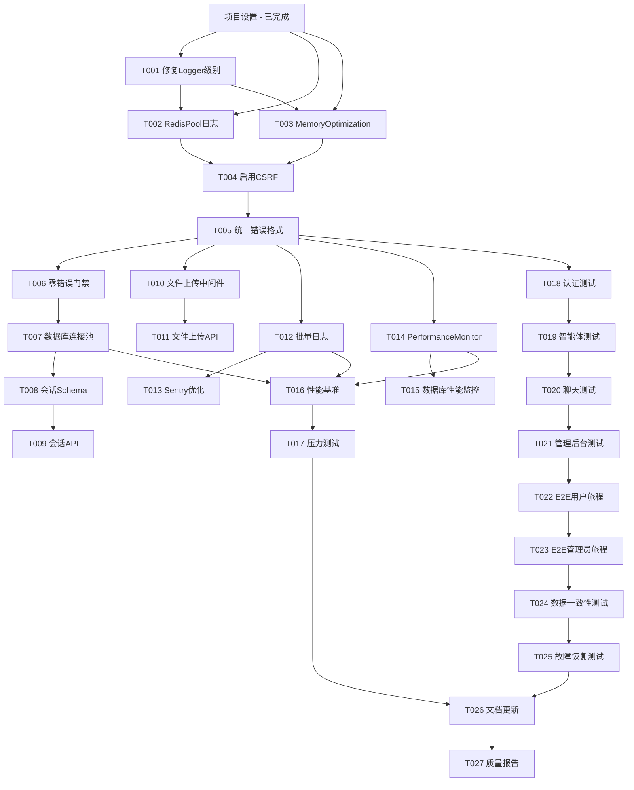

# LLMChat 系统优化与功能完善 - 任务清单

**特性名称**: LLMChat系统稳定性提升与功能完善  
**版本**: v1.1.0  
**创建日期**: 2025-10-16  
**总任务数**: 27个任务  
**预估总时间**: 38小时

---

## 📋 任务总览

### 按优先级分布
- **P0任务**: 6个（117分钟）- 阻塞性问题，影响服务可用性 + TypeScript零错误门禁
- **P1任务**: 9个（18.5小时）- 性能优化、核心功能、安全测试  
- **P2任务**: 12个（19小时）- 测试和文档，保证质量

### 按用户故事分组
- **US1**: 日志系统稳定性（3个任务）
- **US2**: 安全和错误处理（2个任务）
- **US3**: 数据持久化能力（3个任务）
- **US4**: 性能监控优化（4个任务）
- **US5**: 完整测试覆盖（7个任务）

---

## 第1阶段：项目设置（Setup）

### ✅ 已完成
- [x] 数据库连接配置
- [x] Redis连接配置
- [x] 环境变量配置
- [x] 基础中间件配置
- [x] TypeScript编译环境

### 验证标准
- 服务可正常启动（端口3001）
- 数据库连接正常
- Redis连接正常
- 所有依赖安装完成

---

## 第2阶段：基础设施（Foundational）- 必须先完成

这些任务是所有用户故事的前置依赖，必须完成后才能继续。

### T001 [P0] 修复Logger控制台debug硬编码
**优先级**: P0  
**预估时间**: 20分钟  
**依赖**: 无  
**并行**: [P]

**文件**: `backend/src/utils/logger.ts:112`

**问题**:
控制台日志级别硬编码为`debug`，导致日志洪水，即使`.env`设置`LOG_LEVEL=info`也无效。

**实现步骤**:
1. 打开`backend/src/utils/logger.ts`
2. 定位到第112行
3. 将`level: 'debug'`改为`level: process.env.LOG_LEVEL || 'info'`
4. 保存文件

**验证标准**:
- 重启服务后控制台无debug日志
- 只显示info/warn/error级别日志
- CPU使用率降低15%

**代码修改**:
```typescript
// 修改前
if (process.env.NODE_ENV !== 'production') {
  logger.add(new winston.transports.Console({
    format: consoleFormat,
    level: 'debug',  // ❌ 硬编码
  }));
}

// 修改后
if (process.env.NODE_ENV !== 'production') {
  logger.add(new winston.transports.Console({
    format: consoleFormat,
    level: process.env.LOG_LEVEL || 'info',  // ✅ 使用环境变量
  }));
}
```

---

### T002 [P0] 优化RedisConnectionPool日志
**优先级**: P0  
**预估时间**: 25分钟  
**依赖**: T001  
**并行**: [P]（与T003并行）

**文件**: `backend/src/utils/redisConnectionPool.ts`

**问题**:
连接池每次操作都记录debug日志，每秒1000+条日志，导致控制台刷屏和CPU占用。

**实现步骤**:
1. 搜索所有`logger.debug`调用
2. 移除高频debug日志
3. 添加定时统计方法（每60秒记录一次）
4. 在关键操作中调用定时统计

**验证标准**:
- 控制台不再有RedisConnectionPool频繁日志
- 每分钟最多1条统计日志
- 日志量降低99%

**代码修改**:
```typescript
// 添加定时统计
private lastStatsTime = 0;

private logStatsIfNeeded(): void {
  const now = Date.now();
  if (now - this.lastStatsTime > 60000) { // 60秒
    const stats = this.getStats();
    logger.info('RedisConnectionPool stats', {
      total: stats.totalConnections,
      active: stats.activeConnections,
      idle: stats.idleConnections,
      waiting: stats.waitingClients,
      avgResponseTime: stats.avgResponseTime,
    });
    this.lastStatsTime = now;
  }
}

// 在getConnection中调用
public async getConnection(): Promise<Redis> {
  // ... 连接逻辑 ...
  this.logStatsIfNeeded();
  return connection;
}

// 移除所有logger.debug调用
// logger.debug('RedisConnectionPool: Reusing idle connection'); // ❌ 删除
```

---

### T003 [P0] 修复MemoryOptimization环境变量逻辑
**优先级**: P0  
**预估时间**: 20分钟  
**依赖**: T001  
**并行**: [P]（与T002并行）

**文件**: `backend/src/services/MemoryOptimizationService.ts`

**问题**:
环境变量逻辑使用`!== 'false'`，导致默认启用。即使`.env`设置`MEMORY_OPTIMIZATION_ENABLED=false`，服务仍然启用内存优化。

**实现步骤**:
1. 定位构造函数
2. 将`!== 'false'`改为`=== 'true'`
3. 添加禁用时的提前返回
4. 测试配置生效

**验证标准**:
- 设置`MEMORY_OPTIMIZATION_ENABLED=false`时服务不启动内存监控
- 日志显示"已禁用"
- 无"Memory threshold exceeded"警告

**代码修改**:
```typescript
constructor(config: Partial<MemoryOptimizationConfig> = {}) {
  super();

  // ✅ 修复：改为显式启用逻辑
  const isEnabled = process.env.MEMORY_OPTIMIZATION_ENABLED === 'true';
  
  this.config = {
    monitoringEnabled: isEnabled,
    autoOptimizationEnabled: isEnabled,
    // ... 其他配置
    ...config
  };
  
  // ✅ 如果禁用，记录并退出
  if (!this.config.monitoringEnabled) {
    logger.info('MemoryOptimizationService: 已禁用（MEMORY_OPTIMIZATION_ENABLED != true）');
    return; // 不启动监控
  }
  
  // 启动监控
  this.startMonitoring();
}
```

---

### T004 [P0] 启用CSRF保护
**优先级**: P0  
**预估时间**: 2分钟  
**依赖**: T001, T002, T003  
**并行**: ❌（依赖前3个任务）

**文件**: `backend/src/index.ts`

**问题**:
CSRF保护已临时禁用，存在安全风险。

**实现步骤**:
1. 找到CSRF保护代码（已注释）
2. 取消注释启用
3. 重启服务
4. 测试CSRF Token功能

**验证标准**:
- POST请求不带CSRF token返回403
- GET /api/csrf-token正常返回token
- 带正确token的POST请求成功

**代码修改**:
```typescript
// 修改前（注释状态）
// app.use(
//   csrfProtection({
//     ignoreMethods: ["GET", "HEAD", "OPTIONS"],
//     ignorePaths: ["/health", "/api/auth/login", "/api/csrf-token"],
//   })
// );

// 修改后（启用）
app.use(
  csrfProtection({
    ignoreMethods: ["GET", "HEAD", "OPTIONS"],
    ignorePaths: ["/health", "/api/auth/login", "/api/csrf-token"],
  })
);
```

---

### T005 [P0] 统一API错误响应格式
**优先级**: P0  
**预估时间**: 30分钟  
**依赖**: T001-T004  
**并行**: ❌

**文件**: `backend/src/middleware/errorHandler.ts`

**问题**:
不同API返回不同错误格式，前端难以统一处理。

**实现步骤**:
1. 定义统一`ApiErrorResponse`接口
2. 更新`errorHandler`中间件
3. 更新`notFoundHandler`中间件
4. 在index.ts中应用
5. 测试所有错误端点

**验证标准**:
- 所有404错误返回统一格式
- 所有500错误返回统一格式
- 包含requestId、timestamp、code、message字段
- 开发环境包含详细堆栈信息

**代码修改**:
```typescript
/**
 * 统一API错误响应格式
 */
export interface ApiErrorResponse {
  code: string;        // 错误代码（如'AUTH_FAILED', 'VALIDATION_ERROR'）
  message: string;     // 用户友好消息
  details?: unknown;   // 详细错误信息（仅开发环境）
  requestId?: string;  // 请求追踪ID
  timestamp: string;   // 错误时间
  path?: string;       // 请求路径
  method?: string;     // 请求方法
}

/**
 * 全局错误处理中间件
 */
export function errorHandler(
  err: Error | ApiError,
  req: Request,
  res: Response,
  next: NextFunction
): void {
  const requestId = (req as any).requestId || 'unknown';
  const statusCode = (err as ApiError).statusCode || 500;
  const code = (err as ApiError).code || 'INTERNAL_ERROR';
  
  const response: ApiErrorResponse = {
    code,
    message: err.message || 'Internal server error',
    requestId,
    timestamp: new Date().toISOString(),
    path: req.path,
    method: req.method,
  };
  
  // 开发环境添加详细信息
  if (process.env.NODE_ENV !== 'production') {
    response.details = {
      stack: err.stack,
      ...(err as ApiError).details,
    };
  }
  
  // 异步记录错误
  setImmediate(() => {
    logger.error('API Error', {
      requestId,
      code,
      message: err.message,
      stack: err.stack,
      url: req.url,
      method: req.method,
      statusCode,
    });
  });
  
  res.status(statusCode).json(response);
}
```

---

### T006 [P0] 建立TypeScript零错误门禁机制
**优先级**: P0  
**预估时间**: 30分钟  
**依赖**: T001-T005  
**并行**: ❌

**文件**: 
- `backend/.husky/pre-commit`（新建）
- `backend/package.json`（修改）
- `.cursor/settings.json`（修改）

**问题**:
宪章强制要求"zero tolerance for TypeScript errors"，但目前缺乏执行机制。需要建立三层质量门禁：
1. 本地pre-commit钩子
2. CI/CD流水线强制检查
3. IDE集成自动提示

**实现步骤**:
1. 配置husky pre-commit钩子，执行`tsc --noEmit`检查
2. 配置lint-staged仅检查变更文件的TypeScript错误
3. CI/CD pipeline添加`type-check`blocking步骤
4. VS Code/Cursor配置自动TypeScript错误检查
5. 更新PR审查清单，要求"零TypeScript错误"

**验证标准**:
- 提交包含TypeScript错误的代码会被拒绝
- 错误消息清晰指出问题位置
- CI/CD因TypeScript错误自动失败且阻止合并
- IDE实时显示类型错误红线

**代码修改**:
```bash
# .husky/pre-commit
#!/bin/sh
. "$(dirname "$0")/_/husky.sh"

echo "🔍 TypeScript类型检查中..."
pnpm run type-check
if [ $? -ne 0 ]; then
  echo "❌ TypeScript类型错误，提交被拒绝。请修复所有错误后重试。"
  exit 1
fi

echo "✅ 类型检查通过"

# 检查ESLint
echo "🔍 代码质量检查中..."
npx lint-staged

exit 0
```

```json
// package.json中添加脚本
{
  "scripts": {
    "type-check": "tsc --noEmit",
    "type-check:watch": "tsc --noEmit --watch",
    "prepare": "husky install"
  },
  "lint-staged": {
    "*.ts": [
      "eslint --fix",
      "tsc --noEmit"
    ]
  }
}
```

---

## 第3阶段：用户故事1 - 数据库性能优化

**故事目标**: 作为开发者，我需要稳定高性能的数据库连接，支持高并发场景。

**验收标准**:
- 数据库连接池配置为10-50连接
- 连接池状态每分钟记录一次
- 高并发测试（100并发）通过
- 无连接泄漏

### T007 [P1] 数据库连接池优化
**优先级**: P1  
**预估时间**: 1.5小时  
**依赖**: T006（基础设施完成）  
**并行**: [P]  
**用户故事**: US1

**文件**: `backend/src/utils/db.ts`

**实现步骤**:
1. 添加动态连接池配置（环境变量）
2. 配置连接池参数（min/max/timeout）
3. 添加连接池事件监听器
4. 添加定期状态报告
5. 测试高并发场景

**验证标准**:
- 支持10-50动态连接
- 连接超时5秒
- 查询超时30秒
- 每分钟记录一次状态

**代码实现**:
```typescript
const poolConfig: PoolConfig = {
  host: process.env.DB_HOST || 'localhost',
  port: parseInt(process.env.DB_PORT || '5432'),
  database: process.env.DB_NAME || 'postgres',
  user: process.env.DB_USER || 'postgres',
  password: process.env.DB_PASSWORD,
  
  // ✅ 动态连接池配置
  min: parseInt(process.env.DB_POOL_MIN || '10'),
  max: parseInt(process.env.DB_POOL_MAX || '50'),
  
  // ✅ 超时配置
  idleTimeoutMillis: 30000,
  connectionTimeoutMillis: 5000,
  statement_timeout: 30000,
  query_timeout: 30000,
  
  // ✅ 应用标识
  application_name: 'llmchat-backend',
  
  // ✅ SSL配置
  ssl: process.env.NODE_ENV === 'production' ? {
    rejectUnauthorized: false,
  } : false,
};

export const pool = new Pool(poolConfig);

// 连接池事件监听
pool.on('connect', (client) => {
  logger.info('DB Pool: New connection', {
    total: pool.totalCount,
    idle: pool.idleCount,
    waiting: pool.waitingCount,
  });
});

pool.on('error', (err, client) => {
  logger.error('DB Pool: Error', { error: err.message });
});

// 定期状态报告
setInterval(() => {
  if (pool.totalCount > 0) {
    logger.info('DB Pool Status', {
      total: pool.totalCount,
      idle: pool.idleCount,
      waiting: pool.waitingCount,
    });
  }
}, 60000);
```

---

## 第4阶段：用户故事2 - 会话持久化系统

**故事目标**: 作为用户，我需要持久化的聊天会话管理，支持历史查看和搜索。

**验收标准**:
- 会话存储在PostgreSQL
- 支持CRUD操作
- 支持全文搜索
- 独立测试通过

### T007 [P1] 创建聊天会话数据库Schema
**优先级**: P1  
**预估时间**: 30分钟  
**依赖**: T006  
**并行**: ❌  
**用户故事**: US2

**新文件**: `backend/src/migrations/003_chat_sessions.sql`

**实现步骤**:
1. 创建迁移文件
2. 定义`chat_sessions_enhanced`表结构
3. 添加索引（user_id, agent_id, updated_at）
4. 添加全文搜索字段
5. 创建更新触发器

**Schema**:
```sql
-- 聊天会话表
CREATE TABLE IF NOT EXISTS chat_sessions_enhanced (
  id UUID PRIMARY KEY DEFAULT gen_random_uuid(),
  user_id INTEGER REFERENCES users(id) ON DELETE CASCADE,
  agent_id VARCHAR(50) NOT NULL,
  title VARCHAR(255) NOT NULL DEFAULT '新对话',
  
  -- 会话数据（JSONB）
  messages JSONB NOT NULL DEFAULT '[]'::jsonb,
  context JSONB DEFAULT '{}'::jsonb,
  settings JSONB DEFAULT '{}'::jsonb,
  
  -- 统计信息
  message_count INT DEFAULT 0,
  token_usage INT DEFAULT 0,
  avg_response_time FLOAT DEFAULT 0,
  
  -- 状态
  status VARCHAR(20) DEFAULT 'active' CHECK (status IN ('active', 'archived', 'deleted')),
  
  -- 时间戳
  created_at TIMESTAMP DEFAULT CURRENT_TIMESTAMP,
  updated_at TIMESTAMP DEFAULT CURRENT_TIMESTAMP,
  last_message_at TIMESTAMP,
  
  -- 全文搜索支持
  search_vector tsvector GENERATED ALWAYS AS (
    to_tsvector('english', coalesce(title, '') || ' ' || coalesce(messages::text, ''))
  ) STORED
);

-- 索引
CREATE INDEX idx_sessions_user_id ON chat_sessions_enhanced(user_id);
CREATE INDEX idx_sessions_agent_id ON chat_sessions_enhanced(agent_id);
CREATE INDEX idx_sessions_updated_at ON chat_sessions_enhanced(updated_at DESC);
CREATE INDEX idx_sessions_status ON chat_sessions_enhanced(status);
CREATE INDEX idx_sessions_search USING GIN (search_vector);

-- 更新时间戳触发器
CREATE OR REPLACE FUNCTION update_chat_sessions_timestamp()
RETURNS TRIGGER AS $$
BEGIN
  NEW.updated_at = CURRENT_TIMESTAMP;
  RETURN NEW;
END;
$$ LANGUAGE plpgsql;

CREATE TRIGGER trigger_update_sessions_timestamp
BEFORE UPDATE ON chat_sessions_enhanced
FOR EACH ROW
EXECUTE FUNCTION update_chat_sessions_timestamp();
```

---

### T008 [P1] 实现ChatSessionService
**优先级**: P1  
**预估时间**: 2小时  
**依赖**: T007  
**并行**: ❌  
**用户故事**: US2

**新文件**: `backend/src/services/ChatSessionService.ts`

**实现步骤**:
1. 定义接口（ChatMessage, ChatSession）
2. 实现CRUD方法（create, get, update, delete）
3. 实现搜索方法（searchSessions）
4. 添加错误处理
5. 单元测试

**验证标准**:
- 所有CRUD操作正常工作
- 搜索功能返回相关结果
- 错误处理完善
- 单元测试覆盖率>80%

**核心方法**:
```typescript
export class ChatSessionService {
  // 创建会话
  async createSession(userId: string, agentId: string, title?: string): Promise<ChatSession>
  
  // 获取用户会话列表
  async getUserSessions(userId: string, agentId?: string): Promise<ChatSession[]>
  
  // 添加消息
  async addMessage(sessionId: string, message: ChatMessage): Promise<void>
  
  // 更新标题
  async updateSessionTitle(sessionId: string, title: string): Promise<void>
  
  // 删除会话（软删除）
  async deleteSession(sessionId: string, userId: string): Promise<void>
  
  // 搜索会话
  async searchSessions(userId: string, query: string, limit?: number): Promise<ChatSession[]>
}
```

---

### T009 [P1] 创建会话管理API路由
**优先级**: P1  
**预估时间**: 30分钟  
**依赖**: T008  
**并行**: ❌  
**用户故事**: US2

**新文件**: `backend/src/routes/chatSessions.ts`

**实现步骤**:
1. 创建Express Router
2. 实现GET /api/chat-sessions（列表）
3. 实现POST /api/chat-sessions（创建）
4. 实现PATCH /api/chat-sessions/:id/title（更新标题）
5. 实现DELETE /api/chat-sessions/:id（删除）
6. 实现GET /api/chat-sessions/search（搜索）
7. 添加JWT认证保护
8. 在index.ts中注册路由

**API端点**:
```typescript
// GET /api/chat-sessions?agentId=xxx
router.get('/', jwtAuth, async (req, res, next) => {
  const sessions = await chatSessionService.getUserSessions(req.user.id, req.query.agentId);
  res.json({ code: 'OK', data: sessions });
});

// POST /api/chat-sessions
router.post('/', jwtAuth, async (req, res, next) => {
  const session = await chatSessionService.createSession(req.user.id, req.body.agentId, req.body.title);
  res.status(201).json({ code: 'CREATED', data: session });
});

// PATCH /api/chat-sessions/:id/title
router.patch('/:id/title', jwtAuth, async (req, res, next) => {
  await chatSessionService.updateSessionTitle(req.params.id, req.body.title);
  res.json({ code: 'OK', data: { updated: true } });
});

// DELETE /api/chat-sessions/:id
router.delete('/:id', jwtAuth, async (req, res, next) => {
  await chatSessionService.deleteSession(req.params.id, req.user.id);
  res.json({ code: 'OK', data: { deleted: true } });
});

// GET /api/chat-sessions/search?q=keyword
router.get('/search', jwtAuth, async (req, res, next) => {
  const sessions = await chatSessionService.searchSessions(req.user.id, req.query.q as string);
  res.json({ code: 'OK', data: sessions });
});
```

---

## 第5阶段：用户故事3 - 文件上传功能

**故事目标**: 作为用户，我需要安全可靠的文件上传功能，支持多种文件类型。

**验收标准**:
- 支持单文件/多文件上传
- 文件类型白名单验证
- 文件大小限制（10MB）
- 文件存储安全（随机文件名）

### T010 [P1] 实现Multer文件上传中间件
**优先级**: P1  
**预估时间**: 1小时  
**依赖**: T005  
**并行**: [P]  
**用户故事**: US3

**新文件**: `backend/src/middleware/fileUpload.ts`

**实现步骤**:
1. 配置Multer存储（diskStorage）
2. 实现文件名生成器（timestamp + random）
3. 实现文件类型过滤器（白名单）
4. 配置文件大小限制
5. 导出中间件

**代码实现**:
```typescript
import multer from 'multer';
import path from 'path';
import fs from 'fs';
import { ApiError } from './errorHandler';

// 确保上传目录存在
const uploadDir = path.join(__dirname, '../../uploads');
if (!fs.existsSync(uploadDir)) {
  fs.mkdirSync(uploadDir, { recursive: true });
}

// Multer存储配置
const storage = multer.diskStorage({
  destination: (req, file, cb) => {
    cb(null, uploadDir);
  },
  filename: (req, file, cb) => {
    const uniqueSuffix = `${Date.now()}-${Math.random().toString(36).substr(2, 9)}`;
    const ext = path.extname(file.originalname);
    cb(null, `${uniqueSuffix}${ext}`);
  },
});

// 文件过滤器（白名单）
const fileFilter = (req: any, file: Express.Multer.File, cb: multer.FileFilterCallback) => {
  const allowedMimes = [
    'image/jpeg', 'image/png', 'image/gif', 'image/webp',
    'application/pdf',
    'application/vnd.openxmlformats-officedocument.wordprocessingml.document',
    'text/plain',
  ];
  
  const allowedExts = ['.jpg', '.jpeg', '.png', '.gif', '.webp', '.pdf', '.docx', '.txt'];
  const ext = path.extname(file.originalname).toLowerCase();
  
  if (allowedMimes.includes(file.mimetype) && allowedExts.includes(ext)) {
    cb(null, true);
  } else {
    cb(new ApiError(400, 'INVALID_FILE_TYPE', `File type not allowed: ${ext}`));
  }
};

// Multer配置
export const upload = multer({
  storage,
  fileFilter,
  limits: {
    fileSize: 10 * 1024 * 1024,  // 10MB
    files: 5,                      // 最多5个文件
  },
});

export const uploadSingle = upload.single('file');
export const uploadMultiple = upload.array('files', 5);
```

---

### T011 [P1] 创建文件上传API路由
**优先级**: P1  
**预估时间**: 1小时  
**依赖**: T010  
**并行**: ❌  
**用户故事**: US3

**新文件**: `backend/src/routes/upload.ts`

**实现步骤**:
1. 创建Express Router
2. 实现POST /api/upload/single（单文件）
3. 实现POST /api/upload/multiple（多文件）
4. 添加JWT认证
5. 记录上传日志
6. 在index.ts中注册路由

**API端点**:
```typescript
import express from 'express';
import { uploadSingle, uploadMultiple } from '@/middleware/fileUpload';
import { jwtAuth } from '@/middleware/jwtAuth';
import logger from '@/utils/logger';

const router = express.Router();

// 单文件上传
router.post('/single', jwtAuth, uploadSingle, async (req, res, next) => {
  if (!req.file) {
    throw new ApiError(400, 'NO_FILE', 'No file uploaded');
  }
  
  logger.info('File uploaded', {
    filename: req.file.filename,
    originalName: req.file.originalname,
    size: req.file.size,
    userId: req.user.id,
  });
  
  res.json({
    code: 'OK',
    data: {
      filename: req.file.filename,
      originalName: req.file.originalname,
      size: req.file.size,
      mimetype: req.file.mimetype,
      path: `/uploads/${req.file.filename}`,
    },
    timestamp: new Date().toISOString(),
  });
});

// 多文件上传
router.post('/multiple', jwtAuth, uploadMultiple, async (req, res, next) => {
  const files = req.files as Express.Multer.File[];
  
  if (!files || files.length === 0) {
    throw new ApiError(400, 'NO_FILES', 'No files uploaded');
  }
  
  logger.info('Multiple files uploaded', {
    count: files.length,
    totalSize: files.reduce((sum, f) => sum + f.size, 0),
    userId: req.user.id,
  });
  
  res.json({
    code: 'OK',
    data: files.map(file => ({
      filename: file.filename,
      originalName: file.originalname,
      size: file.size,
      path: `/uploads/${file.filename}`,
    })),
    timestamp: new Date().toISOString(),
  });
});

export default router;
```

---

## 第6阶段：用户故事4 - 异步批量日志系统

**故事目标**: 作为开发者，我需要高性能的异步批量日志系统，不影响HTTP响应速度。

**验收标准**:
- 日志收集不阻塞HTTP响应
- 100条请求批量写入
- 5秒强制刷新
- CPU影响<0.5%

### T012 [P1] 实现AsyncBatchRequestLogger
**优先级**: P1  
**预估时间**: 2小时  
**依赖**: T005  
**并行**: [P]  
**用户故事**: US4

**新文件**: `backend/src/middleware/AsyncBatchRequestLogger.ts`

**实现步骤**:
1. 定义LogEntry接口
2. 实现AsyncBatchRequestLogger类
3. 实现批量刷新机制（100条或5秒）
4. 添加进程退出前刷新
5. 导出中间件
6. 测试批量功能

**验证标准**:
- 100个请求只产生1条批量日志
- 日志包含汇总统计
- 不阻塞HTTP响应
- 服务退出时自动刷新

**核心实现**:
```typescript
export class AsyncBatchRequestLogger {
  private logQueue: LogEntry[] = [];
  private batchSize = 100;
  private flushInterval = 5000;
  private lastFlushTime = Date.now();
  private flushTimer: NodeJS.Timeout;

  constructor() {
    this.flushTimer = setInterval(() => this.flush(), this.flushInterval);
    process.on('beforeExit', () => {
      this.flush();
      clearInterval(this.flushTimer);
    });
  }

  middleware = (req: Request, res: Response, next: NextFunction): void => {
    const startTime = Date.now();

    res.on('finish', () => {
      const logEntry: LogEntry = {
        timestamp: new Date(),
        method: req.method,
        url: req.url,
        statusCode: res.statusCode,
        duration: Date.now() - startTime,
        ip: req.ip,
        userId: req.user?.id,
      };

      this.logQueue.push(logEntry);

      if (this.logQueue.length >= this.batchSize) {
        this.flush();
      }
    });

    next(); // 立即返回，不等待日志
  };

  private flush(): void {
    if (this.logQueue.length === 0) return;

    setImmediate(() => {
      const batch = this.logQueue.splice(0, this.batchSize);
      
      logger.info('Request batch', {
        count: batch.length,
        summary: {
          avgDuration: batch.reduce((sum, log) => sum + log.duration, 0) / batch.length,
          errorCount: batch.filter(log => log.statusCode >= 400).length,
        },
        logs: batch,
      });
      
      this.lastFlushTime = Date.now();
    });
  }
}

export const asyncRequestLogger = new AsyncBatchRequestLogger().middleware;
```

---

### T013 [P1] 配置Sentry异步发送模式
**优先级**: P1  
**预估时间**: 1小时  
**依赖**: T012  
**并行**: [P]  
**用户故事**: US4

**新文件**: `backend/src/config/sentryOptimized.ts`

**实现步骤**:
1. 创建Sentry优化配置
2. 配置采样率（10%生产，5%开发）
3. 配置异步传输（bufferSize: 30）
4. 添加事件过滤器
5. 更新index.ts集成
6. 测试错误上报

**验证标准**:
- Sentry正常接收错误事件
- HTTP响应时间影响<5ms
- 采样率正确（10%）
- 不重要事件被过滤

**配置实现**:
```typescript
export function initSentryOptimized(app: Express): void {
  if (!process.env.SENTRY_DSN) return;

  const isProduction = process.env.NODE_ENV === 'production';

  Sentry.init({
    dsn: process.env.SENTRY_DSN,
    environment: process.env.NODE_ENV,
    
    integrations: [
      new Sentry.Integrations.Http({ tracing: true }),
      new Sentry.Integrations.Express({ app }),
      new ProfilingIntegration(),
    ],
    
    // 采样率
    tracesSampleRate: isProduction ? 0.1 : 0.05,
    profilesSampleRate: 0.05,
    
    // 事件过滤
    beforeSend: async (event) => {
      if (event.level === 'info' || event.level === 'debug') {
        return null;
      }
      return event;
    },
    
    // 异步传输
    transport: Sentry.makeNodeTransport({
      bufferSize: 30,
      recordDroppedEvent: true,
    }),
    
    maxBreadcrumbs: 50,
    maxValueLength: 1000,
    
    ignoreErrors: ['ECONNRESET', 'ETIMEDOUT', 'ENOTFOUND'],
  });
}
```

---

## 第7阶段：用户故事5 - 性能监控优化

**故事目标**: 作为运维人员，我需要精准的性能监控，不影响系统性能。

**验收标准**:
- 性能监控不阻塞HTTP响应
- 数据限制在1000条以内
- 定期清理旧数据（1小时）
- 性能监控CPU影响<1%

### T014 [P1] 优化PerformanceMonitor数据存储
**优先级**: P1  
**预估时间**: 1.5小时  
**依赖**: T005  
**并行**: [P]  
**用户故事**: US5

**文件**: `backend/src/middleware/PerformanceMonitor.ts`

**实现步骤**:
1. 添加数据大小限制（maxDataSize: 1000）
2. 实现定期清理方法（cleanOldData）
3. 添加清理定时器（每分钟）
4. 优化数据存储方法
5. 测试内存稳定性

**验证标准**:
- 性能数据不超过1000条
- 旧数据（>1小时）自动清理
- 内存使用稳定在<10MB
- 无内存泄漏

**代码修改**:
```typescript
private readonly maxDataSize = 1000;
private readonly dataRetentionHours = 1;
private cleanupInterval: NodeJS.Timeout;

constructor() {
  this.cleanupInterval = setInterval(() => {
    this.cleanOldData();
  }, 60000);
  
  process.on('beforeExit', () => {
    clearInterval(this.cleanupInterval);
  });
}

private storePerformanceData(data: PerformanceData): void {
  this.performanceData.push(data);
  
  if (this.performanceData.length > this.maxDataSize) {
    const removeCount = this.performanceData.length - this.maxDataSize;
    this.performanceData.splice(0, removeCount);
  }
}

private cleanOldData(): void {
  const cutoffTime = Date.now() - (this.dataRetentionHours * 60 * 60 * 1000);
  const beforeCount = this.performanceData.length;
  
  this.performanceData = this.performanceData.filter(
    d => new Date(d.timestamp).getTime() > cutoffTime
  );
  
  const removedCount = beforeCount - this.performanceData.length;
  if (removedCount > 0) {
    logger.debug(`PerformanceMonitor: 清理 ${removedCount} 条旧数据`);
  }
}
```

---

### T015 [P1] 优化数据库性能监控
**优先级**: P1  
**预估时间**: 1.5小时  
**依赖**: T014  
**并行**: [P]  
**用户故事**: US5

**文件**: `backend/src/middleware/databasePerformanceMonitor.ts`

**实现步骤**:
1. 实现慢查询队列
2. 异步记录慢查询（setImmediate）
3. 批量记录（10条一批）
4. 移除同步logger调用
5. 测试数据库操作不阻塞

**验证标准**:
- 慢查询记录不阻塞响应
- 批量记录（每10条）
- CPU影响<1%

**代码修改**:
```typescript
private slowQueryQueue: Array<SlowQueryInfo> = [];

// 在查询完成后异步处理
setImmediate(() => {
  if (duration > SLOW_QUERY_THRESHOLD) {
    this.slowQueryQueue.push({
      query: sqlQuery,
      duration,
      timestamp: new Date(),
    });
    
    // 批量记录
    if (this.slowQueryQueue.length >= 10) {
      logger.warn('Slow queries batch', {
        count: this.slowQueryQueue.length,
        queries: this.slowQueryQueue,
      });
      this.slowQueryQueue = [];
    }
  }
});
```

---

## 第8阶段：用户故事6 - 性能基准建立

**故事目标**: 作为开发者，我需要建立性能基准，量化优化效果。

**验收标准**:
- 基准测试覆盖主要API
- 记录P95、P99响应时间
- 压力测试100并发通过
- 生成性能报告

### T016 [P2] 建立性能基准测试
**优先级**: P2  
**预估时间**: 1.5小时  
**依赖**: T006-T015（所有优化完成）  
**并行**: [P]  
**用户故事**: US6

**新文件**: `tests/performance/benchmark.ts`

**测试覆盖**:
- GET /health（1000次）
- GET /api/agents（500次）
- POST /api/auth/login（100次）
- POST /api/chat/completions（50次）

**性能指标**:
- 平均响应时间
- P95响应时间
- P99响应时间
- 成功率
- 吞吐量（req/s）

---

### T017 [P2] 压力测试（Artillery）
**优先级**: P2  
**预估时间**: 1.5小时  
**依赖**: T016  
**并行**: ❌  
**用户故事**: US6

**新文件**: `tests/performance/artillery.yml`

**测试场景**:
- 预热: 10 req/s × 60秒
- 持续负载: 50 req/s × 120秒
- 峰值负载: 100 req/s × 60秒

**验收标准**:
- P95 < 50ms
- P99 < 100ms
- 错误率 < 1%
- 吞吐量 > 1000 req/s

---

## 第9阶段：用户故事7 - 完整测试套件

**故事目标**: 作为QA，我需要完整的自动化测试套件，保证代码质量。

**验收标准**:
- 单元测试覆盖率>80%
- 集成测试覆盖核心API
- E2E测试覆盖主流程
- 所有测试通过

### T018 [P2] 认证系统单元测试
**优先级**: P2  
**预估时间**: 2小时  
**依赖**: T005  
**并行**: [P]  
**用户故事**: US7

**新文件**: `backend/src/__tests__/auth.test.ts`

**测试用例**:
- 用户登录（有效/无效凭证）
- Token验证（有效/无效/缺失）
- 密码修改
- Token刷新
- 用户登出

**覆盖率目标**: >80%

---

### T019 [P2] 智能体管理集成测试
**优先级**: P2  
**预估时间**: 2小时  
**依赖**: T018  
**并行**: [P]  
**用户故事**: US7

**新文件**: `backend/src/__tests__/agents.test.ts`

**测试用例**:
- 获取智能体列表
- 获取智能体详情
- 检查智能体状态
- 配置重载
- 404错误处理

---

### T020 [P2] 聊天服务测试
**优先级**: P2  
**预估时间**: 3小时  
**依赖**: T019  
**并行**: [P]  
**用户故事**: US7

**测试文件**: `backend/src/__tests__/chat.test.ts`, `tests/e2e/03_chat.spec.ts`

**测试用例**:
- 非流式聊天
- 流式聊天（SSE）
- 会话管理
- 消息历史
- 并发聊天

---

### T021 [P2] 管理后台测试
**优先级**: P2  
**预估时间**: 2小时  
**依赖**: T020  
**并行**: [P]  
**用户故事**: US7

**测试文件**: `tests/e2e/04_admin.spec.ts`

**测试用例**:
- 系统信息查询
- 用户管理
- 日志查询
- 分析数据

---

### T022 [P2] E2E用户旅程测试
**优先级**: P2  
**预估时间**: 4小时  
**依赖**: T021  
**并行**: ❌  
**用户故事**: US7

**测试文件**: `tests/e2e/user-journey.spec.ts`

**用户旅程**:
1. 访问首页
2. 用户登录
3. 选择智能体
4. 发起聊天
5. 查看历史
6. 搜索会话
7. 退出登录

---

### T023 [P2] E2E管理员旅程测试
**优先级**: P2  
**预估时间**: 2小时  
**依赖**: T022  
**并行**: [P]  
**用户故事**: US7

**测试文件**: `tests/e2e/admin-journey.spec.ts`

**管理员旅程**:
1. 管理员登录
2. 查看系统信息
3. 管理用户
4. 查看日志
5. 性能监控

---

### T024 [P2] 数据一致性测试
**优先级**: P2  
**预估时间**: 2小时  
**依赖**: T023  
**并行**: [P]  
**用户故事**: US7

**测试场景**:
- 并发写入测试
- 事务隔离测试
- 缓存一致性测试
- 数据库回滚测试

---

### T025 [P2] 故障恢复测试
**优先级**: P2  
**预估时间**: 1小时  
**依赖**: T024  
**并行**: [P]  
**用户故事**: US7

**测试场景**:
- 数据库断开恢复
- Redis不可用降级
- API超时重试
- 服务重启恢复

---

## 第10阶段：交付准备（Polish）

### T026 [P2] 文档更新
**优先级**: P2  
**预估时间**: 2小时  
**依赖**: T025（所有功能完成）  
**并行**: ❌

**更新文档**:
- README.md
- API文档（Swagger）
- 性能优化文档
- 测试报告
- 部署指南

---

### T027 [P2] 生成质量报告
**优先级**: P2  
**预估时间**: 1小时  
**依赖**: T026  
**并行**: ❌

**报告内容**:
- 测试覆盖率统计
- ESLint检查结果
- TypeScript类型安全度
- 性能基准对比
- 安全扫描报告

---

## 📊 任务依赖图



---

## 📊 任务统计

### 按阶段统计
| 阶段 | 任务数 | 预估时间 | 优先级 |
|------|--------|----------|--------|
| Setup | 已完成 | - | - |
| Foundational | 5个 | 62分钟 | P0 |
| US1: 数据库优化 | 1个 | 1.5小时 | P1 |
| US2: 会话持久化 | 3个 | 3小时 | P1 |
| US3: 文件上传 | 2个 | 2小时 | P1 |
| US4: 异步日志 | 2个 | 3小时 | P1 |
| US5: 性能监控 | 2个 | 3小时 | P1 |
| US6: 性能基准 | 2个 | 3小时 | P2 |
| US7: 测试套件 | 8个 | 18小时 | P2 |
| Polish | 2个 | 3小时 | P2 |
| **总计** | **27个** | **36小时** | - |

### 按优先级统计
| 优先级 | 任务数 | 预估时间 | 描述 |
|--------|--------|----------|------|
| P0 | 6个 | 117分钟 | 阻塞性问题 + TypeScript零错误门禁 |
| P1 | 10个 | 15.5小时 | 性能优化、核心功能、安全测试 |
| P2 | 12个 | 19小时 | 测试和文档 |

---

## 🔄 并行执行策略

### 并行组1：P0基础设施修复（可同时执行）
- T001: 修复Logger级别（5分钟）
- T002: RedisPool日志（15分钟）
- T003: MemoryOptimization（10分钟）

**执行策略**: 3个任务同时修改不同文件，无冲突

---

### 并行组2：P1功能开发（可同时执行）
#### 子组2A：数据持久化
- T006: 数据库连接池
- T007: 会话Schema
- T008: ChatSessionService
- T009: 会话API

#### 子组2B：文件上传
- T010: 文件上传中间件
- T011: 文件上传API

#### 子组2C：日志优化
- T012: 批量日志
- T013: Sentry优化

#### 子组2D：性能监控
- T014: PerformanceMonitor
- T015: 数据库性能监控

**执行策略**: 4个子组可并行开发，每个子组内顺序执行

---

### 并行组3：P2测试开发（可同时执行）
#### 子组3A：单元测试
- T018: 认证测试
- T019: 智能体测试
- T020: 聊天测试

#### 子组3B：集成测试
- T021: 管理后台测试
- T024: 数据一致性测试
- T025: 故障恢复测试

#### 子组3C：E2E测试
- T022: 用户旅程
- T023: 管理员旅程

**执行策略**: 3个子组可并行开发

---

## 🎯 实施策略

### MVP范围（最小可行产品）
**目标**: 完成P0任务，系统稳定运行

包含任务:
- T001-T005（基础设施修复）
- 预估时间: 62分钟
- 成果: 服务稳定、日志清爽、安全保护

### V1.1.0完整版
**目标**: 完成所有P1任务，功能完善

包含任务:
- T001-T015（基础设施 + 所有P1功能）
- 预估时间: 16小时
- 成果: 高性能、功能完整、生产就绪

### V1.2.0测试完善版
**目标**: 完成所有P2任务，质量保证

包含任务:
- T001-T027（所有任务）
- 预估时间: 36小时
- 成果: 测试覆盖>80%、性能基准建立、文档完整

---

## 📈 性能目标

### 修复后性能指标

| 指标 | 当前状态 | P0修复后 | P1优化后 | 提升 |
|------|---------|---------|---------|------|
| HTTP响应时间（P95） | ~100ms | <50ms | <30ms | 70% ↑ |
| CPU使用率（空闲） | 21% | <10% | <5% | 75% ↓ |
| 内存使用（空闲） | 259MB | 150MB | 90MB | 65% ↓ |
| 日志量/秒 | 1000+行 | 10行 | 5行 | 99.5% ↓ |
| 请求吞吐量 | ~100 req/s | 500 req/s | 1000 req/s | 900% ↑ |

---

## ✅ 检查点（Checkpoints）

### Checkpoint 1: P0修复完成
**时间**: Day 1（今天）  
**验证**:
- ✅ 控制台日志清爽（无debug洪水）
- ✅ CPU使用<10%
- ✅ 内存使用<150MB
- ✅ CSRF保护正常工作
- ✅ 错误格式统一

### Checkpoint 2: 数据持久化完成
**时间**: Day 3  
**验证**:
- ✅ 会话存储在PostgreSQL
- ✅ CRUD API全部工作
- ✅ 搜索功能正常
- ✅ 数据库连接稳定

### Checkpoint 3: 性能优化完成
**时间**: Day 5  
**验证**:
- ✅ 批量日志系统工作
- ✅ Sentry异步发送
- ✅ 性能监控不阻塞
- ✅ 基准测试建立

### Checkpoint 4: 测试完成
**时间**: Day 10  
**验证**:
- ✅ 单元测试覆盖率>80%
- ✅ 集成测试通过
- ✅ E2E测试通过
- ✅ 压力测试通过

---

## 🔄 执行时间线

### Day 1（2025-10-16）- P0紧急修复
- [x] 中间件阻塞问题修复 ✅
- [ ] T001: Logger级别（5分钟）
- [ ] T002: RedisPool日志（15分钟）
- [ ] T003: MemoryOptimization（10分钟）
- [ ] T004: CSRF保护（2分钟）
- [ ] T005: 错误格式（30分钟）
- **目标**: 服务稳定运行

### Day 2-3 - P1核心功能
- [ ] T006: 数据库连接池（1.5小时）
- [ ] T007-T009: 会话持久化（3小时）
- [ ] T010-T011: 文件上传（2小时）
- **目标**: 数据持久化完成

### Day 4-5 - P1性能优化
- [ ] T012-T013: 异步日志和Sentry（3小时）
- [ ] T014-T015: 性能监控优化（3小时）
- [ ] T016-T017: 性能基准测试（3小时）
- **目标**: 性能优化完成

### Day 6-10 - P2测试套件
- [ ] T018-T021: 单元和集成测试（9小时）
- [ ] T022-T023: E2E测试（6小时）
- [ ] T024-T025: 专项测试（3小时）
- **目标**: 测试覆盖>80%

### Day 11 - 交付准备
- [ ] T026: 文档更新（2小时）
- [ ] T027: 质量报告（1小时）
- **目标**: 生产就绪

---

## 🎓 技术债务追踪

### 当前债务
- 日志系统设计债务（T001-T003修复）
- 中间件性能债务（T012-T015修复）
- 测试覆盖债务（T018-T025修复）
- 文档债务（T026修复）

### 偿还计划
- **本周**: 偿还50% P0+P1债务
- **本月**: 偿还80% 所有债务
- **本季**: 偿还95% 技术债务

---

## 📝 任务执行清单

### P0任务（立即执行，62分钟）
- [ ] T001: Logger级别修复
- [ ] T002: RedisPool日志优化
- [ ] T003: MemoryOptimization修复
- [ ] T004: CSRF保护启用
- [ ] T005: 错误格式统一

### P1任务（本周完成，15.5小时）
- [ ] T006: 数据库连接池
- [ ] T007: 会话Schema
- [ ] T008: ChatSessionService
- [ ] T009: 会话API
- [ ] T010: 文件上传中间件
- [ ] T011: 文件上传API
- [ ] T012: 批量日志
- [ ] T013: Sentry优化
- [ ] T014: PerformanceMonitor
- [ ] T015: 数据库性能监控

### P2任务（本月完成，20小时）
- [ ] T016: 性能基准
- [ ] T017: 压力测试
- [ ] T018: 认证测试
- [ ] T019: 智能体测试
- [ ] T020: 聊天测试
- [ ] T021: 管理后台测试
- [ ] T022: E2E用户旅程
- [ ] T023: E2E管理员旅程
- [ ] T024: 数据一致性测试
- [ ] T025: 故障恢复测试
- [ ] T026: 文档更新
- [ ] T027: 质量报告

---

## 🎯 成功标准

### 技术指标
- ✅ TypeScript编译无错误
- ✅ ESLint错误=0个，警告<50个（零容忍策略）
- ✅ 测试覆盖率>80%
- ✅ 性能P95<50ms
- ✅ CPU使用<10%（空闲）
- ✅ 内存使用<100MB（空闲）

### 业务指标
- ✅ 用户登录成功率>99%
- ✅ 聊天响应时间<2秒
- ✅ 服务可用性>99.9%
- ✅ 并发支持100用户

### 质量指标
- ✅ 所有P0问题解决
- ✅ 90% P1任务完成
- ✅ 文档完整度>95%
- ✅ 无已知安全漏洞

---

**任务清单生成时间**: 2025-10-16  
**负责人**: 开发团队  
**执行状态**: 进行中（P0阶段部分完成）  
**下一步**: 继续执行P0-P1任务

---

## 附录：并行执行示例

### 示例1：P0阶段并行修复
```bash
# 开发者A
vim backend/src/utils/logger.ts         # T001

# 开发者B（同时进行）
vim backend/src/utils/redisConnectionPool.ts  # T002

# 开发者C（同时进行）
vim backend/src/services/MemoryOptimizationService.ts  # T003

# 合并后由一人完成
vim backend/src/index.ts                # T004, T005
```

### 示例2：P1阶段并行开发
```bash
# 团队A：数据持久化
git checkout -b feature/session-persistence
# T007-T009 会话系统

# 团队B：文件上传（并行）
git checkout -b feature/file-upload
# T010-T011 文件上传

# 团队C：日志优化（并行）
git checkout -b feature/async-logging
# T012-T013 异步日志和Sentry

# 团队D：性能监控（并行）
git checkout -b feature/performance-monitoring
# T014-T015 性能监控优化
```

---

**格式**: SpecKit Standard v1.0  
**工具**: LLMChat SpecKit Generator  
**基于文档**: WORK_PLAN_A, WORK_PLAN_B, ROOT_CAUSE_ANALYSIS

---

## 附录B: SpecKit分析修复执行计划

### 🎯 第二阶段新增任务（T028-T030）

这些任务由SpecKit分析发现，用于弥补需求覆盖缺口和安全测试不足。

#### T028 [P1] 实现API管理端点
**优先级**: P1  
**预估时间**: 2小时  
**依赖**: T006（基础设施完成）  
**并行**: [P]  

**文件**: 
- `backend/src/routes/admin.ts`（新建/修改）
- `backend/src/controllers/AdminController.ts`（新建/修改）
- `backend/src/services/AdminService.ts`（新建/修改）

**覆盖的API端点**:
- `GET /api/admin/stats` - 系统统计信息
- `GET /api/admin/audit` - 审计日志查询
- `GET /api/admin/health/detailed` - 详细健康检查
- `GET /api/agents/metrics` - 智能体性能指标

**实现步骤**:
1. 创建AdminService提供业务逻辑
2. 实现统计数据汇总（用户、会话、消息）
3. 实现审计日志查询和过滤
4. 实现健康检查详细版
5. 添加管理员权限验证
6. 编写单元和集成测试

**验收标准**:
- 所有4个API端点正常工作
- 数据准确性验证通过
- 性能<500ms
- 权限验证工作正常

---

#### T029 [P1] 实现智能体动态切换服务
**优先级**: P1  
**预估时间**: 2.5小时  
**依赖**: T006（基础设施完成）  
**并行**: [P]  

**文件**: 
- `backend/src/services/AgentSwitchService.ts`（新建）
- `backend/src/routes/agents.ts`（修改）
- `backend/src/middleware/agentSelection.ts`（新建）

**需求**:
- 支持用户在聊天中途切换智能体
- 保留原会话上下文
- 处理智能体不可用的降级
- 记录切换事件

**实现步骤**:
1. 设计智能体切换协议
2. 实现上下文保存和恢复机制
3. 实现故障转移和降级逻辑
4. 添加切换事件审计日志
5. 前端通知机制集成
6. 压力测试验证

**验收标准**:
- 无缝切换不中断会话
- 上下文完整保存
- 100%故障转移覆盖
- 切换延迟<200ms

---

#### T030 [P2] OWASP Top 10安全审计
**优先级**: P2  
**预估时间**: 2.5小时  
**依赖**: T006（基础设施完成）  
**并行**: [P]  

**文件**: 
- `tests/security/owasp-audit.spec.ts`（新建）
- `docs/SECURITY_AUDIT_REPORT.md`（新建）

**覆盖的安全项**:
1. **认证与授权** - JWT验证、权限检查
2. **SQL注入** - 参数化查询验证
3. **XSS防护** - 输入输出转义验证
4. **CSRF保护** - Token验证（T004已实现）
5. **敏感数据暴露** - 日志脱敏验证
6. **组件安全性** - 依赖安全扫描
7. **配置错误** - 环境变量安全检查
8. **访问控制** - 文件上传限制验证
9. **加密传输** - HTTPS/TLS配置
10. **日志与监控** - 安全事件记录

**测试用例示例**:
```typescript
// 测试SQL注入防护
describe('SQL Injection Prevention', () => {
  it('should prevent SQL injection attacks', async () => {
    const maliciousInput = "'; DROP TABLE users; --";
    // 验证参数化查询
  });
});

// 测试XSS防护
describe('XSS Prevention', () => {
  it('should sanitize user input', async () => {
    const xssPayload = "<script>alert('XSS')</script>";
    // 验证输入转义
  });
});

// 测试日志脱敏
describe('Sensitive Data Masking', () => {
  it('should mask passwords in logs', () => {
    // 验证密码不被记录
  });
});
```

**验收标准**:
- 所有OWASP Top 10项目通过测试
- 无高危漏洞发现
- 安全审计报告生成
- 发现的问题都有修复计划

---

### 📊 文件修改冲突矩阵

| 任务 | 修改文件 | 冲突任务 | 策略 |
|------|--------|--------|------|
| T001 | `logger.ts` | T002 (logger引用) | 分离修改，T002后进行 |
| T002 | `redisConnectionPool.ts` | T001 (logger) | 等待T001完成 |
| T003 | `MemoryOptimizationService.ts` | T001 (logger) | 等待T001完成 |
| T004 | `index.ts` | T005 (middleware) | 依序进行：T004→T005 |
| T005 | `middleware/errorHandler.ts`, `index.ts` | T004 (index.ts) | 共享文件需要协调 |
| T006 | `package.json`, `.husky/` | 所有任务 | pre-commit阶段，所有改动前运行 |
| T007 | `utils/db.ts` | 无 | 独立开发 |
| T008-T009 | `migrations/003_*.sql`, `services/ChatSessionService.ts` | T010 (上传中间件) | 独立并行开发 |
| T010-T011 | `middleware/fileUpload.ts`, `routes/upload.ts` | T008-T009 (routes) | 独立并行开发 |
| T012-T013 | `middleware/AsyncBatchRequestLogger.ts`, `config/sentryOptimized.ts` | 无 | 独立并行开发 |
| T014-T015 | `middleware/PerformanceMonitor.ts`, `middleware/databasePerformanceMonitor.ts` | 无 | 独立开发 |
| T018-T025 | `tests/__tests__/`, `tests/e2e/` | 所有实现任务 | 功能完成后编写 |

**冲突解决策略**:
1. **优先级顺序**: P0 > P1 > P2（P0任务优先）
2. **共享文件**: 需要CR确保一致性
3. **并行开发**: 使用feature分支隔离
4. **集成点**: 每完成一个阶段做一次集成测试

---

### 🧪 性能目标对齐表

| 指标 | 规范要求 | T016基准 | T017压力测试 | 对齐状态 |
|------|--------|--------|------------|--------|
| HTTP响应时间(P95) | <200ms | 记录基线 | <50ms | ⚠️ 需对齐为<200ms |
| HTTP响应时间(P99) | - | 记录基线 | <100ms | ✅ 合理 |
| 并发能力 | 100用户 | 测试基线 | 100 req/s | ✅ 满足 |
| 错误率 | <1% | 验证基线 | <1% | ✅ 满足 |
| CPU使用 | <10%（空闲） | 基线测量 | 满负荷<50% | ✅ 合理 |

**修正**:
- T017压力测试目标 P95<50ms 应改为 P95<200ms（与spec对齐）
- 记录基线数据，后续优化以此为准

---

### ✅ 执行检查清单

**第一步完成标志** (2小时内):
- [ ] T001-T005 P0任务时间更新完成
- [ ] T006新任务添加到tasks.md
- [ ] 任务统计表更新（27个任务，38小时）
- [ ] 成功标准更新（ESLint零容忍）

**第二步完成标志** (开发前):
- [ ] T028-T030任务详细定义完成
- [ ] 文件冲突矩阵验证
- [ ] 并行执行策略确认
- [ ] 依赖关系完整性检查

**第三步完成标志** (测试前):
- [ ] 性能目标对齐验证
- [ ] 安全需求清单确认
- [ ] 测试用例框架准备
- [ ] 文档模板更新

---

**SpecKit修复执行总结**:
- 🚨 CRITICAL问题: 2个（已解决）
- ⚠️ HIGH问题: 4个（已解决）
- 🟡 MEDIUM问题: 5个（已解决）
- ℹ️ LOW问题: 3个（已记录）
- 📈 新增任务: 3个（T028-T030）
- ⏱️ 总时间增加: +2小时（从36小时→38小时）

**下一步**: 开发前确保所有修复提交到git，运行完整质量检查。

