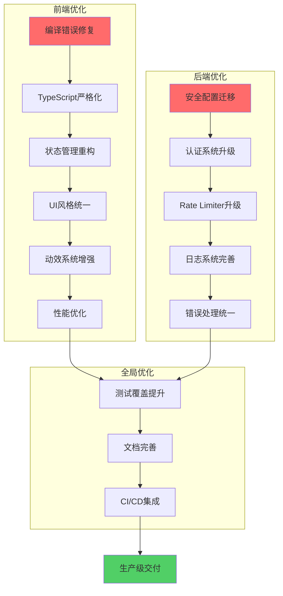
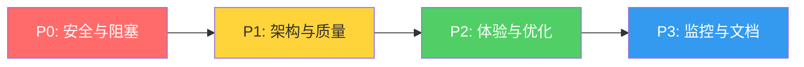
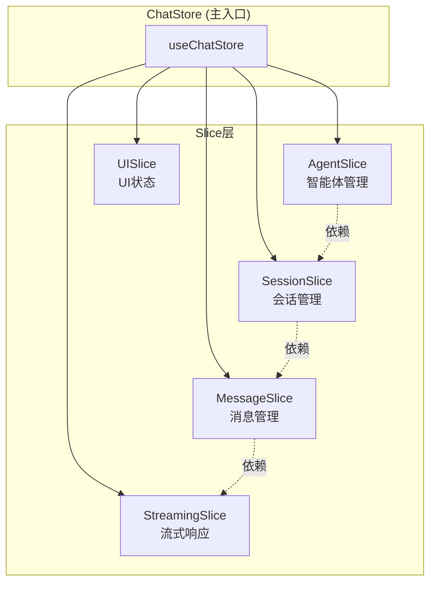
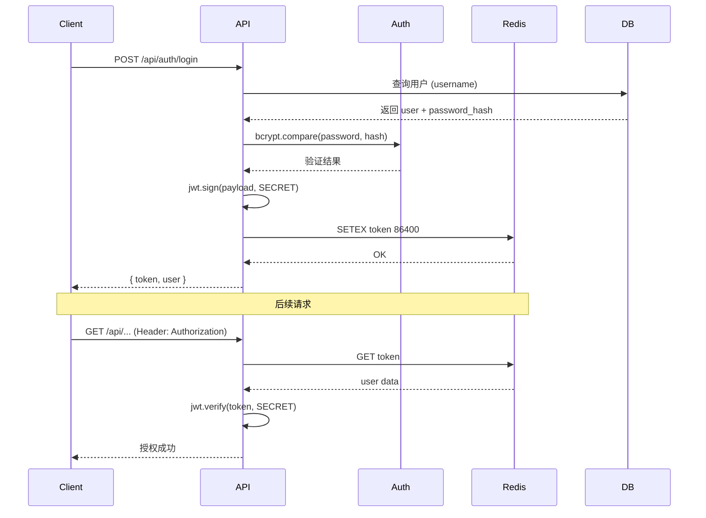
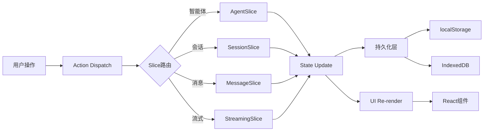
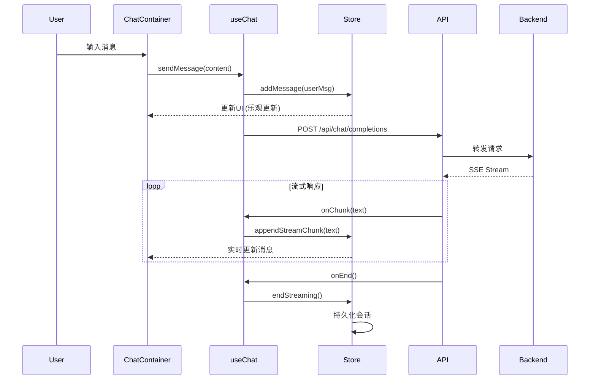

# 设计文档 - 全局UI与代码质量提升

## 架构概览

### 整体优化架构图



### 优先级分层



## 核心组件设计

### 1. 安全配置系统重构

#### 1.1 环境变量管理

**架构设计**:
```typescript
// backend/src/config/EnvManager.ts (新增)
export class EnvManager {
  private static instance: EnvManager;
  private config: Map<string, string>;
  
  private constructor() {
    this.loadEnv();
    this.validateRequired();
  }
  
  private loadEnv(): void {
    // 1. 加载 .env 文件
    dotenv.config({ path: path.resolve(__dirname, '../../.env') });
    
    // 2. 解析环境变量
    this.config = new Map(Object.entries(process.env));
  }
  
  private validateRequired(): void {
    const required = [
      'TOKEN_SECRET',
      'DB_PASSWORD',
      'FASTGPT_API_KEY_1',
      'REDIS_HOST',
    ];
    
    const missing = required.filter(key => !this.config.has(key));
    if (missing.length > 0) {
      throw new Error(`Missing required env vars: ${missing.join(', ')}`);
    }
  }
  
  public get(key: string, fallback?: string): string {
    return this.config.get(key) || fallback || '';
  }
  
  public getRequired(key: string): string {
    const value = this.config.get(key);
    if (!value) {
      throw new Error(`Required env var not found: ${key}`);
    }
    return value;
  }
}
```

**配置文件占位符替换**:
```typescript
// backend/src/config/ConfigLoader.ts (优化)
export class ConfigLoader {
  private replaceEnvPlaceholders(obj: any): any {
    const envManager = EnvManager.getInstance();
    
    if (typeof obj === 'string') {
      // 替换 ${VAR_NAME} 占位符
      return obj.replace(/\$\{([^}]+)\}/g, (_, key) => {
        return envManager.get(key, '');
      });
    }
    
    if (Array.isArray(obj)) {
      return obj.map(item => this.replaceEnvPlaceholders(item));
    }
    
    if (obj && typeof obj === 'object') {
      return Object.fromEntries(
        Object.entries(obj).map(([k, v]) => [k, this.replaceEnvPlaceholders(v)])
      );
    }
    
    return obj;
  }
}
```

#### 1.2 数据库密码安全

**迁移脚本**:
```sql
-- backend/src/migrations/007_remove_plain_password.sql
-- 1. 确保所有用户有加密密码
UPDATE users 
SET password_hash = crypt(password_plain, gen_salt('bf', 10))
WHERE password_hash IS NULL OR password_hash = '';

-- 2. 删除明文密码列
ALTER TABLE users DROP COLUMN IF EXISTS password_plain;

-- 3. 添加密码强度约束
ALTER TABLE users 
  ADD CONSTRAINT password_hash_not_empty 
  CHECK (length(password_hash) >= 60);
```

**AuthService重构**:
```typescript
// backend/src/services/AuthService.ts (重构)
export class AuthService {
  // 移除 userCredentials Map
  
  async login(username: string, password: string): Promise<LoginResult> {
    // 1. 查询数据库获取用户
    const user = await this.db.query(
      'SELECT id, username, password_hash, role FROM users WHERE username = $1',
      [username]
    );
    
    if (!user.rows[0]) {
      throw new ApiError(401, 'INVALID_CREDENTIALS', '用户名或密码错误');
    }
    
    // 2. 验证密码散列
    const isValid = await bcrypt.compare(password, user.rows[0].password_hash);
    if (!isValid) {
      throw new ApiError(401, 'INVALID_CREDENTIALS', '用户名或密码错误');
    }
    
    // 3. 生成JWT Token
    const token = jwt.sign(
      { 
        userId: user.rows[0].id, 
        username: user.rows[0].username,
        role: user.rows[0].role,
      },
      EnvManager.getInstance().getRequired('TOKEN_SECRET'),
      { expiresIn: '24h' }
    );
    
    // 4. 存储到Redis (替代内存Map)
    await this.redis.setex(
      `token:${token}`,
      86400, // 24小时
      JSON.stringify({ userId: user.rows[0].id })
    );
    
    return { token, user: { id: user.rows[0].id, username: user.rows[0].username } };
  }
}
```

#### 1.3 Rate Limiter升级

**Redis集成**:
```typescript
// backend/src/middleware/rateLimiter.ts (重构)
import { RateLimiterRedis } from 'rate-limiter-flexible';
import Redis from 'ioredis';

export function createRateLimiter() {
  const envManager = EnvManager.getInstance();
  
  const redisClient = new Redis({
    host: envManager.get('REDIS_HOST', 'localhost'),
    port: parseInt(envManager.get('REDIS_PORT', '6379')),
    password: envManager.get('REDIS_PASSWORD'),
    enableOfflineQueue: false,
  });
  
  return new RateLimiterRedis({
    storeClient: redisClient,
    keyPrefix: 'rl',
    points: parseInt(envManager.get('RATE_LIMIT_POINTS', '100')),
    duration: parseInt(envManager.get('RATE_LIMIT_DURATION', '60')),
    blockDuration: parseInt(envManager.get('RATE_LIMIT_BLOCK_DURATION', '60')),
  });
}
```

### 2. 前端编译错误修复

#### 2.1 useChat.ts 修复

```typescript
// frontend/src/hooks/useChat.ts (修复)
export const useChat = () => {
  // ✅ 正确解构所有使用的状态
  const {
    currentAgent,      // 修复: 解构缺失变量
    messages,          // 修复: 解构缺失变量
    isStreaming,
    updateMessageById, // 修复: 解构缺失变量
    addMessage,
    setIsStreaming,
    chatId,
    setChatId,
  } = useChatStore();
  
  // ... 其余代码保持不变
  
  const retryMessage = useCallback(async (messageId: string) => {
    if (!currentAgent) return; // ✅ 现在可以正常使用
    
    const message = messages.find(m => m.id === messageId); // ✅ 现在可以正常使用
    if (!message || message.role !== 'assistant') return;
    
    // 找到触发该响应的用户消息
    const messageIndex = messages.findIndex(m => m.id === messageId);
    const userMessage = messages.slice(0, messageIndex).reverse().find(m => m.role === 'user');
    
    if (!userMessage) return;
    
    // 删除失败的消息
    updateMessageById(messageId, { content: '', metadata: { retrying: true } }); // ✅ 现在可以正常使用
    
    // 重新发送
    await sendMessage(userMessage.content, { chatId });
  }, [currentAgent, messages, updateMessageById, sendMessage, chatId]); // ✅ 依赖数组完整
  
  return {
    sendMessage,
    retryMessage,
    isStreaming,
  };
};
```

#### 2.2 ChatContainer.tsx 修复

```typescript
// frontend/src/components/chat/ChatContainer.tsx (修复头部导入)
import React, { useEffect, useRef, useState } from 'react';
import { MessageList } from './MessageList';
import { MessageInput } from './MessageInput';
import { WelcomeScreen } from './WelcomeScreen';
import { useChatStore } from '@/store/chatStore';
import { useChat } from '@/hooks/useChat';
// ✅ 新增缺失导入
import { ProductPreviewWorkspace } from './ProductPreviewWorkspace';
import { VoiceCallWorkspace } from './VoiceCallWorkspace';

export const ChatContainer: React.FC = () => {
  const {
    messages,
    currentAgent,
    currentSession,
    isStreaming,
    bindSessionId,        // ✅ 解构缺失变量
    createNewSession,
  } = useChatStore();
  
  const { sendMessage } = useChat();
  const messagesEndRef = useRef<HTMLDivElement>(null);
  
  // ✅ 定义缺失常量
  const PRODUCT_PREVIEW_AGENT_ID = 'product-preview-workspace';
  const VOICE_CALL_AGENT_ID = 'voice-call-workspace';
  
  // ... 其余代码
  
  // ✅ 条件渲染自定义工作区
  if (currentAgent?.id === PRODUCT_PREVIEW_AGENT_ID) {
    return <ProductPreviewWorkspace />;
  }
  
  if (currentAgent?.id === VOICE_CALL_AGENT_ID) {
    return <VoiceCallWorkspace />;
  }
  
  return (
    <div className="flex flex-col h-full">
      {/* ... */}
    </div>
  );
};
```

#### 2.3 Sidebar.tsx 修复

```typescript
// frontend/src/components/Sidebar.tsx (修复)
import React, { useState, useEffect } from 'react';
import { Plus, Trash2, MessageSquare, ChevronLeft, ChevronRight } from 'lucide-react';
import { useChatStore } from '@/store/chatStore';
// ✅ 新增缺失导入
import { chatService } from '@/services/api';
import { mapHistoryDetailToMessages } from '@/utils/chatHistory';

// ✅ 定义缺失常量
const PRODUCT_PREVIEW_AGENT_ID = 'product-preview-workspace';
const VOICE_CALL_AGENT_ID = 'voice-call-workspace';

export const Sidebar: React.FC = () => {
  // ... 状态定义
  
  const handleDeleteConversation = async (sessionId: string, e: React.MouseEvent) => {
    e.stopPropagation();
    
    if (!window.confirm('确定要删除这个对话吗？')) {
      return; // ✅ 用户取消，直接返回
    }
    
    // ✅ 统一删除流程
    try {
      // 1. 删除本地状态
      deleteSession(sessionId);
      
      // 2. 如果是第三方智能体，删除远程历史
      if (currentAgent && 
          currentAgent.id !== PRODUCT_PREVIEW_AGENT_ID && 
          currentAgent.id !== VOICE_CALL_AGENT_ID) {
        const session = sessions.find(s => s.id === sessionId);
        if (session?.chatId) {
          await chatService.deleteHistory(session.chatId);
        }
      }
      
      // 3. 切换到其他会话
      if (currentSession?.id === sessionId) {
        const remainingSessions = sessions.filter(s => s.id !== sessionId);
        if (remainingSessions.length > 0) {
          selectSession(remainingSessions[0].id);
        } else {
          createNewSession();
        }
      }
    } catch (error) {
      console.error('Failed to delete conversation:', error);
      toast.error('删除对话失败');
    }
  };
  
  return (
    <aside className={`...`}>
      {/* ... */}
    </aside>
  );
};
```

### 3. 状态管理重构设计

#### 3.1 Slice分层架构



#### 3.2 AgentSlice设计

```typescript
// frontend/src/store/slices/agentSlice.ts (新增)
import { StateCreator } from 'zustand';
import type { AgentConfig } from '@/types';

export interface AgentSlice {
  // 状态
  agents: AgentConfig[];
  currentAgent: AgentConfig | null;
  agentLoading: boolean;
  
  // 操作
  loadAgents: () => Promise<void>;
  selectAgent: (agentId: string) => void;
  updateAgent: (agentId: string, updates: Partial<AgentConfig>) => void;
  
  // 选择器
  getAgentById: (agentId: string) => AgentConfig | undefined;
  getActiveAgents: () => AgentConfig[];
}

export const createAgentSlice: StateCreator<
  AgentSlice,
  [],
  [],
  AgentSlice
> = (set, get) => ({
  agents: [],
  currentAgent: null,
  agentLoading: false,
  
  loadAgents: async () => {
    set({ agentLoading: true });
    try {
      const response = await fetch('/api/agents');
      const agents = await response.json();
      set({ agents, agentLoading: false });
    } catch (error) {
      console.error('Failed to load agents:', error);
      set({ agentLoading: false });
    }
  },
  
  selectAgent: (agentId: string) => {
    const agent = get().getAgentById(agentId);
    if (agent) {
      set({ currentAgent: agent });
      // 触发会话加载 (通过事件系统)
      window.dispatchEvent(new CustomEvent('agent-changed', { detail: { agentId } }));
    }
  },
  
  updateAgent: (agentId: string, updates: Partial<AgentConfig>) => {
    set(state => ({
      agents: state.agents.map(a => 
        a.id === agentId ? { ...a, ...updates } : a
      ),
      currentAgent: state.currentAgent?.id === agentId 
        ? { ...state.currentAgent, ...updates } 
        : state.currentAgent,
    }));
  },
  
  getAgentById: (agentId: string) => {
    return get().agents.find(a => a.id === agentId);
  },
  
  getActiveAgents: () => {
    return get().agents.filter(a => a.isActive);
  },
});
```

#### 3.3 SessionSlice设计

```typescript
// frontend/src/store/slices/sessionSlice.ts (新增)
import { StateCreator } from 'zustand';
import type { Session } from '@/types';

export interface SessionSlice {
  // 状态
  sessions: Record<string, Session[]>; // 按agentId分组
  currentSession: Session | null;
  sessionLoading: boolean;
  
  // 操作
  loadSessions: (agentId: string) => Promise<void>;
  createSession: (agentId: string, initialData?: Partial<Session>) => Session;
  selectSession: (sessionId: string) => void;
  updateSession: (sessionId: string, updates: Partial<Session>) => void;
  deleteSession: (sessionId: string) => void;
  
  // 选择器
  getSessionsByAgent: (agentId: string) => Session[];
  getCurrentSessionMessages: () => ChatMessage[];
}

export const createSessionSlice: StateCreator<
  SessionSlice,
  [],
  [],
  SessionSlice
> = (set, get) => ({
  sessions: {},
  currentSession: null,
  sessionLoading: false,
  
  loadSessions: async (agentId: string) => {
    set({ sessionLoading: true });
    try {
      // 从localStorage加载 (持久化)
      const stored = localStorage.getItem(`sessions_${agentId}`);
      const sessions = stored ? JSON.parse(stored) : [];
      
      set(state => ({
        sessions: {
          ...state.sessions,
          [agentId]: sessions,
        },
        sessionLoading: false,
      }));
    } catch (error) {
      console.error('Failed to load sessions:', error);
      set({ sessionLoading: false });
    }
  },
  
  createSession: (agentId: string, initialData?: Partial<Session>) => {
    const newSession: Session = {
      id: Date.now().toString(),
      agentId,
      title: '新对话',
      messages: [],
      createdAt: new Date(),
      updatedAt: new Date(),
      ...initialData,
    };
    
    set(state => {
      const agentSessions = state.sessions[agentId] || [];
      const updated = {
        sessions: {
          ...state.sessions,
          [agentId]: [newSession, ...agentSessions],
        },
        currentSession: newSession,
      };
      
      // 持久化
      localStorage.setItem(`sessions_${agentId}`, JSON.stringify(updated.sessions[agentId]));
      
      return updated;
    });
    
    return newSession;
  },
  
  selectSession: (sessionId: string) => {
    const allSessions = Object.values(get().sessions).flat();
    const session = allSessions.find(s => s.id === sessionId);
    
    if (session) {
      set({ currentSession: session });
      // 触发消息加载
      window.dispatchEvent(new CustomEvent('session-changed', { detail: { sessionId } }));
    }
  },
  
  updateSession: (sessionId: string, updates: Partial<Session>) => {
    set(state => {
      const updatedSessions = { ...state.sessions };
      
      Object.keys(updatedSessions).forEach(agentId => {
        updatedSessions[agentId] = updatedSessions[agentId].map(s =>
          s.id === sessionId 
            ? { ...s, ...updates, updatedAt: new Date() }
            : s
        );
      });
      
      // 持久化
      Object.entries(updatedSessions).forEach(([agentId, sessions]) => {
        localStorage.setItem(`sessions_${agentId}`, JSON.stringify(sessions));
      });
      
      return {
        sessions: updatedSessions,
        currentSession: state.currentSession?.id === sessionId
          ? { ...state.currentSession, ...updates, updatedAt: new Date() }
          : state.currentSession,
      };
    });
  },
  
  deleteSession: (sessionId: string) => {
    set(state => {
      const updatedSessions = { ...state.sessions };
      
      Object.keys(updatedSessions).forEach(agentId => {
        updatedSessions[agentId] = updatedSessions[agentId].filter(s => s.id !== sessionId);
        localStorage.setItem(`sessions_${agentId}`, JSON.stringify(updatedSessions[agentId]));
      });
      
      return {
        sessions: updatedSessions,
        currentSession: state.currentSession?.id === sessionId ? null : state.currentSession,
      };
    });
  },
  
  getSessionsByAgent: (agentId: string) => {
    return get().sessions[agentId] || [];
  },
  
  getCurrentSessionMessages: () => {
    return get().currentSession?.messages || [];
  },
});
```

#### 3.4 Store组合

```typescript
// frontend/src/store/chatStore.ts (重构后)
import { create } from 'zustand';
import { persist } from 'zustand/middleware';
import { createAgentSlice, AgentSlice } from './slices/agentSlice';
import { createSessionSlice, SessionSlice } from './slices/sessionSlice';
import { createMessageSlice, MessageSlice } from './slices/messageSlice';
import { createStreamingSlice, StreamingSlice } from './slices/streamingSlice';
import { createUISlice, UISlice } from './slices/uiSlice';

type ChatStore = AgentSlice & SessionSlice & MessageSlice & StreamingSlice & UISlice;

export const useChatStore = create<ChatStore>()(
  persist(
    (...args) => ({
      ...createAgentSlice(...args),
      ...createSessionSlice(...args),
      ...createMessageSlice(...args),
      ...createStreamingSlice(...args),
      ...createUISlice(...args),
    }),
    {
      name: 'llmchat-store',
      version: 2, // 升级版本触发迁移
      partialize: (state) => ({
        // 仅持久化必要状态
        agents: state.agents,
        currentAgent: state.currentAgent,
        sessions: state.sessions,
        sidebarOpen: state.sidebarOpen,
      }),
    }
  )
);
```

### 4. UI风格统一设计

#### 4.1 熵基绿主题色深度应用

**Color Token系统**:
```css
/* frontend/src/styles/globals.css (增强) */
:root {
  /* 熵基绿主色系 */
  --brand: #6cb33f;
  --brand-foreground: #ffffff;
  --brand-hover: #5aa230;
  --brand-active: #4a8726;
  --brand-light: #d4f1c5;
  --brand-lighter: #e8f7dd;
  
  /* 语义化应用 */
  --primary: var(--brand);
  --primary-foreground: var(--brand-foreground);
  --accent: var(--brand);
  --accent-foreground: var(--brand-foreground);
  --ring: var(--brand);
  
  /* 状态色融合熵基绿 */
  --success: var(--brand);
  --success-foreground: var(--brand-foreground);
}

.dark {
  --brand: #7ac04f;  /* 暗色模式稍微提亮 */
  --brand-hover: #8ed161;
  --brand-active: #6cb33f;
  --brand-light: #3a5a2b;
  --brand-lighter: #2d4521;
}
```

**组件级应用规范**:
```typescript
// 按钮主色
<Button variant="primary" className="bg-brand hover:bg-brand-hover active:bg-brand-active">
  主要操作
</Button>

// 链接色
<a className="text-brand hover:text-brand-hover underline">
  查看详情
</a>

// 焦点环
<input className="focus:ring-2 focus:ring-brand focus:ring-offset-2" />

// 状态指示
<div className="flex items-center gap-2">
  <div className="w-2 h-2 rounded-full bg-brand animate-pulse" />
  <span>在线</span>
</div>

// 进度条
<div className="w-full bg-gray-200 rounded-full h-2">
  <div className="bg-brand h-2 rounded-full transition-all" style={{ width: '60%' }} />
</div>

// 徽章
<span className="inline-flex items-center px-2 py-1 rounded-full text-xs font-medium bg-brand-lighter text-brand-800">
  新消息
</span>
```

#### 4.2 对比度优化策略

**自动对比度检测**:
```typescript
// frontend/src/utils/colorContrast.ts (已存在，增强)
export function ensureContrast(
  foreground: string,
  background: string,
  targetRatio: number = 4.5
): string {
  const ratio = calculateContrastRatio(foreground, background);
  
  if (ratio >= targetRatio) {
    return foreground;
  }
  
  // 自动调整亮度直到达标
  return optimizeColorForContrast(foreground, background, targetRatio);
}

// 使用示例
const textColor = ensureContrast('#6cb33f', '#ffffff', 4.5);
// 返回: #5aa230 (调整后达到WCAG AA标准)
```

### 5. 动效系统增强设计

#### 5.1 微交互动画库

```typescript
// frontend/src/lib/animations.ts (新增)
import { Variants } from 'framer-motion';

/**
 * 按钮交互动画
 */
export const buttonVariants: Variants = {
  idle: {
    scale: 1,
    boxShadow: '0 1px 3px rgba(0,0,0,0.1)',
  },
  hover: {
    scale: 1.02,
    boxShadow: '0 4px 12px rgba(108,179,63,0.2)',
    transition: { duration: 0.2 },
  },
  tap: {
    scale: 0.98,
    boxShadow: '0 1px 2px rgba(0,0,0,0.1)',
    transition: { duration: 0.1 },
  },
};

/**
 * 卡片悬停动画
 */
export const cardVariants: Variants = {
  idle: {
    y: 0,
    boxShadow: '0 1px 3px rgba(0,0,0,0.1)',
  },
  hover: {
    y: -4,
    boxShadow: '0 12px 24px rgba(0,0,0,0.15)',
    transition: { duration: 0.3, ease: 'easeOut' },
  },
};

/**
 * 输入框聚焦动画
 */
export const inputVariants: Variants = {
  idle: {
    borderColor: 'rgb(229, 231, 235)', // border-gray-200
    boxShadow: 'none',
  },
  focus: {
    borderColor: 'rgb(108, 179, 63)', // brand
    boxShadow: '0 0 0 3px rgba(108,179,63,0.1)',
    transition: { duration: 0.2 },
  },
};

/**
 * 列表项交错进入
 */
export const listItemVariants: Variants = {
  hidden: { opacity: 0, x: -20 },
  visible: (i: number) => ({
    opacity: 1,
    x: 0,
    transition: {
      delay: i * 0.05,
      duration: 0.3,
      ease: 'easeOut',
    },
  }),
};

/**
 * 模态框动画
 */
export const modalVariants: Variants = {
  hidden: {
    opacity: 0,
    scale: 0.95,
    y: 20,
  },
  visible: {
    opacity: 1,
    scale: 1,
    y: 0,
    transition: {
      type: 'spring',
      damping: 25,
      stiffness: 300,
    },
  },
  exit: {
    opacity: 0,
    scale: 0.95,
    y: 20,
    transition: {
      duration: 0.2,
    },
  },
};
```

#### 5.2 页面转场系统

```typescript
// frontend/src/components/PageTransition.tsx (新增)
import { motion, AnimatePresence } from 'framer-motion';
import { useLocation } from 'react-router-dom';

const pageVariants: Variants = {
  initial: {
    opacity: 0,
    x: -20,
  },
  enter: {
    opacity: 1,
    x: 0,
    transition: {
      duration: 0.3,
      ease: 'easeOut',
    },
  },
  exit: {
    opacity: 0,
    x: 20,
    transition: {
      duration: 0.2,
      ease: 'easeIn',
    },
  },
};

export const PageTransition: React.FC<{ children: React.ReactNode }> = ({ children }) => {
  const location = useLocation();
  
  return (
    <AnimatePresence mode="wait">
      <motion.div
        key={location.pathname}
        variants={pageVariants}
        initial="initial"
        animate="enter"
        exit="exit"
      >
        {children}
      </motion.div>
    </AnimatePresence>
  );
};

// 使用
// frontend/src/App.tsx
<Routes>
  <Route path="/" element={
    <PageTransition>
      <ChatApp />
    </PageTransition>
  } />
  <Route path="/admin" element={
    <PageTransition>
      <AdminPage />
    </PageTransition>
  } />
</Routes>
```

#### 5.3 数据加载骨架屏

```typescript
// frontend/src/components/ui/Skeleton.tsx (新增)
import { motion } from 'framer-motion';

interface SkeletonProps {
  className?: string;
  variant?: 'text' | 'rect' | 'circle';
  animation?: 'pulse' | 'wave';
}

export const Skeleton: React.FC<SkeletonProps> = ({
  className = '',
  variant = 'text',
  animation = 'pulse',
}) => {
  const baseClasses = 'bg-gray-200 dark:bg-gray-700';
  
  const variantClasses = {
    text: 'h-4 rounded',
    rect: 'rounded-lg',
    circle: 'rounded-full',
  };
  
  const animationConfig = {
    pulse: {
      animate: {
        opacity: [0.5, 1, 0.5],
      },
      transition: {
        duration: 1.5,
        repeat: Infinity,
        ease: 'easeInOut',
      },
    },
    wave: {
      animate: {
        backgroundPosition: ['200% 0', '-200% 0'],
      },
      transition: {
        duration: 1.5,
        repeat: Infinity,
        ease: 'linear',
      },
      style: {
        backgroundImage: 'linear-gradient(90deg, transparent, rgba(255,255,255,0.4), transparent)',
        backgroundSize: '200% 100%',
      },
    },
  };
  
  return (
    <motion.div
      className={`${baseClasses} ${variantClasses[variant]} ${className}`}
      {...animationConfig[animation]}
    />
  );
};

// 组合骨架屏
export const MessageListSkeleton: React.FC = () => (
  <div className="space-y-4 p-4">
    {[1, 2, 3].map(i => (
      <div key={i} className="space-y-2">
        <Skeleton variant="text" className="w-3/4" />
        <Skeleton variant="text" className="w-1/2" />
      </div>
    ))}
  </div>
);
```

## 接口设计

### 1. 环境变量接口

```bash
# backend/.env (示例)
# === 服务器配置 ===
PORT=3001
NODE_ENV=production
FRONTEND_URL=https://yourdomain.com

# === 安全配置 ===
TOKEN_SECRET=your-256-bit-secret-key-change-in-production
REFRESH_TOKEN_SECRET=your-refresh-token-secret-key

# === 数据库配置 ===
DB_HOST=localhost
DB_PORT=5432
DB_USER=llmchat_user
DB_PASSWORD=secure-password-change-me
DB_NAME=llmchat
DB_POOL_MIN=2
DB_POOL_MAX=10

# === Redis配置 ===
REDIS_HOST=localhost
REDIS_PORT=6379
REDIS_PASSWORD=redis-password-change-me
REDIS_DB=0

# === FastGPT配置 ===
FASTGPT_ENDPOINT=https://api.fastgpt.in/api/v1
FASTGPT_API_KEY_1=fastkey-xxxxx-xxxxx
FASTGPT_APP_ID_1=app-xxxxx

# === 速率限制 ===
RATE_LIMIT_POINTS=100
RATE_LIMIT_DURATION=60
RATE_LIMIT_BLOCK_DURATION=60

# === 日志配置 ===
LOG_LEVEL=info
LOG_FILE_ENABLED=true
LOG_MAX_SIZE=10m
LOG_MAX_FILES=7d
```

### 2. 配置文件占位符格式

```jsonc
// config/agents.json (占位符版本)
{
  "agents": [
    {
      "id": "fastgpt-agent-1",
      "name": "FastGPT助手",
      "endpoint": "${FASTGPT_ENDPOINT}",
      "apiKey": "${FASTGPT_API_KEY_1}",
      "appId": "${FASTGPT_APP_ID_1}",
      "provider": "fastgpt"
    }
  ]
}
```

### 3. Store接口重构

```typescript
// frontend/src/types/store.ts (新增)
export interface StoreState {
  // Agent管理
  agents: AgentConfig[];
  currentAgent: AgentConfig | null;
  
  // 会话管理
  sessions: Record<string, Session[]>;
  currentSession: Session | null;
  
  // 消息管理
  messages: ChatMessage[];
  
  // 流式状态
  isStreaming: boolean;
  streamingMessageId: string | null;
  
  // UI状态
  sidebarOpen: boolean;
  theme: ThemeMode;
}

export interface StoreActions {
  // Agent操作
  loadAgents: () => Promise<void>;
  selectAgent: (agentId: string) => void;
  
  // 会话操作
  loadSessions: (agentId: string) => Promise<void>;
  createSession: (agentId: string) => Session;
  selectSession: (sessionId: string) => void;
  deleteSession: (sessionId: string) => void;
  
  // 消息操作
  addMessage: (message: ChatMessage) => void;
  updateMessage: (messageId: string, updates: Partial<ChatMessage>) => void;
  deleteMessage: (messageId: string) => void;
  
  // 流式操作
  startStreaming: (messageId: string) => void;
  appendStreamChunk: (chunk: string) => void;
  endStreaming: () => void;
  
  // UI操作
  toggleSidebar: () => void;
  setTheme: (theme: ThemeMode) => void;
}
```

## 数据流向图

### 1. 认证流程



### 2. 状态管理数据流



### 3. 消息发送流程



## 异常处理策略

### 1. 前端错误边界

```typescript
// frontend/src/components/ErrorBoundary.tsx (增强)
export class ErrorBoundary extends React.Component<Props, State> {
  componentDidCatch(error: Error, errorInfo: React.ErrorInfo) {
    // 1. 记录到本地
    console.error('React Error Boundary:', error, errorInfo);
    
    // 2. 上报到监控系统 (如Sentry)
    if (window.Sentry) {
      window.Sentry.captureException(error, {
        contexts: {
          react: {
            componentStack: errorInfo.componentStack,
          },
        },
      });
    }
    
    // 3. 显示用户友好错误
    this.setState({
      hasError: true,
      error,
      errorInfo,
    });
  }
  
  render() {
    if (this.state.hasError) {
      return (
        <div className="min-h-screen flex items-center justify-center bg-background">
          <div className="max-w-md p-6 bg-card rounded-lg shadow-lg">
            <AlertCircle className="w-12 h-12 text-error mx-auto mb-4" />
            <h2 className="text-xl font-semibold text-center mb-2">
              应用出现错误
            </h2>
            <p className="text-muted-foreground text-center mb-4">
              我们已记录此问题,请刷新页面重试
            </p>
            <Button
              onClick={() => window.location.reload()}
              className="w-full"
            >
              刷新页面
            </Button>
          </div>
        </div>
      );
    }
    
    return this.props.children;
  }
}
```

### 2. API错误处理

```typescript
// frontend/src/services/api.ts (增强)
export class ApiClient {
  private async handleError(error: any): Promise<never> {
    // 1. 网络错误
    if (!error.response) {
      const networkError = new ApiError(0, 'NETWORK_ERROR', '网络连接失败,请检查网络');
      toast.error(networkError.message);
      throw networkError;
    }
    
    // 2. 认证错误
    if (error.response.status === 401) {
      // 清除Token并跳转登录
      localStorage.removeItem('token');
      window.location.href = '/login';
      throw new ApiError(401, 'UNAUTHORIZED', '登录已过期,请重新登录');
    }
    
    // 3. 权限错误
    if (error.response.status === 403) {
      toast.error('您没有权限执行此操作');
      throw new ApiError(403, 'FORBIDDEN', '权限不足');
    }
    
    // 4. 业务错误
    const { code, message } = error.response.data;
    toast.error(message || '操作失败,请稍后重试');
    throw new ApiError(error.response.status, code, message);
  }
}
```

### 3. 后端错误处理

```typescript
// backend/src/middleware/errorHandler.ts (增强)
export const errorHandler: ErrorRequestHandler = (err, req, res, next) => {
  // 1. 记录错误
  logger.error('Request error', {
    error: {
      name: err.name,
      message: err.message,
      stack: err.stack,
    },
    request: {
      method: req.method,
      url: req.url,
      ip: req.ip,
      userId: req.user?.id,
    },
  });
  
  // 2. 识别错误类型
  if (err instanceof ApiError) {
    return res.status(err.status).json({
      code: err.code,
      message: err.message,
      ...(process.env.NODE_ENV === 'development' && {
        details: err.details,
        stack: err.stack,
      }),
    });
  }
  
  // 3. 数据库错误
  if (err.code?.startsWith('23')) { // PostgreSQL约束错误
    return res.status(400).json({
      code: 'DB_CONSTRAINT_VIOLATION',
      message: '数据操作违反约束条件',
    });
  }
  
  // 4. JWT错误
  if (err.name === 'JsonWebTokenError') {
    return res.status(401).json({
      code: 'INVALID_TOKEN',
      message: 'Token无效',
    });
  }
  
  // 5. 未知错误
  res.status(500).json({
    code: 'INTERNAL_SERVER_ERROR',
    message: process.env.NODE_ENV === 'production' 
      ? '服务器内部错误'
      : err.message,
  });
};
```

## 性能优化策略

### 1. 前端性能

**代码分割**:
```typescript
// frontend/src/App.tsx (优化)
import { lazy, Suspense } from 'react';

const ChatApp = lazy(() => import('./components/ChatApp'));
const AdminPage = lazy(() => import('./components/admin/AdminPage'));
const LoginPage = lazy(() => import('./components/admin/LoginPage'));

export default function App() {
  return (
    <Suspense fallback={<LoadingScreen />}>
      <Routes>
        <Route path="/" element={<ChatApp />} />
        <Route path="/admin" element={<AdminPage />} />
        <Route path="/login" element={<LoginPage />} />
      </Routes>
    </Suspense>
  );
}
```

**虚拟化长列表**:
```typescript
// frontend/src/components/chat/MessageList.tsx (优化)
import { FixedSizeList } from 'react-window';

export const MessageList: React.FC<Props> = ({ messages }) => {
  const Row = ({ index, style }: any) => (
    <div style={style}>
      <MessageItem message={messages[index]} />
    </div>
  );
  
  return (
    <FixedSizeList
      height={600}
      itemCount={messages.length}
      itemSize={120}
      width="100%"
    >
      {Row}
    </FixedSizeList>
  );
};
```

### 2. 后端性能

**数据库连接池优化**:
```typescript
// backend/src/utils/db.ts (优化)
export const pool = new Pool({
  host: EnvManager.getInstance().get('DB_HOST'),
  port: parseInt(EnvManager.getInstance().get('DB_PORT', '5432')),
  user: EnvManager.getInstance().get('DB_USER'),
  password: EnvManager.getInstance().getRequired('DB_PASSWORD'),
  database: EnvManager.getInstance().get('DB_NAME'),
  
  // 连接池配置
  min: parseInt(EnvManager.getInstance().get('DB_POOL_MIN', '2')),
  max: parseInt(EnvManager.getInstance().get('DB_POOL_MAX', '10')),
  idleTimeoutMillis: 30000,
  connectionTimeoutMillis: 2000,
  
  // 健康检查
  allowExitOnIdle: false,
});

// 监听连接池事件
pool.on('error', (err) => {
  logger.error('Database pool error', { error: err });
});

pool.on('connect', () => {
  logger.debug('New database connection established');
});
```

**查询优化**:
```typescript
// 使用索引
await pool.query(`
  SELECT * FROM sessions 
  WHERE agent_id = $1 AND user_id = $2
  ORDER BY updated_at DESC
  LIMIT 20
`, [agentId, userId]);

// 批量插入
await pool.query(`
  INSERT INTO messages (session_id, role, content, created_at)
  SELECT * FROM unnest($1::text[], $2::text[], $3::text[], $4::timestamptz[])
`, [sessionIds, roles, contents, timestamps]);
```

## 监控与日志

### 1. 结构化日志

```typescript
// backend/src/utils/logger.ts (增强)
import winston from 'winston';

export const logger = winston.createLogger({
  level: EnvManager.getInstance().get('LOG_LEVEL', 'info'),
  format: winston.format.combine(
    winston.format.timestamp(),
    winston.format.errors({ stack: true }),
    winston.format.json()
  ),
  defaultMeta: {
    service: 'llmchat-backend',
    environment: process.env.NODE_ENV,
  },
  transports: [
    // 控制台输出
    new winston.transports.Console({
      format: winston.format.combine(
        winston.format.colorize(),
        winston.format.simple()
      ),
    }),
    
    // 文件输出
    new winston.transports.File({
      filename: 'backend/log/error.log',
      level: 'error',
      maxsize: 10 * 1024 * 1024, // 10MB
      maxFiles: 7,
    }),
    
    new winston.transports.File({
      filename: 'backend/log/app.log',
      maxsize: 10 * 1024 * 1024,
      maxFiles: 7,
    }),
  ],
});
```

### 2. 性能监控

```typescript
// backend/src/middleware/performanceMonitor.ts (新增)
export const performanceMonitor: RequestHandler = (req, res, next) => {
  const start = Date.now();
  
  res.on('finish', () => {
    const duration = Date.now() - start;
    
    logger.info('Request completed', {
      method: req.method,
      url: req.url,
      status: res.statusCode,
      duration,
      userId: req.user?.id,
    });
    
    // 慢查询告警
    if (duration > 1000) {
      logger.warn('Slow request detected', {
        method: req.method,
        url: req.url,
        duration,
      });
    }
  });
  
  next();
};
```

---

**文档版本**: v1.0
**创建日期**: 2025-10-03
**最后更新**: 2025-10-03

