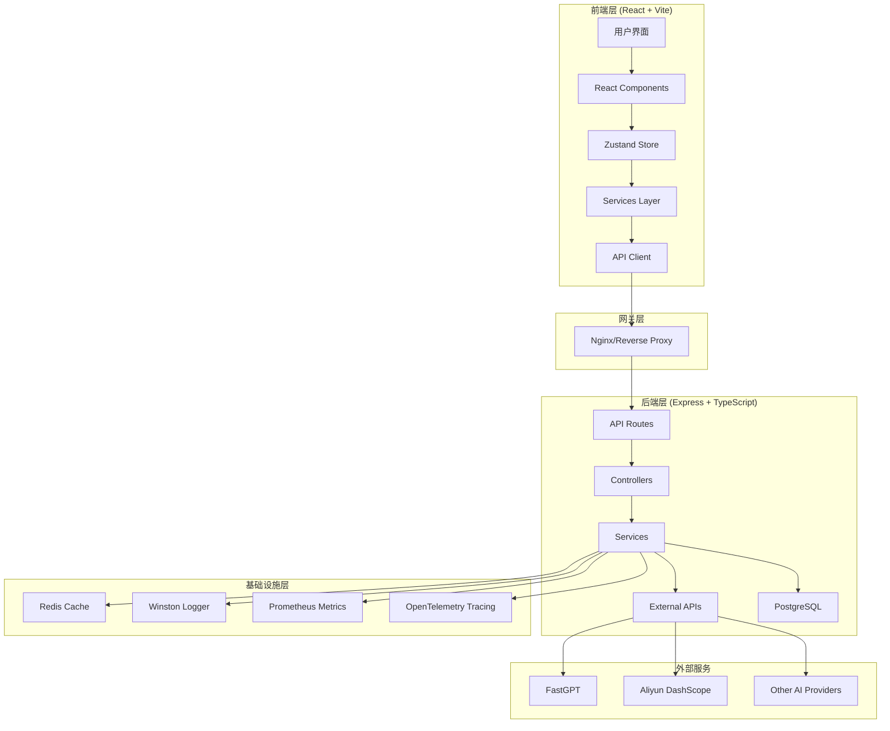
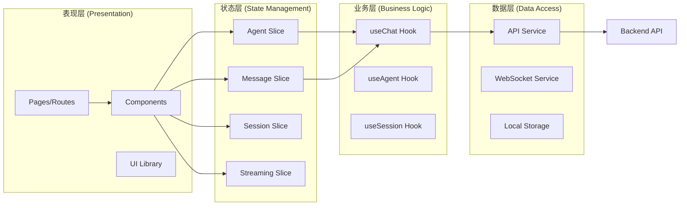
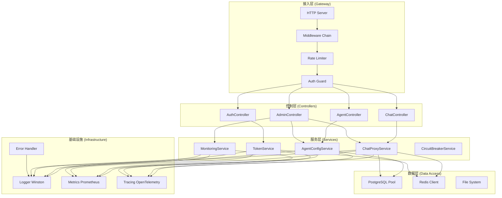
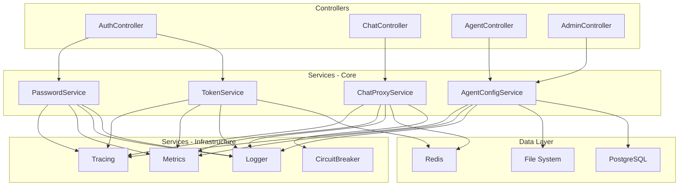
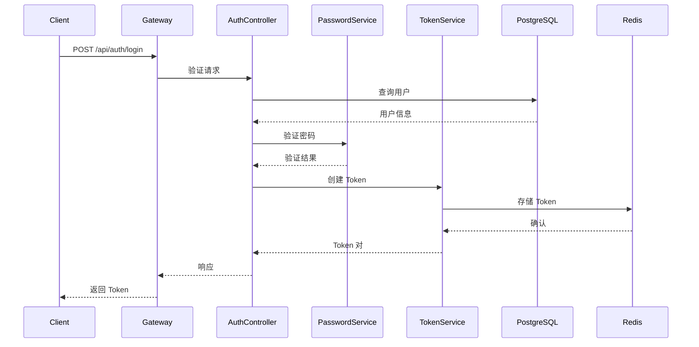
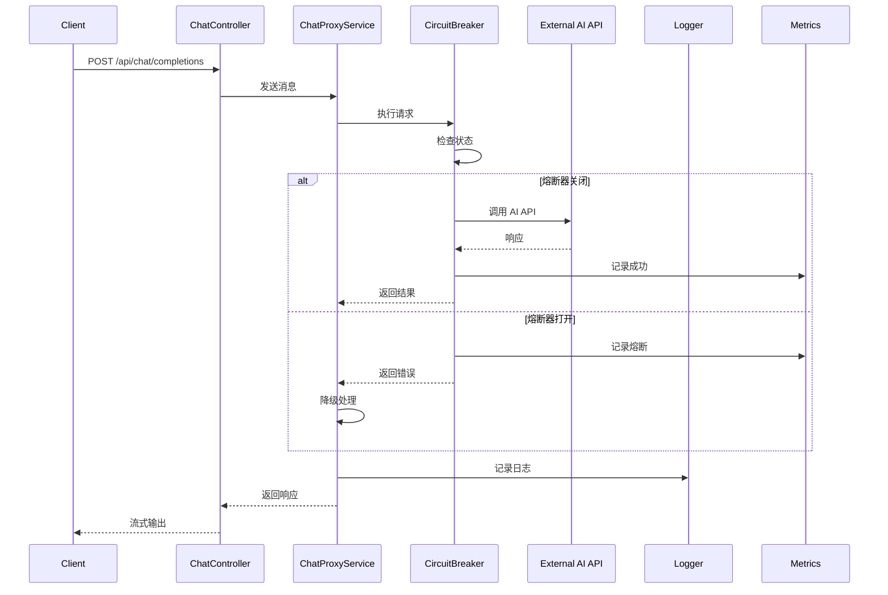
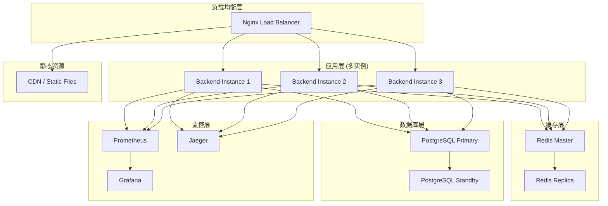
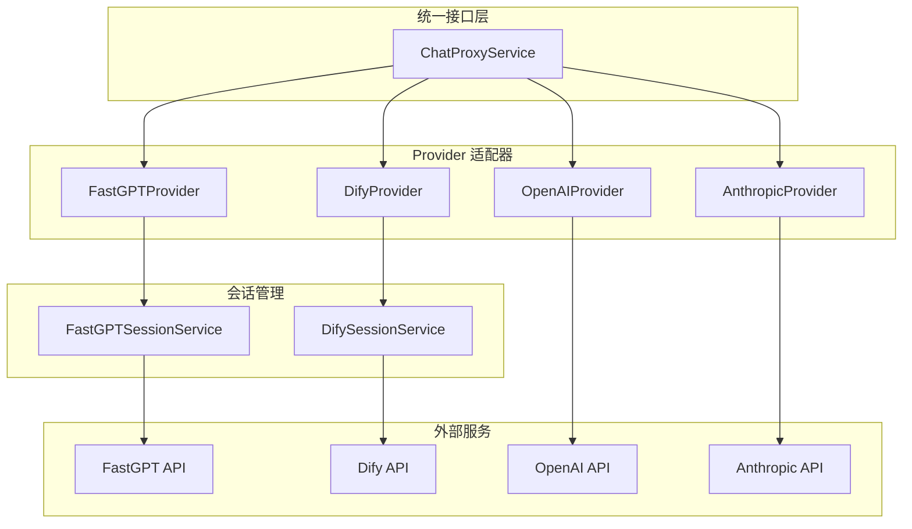

# 设计文档 - 全局项目审计与优化

## 架构概览

### 整体架构图



### 分层设计

#### 1. 前端架构 (Frontend Architecture)



#### 2. 后端架构 (Backend Architecture)



## 核心组件详细设计

### 1. 安全模块设计

#### 1.1 密码加密服务 (PasswordService)

```typescript
// backend/src/services/PasswordService.ts

import bcrypt from 'bcrypt';
import { BaseError } from '@/types/errors';

interface PasswordStrengthResult {
  valid: boolean;
  score: number; // 0-4
  feedback: string[];
}

export class PasswordService {
  private readonly saltRounds = 12;
  private readonly minLength = 8;
  private readonly maxLength = 128;

  /**
   * 散列密码
   */
  async hashPassword(plainPassword: string): Promise<string> {
    this.validatePasswordFormat(plainPassword);
    const salt = await bcrypt.genSalt(this.saltRounds);
    return bcrypt.hash(plainPassword, salt);
  }

  /**
   * 验证密码
   */
  async verifyPassword(plainPassword: string, hashedPassword: string): Promise<boolean> {
    try {
      return await bcrypt.compare(plainPassword, hashedPassword);
    } catch (error) {
      throw new BaseError({
        message: 'Password verification failed',
        code: 'PASSWORD_VERIFY_ERROR',
        category: 'security',
        cause: error as Error
      });
    }
  }

  /**
   * 检查密码强度
   */
  checkPasswordStrength(password: string): PasswordStrengthResult {
    const feedback: string[] = [];
    let score = 0;

    // 长度检查
    if (password.length < this.minLength) {
      feedback.push(`密码长度至少 ${this.minLength} 位`);
    } else if (password.length >= this.minLength) {
      score++;
    }

    // 复杂度检查
    if (!/[a-z]/.test(password)) {
      feedback.push('至少包含一个小写字母');
    } else {
      score++;
    }

    if (!/[A-Z]/.test(password)) {
      feedback.push('至少包含一个大写字母');
    } else {
      score++;
    }

    if (!/[0-9]/.test(password)) {
      feedback.push('至少包含一个数字');
    } else {
      score++;
    }

    if (!/[!@#$%^&*(),.?":{}|<>]/.test(password)) {
      feedback.push('建议包含特殊字符以增强安全性');
    } else {
      score++;
    }

    // 常见弱密码检查
    const weakPasswords = ['password', '12345678', 'qwerty', 'admin123'];
    if (weakPasswords.some(weak => password.toLowerCase().includes(weak))) {
      feedback.push('密码过于简单,请避免使用常见密码');
      score = Math.max(0, score - 2);
    }

    return {
      valid: score >= 3,
      score: Math.min(4, score),
      feedback
    };
  }

  /**
   * 格式验证
   */
  private validatePasswordFormat(password: string): void {
    if (!password || typeof password !== 'string') {
      throw new BaseError({
        message: 'Password must be a non-empty string',
        code: 'INVALID_PASSWORD_FORMAT',
        category: 'validation'
      });
    }

    if (password.length < this.minLength || password.length > this.maxLength) {
      throw new BaseError({
        message: `Password length must be between ${this.minLength} and ${this.maxLength} characters`,
        code: 'INVALID_PASSWORD_LENGTH',
        category: 'validation'
      });
    }
  }
}
```

**测试覆盖要求**:
- ✅ 正常密码散列和验证
- ✅ 错误密码验证失败
- ✅ 密码强度评分准确性
- ✅ 边界条件(最小/最大长度)
- ✅ 特殊字符处理
- ✅ 常见弱密码检测
- ✅ 并发安全性

#### 1.2 Token 服务 (TokenService)

```typescript
// backend/src/services/TokenService.ts

import Redis from 'ioredis';
import jwt from 'jsonwebtoken';
import { BaseError } from '@/types/errors';
import logger from '@/utils/logger';

interface TokenPayload {
  userId: string;
  username: string;
  role: 'admin' | 'user';
  iat: number;
  exp: number;
}

interface TokenMetadata {
  createdAt: number;
  userAgent?: string;
  ip?: string;
  lastAccessedAt: number;
}

export class TokenService {
  private redis: Redis;
  private secret: string;
  private ttl: number;
  private refreshTtl: number;

  constructor() {
    const redisConfig = {
      host: process.env.REDIS_HOST || 'localhost',
      port: parseInt(process.env.REDIS_PORT || '6379'),
      password: process.env.REDIS_PASSWORD,
      db: parseInt(process.env.REDIS_DB || '0'),
      keyPrefix: 'token:',
      retryStrategy: (times: number) => {
        const delay = Math.min(times * 50, 2000);
        return delay;
      }
    };

    this.redis = new Redis(redisConfig);
    this.secret = process.env.JWT_SECRET || this.generateSecret();
    this.ttl = parseInt(process.env.TOKEN_TTL || '604800'); // 7 天
    this.refreshTtl = parseInt(process.env.REFRESH_TOKEN_TTL || '2592000'); // 30 天

    // 监听 Redis 连接事件
    this.redis.on('error', (err) => {
      logger.error('Redis connection error', { error: err });
    });

    this.redis.on('connect', () => {
      logger.info('Redis connected successfully');
    });
  }

  /**
   * 创建访问令牌
   */
  async createAccessToken(
    userId: string,
    username: string,
    role: 'admin' | 'user',
    metadata?: Partial<TokenMetadata>
  ): Promise<string> {
    const now = Math.floor(Date.now() / 1000);
    const payload: TokenPayload = {
      userId,
      username,
      role,
      iat: now,
      exp: now + this.ttl
    };

    const token = jwt.sign(payload, this.secret);

    // 存储到 Redis
    const tokenKey = `access:${userId}:${this.hashToken(token)}`;
    const tokenMetadata: TokenMetadata = {
      createdAt: now,
      userAgent: metadata?.userAgent,
      ip: metadata?.ip,
      lastAccessedAt: now
    };

    await this.redis.setex(
      tokenKey,
      this.ttl,
      JSON.stringify(tokenMetadata)
    );

    logger.info('Access token created', { userId, username, role });

    return token;
  }

  /**
   * 创建刷新令牌
   */
  async createRefreshToken(userId: string): Promise<string> {
    const token = this.generateRandomToken();
    const refreshKey = `refresh:${userId}:${this.hashToken(token)}`;

    await this.redis.setex(refreshKey, this.refreshTtl, Date.now().toString());

    logger.info('Refresh token created', { userId });

    return token;
  }

  /**
   * 验证访问令牌
   */
  async verifyAccessToken(token: string): Promise<TokenPayload | null> {
    try {
      // JWT 验证
      const payload = jwt.verify(token, this.secret) as TokenPayload;

      // Redis 检查(支持主动撤销)
      const tokenKey = `access:${payload.userId}:${this.hashToken(token)}`;
      const exists = await this.redis.exists(tokenKey);

      if (!exists) {
        logger.warn('Token not found in Redis', { userId: payload.userId });
        return null;
      }

      // 更新最后访问时间
      await this.updateLastAccessed(tokenKey);

      return payload;
    } catch (error) {
      if (error instanceof jwt.JsonWebTokenError) {
        logger.warn('Invalid JWT token', { error: error.message });
      } else if (error instanceof jwt.TokenExpiredError) {
        logger.info('Token expired', { expiredAt: error.expiredAt });
      } else {
        logger.error('Token verification error', { error });
      }
      return null;
    }
  }

  /**
   * 刷新访问令牌
   */
  async refreshAccessToken(
    refreshToken: string,
    userId: string
  ): Promise<{ accessToken: string; newRefreshToken: string } | null> {
    const refreshKey = `refresh:${userId}:${this.hashToken(refreshToken)}`;
    const exists = await this.redis.exists(refreshKey);

    if (!exists) {
      logger.warn('Refresh token not found', { userId });
      return null;
    }

    // 获取用户信息
    const userInfo = await this.getUserInfo(userId);
    if (!userInfo) {
      logger.error('User not found during token refresh', { userId });
      return null;
    }

    // 创建新令牌对
    const accessToken = await this.createAccessToken(
      userId,
      userInfo.username,
      userInfo.role
    );
    const newRefreshToken = await this.createRefreshToken(userId);

    // 撤销旧的刷新令牌
    await this.redis.del(refreshKey);

    logger.info('Tokens refreshed', { userId });

    return { accessToken, newRefreshToken };
  }

  /**
   * 撤销用户所有令牌
   */
  async revokeAllTokens(userId: string): Promise<void> {
    const pattern = `*:${userId}:*`;
    const keys = await this.redis.keys(pattern);

    if (keys.length > 0) {
      await this.redis.del(...keys);
      logger.info('All tokens revoked', { userId, count: keys.length });
    }
  }

  /**
   * 撤销单个令牌
   */
  async revokeToken(token: string, userId: string): Promise<void> {
    const tokenKey = `access:${userId}:${this.hashToken(token)}`;
    await this.redis.del(tokenKey);
    logger.info('Token revoked', { userId });
  }

  /**
   * 获取活跃令牌列表
   */
  async getActiveTokens(userId: string): Promise<TokenMetadata[]> {
    const pattern = `access:${userId}:*`;
    const keys = await this.redis.keys(pattern);

    const tokens: TokenMetadata[] = [];
    for (const key of keys) {
      const data = await this.redis.get(key);
      if (data) {
        tokens.push(JSON.parse(data));
      }
    }

    return tokens;
  }

  /**
   * 辅助方法
   */
  private hashToken(token: string): string {
    const crypto = require('crypto');
    return crypto.createHash('sha256').update(token).digest('hex');
  }

  private generateRandomToken(): string {
    const crypto = require('crypto');
    return crypto.randomBytes(32).toString('hex');
  }

  private generateSecret(): string {
    const crypto = require('crypto');
    const secret = crypto.randomBytes(64).toString('hex');
    logger.warn('Using generated JWT secret. Set JWT_SECRET in production!');
    return secret;
  }

  private async updateLastAccessed(tokenKey: string): Promise<void> {
    const data = await this.redis.get(tokenKey);
    if (data) {
      const metadata: TokenMetadata = JSON.parse(data);
      metadata.lastAccessedAt = Math.floor(Date.now() / 1000);
      const ttl = await this.redis.ttl(tokenKey);
      if (ttl > 0) {
        await this.redis.setex(tokenKey, ttl, JSON.stringify(metadata));
      }
    }
  }

  private async getUserInfo(userId: string): Promise<{ username: string; role: 'admin' | 'user' } | null> {
    // TODO: 从数据库查询用户信息
    // 这里需要依赖注入 UserService 或直接查询数据库
    return null;
  }

  /**
   * 清理过期令牌(定时任务)
   */
  async cleanupExpiredTokens(): Promise<number> {
    const pattern = '*:*:*';
    const keys = await this.redis.keys(pattern);
    
    let cleaned = 0;
    for (const key of keys) {
      const ttl = await this.redis.ttl(key);
      if (ttl < 0) {
        await this.redis.del(key);
        cleaned++;
      }
    }

    if (cleaned > 0) {
      logger.info('Cleaned up expired tokens', { count: cleaned });
    }

    return cleaned;
  }

  /**
   * 关闭连接
   */
  async close(): Promise<void> {
    await this.redis.quit();
    logger.info('TokenService Redis connection closed');
  }
}
```

**测试覆盖要求**:
- ✅ Token 创建和验证
- ✅ Token 刷新机制
- ✅ Token 撤销(单个/全部)
- ✅ 过期 Token 处理
- ✅ Redis 连接失败处理
- ✅ 并发请求处理
- ✅ Token 元数据管理
- ✅ 安全性测试(伪造 Token)

### 2. 日志系统设计

#### 2.1 Logger 配置

```typescript
// backend/src/utils/logger.ts

import winston from 'winston';
import DailyRotateFile from 'winston-daily-rotate-file';
import path from 'path';

// 自定义日志格式
const customFormat = winston.format.combine(
  winston.format.timestamp({ format: 'YYYY-MM-DD HH:mm:ss' }),
  winston.format.errors({ stack: true }),
  winston.format.metadata({ fillWith: ['service', 'component'] }),
  winston.format.json()
);

// 控制台格式(仅开发环境)
const consoleFormat = winston.format.combine(
  winston.format.colorize(),
  winston.format.timestamp({ format: 'HH:mm:ss' }),
  winston.format.printf(({ timestamp, level, message, ...meta }) => {
    let metaStr = '';
    if (Object.keys(meta).length > 0) {
      metaStr = JSON.stringify(meta, null, 2);
    }
    return `${timestamp} [${level}]: ${message} ${metaStr}`;
  })
);

// 日志目录
const logDir = path.join(__dirname, '../../log');

// 创建 logger 实例
export const logger = winston.createLogger({
  level: process.env.LOG_LEVEL || 'info',
  format: customFormat,
  defaultMeta: {
    service: 'llmchat-backend',
    environment: process.env.NODE_ENV || 'development'
  },
  transports: [
    // 应用日志(每日轮转)
    new DailyRotateFile({
      filename: path.join(logDir, 'app-%DATE%.log'),
      datePattern: 'YYYY-MM-DD',
      maxSize: '20m',
      maxFiles: '14d',
      level: 'info'
    }),

    // 错误日志(单独文件)
    new DailyRotateFile({
      filename: path.join(logDir, 'error-%DATE%.log'),
      datePattern: 'YYYY-MM-DD',
      maxSize: '20m',
      maxFiles: '30d',
      level: 'error'
    }),

    // 审计日志(敏感操作)
    new DailyRotateFile({
      filename: path.join(logDir, 'audit-%DATE%.log'),
      datePattern: 'YYYY-MM-DD',
      maxSize: '50m',
      maxFiles: '90d',
      level: 'warn'
    })
  ],
  exceptionHandlers: [
    new winston.transports.File({
      filename: path.join(logDir, 'exceptions.log')
    })
  ],
  rejectionHandlers: [
    new winston.transports.File({
      filename: path.join(logDir, 'rejections.log')
    })
  ]
});

// 开发环境添加控制台输出
if (process.env.NODE_ENV !== 'production') {
  logger.add(new winston.transports.Console({
    format: consoleFormat,
    level: 'debug'
  }));
}

// 导出便捷方法
export const logAudit = (action: string, details: Record<string, any>) => {
  logger.warn('AUDIT', {
    action,
    ...details,
    timestamp: new Date().toISOString()
  });
};

export const logPerformance = (operation: string, duration: number, metadata?: Record<string, any>) => {
  logger.info('PERFORMANCE', {
    operation,
    duration,
    ...metadata
  });
};

export default logger;
```

**测试覆盖要求**:
- ✅ 不同级别日志输出
- ✅ 日志格式正确性
- ✅ 日志文件轮转
- ✅ 异常/拒绝日志记录
- ✅ 审计日志格式
- ✅ 性能日志记录
- ✅ 大量日志并发写入

### 3. 测试基础设施设计

#### 3.1 后端测试架构

```typescript
// backend/src/test/setup.ts

import { Pool } from 'pg';
import Redis from 'ioredis';

// 测试数据库配置
export const testDbConfig = {
  host: process.env.TEST_DB_HOST || 'localhost',
  port: parseInt(process.env.TEST_DB_PORT || '5432'),
  user: 'test_user',
  password: 'test_password',
  database: 'llmchat_test'
};

// 测试 Redis 配置
export const testRedisConfig = {
  host: process.env.TEST_REDIS_HOST || 'localhost',
  port: parseInt(process.env.TEST_REDIS_PORT || '6379'),
  db: 15 // 使用独立的测试数据库
};

// 全局 setup
beforeAll(async () => {
  // 初始化测试数据库
  const pool = new Pool(testDbConfig);
  await initTestDatabase(pool);
  await pool.end();

  // 清空测试 Redis
  const redis = new Redis(testRedisConfig);
  await redis.flushdb();
  await redis.quit();
});

// 每个测试后清理
afterEach(async () => {
  // 清理测试数据(可选,取决于测试策略)
});

// 全局 teardown
afterAll(async () => {
  // 关闭所有连接
});

// 辅助函数
async function initTestDatabase(pool: Pool) {
  // 创建测试表结构
  await pool.query(`
    CREATE TABLE IF NOT EXISTS users (
      id SERIAL PRIMARY KEY,
      username TEXT UNIQUE NOT NULL,
      password_hash TEXT NOT NULL,
      role TEXT DEFAULT 'user',
      created_at TIMESTAMPTZ DEFAULT NOW()
    );
  `);

  // 插入测试数据
  await pool.query(`
    INSERT INTO users (username, password_hash, role)
    VALUES ('test_admin', '$2b$12$...', 'admin')
    ON CONFLICT (username) DO NOTHING;
  `);
}

// Mock 工厂
export const createMockAgent = (overrides?: Partial<AgentConfig>): AgentConfig => ({
  id: 'test-agent',
  name: 'Test Agent',
  provider: 'fastgpt',
  endpoint: 'http://localhost:3000/api/test',
  apiKey: 'test-key',
  model: 'test-model',
  isActive: true,
  ...overrides
});

export const createMockUser = (overrides?: Partial<User>): User => ({
  id: 1,
  username: 'testuser',
  role: 'user',
  createdAt: new Date(),
  ...overrides
});
```

#### 3.2 前端测试架构

```typescript
// frontend/src/test/setup.ts

import '@testing-library/jest-dom';
import { cleanup } from '@testing-library/react';
import { afterEach, vi } from 'vitest';

// 每个测试后清理
afterEach(() => {
  cleanup();
  vi.clearAllMocks();
});

// Mock window.matchMedia
Object.defineProperty(window, 'matchMedia', {
  writable: true,
  value: vi.fn().mockImplementation(query => ({
    matches: false,
    media: query,
    onchange: null,
    addListener: vi.fn(),
    removeListener: vi.fn(),
    addEventListener: vi.fn(),
    removeEventListener: vi.fn(),
    dispatchEvent: vi.fn(),
  })),
});

// Mock IntersectionObserver
global.IntersectionObserver = class IntersectionObserver {
  constructor() {}
  disconnect() {}
  observe() {}
  takeRecords() { return []; }
  unobserve() {}
} as any;

// Mock ResizeObserver
global.ResizeObserver = class ResizeObserver {
  constructor() {}
  disconnect() {}
  observe() {}
  unobserve() {}
} as any;

// Mock fetch
global.fetch = vi.fn();

// Test helpers
export const mockApiResponse = (data: any, ok = true) => {
  (global.fetch as any).mockResolvedValueOnce({
    ok,
    json: async () => data,
    text: async () => JSON.stringify(data),
    status: ok ? 200 : 500
  });
};

export const mockApiError = (message: string, status = 500) => {
  (global.fetch as any).mockResolvedValueOnce({
    ok: false,
    status,
    json: async () => ({ error: message }),
    text: async () => JSON.stringify({ error: message })
  });
};

// Wrapper for testing with Zustand
export function createTestStore() {
  // 创建测试用的 store 实例
}
```

## 模块依赖关系图



## 接口契约定义

### 1. 认证接口

```typescript
// POST /api/auth/login
interface LoginRequest {
  username: string;
  password: string;
  rememberMe?: boolean;
}

interface LoginResponse {
  success: boolean;
  data: {
    accessToken: string;
    refreshToken: string;
    user: {
      id: string;
      username: string;
      role: 'admin' | 'user';
    };
    expiresIn: number; // 秒
  };
  message?: string;
}

// POST /api/auth/refresh
interface RefreshRequest {
  refreshToken: string;
}

interface RefreshResponse {
  success: boolean;
  data: {
    accessToken: string;
    refreshToken: string;
    expiresIn: number;
  };
}

// POST /api/auth/logout
interface LogoutRequest {
  allDevices?: boolean; // 是否登出所有设备
}

interface LogoutResponse {
  success: boolean;
  message: string;
}
```

### 2. 监控接口

```typescript
// GET /api/monitoring/sla
interface SLAMetricsResponse {
  success: boolean;
  data: {
    systemHealth: {
      status: 'healthy' | 'degraded' | 'down';
      uptime: number; // 秒
      cpuUsage: number; // 0-100
      memoryUsage: number; // 0-100
      diskUsage: number; // 0-100
    };
    performance: {
      avgResponseTime: number; // ms
      p95ResponseTime: number;
      p99ResponseTime: number;
      requestRate: number; // req/s
      errorRate: number; // 0-1
    };
    agents: Array<{
      id: string;
      name: string;
      status: 'online' | 'offline' | 'degraded';
      responseTime: number;
      successRate: number;
      errorCount: number;
      requestCount: number;
    }>;
    alerts: Array<{
      id: string;
      severity: 'critical' | 'warning' | 'info';
      message: string;
      timestamp: string;
      resolved: boolean;
    }>;
  };
  timestamp: string;
}

// GET /api/monitoring/metrics (Prometheus format)
// 返回 Prometheus 格式的指标
```

## 数据流向图

### 1. 认证流程



### 2. 聊天流程(带熔断)



## 异常处理策略

### 1. 错误分类

```typescript
// backend/src/types/errors.ts (扩展)

export enum ErrorCategory {
  // 客户端错误
  VALIDATION = 'validation',
  AUTHENTICATION = 'authentication',
  AUTHORIZATION = 'authorization',
  NOT_FOUND = 'not_found',
  CONFLICT = 'conflict',
  RATE_LIMIT = 'rate_limit',
  
  // 服务端错误
  INTERNAL = 'internal',
  DATABASE = 'database',
  EXTERNAL_SERVICE = 'external_service',
  NETWORK = 'network',
  TIMEOUT = 'timeout',
  
  // 业务错误
  BUSINESS_LOGIC = 'business_logic',
  CIRCUIT_BREAKER = 'circuit_breaker'
}

export interface ErrorRecoveryStrategy {
  type: 'retry' | 'fallback' | 'cache' | 'ignore';
  maxAttempts?: number;
  backoff?: 'linear' | 'exponential';
  fallbackValue?: any;
}
```

### 2. 错误恢复矩阵

| 错误类型 | HTTP 状态码 | 恢复策略 | 用户提示 |
|---------|------------|---------|---------|
| VALIDATION | 400 | 无需重试 | 显示具体字段错误 |
| AUTHENTICATION | 401 | 重定向登录 | "请重新登录" |
| AUTHORIZATION | 403 | 无需重试 | "无权限访问" |
| NOT_FOUND | 404 | 无需重试 | "资源不存在" |
| TIMEOUT | 408 | 重试 3 次 | "请求超时,请重试" |
| RATE_LIMIT | 429 | 延迟重试 | "请求过于频繁" |
| INTERNAL | 500 | 记录日志 | "服务器错误" |
| CIRCUIT_BREAKER | 503 | 降级处理 | "服务暂时不可用" |

## 性能优化设计

### 1. 缓存策略

```typescript
// backend/src/services/CacheService.ts

interface CacheOptions {
  ttl: number; // 过期时间(秒)
  key: string;
  refresh?: () => Promise<any>; // 刷新函数
}

export class CacheService {
  private redis: Redis;
  
  /**
   * 多级缓存
   * L1: 内存(快速,容量小)
   * L2: Redis(持久,容量大)
   */
  async get<T>(key: string): Promise<T | null> {
    // 先查内存缓存
    const memCache = this.memoryCache.get(key);
    if (memCache) return memCache;
    
    // 再查 Redis
    const cached = await this.redis.get(key);
    if (cached) {
      const value = JSON.parse(cached);
      this.memoryCache.set(key, value);
      return value;
    }
    
    return null;
  }
  
  /**
   * 缓存穿透保护
   */
  async getWithBloomFilter<T>(
    key: string,
    loader: () => Promise<T>
  ): Promise<T | null> {
    // 检查布隆过滤器
    const exists = await this.bloomFilter.exists(key);
    if (!exists) {
      return null; // 数据一定不存在
    }
    
    // 正常查询
    return this.getOrSet(key, loader);
  }
  
  /**
   * 缓存击穿保护(分布式锁)
   */
  async getOrSet<T>(
    key: string,
    loader: () => Promise<T>,
    options?: CacheOptions
  ): Promise<T> {
    // 先查缓存
    const cached = await this.get<T>(key);
    if (cached) return cached;
    
    // 获取分布式锁
    const lock = await this.acquireLock(key, 5000);
    if (!lock) {
      // 锁获取失败,等待后重试
      await this.sleep(100);
      return this.getOrSet(key, loader, options);
    }
    
    try {
      // 双重检查
      const cached2 = await this.get<T>(key);
      if (cached2) return cached2;
      
      // 加载数据
      const value = await loader();
      
      // 设置缓存
      await this.set(key, value, options?.ttl || 300);
      
      return value;
    } finally {
      await this.releaseLock(lock);
    }
  }
}
```

### 2. 数据库优化

```sql
-- 添加索引
CREATE INDEX CONCURRENTLY idx_users_username ON users(username);
CREATE INDEX CONCURRENTLY idx_agent_configs_is_active ON agent_configs(is_active);
CREATE INDEX CONCURRENTLY idx_logs_timestamp ON logs(timestamp DESC);

-- 分区表(大表优化)
CREATE TABLE chat_messages (
    id BIGSERIAL NOT NULL,
    session_id TEXT NOT NULL,
    content TEXT NOT NULL,
    created_at TIMESTAMPTZ NOT NULL DEFAULT NOW()
) PARTITION BY RANGE (created_at);

CREATE TABLE chat_messages_2025_01 PARTITION OF chat_messages
    FOR VALUES FROM ('2025-01-01') TO ('2025-02-01');

-- 物化视图(统计查询优化)
CREATE MATERIALIZED VIEW agent_stats AS
SELECT 
    agent_id,
    COUNT(*) as request_count,
    AVG(response_time) as avg_response_time,
    COUNT(*) FILTER (WHERE success = true) * 100.0 / COUNT(*) as success_rate
FROM chat_logs
GROUP BY agent_id;

CREATE UNIQUE INDEX ON agent_stats(agent_id);

-- 定期刷新
REFRESH MATERIALIZED VIEW CONCURRENTLY agent_stats;
```

## 部署架构



## Dify 智能体集成设计

### 集成目标

在现有 FastGPT 智能体基础上,无缝集成 Dify 平台,提供统一的多智能体管理和切换能力。

### 架构对齐



### 功能对齐表

| 功能特性 | FastGPT | Dify | 实现策略 |
|---------|---------|------|----------|
| 聊天消息 | ✅ | ✅ | 统一 `transformRequest` 接口 |
| 流式响应 | ✅ SSE | ✅ SSE | 统一 `handleStreamResponse` |
| 会话管理 | ✅ chatId | ✅ conversation_id | 字段映射处理 |
| 历史记录 | ✅ | ✅ | 独立 SessionService |
| 消息反馈 | ✅ | ✅ | 统一 feedback API |
| 输入变量 | ✅ variables | ✅ inputs | 参数转换 |
| 文件上传 | ✅ | ✅ | 格式转换 |
| 工作流状态 | ✅ | ❌ | FastGPT 独有,Dify 返回空 |
| 知识库检索 | ✅ | ✅ | metadata 透传 |

### 核心实现

#### 1. DifyProvider 类

```typescript
// backend/src/services/providers/DifyProvider.ts
export class DifyProvider implements AIProvider {
  name = 'Dify';
  
  // API 端点: POST /v1/chat-messages
  // 认证: Bearer {api_key}
  
  transformRequest(messages, config, stream, options) {
    return {
      query: extractLastUserMessage(messages),
      response_mode: stream ? 'streaming' : 'blocking',
      conversation_id: options?.chatId,
      user: options?.userId || 'default-user',
      inputs: options?.variables || {},
      files: options?.files || []
    };
  }
  
  transformResponse(response: DifyResponse): ChatResponse {
    return {
      id: response.message_id,
      choices: [{ message: { role: 'assistant', content: response.answer } }],
      usage: response.metadata.usage,
      metadata: { conversation_id: response.conversation_id }
    };
  }
  
  // SSE 事件: message, message_end, message_file, error, ping
  parseSSEEvent(rawData: string): DifyStreamEvent;
  transformStreamStatus(event: DifyStreamEvent);
}
```

#### 2. DifySessionService 类

```typescript
// backend/src/services/DifySessionService.ts
export class DifySessionService {
  // GET /v1/conversations - 会话列表
  async getConversations(agent, options);
  
  // GET /v1/messages?conversation_id=xxx - 会话消息
  async getConversationMessages(agent, conversationId);
  
  // DELETE /v1/conversations/:id - 删除会话
  async deleteConversation(agent, conversationId);
  
  // POST /v1/messages/:id/feedbacks - 消息反馈
  async submitFeedback(agent, messageId, rating);
  
  // GET /v1/messages/:id - 消息详情
  async getMessageDetail(agent, messageId);
}
```

#### 3. 配置管理

```jsonc
// config/agents.json
{
  "agents": [
    // FastGPT 智能体
    {
      "id": "fastgpt-assistant",
      "provider": "fastgpt",
      "endpoint": "https://fastgpt.example.com/api/v1/chat/completions",
      "apiKey": "fastgpt-key",
      "appId": "64f8a0d4d8d8d8d8d8d8d8d8",
      "features": {
        "supportsDetail": true,
        "flowNodeStatus": true
      }
    },
    // Dify 智能体
    {
      "id": "dify-assistant",
      "provider": "dify",
      "endpoint": "https://api.dify.ai",
      "apiKey": "app-xxx",
      "features": {
        "supportsDetail": false,  // Dify 无 detail 模式
        "flowNodeStatus": false   // Dify 无工作流状态
      }
    }
  ]
}
```

### 测试策略

#### 1. 单元测试 (目标覆盖率 >85%)

**DifyProvider 测试**:
```typescript
// backend/src/__tests__/providers/DifyProvider.test.ts
describe('DifyProvider', () => {
  test('transformRequest - 非流式');
  test('transformRequest - 流式');
  test('transformRequest - 带会话ID');
  test('transformRequest - 带输入变量');
  test('transformRequest - 带文件上传');
  test('transformRequest - 无用户消息抛错');
  test('transformResponse - 标准响应');
  test('transformStreamResponse - 消息事件');
  test('parseSSEEvent - 正常解析');
  test('transformStreamStatus - 各类事件');
  test('buildHeaders - 正确格式');
});
```

**DifySessionService 测试**:
```typescript
// backend/src/__tests__/services/DifySessionService.test.ts
describe('DifySessionService', () => {
  test('getConversations - 成功');
  test('getConversations - 错误处理');
  test('getConversationMessages - 成功');
  test('submitFeedback - 点赞');
  test('submitFeedback - 点踩');
  test('deleteConversation - 成功');
  test('并发请求处理');
  test('超时重试机制');
});
```

#### 2. 集成测试

**ChatProxyService 集成**:
```typescript
// backend/src/__tests__/integration/dify-integration.test.ts
describe('Dify 集成测试', () => {
  test('非流式聊天完整流程');
  test('流式聊天完整流程');
  test('FastGPT/Dify 切换');
  test('会话管理完整流程');
  test('消息反馈完整流程');
  test('错误恢复');
  test('熔断器触发');
});
```

#### 3. 端到端测试

**Playwright E2E**:
```typescript
// tests/e2e/dify-integration.spec.ts
test('选择 Dify 智能体');
test('发送消息并接收回复');
test('流式响应显示');
test('消息点赞/点踩');
test('查看会话历史');
test('FastGPT/Dify 切换');
test('文件上传(Dify)');
test('输入变量支持');
```

#### 4. 性能测试

```typescript
// tests/performance/dify-load.test.ts
test('并发请求 - 100 QPS');
test('流式响应性能');
test('会话查询性能');
test('缓存命中率');
test('错误率监控');
```

### 前端适配

#### 1. Agent 类型扩展

```typescript
// frontend/src/types/agent.ts
export type ProviderType = 'fastgpt' | 'dify' | 'openai' | 'anthropic';

export interface AgentConfig {
  id: string;
  name: string;
  provider: ProviderType;
  features: {
    supportsDetail?: boolean;      // FastGPT 特有
    flowNodeStatus?: boolean;       // FastGPT 特有
    supportsInputs?: boolean;       // Dify 特有
    supportsRetriever?: boolean;    // Dify 特有
  };
}
```

#### 2. API Service 适配

```typescript
// frontend/src/services/api.ts
export const chatService = {
  sendMessage(agentId, messages, options) {
    // 根据 provider 自动适配参数
    const agent = agents.find(a => a.id === agentId);
    if (agent.provider === 'dify') {
      return this.sendDifyMessage(agent, messages, options);
    }
    return this.sendFastGPTMessage(agent, messages, options);
  },
  
  sendDifyMessage(agent, messages, options) {
    // Dify 特定逻辑
  },
  
  // 统一的历史记录接口
  getHistory(agentId, sessionId) {
    const agent = agents.find(a => a.id === agentId);
    const endpoint = agent.provider === 'dify' 
      ? '/api/dify/conversations'
      : '/api/fastgpt/history';
    return axios.get(endpoint, { params: { agentId, sessionId } });
  }
};
```

#### 3. 前端测试

```typescript
// frontend/src/__tests__/services/api.test.ts
describe('chatService - Dify', () => {
  test('sendMessage - Dify 格式');
  test('sendStreamMessage - Dify 流式');
  test('getHistory - Dify 会话');
  test('submitFeedback - Dify 反馈');
});

// frontend/src/__tests__/components/Chat.test.tsx
describe('Chat Component - Dify', () => {
  test('选择 Dify 智能体');
  test('发送消息显示');
  test('流式响应动画');
  test('会话切换');
});
```

### 部署清单

#### 开发环境
- [ ] 创建 DifyProvider 和 DifySessionService
- [ ] 在 ChatProxyService 注册 Dify Provider
- [ ] 添加 Dify 智能体配置示例
- [ ] 实现单元测试(覆盖率 >85%)
- [ ] 实现集成测试
- [ ] 前端 API Service 适配
- [ ] 前端组件测试
- [ ] E2E 测试覆盖

#### 测试环境
- [ ] 配置测试用 Dify 应用
- [ ] 运行完整测试套件
- [ ] 性能测试验证
- [ ] 压力测试验证
- [ ] 故障注入测试

#### 生产环境
- [ ] 配置生产 Dify 端点
- [ ] 环境变量化敏感信息
- [ ] 日志和监控集成
- [ ] 熔断和降级配置
- [ ] 灰度发布验证
- [ ] 文档更新

### 风险评估

| 风险项 | 可能性 | 影响 | 缓解措施 |
|--------|--------|------|----------|
| Dify API 不稳定 | 中 | 高 | 熔断+降级策略 |
| 字段映射错误 | 低 | 中 | 充分测试+类型检查 |
| 性能不达标 | 低 | 中 | 缓存+连接池优化 |
| 用户体验不一致 | 中 | 中 | 统一前端组件 |

### 参考文档

- [DIFY_集成方案.md](./DIFY_集成方案.md) - 完整实现方案
- [CONSENSUS_全局审计.md](./CONSENSUS_全局审计.md) - 整体共识
- [FastGPT 集成文档](../fastgpt.md) - FastGPT 参考

---

**文档状态**: 设计完成(含 Dify 集成) - 待任务拆分  
**评审人**: [待填写]  
**批准时间**: [待填写]  
**下一步**: 创建 TASK 任务拆分文档

