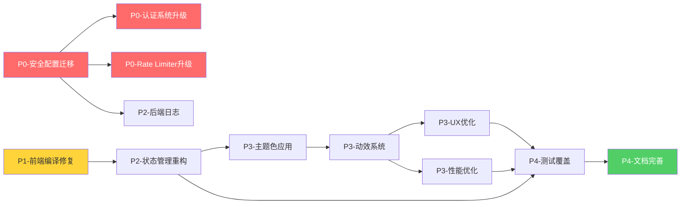

# 任务拆分文档 - 全局UI与代码质量提升

## 任务优先级矩阵

| 优先级 | 类型 | 说明 | 估时 |
|-------|------|------|------|
| **P0** | 安全阻塞 | 立即修复,阻塞后续工作 | 2-4h |
| **P1** | 功能阻塞 | 影响编译和基础功能 | 1-2h |
| **P2** | 架构优化 | 提升可维护性 | 3-5天 |
| **P3** | 体验优化 | 提升用户体验 | 2-3天 |
| **P4** | 监控文档 | 完善监控和文档 | 1-2天 |

## 任务列表

### 任务1: P0-安全配置迁移 ⚠️ (最高优先级)

#### 输入契约
- 前置依赖: 无 (第一优先级任务)
- 输入数据:
  - 当前 `config/agents.json` (含明文API Key)
  - 当前 `config/config.jsonc` (含数据库凭证)
  - 当前数据库schema (含password_plain列)
- 环境依赖:
  - Node.js 18+
  - PostgreSQL 数据库访问权限
  - Redis服务 (用于Token存储)

#### 输出契约
- 输出数据:
  - 完整的 `backend/.env` 文件 (含所有敏感配置)
  - 占位符版本的 `config/agents.json`
  - 占位符版本的 `config/config.jsonc`
  - 数据库迁移脚本 `007_remove_plain_password.sql`
- 交付物:
  - ✅ `backend/.env.example` 模板
  - ✅ `backend/src/config/EnvManager.ts` 类
  - ✅ `backend/src/config/ConfigLoader.ts` 优化
  - ✅ SQL迁移脚本
  - ✅ 配置验证脚本
- 验收标准:
  - [ ] `config/agents.json` 无明文API Key
  - [ ] 数据库无 `password_plain` 列
  - [ ] 所有环境变量从 `.env` 正确加载
  - [ ] 配置验证脚本通过
  - [ ] 后端成功启动并连接数据库

#### 实现约束
- 技术栈: Node.js + TypeScript + dotenv + pg
- 接口规范: EnvManager单例模式
- 质量要求:
  - 必须校验所有必需环境变量
  - 启动失败时提供清晰错误提示
  - 不得在日志中打印敏感信息

#### 依赖关系
- 后置任务: 任务2 (认证系统升级)
- 阻塞关系: 阻塞所有后续任务 (安全基础)

---

### 任务2: P0-认证系统升级 🔐

#### 输入契约
- 前置依赖: 任务1 (环境变量配置完成)
- 输入数据:
  - EnvManager配置好的TOKEN_SECRET
  - Redis连接信息
  - 现有AuthService代码
- 环境依赖:
  - Redis服务运行中
  - bcrypt库已安装

#### 输出契约
- 输出数据:
  - JWT Token (24小时有效期)
  - Redis存储的Token映射
  - bcrypt加密的密码散列
- 交付物:
  - ✅ `backend/src/services/AuthService.ts` 重构
  - ✅ `backend/src/middleware/auth.ts` 中间件更新
  - ✅ 单元测试 `AuthService.test.ts`
- 验收标准:
  - [ ] 登录使用bcrypt验证密码
  - [ ] Token存储在Redis而非内存
  - [ ] JWT签名使用环境变量SECRET
  - [ ] Token过期自动清理
  - [ ] 单元测试覆盖率>80%

#### 实现约束
- 技术栈: bcrypt + jsonwebtoken + ioredis
- 接口规范:
  ```typescript
  interface LoginResult {
    token: string;
    user: { id: string; username: string; role: string };
  }
  ```
- 质量要求:
  - 密码验证失败不泄露用户是否存在
  - Token刷新机制 (可选)
  - 并发登录处理

#### 依赖关系
- 后置任务: 任务3 (Rate Limiter升级)
- 并行任务: 任务4 (前端编译错误修复)

---

### 任务3: P0-Rate Limiter升级

#### 输入契约
- 前置依赖: 任务1 (Redis配置完成)
- 输入数据:
  - 现有 `backend/src/middleware/rateLimiter.ts`
  - Redis连接信息
- 环境依赖:
  - Redis服务运行中
  - rate-limiter-flexible库

#### 输出契约
- 输出数据:
  - 集中式速率限制状态
  - 跨实例共享的限流计数
- 交付物:
  - ✅ `backend/src/middleware/rateLimiter.ts` 重构
  - ✅ Redis连接池配置
  - ✅ 速率限制测试
- 验收标准:
  - [ ] 使用RateLimiterRedis替代内存版本
  - [ ] 多实例部署时速率限制正确共享
  - [ ] 超限返回429状态码和Retry-After头
  - [ ] 压力测试验证限流效果

#### 实现约束
- 技术栈: rate-limiter-flexible + ioredis
- 接口规范: Express中间件
- 质量要求:
  - 优雅处理Redis连接失败 (降级到内存模式)
  - 可配置不同路径的速率限制

#### 依赖关系
- 后置任务: 无 (独立任务)
- 并行任务: 任务2, 任务4

---

### 任务4: P1-前端编译错误修复 🔧

#### 输入契约
- 前置依赖: 无 (可与P0任务并行)
- 输入数据:
  - `frontend/src/hooks/useChat.ts` (未定义引用)
  - `frontend/src/components/chat/ChatContainer.tsx` (缺少导入)
  - `frontend/src/components/Sidebar.tsx` (缺少导入)
- 环境依赖:
  - Node.js 18+
  - TypeScript编译器

#### 输出契约
- 输出数据:
  - 零编译错误的前端代码
- 交付物:
  - ✅ `useChat.ts` 修复 (解构缺失变量)
  - ✅ `ChatContainer.tsx` 修复 (补充导入和常量)
  - ✅ `Sidebar.tsx` 修复 (补充导入和统一删除逻辑)
  - ✅ 前端构建成功
- 验收标准:
  - [ ] `npm run frontend:build` 零错误
  - [ ] TypeScript严格模式检查通过
  - [ ] ESLint检查通过
  - [ ] 所有组件正常渲染

#### 实现约束
- 技术栈: TypeScript + React
- 接口规范: 保持现有API不变
- 质量要求:
  - 不改变现有功能逻辑
  - 补全类型定义
  - 保持代码风格一致

#### 依赖关系
- 后置任务: 任务7 (状态管理重构)
- 阻塞关系: 阻塞所有前端优化任务

---

### 任务5: P2-状态管理重构 (渐进式)

#### 输入契约
- 前置依赖: 任务4 (前端编译修复完成)
- 输入数据:
  - 现有 `frontend/src/store/chatStore.ts` (760+行)
- 环境依赖:
  - Zustand库
  - 现有localStorage数据 (需保持兼容)

#### 输出契约
- 输出数据:
  - 模块化的Store Slices
  - 向后兼容的API
- 交付物:
  - ✅ `frontend/src/store/slices/agentSlice.ts`
  - ✅ `frontend/src/store/slices/sessionSlice.ts`
  - ✅ `frontend/src/store/slices/messageSlice.ts`
  - ✅ `frontend/src/store/slices/streamingSlice.ts`
  - ✅ `frontend/src/store/slices/uiSlice.ts`
  - ✅ `frontend/src/store/chatStore.ts` (重构为组合版)
  - ✅ 单元测试覆盖
- 验收标准:
  - [ ] 所有Slice独立可测试
  - [ ] Store总行数<300行 (组合逻辑)
  - [ ] 现有组件无需修改即可使用
  - [ ] 单元测试覆盖率>70%
  - [ ] localStorage数据自动迁移

#### 实现约束
- 技术栈: Zustand + TypeScript
- 接口规范:
  ```typescript
  export const useChatStore = create<ChatStore>()(
    persist((...args) => ({
      ...createAgentSlice(...args),
      ...createSessionSlice(...args),
      // ...
    }), { ... })
  );
  ```
- 质量要求:
  - 每个Slice单一职责
  - 避免Slice间直接依赖 (通过事件通信)
  - 状态更新纯函数化

#### 依赖关系
- 后置任务: 任务9 (UI风格统一)
- 并行任务: 任务6 (后端日志系统)

---

### 任务6: P2-后端日志系统完善

#### 输入契约
- 前置依赖: 任务1 (环境变量配置)
- 输入数据:
  - 现有日志中间件
  - LOG_LEVEL等配置
- 环境依赖:
  - winston库
  - 文件系统写权限

#### 输出契约
- 输出数据:
  - 结构化JSON日志
  - 按日期轮转的日志文件
- 交付物:
  - ✅ `backend/src/utils/logger.ts` 增强
  - ✅ `backend/src/middleware/performanceMonitor.ts` 新增
  - ✅ 日志查询工具脚本
- 验收标准:
  - [ ] 所有日志输出JSON格式
  - [ ] 错误日志包含堆栈和上下文
  - [ ] 慢查询(>1s)自动告警
  - [ ] 日志文件按天轮转,保留7天
  - [ ] 可通过API查询日志

#### 实现约束
- 技术栈: winston + winston-daily-rotate-file
- 接口规范:
  ```typescript
  logger.info('message', { context: {...} });
  logger.error('error', { error, userId, operation });
  ```
- 质量要求:
  - 敏感信息脱敏 (密码, Token)
  - 日志分级明确 (debug/info/warn/error)
  - 性能开销<5ms/request

#### 依赖关系
- 后置任务: 无 (独立任务)
- 并行任务: 任务5, 任务7

---

### 任务7: P3-熵基绿主题色深度应用

#### 输入契约
- 前置依赖: 任务4 (前端编译修复)
- 输入数据:
  - 现有 `frontend/tailwind.config.js` (已定义brand色)
  - 现有 `frontend/src/styles/globals.css` (部分应用)
- 环境依赖:
  - Tailwind CSS v4
  - CSS变量系统

#### 输出契约
- 输出数据:
  - 全局统一的熵基绿应用
  - WCAG AA级对比度
- 交付物:
  - ✅ `frontend/src/styles/globals.css` 增强
  - ✅ 组件级颜色类更新 (Button, Link, Badge等)
  - ✅ 对比度检测工具集成
  - ✅ Storybook文档 (可选)
- 验收标准:
  - [ ] 所有主要交互元素使用熵基绿
  - [ ] 文字对比度≥4.5:1 (WCAG AA)
  - [ ] 暗色模式熵基绿适配完成
  - [ ] 视觉一致性检查通过

#### 实现约束
- 技术栈: Tailwind CSS + CSS变量
- 接口规范:
  ```css
  --brand: #6cb33f;
  --brand-hover: #5aa230;
  --brand-active: #4a8726;
  ```
- 质量要求:
  - 保持品牌识别度
  - 确保可访问性
  - 响应式适配

#### 依赖关系
- 后置任务: 任务8 (动效系统增强)
- 并行任务: 任务5 (状态管理重构)

---

### 任务8: P3-动效系统增强

#### 输入契约
- 前置依赖: 任务7 (UI风格统一)
- 输入数据:
  - 现有Framer Motion动画
  - 现有CSS动画定义
- 环境依赖:
  - Framer Motion库
  - Tailwind CSS动画系统

#### 输出契约
- 输出数据:
  - 统一的动画库
  - 页面转场系统
  - 微交互反馈
- 交付物:
  - ✅ `frontend/src/lib/animations.ts` 动画库
  - ✅ `frontend/src/components/PageTransition.tsx` 转场组件
  - ✅ `frontend/src/components/ui/Skeleton.tsx` 骨架屏
  - ✅ 现有组件动效增强 (Button, Card, Input等)
- 验收标准:
  - [ ] 所有交互元素有悬停/聚焦反馈
  - [ ] 路由切换有流畅过渡
  - [ ] 数据加载显示骨架屏
  - [ ] 动画性能60fps
  - [ ] 支持prefers-reduced-motion降级

#### 实现约束
- 技术栈: Framer Motion + CSS Animations
- 接口规范:
  ```typescript
  // Framer Motion Variants
  export const buttonVariants: Variants = { ... };
  
  // React组件
  <motion.button variants={buttonVariants} whileHover="hover">
  ```
- 质量要求:
  - 仅使用GPU加速属性 (transform, opacity)
  - 避免触发Layout的属性
  - 复杂动画使用will-change提示

#### 依赖关系
- 后置任务: 任务10 (性能优化)
- 并行任务: 任务6 (后端日志)

---

### 任务9: P3-用户体验优化

#### 输入契约
- 前置依赖: 任务8 (动效系统完成)
- 输入数据:
  - 现有交互流程
  - 用户反馈数据 (如有)
- 环境依赖:
  - React + TypeScript

#### 输出契约
- 输出数据:
  - 优化的交互流程
  - 友好的错误提示
- 交付物:
  - ✅ 登录流程优化 (<3秒完成)
  - ✅ 会话切换优化 (<1秒响应)
  - ✅ 消息发送乐观更新
  - ✅ 统一Toast/Modal确认
  - ✅ 键盘导航支持
- 验收标准:
  - [ ] 登录成功后<3秒跳转
  - [ ] 会话切换<1秒渲染
  - [ ] 消息发送即时显示 (乐观更新)
  - [ ] 错误提示清晰且有操作指引
  - [ ] Tab键可完整导航所有交互元素

#### 实现约束
- 技术栈: React + Framer Motion
- 接口规范: 保持现有API
- 质量要求:
  - 响应式设计 (移动端适配)
  - 无障碍访问 (ARIA标签)
  - 离线提示 (网络断开)

#### 依赖关系
- 后置任务: 任务11 (测试覆盖)
- 并行任务: 任务10 (性能优化)

---

### 任务10: P3-性能优化

#### 输入契约
- 前置依赖: 任务8 (动效系统), 任务9 (UX优化)
- 输入数据:
  - 现有代码库
  - 性能基准数据
- 环境依赖:
  - Lighthouse CI
  - React DevTools Profiler

#### 输出契约
- 输出数据:
  - 优化后的性能指标
  - 性能报告
- 交付物:
  - ✅ 代码分割 (路由级)
  - ✅ 长列表虚拟化
  - ✅ 图片懒加载
  - ✅ 数据库查询优化
  - ✅ 性能监控集成
- 验收标准:
  - [ ] FCP <1.5s (首次内容绘制)
  - [ ] LCP <2.5s (最大内容绘制)
  - [ ] CLS <0.1 (累积布局偏移)
  - [ ] API响应P95 <500ms
  - [ ] Lighthouse评分>90

#### 实现约束
- 技术栈:
  - 前端: React.lazy + react-window
  - 后端: pg连接池 + 查询索引
- 接口规范: 保持现有API
- 质量要求:
  - 不牺牲功能完整性
  - 优雅降级 (低性能设备)

#### 依赖关系
- 后置任务: 任务11 (测试覆盖)
- 并行任务: 任务9 (UX优化)

---

### 任务11: P4-测试覆盖提升

#### 输入契约
- 前置依赖: 任务5 (状态管理重构), 任务10 (性能优化)
- 输入数据:
  - 现有测试代码
  - 未覆盖的代码模块
- 环境依赖:
  - Jest (后端)
  - Vitest (前端, 待集成)
  - Playwright (E2E)

#### 输出契约
- 输出数据:
  - 测试报告 (覆盖率>80%)
- 交付物:
  - ✅ 后端单元测试 (Controller + Service)
  - ✅ 前端单元测试 (Hooks + Utils)
  - ✅ 集成测试 (API端到端)
  - ✅ E2E测试 (关键用户流程)
  - ✅ CI/CD集成
- 验收标准:
  - [ ] 后端测试覆盖率>80%
  - [ ] 前端测试覆盖率>70%
  - [ ] E2E测试覆盖关键流程 (登录/聊天/会话切换)
  - [ ] CI自动运行测试
  - [ ] PR需通过测试才能合并

#### 实现约束
- 技术栈:
  - 后端: Jest + Supertest
  - 前端: Vitest + Testing Library
  - E2E: Playwright
- 接口规范: 标准Jest/Vitest语法
- 质量要求:
  - 测试独立可重复
  - 模拟外部依赖 (API, 数据库)
  - 覆盖边界和异常情况

#### 依赖关系
- 后置任务: 任务12 (文档完善)
- 阻塞关系: 阻塞最终交付

---

### 任务12: P4-文档完善

#### 输入契约
- 前置依赖: 所有前序任务完成
- 输入数据:
  - 现有文档
  - 代码变更记录
- 环境依赖:
  - Markdown编辑器
  - Mermaid图表

#### 输出契约
- 输出数据:
  - 完整的技术文档
  - 部署指南
  - 架构图
- 交付物:
  - ✅ README.md 更新
  - ✅ ARCHITECTURE.md (架构图)
  - ✅ API.md (API文档)
  - ✅ DEPLOYMENT.md (部署指南)
  - ✅ CHANGELOG.md (变更日志)
  - ✅ CONTRIBUTING.md (贡献指南)
- 验收标准:
  - [ ] 新成员可根据文档独立搭建环境
  - [ ] 架构图清晰反映实际结构
  - [ ] API文档完整 (请求/响应示例)
  - [ ] 部署指南经过验证
  - [ ] 变更日志完整记录

#### 实现约束
- 技术栈: Markdown + Mermaid
- 接口规范: 标准Markdown格式
- 质量要求:
  - 文档准确无误
  - 示例可直接运行
  - 定期更新维护

#### 依赖关系
- 后置任务: 无 (最终任务)
- 阻塞关系: 阻塞项目交付

## 依赖关系图



## 执行顺序建议

### 第1天: P0安全修复 ⚠️
```
上午:
- 任务1: 安全配置迁移 (2-3h)
- 任务2: 认证系统升级 (2-3h)

下午:
- 任务3: Rate Limiter升级 (1-2h)
- 任务4: 前端编译修复 (1-2h)
- 初步测试验证
```

### 第2-4天: P1-P2核心重构
```
第2天:
- 任务5: 状态管理重构 (全天)
  - 创建Slice结构
  - 迁移AgentSlice + SessionSlice

第3天:
- 任务5: 状态管理重构 (继续)
  - 迁移MessageSlice + StreamingSlice + UISlice
  - 组合Store + 单元测试
- 任务6: 后端日志系统 (并行, 2-3h)

第4天:
- 任务5: 测试与文档 (上午)
- 任务7: 主题色应用 (下午)
```

### 第5-6天: P3体验优化
```
第5天:
- 任务8: 动效系统增强 (全天)
  - 创建动画库
  - 组件动效应用

第6天:
- 任务9: UX优化 (上午)
- 任务10: 性能优化 (下午)
```

### 第7-8天: P4测试与文档
```
第7天:
- 任务11: 测试覆盖 (全天)
  - 后端单元测试
  - 前端单元测试

第8天:
- 任务11: E2E测试 (上午)
- 任务12: 文档完善 (下午)
- 最终验收测试
```

## 风险与应对

### 高风险项
1. **安全配置迁移失败**
   - 风险: 数据库连接失败, Token验证失败
   - 应对: 先在测试环境验证, 保留回滚脚本

2. **状态管理重构破坏现有功能**
   - 风险: 组件无法正常渲染, 数据丢失
   - 应对: 完整回归测试, 版本化迁移, 保留旧Store备份

3. **性能优化效果不明显**
   - 风险: 投入时间但指标未改善
   - 应对: 提前建立性能基线, 分阶段优化, 可回退

### 中风险项
1. **测试覆盖时间超预期**
   - 应对: 优先核心流程, 非关键路径可延后

2. **动效性能影响用户体验**
   - 应对: 提供降级开关, 监测设备性能

3. **文档更新不及时**
   - 应对: 每个任务完成后立即更新相关文档

## 资源需求

### 人力
- 后端开发: 1人 (任务1-3, 6)
- 前端开发: 1人 (任务4-5, 7-10)
- 测试工程师: 0.5人 (任务11)
- 技术文档: 0.5人 (任务12)

### 基础设施
- Redis服务 (用于Rate Limiter和Token存储)
- PostgreSQL数据库 (已有)
- CI/CD环境 (GitHub Actions / GitLab CI)
- 监控服务 (可选: Sentry, New Relic)

### 第三方服务
- FastGPT API (已有)
- 阿里云OSS (可选: 图片存储)
- Cloudflare (可选: CDN加速)

## 验收清单

### 功能验收
- [ ] 所有编译错误已修复
- [ ] 登录/认证流程正常
- [ ] 会话创建/切换/删除正常
- [ ] 消息发送/接收/重试正常
- [ ] 管理后台功能正常

### 性能验收
- [ ] Lighthouse评分>90
- [ ] FCP <1.5s, LCP <2.5s, CLS <0.1
- [ ] API响应P95 <500ms
- [ ] 无内存泄漏
- [ ] 24小时压测稳定

### 安全验收
- [ ] 无明文敏感信息
- [ ] 密码使用bcrypt加密
- [ ] Token存储在Redis
- [ ] 速率限制生效
- [ ] SQL注入/XSS测试通过

### 质量验收
- [ ] 后端测试覆盖率>80%
- [ ] 前端测试覆盖率>70%
- [ ] E2E测试覆盖关键流程
- [ ] ESLint检查通过
- [ ] TypeScript严格模式通过

### 文档验收
- [ ] README完整准确
- [ ] 架构图反映实际结构
- [ ] API文档完整
- [ ] 部署指南可执行
- [ ] CHANGELOG记录完整

---

**文档版本**: v1.0
**创建日期**: 2025-10-03
**最后更新**: 2025-10-03
**总估计工作量**: 8-10个工作日
**建议团队规模**: 2-3人

