# 任务拆分文档 - 全局项目审计与优化

## 任务概览

基于 DESIGN 文档，将全局优化工作拆分为可独立执行、可独立验证的原子任务。

### 任务优先级说明

- **P0**: 阻塞性任务，必须立即完成（安全漏洞、功能缺失）
- **P1**: 高优先级，近期完成（性能、稳定性）
- **P2**: 中优先级，计划完成（优化、体验）
- **P3**: 低优先级，持续优化（文档、工具）

### 任务执行原则

1. **独立性**: 每个任务可独立编译和测试
2. **可验证**: 有明确的验收标准
3. **原子性**: 任务粒度适中，2-4小时完成
4. **依赖清晰**: 明确前置和后置任务

## 任务依赖关系图

```mermaid
graph TB
    subgraph "P0 安全加固"
        T01[T01: PasswordService实现]
        T02[T02: TokenService实现]
        T03[T03: 敏感信息环境变量化]
        T04[T04: 数据库迁移脚本]
    end
    
    subgraph "P0 日志系统"
        T05[T05: Winston日志配置]
        T06[T06: 全局console替换]
        T07[T07: 审计日志实现]
    end
    
    subgraph "P0 Dify集成"
        T08[T08: DifyProvider实现]
        T09[T09: DifySessionService实现]
        T10[T10: ChatProxyService集成]
        T11[T11: Dify配置示例]
    end
    
    subgraph "P1 测试基础设施"
        T12[T12: 后端测试环境搭建]
        T13[T13: 前端测试环境搭建]
        T14[T14: E2E测试框架]
    end
    
    subgraph "P1 核心模块测试"
        T15[T15: PasswordService测试]
        T16[T16: TokenService测试]
        T17[T17: DifyProvider测试]
        T18[T18: DifySessionService测试]
        T19[T19: ChatProxyService Dify测试]
    end
    
    subgraph "P1 前端测试"
        T20[T20: API Service Dify测试]
        T21[T21: Chat组件测试]
        T22[T22: E2E Dify集成测试]
    end
    
    subgraph "P2 性能优化"
        T23[T23: chatStore拆分]
        T24[T24: 虚拟滚动实现]
        T25[T25: 缓存策略优化]
    end
    
    subgraph "P2 类型安全"
        T26[T26: 高风险文件类型修复]
        T27[T27: Git Hook类型检查]
    end
    
    subgraph "P3 文档与监控"
        T28[T28: API文档更新]
        T29[T29: 部署文档完善]
        T30[T30: 监控配置]
    end
    
    T01 --> T04
    T02 --> T03
    T05 --> T06
    T06 --> T07
    
    T08 --> T10
    T09 --> T10
    T10 --> T11
    
    T12 --> T15
    T12 --> T16
    T12 --> T17
    T12 --> T18
    T12 --> T19
    
    T13 --> T20
    T13 --> T21
    T14 --> T22
    
    T01 --> T15
    T02 --> T16
    T08 --> T17
    T09 --> T18
    T10 --> T19
    
    T10 --> T20
    T10 --> T21
    T10 --> T22
    
    T05 --> T23
    T10 --> T25
    
    T12 --> T26
    T26 --> T27
    
    T11 --> T28
    T22 --> T29
    T30 --> T29
```



## 任务列表

### P0-01: PasswordService 实现

#### 输入契约
- **前置依赖**: 无
- **输入数据**: 
  - 明文密码字符串
  - 用户表结构信息
- **环境依赖**: 
  - Node.js 18+
  - bcrypt 包

#### 输出契约
- **交付物**:
  - `backend/src/services/PasswordService.ts`
  - 密码散列方法
  - 密码验证方法
  - 密码强度检查方法
- **验收标准**:
  - ✅ 支持 bcrypt 散列(saltRounds=12)
  - ✅ 密码强度评分(0-4)
  - ✅ 最小长度8位，最大128位
  - ✅ 检测常见弱密码
  - ✅ 提供详细反馈信息
- **性能要求**:
  - 散列操作 <300ms
  - 验证操作 <200ms

#### 实现约束
- **技术栈**: TypeScript + bcrypt
- **接口规范**: 
  ```typescript
  class PasswordService {
    async hashPassword(plainPassword: string): Promise<string>
    async verifyPassword(plain: string, hash: string): Promise<boolean>
    checkPasswordStrength(password: string): PasswordStrengthResult
  }
  ```
- **质量要求**:
  - 单元测试覆盖率 >90%
  - 通过 ESLint 检查
  - 完整 JSDoc 注释

#### 依赖关系
- **后置任务**: T04-数据库迁移脚本, T15-PasswordService测试
- **并行任务**: T02-TokenService实现

#### 预估工时
**2-3 小时**

---

### P0-02: TokenService 实现

#### 输入契约
- **前置依赖**: 无
- **输入数据**:
  - Redis 连接配置
  - JWT 密钥配置
  - 用户信息
- **环境依赖**:
  - Redis 服务器
  - ioredis 包
  - jsonwebtoken 包

#### 输出契约
- **交付物**:
  - `backend/src/services/TokenService.ts`
  - Token 创建/验证/撤销方法
  - Refresh Token 机制
  - 元数据管理
- **验收标准**:
  - ✅ 支持 access token 和 refresh token
  - ✅ Token 存储到 Redis
  - ✅ 支持主动撤销
  - ✅ Token 元数据(创建时间、最后访问等)
  - ✅ 支持撤销所有设备
  - ✅ 清理过期 token 机制
- **性能要求**:
  - Token 创建 <50ms
  - Token 验证 <30ms
  - 支持 1000+ TPS

#### 实现约束
- **技术栈**: TypeScript + Redis + JWT
- **接口规范**:
  ```typescript
  class TokenService {
    async createAccessToken(userId, username, role): Promise<string>
    async createRefreshToken(userId): Promise<string>
    async verifyAccessToken(token): Promise<TokenPayload | null>
    async refreshAccessToken(refreshToken, userId)
    async revokeAllTokens(userId): Promise<void>
  }
  ```
- **质量要求**:
  - 单元测试覆盖率 >85%
  - 集成测试覆盖 Redis 操作
  - 并发安全性测试

#### 依赖关系
- **后置任务**: T03-敏感信息环境变量化, T16-TokenService测试
- **并行任务**: T01-PasswordService实现

#### 预估工时
**3-4 小时**

---

### P0-03: 敏感信息环境变量化

#### 输入契约
- **前置依赖**: T02-TokenService实现
- **输入数据**:
  - 现有配置文件(`config/agents.json`)
  - 环境变量规范
- **环境依赖**: dotenv

#### 输出契约
- **交付物**:
  - `backend/.env.example` 更新
  - `config/agents.example.json` 脱敏模板
  - 配置加载逻辑更新
  - 环境变量校验脚本
- **验收标准**:
  - ✅ 所有 API Key 使用环境变量
  - ✅ 数据库密码使用环境变量
  - ✅ JWT_SECRET 使用环境变量
  - ✅ 启动时校验必填环境变量
  - ✅ 提供清晰的配置文档
- **安全要求**:
  - Git 中无真实凭证
  - `.gitignore` 包含 `.env`

#### 实现约束
- **技术栈**: TypeScript + dotenv
- **接口规范**:
  ```typescript
  function validateRequiredEnvVars(): void
  function loadAgentConfig(): AgentConfig[]
  ```
- **质量要求**:
  - 启动失败有明确提示
  - 文档完整

#### 依赖关系
- **前置任务**: T02-TokenService实现
- **后置任务**: T11-Dify配置示例
- **并行任务**: T04-数据库迁移脚本

#### 预估工时
**2 小时**

---

### P0-04: 数据库迁移脚本

#### 输入契约
- **前置依赖**: T01-PasswordService实现
- **输入数据**:
  - 现有用户表结构
  - 密码散列服务
- **环境依赖**: PostgreSQL

#### 输出契约
- **交付物**:
  - `backend/migrations/001_remove_plain_password.sql`
  - `backend/scripts/migrate-passwords.ts`
  - 迁移文档
- **验收标准**:
  - ✅ 删除 `password_plain` 列
  - ✅ 为现有用户生成散列密码
  - ✅ 支持回滚
  - ✅ 迁移过程有日志
  - ✅ 数据完整性校验
- **数据安全**:
  - 备份原始数据
  - 事务处理
  - 失败自动回滚

#### 实现约束
- **技术栈**: SQL + TypeScript
- **接口规范**:
  ```sql
  -- 迁移
  ALTER TABLE users DROP COLUMN password_plain;
  
  -- 回滚
  ALTER TABLE users ADD COLUMN password_plain TEXT;
  ```
- **质量要求**:
  - 在测试数据库验证
  - 迁移脚本幂等性

#### 依赖关系
- **前置任务**: T01-PasswordService实现
- **后置任务**: T15-PasswordService测试
- **并行任务**: T03-敏感信息环境变量化

#### 预估工时
**2-3 小时**

---

### P0-05: Winston 日志配置

#### 输入契约
- **前置依赖**: 无
- **输入数据**:
  - 日志级别配置
  - 日志目录结构
- **环境依赖**: winston, winston-daily-rotate-file

#### 输出契约
- **交付物**:
  - `backend/src/utils/logger.ts`
  - 日志配置文件
  - 日志目录初始化
- **验收标准**:
  - ✅ 支持 info/warn/error/debug 级别
  - ✅ 日志文件按日期轮转
  - ✅ 错误日志单独文件
  - ✅ 审计日志单独文件
  - ✅ 开发环境控制台输出
  - ✅ 生产环境仅文件输出
  - ✅ 结构化 JSON 格式
- **性能要求**:
  - 日志写入不阻塞主线程
  - 支持高并发日志

#### 实现约束
- **技术栈**: Winston + DailyRotateFile
- **接口规范**:
  ```typescript
  import logger from '@/utils/logger';
  
  logger.info('message', { context });
  logger.error('error', { error, context });
  logAudit('action', details);
  logPerformance('operation', duration);
  ```
- **质量要求**:
  - 日志格式统一
  - 配置可通过环境变量调整

#### 依赖关系
- **后置任务**: T06-全局console替换
- **并行任务**: T01-PasswordService, T02-TokenService

#### 预估工时
**2 小时**

---

### P0-06: 全局 console 替换

#### 输入契约
- **前置依赖**: T05-Winston日志配置
- **输入数据**:
  - 现有 console.* 调用位置(172处)
  - logger 实例
- **环境依赖**: logger 服务

#### 输出契约
- **交付物**:
  - 27 个文件的 console 替换
  - 日志上下文补充
- **验收标准**:
  - ✅ 100% console.log → logger.info
  - ✅ 100% console.error → logger.error
  - ✅ 100% console.warn → logger.warn
  - ✅ 100% console.debug → logger.debug
  - ✅ 关键日志添加上下文信息
  - ✅ ESLint 规则禁止 console
- **质量要求**:
  - 日志信息完整
  - 敏感信息脱敏

#### 实现约束
- **技术栈**: TypeScript + Winston
- **替换策略**:
  ```typescript
  // 替换前
  console.log('Agent loaded', agentId);
  
  // 替换后
  logger.info('Agent loaded', {
    agentId,
    provider: agent.provider,
    timestamp: new Date().toISOString()
  });
  ```
- **质量要求**:
  - 不改变业务逻辑
  - 添加 ESLint rule: `no-console`

#### 依赖关系
- **前置任务**: T05-Winston日志配置
- **后置任务**: T07-审计日志实现
- **并行任务**: T08-DifyProvider实现

#### 预估工时
**3-4 小时**

---

### P0-07: 审计日志实现

#### 输入契约
- **前置依赖**: T06-全局console替换
- **输入数据**:
  - 敏感操作清单
  - 审计日志格式规范
- **环境依赖**: Winston logger

#### 输出契约
- **交付物**:
  - 审计日志中间件
  - 关键操作埋点
  - 审计日志查询接口
- **验收标准**:
  - ✅ 记录智能体 CRUD 操作
  - ✅ 记录用户认证事件
  - ✅ 记录权限变更
  - ✅ 记录配置热加载
  - ✅ 包含操作人、时间、IP、结果
  - ✅ 审计日志不可篡改
- **合规要求**:
  - 保留90天
  - 支持导出

#### 实现约束
- **技术栈**: TypeScript + Winston
- **接口规范**:
  ```typescript
  logAudit(action: string, details: {
    userId?: string;
    ip?: string;
    resource?: string;
    result: 'success' | 'failure';
    metadata?: Record<string, any>;
  });
  ```
- **质量要求**:
  - 异步写入不阻塞
  - 写入失败有告警

#### 依赖关系
- **前置任务**: T06-全局console替换
- **后置任务**: T28-API文档更新
- **并行任务**: T09-DifySessionService实现

#### 预估工时
**2-3 小时**

---

### P0-08: DifyProvider 实现

#### 输入契约
- **前置依赖**: 无
- **输入数据**:
  - AIProvider 接口定义
  - Dify API 规范
- **环境依赖**: axios

#### 输出契约
- **交付物**:
  - `backend/src/services/providers/DifyProvider.ts`
  - Dify API 请求/响应转换
  - SSE 流式处理
- **验收标准**:
  - ✅ 实现 AIProvider 接口
  - ✅ 支持非流式/流式请求
  - ✅ 支持会话管理(conversation_id)
  - ✅ 支持输入变量(inputs)
  - ✅ 支持文件上传
  - ✅ SSE 事件解析
  - ✅ 错误处理
- **功能对齐**:
  - 与 FastGPTProvider 接口一致

#### 实现约束
- **技术栈**: TypeScript
- **接口规范**:
  ```typescript
  class DifyProvider implements AIProvider {
    name = 'Dify';
    transformRequest(messages, config, stream, options)
    transformResponse(response): ChatResponse
    transformStreamResponse(chunk): string
    buildHeaders(config): RequestHeaders
  }
  ```
- **质量要求**:
  - 单元测试覆盖率 >85%
  - 完整类型定义

#### 依赖关系
- **后置任务**: T10-ChatProxyService集成, T17-DifyProvider测试
- **并行任务**: T09-DifySessionService实现

#### 预估工时
**4-5 小时**

---

### P0-09: DifySessionService 实现

#### 输入契约
- **前置依赖**: 无
- **输入数据**:
  - AgentConfig 接口
  - Dify Session API 规范
- **环境依赖**: axios

#### 输出契约
- **交付物**:
  - `backend/src/services/DifySessionService.ts`
  - 会话列表查询
  - 会话消息查询
  - 会话删除
  - 消息反馈
- **验收标准**:
  - ✅ 获取会话列表
  - ✅ 获取会话消息
  - ✅ 删除会话
  - ✅ 提交反馈(点赞/点踩)
  - ✅ 获取消息详情
  - ✅ 错误处理和重试
- **功能对齐**:
  - 与 FastGPTSessionService 接口一致

#### 实现约束
- **技术栈**: TypeScript + axios
- **接口规范**:
  ```typescript
  class DifySessionService {
    async getConversations(agent, options)
    async getConversationMessages(agent, conversationId)
    async deleteConversation(agent, conversationId)
    async submitFeedback(agent, messageId, rating)
  }
  ```
- **质量要求**:
  - 单元测试覆盖率 >85%
  - 集成测试覆盖主要流程

#### 依赖关系
- **后置任务**: T10-ChatProxyService集成, T18-DifySessionService测试
- **并行任务**: T08-DifyProvider实现

#### 预估工时
**3-4 小时**

---

### P0-10: ChatProxyService Dify 集成

#### 输入契约
- **前置依赖**: T08-DifyProvider实现, T09-DifySessionService实现
- **输入数据**:
  - DifyProvider 实例
  - DifySessionService 实例
- **环境依赖**: 现有 ChatProxyService

#### 输出契约
- **交付物**:
  - ChatProxyService 注册 Dify Provider
  - Dify 流式响应处理
  - 路由适配
- **验收标准**:
  - ✅ 注册 DifyProvider 到 providers Map
  - ✅ Dify 流式响应正确处理
  - ✅ 根据 agent.provider 自动路由
  - ✅ 与 FastGPT 切换无缝
  - ✅ 错误处理统一
- **性能要求**:
  - 流式响应延迟 <100ms
  - 支持并发请求

#### 实现约束
- **技术栈**: TypeScript
- **接口规范**:
  ```typescript
  // ChatProxyService 构造函数
  this.registerProvider(new DifyProvider());
  
  // 流式处理
  private async handleDifyStream(stream, provider, ...)
  ```
- **质量要求**:
  - 集成测试覆盖切换场景
  - 性能测试验证

#### 依赖关系
- **前置任务**: T08-DifyProvider, T09-DifySessionService
- **后置任务**: T11-Dify配置示例, T19-ChatProxyService Dify测试
- **并行任务**: T05-Winston日志配置

#### 预估工时
**2-3 小时**

---

### P0-11: Dify 配置示例

#### 输入契约
- **前置依赖**: T10-ChatProxyService Dify集成, T03-敏感信息环境变量化
- **输入数据**:
  - Dify API 规范
  - 配置文件格式
- **环境依赖**: 无

#### 输出契约
- **交付物**:
  - `config/agents.json` 添加 Dify 示例
  - `config/agents.example.json` 脱敏模板
  - 配置文档更新
- **验收标准**:
  - ✅ Dify 智能体配置完整
  - ✅ 示例配置可直接使用
  - ✅ 环境变量说明清晰
  - ✅ 配置校验通过
- **文档要求**:
  - 配置字段说明
  - 获取 API Key 步骤

#### 实现约束
- **技术栈**: JSON/JSONC
- **配置格式**:
  ```jsonc
  {
    "id": "dify-assistant",
    "provider": "dify",
    "endpoint": "https://api.dify.ai",
    "apiKey": "${DIFY_API_KEY}",
    "features": { ... }
  }
  ```
- **质量要求**:
  - 配置格式正确
  - 通过校验脚本

#### 依赖关系
- **前置任务**: T10-ChatProxyService Dify集成, T03-敏感信息环境变量化
- **后置任务**: T28-API文档更新
- **并行任务**: T12-后端测试环境搭建

#### 预估工时
**1-2 小时**

---

### P1-12: 后端测试环境搭建

#### 输入契约
- **前置依赖**: 无
- **输入数据**:
  - Jest 配置
  - 测试数据库配置
- **环境依赖**: 
  - PostgreSQL 测试数据库
  - Redis 测试实例
  - Jest

#### 输出契约
- **交付物**:
  - `backend/src/test/setup.ts`
  - `backend/jest.config.ts` 更新
  - Mock 工厂函数
  - 测试数据库初始化脚本
- **验收标准**:
  - ✅ Jest 配置完整
  - ✅ 测试数据库自动初始化
  - ✅ 测试后自动清理
  - ✅ Mock 工厂可用
  - ✅ 支持并发测试
- **覆盖率配置**:
  - 阈值: 80%
  - 报告格式: html + text

#### 实现约束
- **技术栈**: Jest + TypeScript
- **接口规范**:
  ```typescript
  export const testDbConfig = {...};
  export const testRedisConfig = {...};
  export const createMockAgent = (...);
  export const createMockUser = (...);
  ```
- **质量要求**:
  - 测试环境隔离
  - 快速清理数据

#### 依赖关系
- **后置任务**: T15, T16, T17, T18, T19 (所有后端单元测试)
- **并行任务**: T13-前端测试环境搭建

#### 预估工时
**3-4 小时**

---

### P1-13: 前端测试环境搭建

#### 输入契约
- **前置依赖**: 无
- **输入数据**:
  - Vitest 配置
  - Testing Library 配置
- **环境依赖**: Vitest + Testing Library

#### 输出契约
- **交付物**:
  - `frontend/vitest.config.ts`
  - `frontend/src/test/setup.ts`
  - Mock 工厂和工具函数
- **验收标准**:
  - ✅ Vitest 配置完整
  - ✅ Testing Library 集成
  - ✅ Mock window/fetch等全局对象
  - ✅ 支持 JSX 测试
  - ✅ 覆盖率报告配置
- **覆盖率配置**:
  - 阈值: 80%
  - 排除: test/setup.ts

#### 实现约束
- **技术栈**: Vitest + Testing Library
- **接口规范**:
  ```typescript
  export function mockApiResponse(data, ok);
  export function createTestStore();
  export function renderWithProviders(component);
  ```
- **质量要求**:
  - 测试快速运行
  - Mock 完整

#### 依赖关系
- **后置任务**: T20, T21 (前端单元测试)
- **并行任务**: T12-后端测试环境搭建

#### 预估工时
**3-4 小时**

---

### P1-14: E2E 测试框架搭建

#### 输入契约
- **前置依赖**: 无
- **输入数据**:
  - Playwright 配置
  - 测试场景清单
- **环境依赖**: Playwright

#### 输出契约
- **交付物**:
  - `playwright.config.ts` 更新
  - `tests/e2e/helpers.ts` 辅助函数
  - 测试数据准备脚本
- **验收标准**:
  - ✅ Playwright 配置完整
  - ✅ 支持多浏览器测试
  - ✅ 截图和视频记录
  - ✅ 并发执行
  - ✅ 测试报告生成
- **浏览器支持**:
  - Chromium, Firefox, WebKit

#### 实现约束
- **技术栈**: Playwright
- **接口规范**:
  ```typescript
  export async function login(page, username, password);
  export async function selectAgent(page, agentName);
  export async function sendMessage(page, message);
  ```
- **质量要求**:
  - 测试稳定性
  - 等待策略合理

#### 依赖关系
- **后置任务**: T22-E2E Dify集成测试
- **并行任务**: T12, T13 (其他测试环境)

#### 预估工时
**2-3 小时**

---

### P1-15 至 P1-22: 测试实现任务

由于篇幅限制，测试任务按照类似格式定义：

- **T15**: PasswordService 单元测试 (>90% 覆盖率)
- **T16**: TokenService 单元测试 (>85% 覆盖率)
- **T17**: DifyProvider 单元测试 (>85% 覆盖率)
- **T18**: DifySessionService 单元测试 (>85% 覆盖率)
- **T19**: ChatProxyService Dify 集成测试
- **T20**: API Service Dify 单元测试
- **T21**: Chat 组件单元测试
- **T22**: E2E Dify 集成测试

每个测试任务预估工时: **2-4 小时**

---

### P2-23: chatStore 拆分

#### 输入契约
- **前置依赖**: T05-Winston日志配置
- **输入数据**:
  - 现有 chatStore.ts (700+ 行)
  - Zustand 最佳实践
- **环境依赖**: Zustand

#### 输出契约
- **交付物**:
  - `frontend/src/store/slices/agentSlice.ts`
  - `frontend/src/store/slices/messageSlice.ts`
  - `frontend/src/store/slices/sessionSlice.ts`
  - `frontend/src/store/slices/streamingSlice.ts`
  - `frontend/src/store/chatStore.ts` (重构)
- **验收标准**:
  - ✅ 代码行数减少 50%
  - ✅ 职责清晰分离
  - ✅ 原有功能 100% 保留
  - ✅ 性能不降低
  - ✅ 测试全部通过
- **性能要求**:
  - 状态更新时间不增加

#### 实现约束
- **技术栈**: Zustand + TypeScript
- **拆分策略**:
  ```typescript
  // agentSlice - 智能体管理
  // messageSlice - 消息管理
  // sessionSlice - 会话管理
  // streamingSlice - 流式状态
  ```
- **质量要求**:
  - 向后兼容
  - 单元测试覆盖

#### 依赖关系
- **前置任务**: T05-Winston日志配置
- **后置任务**: T24-虚拟滚动实现
- **并行任务**: T26-高风险文件类型修复

#### 预估工时
**4-6 小时**

---

### P2-24: 虚拟滚动实现

#### 输入契约
- **前置依赖**: T23-chatStore拆分
- **输入数据**:
  - MessageList 组件
  - 消息数据结构
- **环境依赖**: @tanstack/react-virtual

#### 输出契约
- **交付物**:
  - `frontend/src/components/chat/VirtualMessageList.tsx`
  - 性能优化文档
- **验收标准**:
  - ✅ 支持1000+消息流畅滚动
  - ✅ 渲染性能提升 >50%
  - ✅ 自动滚动到底部
  - ✅ 支持搜索定位
  - ✅ 支持消息高亮
- **性能要求**:
  - 60 FPS 滚动
  - 初始渲染 <100ms

#### 实现约束
- **技术栈**: React + @tanstack/react-virtual
- **接口规范**:
  ```typescript
  function VirtualMessageList({ messages }: Props)
  ```
- **质量要求**:
  - 性能测试验证
  - 低端设备测试

#### 依赖关系
- **前置任务**: T23-chatStore拆分
- **后置任务**: 无
- **并行任务**: T25-缓存策略优化

#### 预估工时
**3-4 小时**

---

### P2-25: 缓存策略优化

#### 输入契约
- **前置依赖**: T10-ChatProxyService Dify集成
- **输入数据**:
  - 现有缓存实现
  - Redis 配置
- **环境依赖**: Redis

#### 输出契约
- **交付物**:
  - `backend/src/services/CacheService.ts`
  - 多级缓存实现
  - 布隆过滤器
  - 分布式锁
- **验收标准**:
  - ✅ L1 内存缓存 + L2 Redis
  - ✅ 缓存穿透保护(布隆过滤器)
  - ✅ 缓存击穿保护(分布式锁)
  - ✅ 缓存雪崩保护(TTL随机化)
  - ✅ 缓存命中率监控
- **性能要求**:
  - 缓存命中率 >80%
  - 查询延迟降低 >50%

#### 实现约束
- **技术栈**: Redis + 内存缓存
- **接口规范**:
  ```typescript
  class CacheService {
    async get<T>(key): Promise<T | null>
    async getOrSet<T>(key, loader, options)
    async getWithBloomFilter<T>(key, loader)
  }
  ```
- **质量要求**:
  - 并发安全
  - 性能测试验证

#### 依赖关系
- **前置任务**: T10-ChatProxyService Dify集成
- **后置任务**: 无
- **并行任务**: T24-虚拟滚动实现

#### 预估工时
**4-5 小时**

---

### P2-26: 高风险文件类型修复

#### 输入契约
- **前置依赖**: T12-后端测试环境搭建
- **输入数据**:
  - 高风险文件清单(357处 any)
  - 类型定义规范
- **环境依赖**: TypeScript

#### 输出契约
- **交付物**:
  - 后端高风险文件修复:
    - ChatProxyService.ts
    - FastGPTSessionService.ts
    - ProtectionService.ts
  - 前端高风险文件修复:
    - api.ts
    - AdminHome.tsx
    - HybridStorageManager.ts
- **验收标准**:
  - ✅ 高风险文件 any 减少 >80%
  - ✅ 全部通过类型检查
  - ✅ 测试全部通过
  - ✅ 无新增运行时错误
- **质量要求**:
  - 类型精确
  - 泛型约束合理

#### 实现约束
- **技术栈**: TypeScript
- **修复策略**:
  ```typescript
  // 替换 any 为精确类型
  interface EventData { ... }
  function processEvent(event: EventData): Result
  ```
- **质量要求**:
  - 单元测试覆盖
  - 类型推导正确

#### 依赖关系
- **前置任务**: T12-后端测试环境搭建
- **后置任务**: T27-Git Hook类型检查
- **并行任务**: T23-chatStore拆分

#### 预估工时
**6-8 小时** (6个文件)

---

### P2-27: Git Hook 类型检查

#### 输入契约
- **前置依赖**: T26-高风险文件类型修复
- **输入数据**:
  - Husky 配置
  - ESLint 规则
- **环境依赖**: Husky + lint-staged

#### 输出契约
- **交付物**:
  - `.husky/pre-commit` 更新
  - ESLint 规则配置
  - 类型检查脚本
- **验收标准**:
  - ✅ 提交前执行类型检查
  - ✅ 检测新增 any 类型
  - ✅ 执行 ESLint 检查
  - ✅ 失败阻止提交
  - ✅ 提供清晰错误信息
- **性能要求**:
  - 检查时间 <30秒

#### 实现约束
- **技术栈**: Husky + TypeScript
- **脚本内容**:
  ```bash
  #!/bin/sh
  npm run type-check
  git diff --cached | grep ': any' && exit 1
  npm run lint
  ```
- **质量要求**:
  - 快速反馈
  - 错误信息明确

#### 依赖关系
- **前置任务**: T26-高风险文件类型修复
- **后置任务**: 无
- **并行任务**: T28-API文档更新

#### 预估工时
**1-2 小时**

---

### P3-28: API 文档更新

#### 输入契约
- **前置依赖**: T11-Dify配置示例, T07-审计日志实现
- **输入数据**:
  - 现有 API 接口
  - Swagger/OpenAPI 规范
- **环境依赖**: 无

#### 输出契约
- **交付物**:
  - `docs/api/` 目录
  - API 接口文档
  - Postman 集合
  - 调用示例
- **验收标准**:
  - ✅ 所有接口文档齐全
  - ✅ 请求/响应示例完整
  - ✅ 错误码说明清晰
  - ✅ 认证方式说明
  - ✅ Dify 接口单独说明
- **文档要求**:
  - Markdown 格式
  - 代码示例可运行

#### 实现约束
- **技术栈**: Markdown
- **文档结构**:
  ```
  docs/api/
    - authentication.md
    - agents.md
    - chat.md
    - dify.md
    - errors.md
  ```
- **质量要求**:
  - 信息准确
  - 示例可用

#### 依赖关系
- **前置任务**: T11-Dify配置示例, T07-审计日志实现
- **后置任务**: T29-部署文档完善
- **并行任务**: T27-Git Hook类型检查

#### 预估工时
**3-4 小时**

---

### P3-29: 部署文档完善

#### 输入契约
- **前置依赖**: T22-E2E Dify集成测试, T28-API文档更新
- **输入数据**:
  - 现有部署文档
  - 环境变量清单
- **环境依赖**: 无

#### 输出契约
- **交付物**:
  - `docs/deployment/` 目录
  - 开发环境搭建指南
  - 生产环境部署指南
  - Docker Compose 配置
  - 故障排查指南
- **验收标准**:
  - ✅ 环境变量完整说明
  - ✅ 依赖服务部署指南
  - ✅ 数据库迁移步骤
  - ✅ 监控配置说明
  - ✅ 常见问题 FAQ
- **文档要求**:
  - 步骤清晰
  - 命令可复制

#### 实现约束
- **技术栈**: Markdown + Docker
- **文档结构**:
  ```
  docs/deployment/
    - development.md
    - production.md
    - docker-compose.yml
    - troubleshooting.md
  ```
- **质量要求**:
  - 按文档可部署成功

#### 依赖关系
- **前置任务**: T22-E2E Dify集成测试, T28-API文档更新
- **后置任务**: 无
- **并行任务**: T30-监控配置

#### 预估工时
**3-4 小时**

---

### P3-30: 监控配置

#### 输入契约
- **前置依赖**: 无
- **输入数据**:
  - Prometheus 配置
  - Grafana 配置
- **环境依赖**: Prometheus + Grafana

#### 输出契约
- **交付物**:
  - Prometheus 配置文件
  - Grafana Dashboard JSON
  - 告警规则配置
  - 监控文档
- **验收标准**:
  - ✅ 系统指标监控
  - ✅ 业务指标监控
  - ✅ 告警规则配置
  - ✅ Dashboard 可视化
  - ✅ 日志聚合查询
- **监控指标**:
  - HTTP 请求量/耗时/错误率
  - 聊天消息量/成功率
  - Token 使用量
  - 缓存命中率

#### 实现约束
- **技术栈**: Prometheus + Grafana
- **配置文件**:
  ```yaml
  # prometheus.yml
  scrape_configs:
    - job_name: 'llmchat-backend'
      static_configs:
        - targets: ['localhost:3001']
  ```
- **质量要求**:
  - 告警及时
  - Dashboard 直观

#### 依赖关系
- **后置任务**: T29-部署文档完善
- **并行任务**: T28-API文档更新, T29-部署文档完善

#### 预估工时
**4-5 小时**

---

## 任务执行时间线

### 第一周 (P0 任务)

**Day 1-2**: 安全基础
- T01: PasswordService 实现 (3h)
- T02: TokenService 实现 (4h)
- T03: 敏感信息环境变量化 (2h)
- T04: 数据库迁移脚本 (3h)

**Day 3-4**: 日志系统
- T05: Winston 日志配置 (2h)
- T06: 全局 console 替换 (4h)
- T07: 审计日志实现 (3h)

**Day 5**: Dify 集成 - 核心
- T08: DifyProvider 实现 (5h)
- T09: DifySessionService 实现 (4h)

### 第二周 (P0 完成 + P1 测试)

**Day 6**: Dify 集成 - 完成
- T10: ChatProxyService Dify 集成 (3h)
- T11: Dify 配置示例 (2h)

**Day 7-8**: 测试基础设施
- T12: 后端测试环境搭建 (4h)
- T13: 前端测试环境搭建 (4h)
- T14: E2E 测试框架搭建 (3h)

**Day 9-10**: 核心测试
- T15: PasswordService 测试 (3h)
- T16: TokenService 测试 (3h)
- T17: DifyProvider 测试 (3h)
- T18: DifySessionService 测试 (3h)
- T19: ChatProxyService Dify 测试 (3h)

### 第三周 (P1 测试完成 + P2 优化)

**Day 11**: 前端测试
- T20: API Service Dify 测试 (3h)
- T21: Chat 组件测试 (3h)
- T22: E2E Dify 集成测试 (4h)

**Day 12-13**: 性能优化
- T23: chatStore 拆分 (6h)
- T24: 虚拟滚动实现 (4h)
- T25: 缓存策略优化 (5h)

**Day 14-15**: 类型安全
- T26: 高风险文件类型修复 (8h)
- T27: Git Hook 类型检查 (2h)

### 第四周 (P3 文档 + 验收)

**Day 16-17**: 文档完善
- T28: API 文档更新 (4h)
- T29: 部署文档完善 (4h)
- T30: 监控配置 (5h)

**Day 18-20**: 集成验证与修复
- 完整回归测试
- 性能压测
- 文档审核
- Bug 修复

## 总体工时估算

| 优先级 | 任务数量 | 预估工时 | 人员需求 |
|--------|---------|----------|----------|
| P0 | 11 个 | 35-40h | 1-2人 |
| P1 | 11 个 | 30-35h | 1-2人 |
| P2 | 5 个 | 25-30h | 1人 |
| P3 | 3 个 | 12-15h | 1人 |
| **总计** | **30 个** | **102-120h** | **2-3 周** |

## 质量门槛

### P0 阶段验收
- [ ] 所有 P0 任务完成并通过测试
- [ ] 安全漏洞 100% 修复
- [ ] Dify 智能体可正常使用
- [ ] 日志系统正常运行

### P1 阶段验收
- [ ] 单元测试覆盖率 >85%
- [ ] 集成测试覆盖率 >80%
- [ ] E2E 测试通过率 100%
- [ ] 性能指标达标

### P2 阶段验收
- [ ] 性能提升 >50%
- [ ] 类型安全问题减少 >80%
- [ ] 用户体验显著改善

### P3 阶段验收
- [ ] 文档完整准确
- [ ] 监控告警配置完成
- [ ] 部署流程验证通过

## 风险与应对

| 风险 | 可能性 | 影响 | 应对措施 |
|------|--------|------|----------|
| Redis 部署困难 | 中 | 高 | 提供 Docker Compose,降低部署门槛 |
| 测试编写耗时超预期 | 高 | 中 | 优先核心路径,并行编写 |
| Dify API 变更 | 低 | 中 | 版本锁定,提供适配层 |
| 类型修复引入 Bug | 中 | 中 | 充分测试,小步迭代 |
| 性能优化效果不明显 | 低 | 低 | 建立基准,量化对比 |

---

**文档状态**: 任务拆分完成 - 待审批执行  
**创建时间**: 2025-10-02  
**预计完成**: 2-3 周  
**下一步**: 进入 Approve 阶段,进行任务审批

